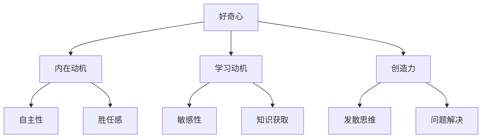

# 好奇心：探索未知的动力

## 1. 背景介绍
### 1.1  问题的由来
人类文明的进步离不开对未知事物的探索和发现。从古至今，无数科学家、探险家、发明家凭借着强烈的好奇心，不断突破人类认知的边界，推动着人类社会的发展。那么，是什么驱使着他们不断探索未知的领域？好奇心在其中扮演了怎样的角色？

### 1.2  研究现状 
目前，心理学、认知科学、神经科学等领域都对好奇心的本质和作用机制进行了广泛的研究。一些研究表明，好奇心与人的动机系统密切相关，能够激发人的内在动力，推动人们主动学习和探索[1]。另一些研究则揭示了好奇心的神经基础，发现大脑中与奖赏、记忆等相关的区域在好奇心被激发时会被活化[2]。

### 1.3  研究意义
深入理解好奇心的作用机制，对于激发创新、优化学习、提升工作绩效等方面都具有重要意义。在人工智能领域，赋予机器以类似人类的好奇心，让其主动探索未知，有望突破当前AI系统在泛化能力、自主学习等方面的瓶颈。因此，研究好奇心无论是对个人成长还是人工智能的进步，都具有重要价值。

### 1.4  本文结构
本文将从以下几个方面来探讨好奇心这一主题：

- 介绍好奇心的核心概念及其与其他心理学概念的联系
- 阐述好奇心的核心作用机制和影响因素 
- 介绍当前用于研究好奇心的主要数学模型
- 分享如何在人工智能系统中实现类似人类好奇心的机制
- 展望好奇心研究和应用的未来方向

## 2. 核心概念与联系
好奇心是指个体对新奇、复杂、不确定或冲突的事物产生探索欲望的一种心理状态[3]。它与许多其他心理学概念都有着密切联系：

- **内在动机**：好奇心被认为是最重要的内在动机之一，能够驱使个体主动探索、学习新知识[4]。
- **学习动机**：好奇心能够提高个体对新信息的敏感性，增强其获取知识的意愿[5]。
- **创造力**：好奇心是创新的重要驱动力，许多重大发明创造的背后都有强烈的好奇心作为支撑[6]。

下图展示了好奇心与相关概念之间的关系：

## 3. 核心算法原理 & 具体操作步骤
### 3.1 算法原理概述
在人工智能系统中实现类似人类好奇心的机制，主要采用的是**内在动机驱动的强化学习算法**。该算法旨在赋予智能体探索环境、寻求新奇状态的内在动机，而不仅仅依赖外部奖励信号[7]。

### 3.2 算法步骤详解
内在动机驱动的强化学习算法主要包括以下步骤[8]：

1. **初始化策略和价值函数**：为智能体初始化一个策略函数$\pi(s)$和价值函数$V(s)$，用于选择动作和评估状态。

2. **定义内在奖励函数**：设计一个内在奖励函数$r^i(s)$，用于度量一个状态的新奇程度或不确定性，作为探索的驱动力。常见的内在奖励函数包括：
   - 预测误差奖励：$r^i(s)=\lvert V(s)-\hat{V}(s) \rvert$，其中$\hat{V}(s)$是对状态价值的估计。
   - 信息增益奖励：$r^i(s)=H(\hat{P}(\cdot \vert s, a))-H(P(\cdot \vert s, a))$，其中$H$为熵，$P$为真实的状态转移概率，$\hat{P}$为估计的概率。
   
3. **探索与利用平衡**：在每个时间步，智能体根据一定的策略选择探索新状态或利用已有知识，如$\epsilon-greedy$策略：
   - 以$\epsilon$的概率随机选择动作进行探索
   - 以$1-\epsilon$的概率选择价值最高的动作进行利用
   
4. **更新价值函数和策略**：根据环境反馈的外部奖励$r^e$和内部奖励$r^i$，利用时序差分学习等算法更新价值函数，并相应地调整策略。
   - 总奖励：$r(s,a)=r^e(s,a)+\eta \cdot r^i(s,a)$
   - 价值函数更新：$V(s) \leftarrow V(s) + \alpha[r(s,a) + \gamma V(s') - V(s)]$
   - 策略更新：$\pi(s) \leftarrow \arg\max_a Q(s,a)$

5. **重复迭代**：重复步骤3-4，直到智能体学习到一个最优策略或满足某个终止条件。

### 3.3 算法优缺点
优点：
- 通过内在奖励驱动探索，使智能体更有效地探索未知环境，发现新知识。
- 不依赖于环境提供的稀疏奖励信号，具有更好的自主学习能力。

缺点：
- 内在奖励函数的设计需要针对具体问题进行调整，没有统一的标准。
- 探索与利用的平衡是一个难题，过度探索可能影响学习效率。

### 3.4 算法应用领域
内在动机驱动的强化学习算法已经在以下领域得到应用：
- 游戏AI：如AlphaGo通过自我博弈不断探索新的落子策略[9]。
- 机器人控制：如好奇心驱动的机器人能够主动探索环境[10]。
- 推荐系统：利用好奇心机制为用户推荐新颖的内容[11]。

## 4. 数学模型和公式 & 详细讲解 & 举例说明
### 4.1  数学模型构建
我们以预测误差内在奖励为例，介绍一种基于贝叶斯神经网络的好奇心数学模型[12]。该模型包含两个神经网络：
- 前向模型$f_{\theta}(s,a)$：预测在状态$s$下采取动作$a$的结果状态$\hat{s}'$。
- 反向模型$g_{\phi}(s,s')$：预测从状态$s$到$s'$采取的动作$\hat{a}$。

两个网络的参数$\theta$和$\phi$都服从先验分布$p(\theta),p(\phi)$，并根据观察数据$\mathcal{D}=\{(s,a,s')_i\}$计算后验分布$p(\theta \vert \mathcal{D}),p(\phi \vert \mathcal{D})$。

### 4.2  公式推导过程
根据贝叶斯推断，后验分布可表示为：

$$
\begin{aligned}
p(\theta \vert \mathcal{D}) &\propto p(\mathcal{D} \vert \theta)p(\theta) \\
p(\phi \vert \mathcal{D}) &\propto p(\mathcal{D} \vert \phi)p(\phi)
\end{aligned}
$$

其中，$p(\mathcal{D} \vert \theta)$和$p(\mathcal{D} \vert \phi)$分别为前向和反向模型的似然函数。假设似然函数服从高斯分布，则可得：

$$
\begin{aligned}
p(\mathcal{D} \vert \theta) &= \prod_i \mathcal{N}(s'_i \vert f_{\theta}(s_i,a_i), \sigma_1^2) \\
p(\mathcal{D} \vert \phi) &= \prod_i \mathcal{N}(a_i \vert g_{\phi}(s_i,s'_i), \sigma_2^2)
\end{aligned}
$$

其中$\mathcal{N}$为高斯分布，$\sigma_1,\sigma_2$为固定的噪声参数。

在给定状态$s$和动作$a$的条件下，预测状态$\hat{s}'$的不确定性可用信息熵$H$来度量：

$$
H(\hat{s}' \vert s,a) = -\int p(\hat{s}' \vert s,a) \log p(\hat{s}' \vert s,a) d\hat{s}'
$$

由于$p(\hat{s}' \vert s,a)$难以计算，我们用蒙特卡洛估计来近似：

$$
H(\hat{s}' \vert s,a) \approx -\frac{1}{N} \sum_{i=1}^N \log p(\hat{s}'_i \vert s,a,\theta_i)
$$

其中$\hat{s}'_i$是从后验分布$p(\theta \vert \mathcal{D})$采样的网络参数$\theta_i$预测得到的状态。

类似地，反向模型预测动作$\hat{a}$的不确定性为：

$$
H(\hat{a} \vert s,s') \approx -\frac{1}{N} \sum_{i=1}^N \log p(\hat{a}_i \vert s,s',\phi_i) 
$$

最后，我们将前向和反向模型的不确定性相加作为内在奖励：

$$
r^i(s,a,s') = H(\hat{s}' \vert s,a) + H(\hat{a} \vert s,s')
$$

### 4.3  案例分析与讲解
下面我们以一个简单的迷宫探索任务为例，说明该好奇心模型的应用。

假设一个智能体在一个未知的迷宫环境中探索，目标是尽快找到宝藏。迷宫中的每个位置都是一个状态$s$，智能体可以执行上下左右四个动作$a$。

初始时，由于对环境一无所知，智能体的好奇心很高，倾向于探索未知区域。每当它访问一个新位置时，前向模型预测下一个位置的不确定性较大，反向模型预测当前动作的不确定性也较大，所以内在奖励较高，鼓励智能体继续探索。

随着不断探索，智能体逐渐构建了对环境的认知。已探索区域的不确定性下降，相应的内在奖励变小，智能体开始利用已有知识，沿着更有可能通向目标的路径前进。

当智能体发现宝藏时，达到了一个预料之外的状态，前向模型的预测误差很大，内在奖励再次升高，激励智能体在找到宝藏附近持续探索，发现更多有价值的信息。

通过平衡探索与利用，智能体最终能够高效地找到宝藏，并对整个迷宫环境建立起准确的认知。

### 4.4  常见问题解答
**Q: 如何选择先验分布？**

A: 常见的选择有高斯分布、拉普拉斯分布等，要根据具体问题特点和先验知识进行选择。如果事先对参数分布没有太多了解，可以选择无信息先验，如均匀分布。

**Q: 蒙特卡洛估计需要多少样本？**

A: 样本数$N$需要权衡计算效率和估计精度。一般来说，$N$越大，估计的偏差越小，但计算开销也越大。可以根据任务需求和计算资源来选择合适的$N$。

**Q: 如何平衡探索与利用？**

A: 可以在奖励函数中引入一个权重因子$\eta$来控制内在奖励的相对重要性：$r(s,a)=r^e(s,a)+\eta \cdot r^i(s,a)$。$\eta$越大，越鼓励探索；$\eta$越小，越倾向于利用。另外，也可以随着学习的进行，动态调整$\eta$的大小，初期多探索，后期多利用。

## 5. 项目实践：代码实例和详细解释说明
### 5.1  开发环境搭建
本项目使用Python语言，需要安装以下依赖库：
- NumPy：科学计算库
- PyTorch：深度学习框架，用于构建和训练神经网络
- Gym：强化学习环境模拟器，提供各种标准测试环境

可以通