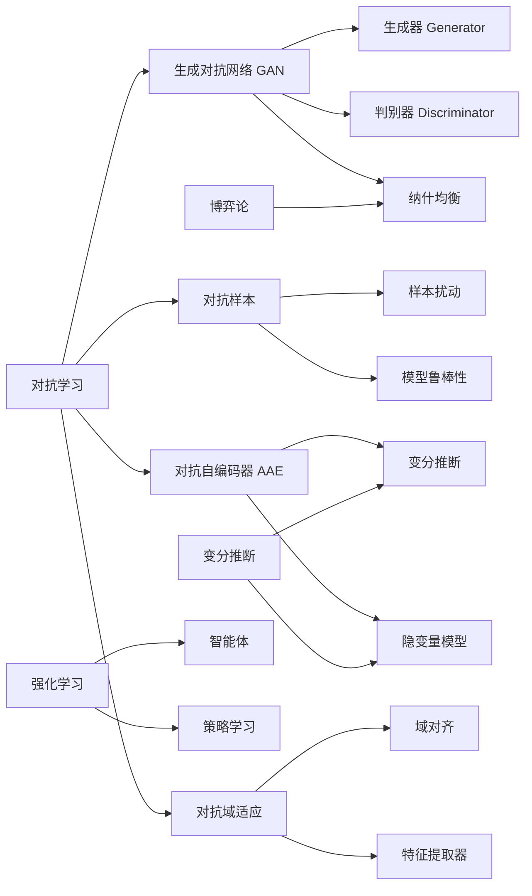

# 对抗学习 原理与代码实例讲解

## 1. 背景介绍
### 1.1 问题的由来
在机器学习领域,有监督学习和无监督学习两大类主要的学习范式。有监督学习需要大量的标注数据,而获取高质量的标注数据往往是一个非常昂贵和耗时的过程。无监督学习虽然不需要标注数据,但学习到的特征表示能力有限。近年来,对抗学习(Adversarial Learning)作为一种介于有监督学习和无监督学习之间的学习范式受到了广泛关注。对抗学习通过引入对抗机制,在生成对抗网络(GAN)、对抗自编码器等模型中取得了显著的效果,为解决小样本学习、无监督特征学习等问题提供了新的思路。

### 1.2 研究现状
自从2014年Goodfellow等人提出生成对抗网络(GAN)以来,对抗学习迅速成为机器学习领域的研究热点。各种基于对抗思想的模型和算法被相继提出,如DCGAN、InfoGAN、WGAN、CycleGAN等,并在图像生成、风格迁移、领域自适应等任务上取得了令人瞩目的效果。此外,对抗学习在NLP、语音、推荐等领域也得到了广泛应用。尽管取得了很大进展,对抗学习仍然面临训练不稳定、生成样本多样性不足、评价指标缺乏等诸多挑战,目前仍是一个非常活跃的研究方向。

### 1.3 研究意义
对抗学习作为一种重要的机器学习范式,有望在多个领域取得突破性进展:

1. 小样本学习:利用对抗机制可以从少量样本中学习到鲁棒的特征表示,减少对大规模标注数据的依赖。
2. 无监督/半监督学习:通过对抗博弈可以学习到高质量的数据表示,实现无监督特征学习。
3. 多领域学习:对抗思想可用于不同领域数据的迁移和适配,提高模型的泛化能力。
4. 数据增强与生成:利用生成对抗模型可以生成逼真的样本数据,扩充小样本数据集。

总之,对抗学习有望突破传统机器学习的诸多局限,为人工智能的发展注入新的活力。深入研究对抗学习的原理和方法具有重要的理论和实践意义。

### 1.4 本文结构
本文将全面介绍对抗学习的原理、方法和应用。第2部分介绍对抗学习的核心概念。第3部分重点讲解对抗学习的核心算法。第4部分介绍对抗学习常用的数学模型和优化方法。第5部分通过代码实例讲解如何实现对抗学习模型。第6部分总结对抗学习的典型应用场景。第7部分推荐对抗学习的学习资源。最后第8部分讨论对抗学习未来的发展趋势与挑战。

## 2. 核心概念与联系

对抗学习的核心思想是引入两个或多个相互博弈的对手方,通过对抗训练使得各方达到某种平衡。以最经典的生成对抗网络(GAN)为例,其包含一个生成器(Generator)和一个判别器(Discriminator):

- 生成器(G):尝试生成尽可能逼真的样本数据去欺骗判别器。
- 判别器(D):尝试判别输入的样本是真实数据还是生成器产生的虚假数据。

生成器和判别器构成了一个二人极小极大博弈(minimax game),两者互为对手,最终目标是达到纳什均衡(Nash equilibrium),此时生成器可以生成与真实数据分布一致的样本,而判别器无法判断生成样本与真实样本的区别。

除了生成器和判别器,对抗学习的另一个重要概念是对抗样本(Adversarial Examples)。对抗样本是指在原始样本上添加少量的扰动后,可以使得模型产生错误输出的样本。对抗样本揭示了现有模型的脆弱性,因此研究对抗样本对于提高模型的鲁棒性具有重要意义。

对抗学习与多个机器学习分支密切相关:

- 博弈论:对抗学习本质上是构建了一个博弈过程,借鉴了博弈论的许多思想,如纳什均衡、最优策略等。
- 强化学习:可以将对抗学习看作多个智能体之间的竞争与合作,这与多智能体强化学习的建模方式一致。
- 变分推断:许多对抗模型如AAE、BiGAN从变分推断的角度出发,将生成器视为隐变量后验概率的近似。

下图总结了对抗学习的核心概念与相关领域之间的联系:

## 3. 核心算法原理 & 具体操作步骤
### 3.1 算法原理概述
对抗学习的核心算法是生成对抗网络(GAN),它由生成器(G)和判别器(D)组成。生成器试图生成与真实数据分布一致的样本,而判别器则试图判别输入样本是真实的还是生成的。形式化地,GAN 的优化目标可以表示为:

$$\min_G \max_D V(D,G) = \mathbb{E}_{x \sim p_{data}(x)}[\log D(x)] + \mathbb{E}_{z \sim p_z(z)}[\log (1-D(G(z)))]$$

其中 $p_{data}$ 表示真实数据分布,$p_z$ 表示随机噪声的先验分布,通常取标准高斯分布。$D(x)$ 表示判别器输出样本 $x$ 为真实样本的概率,$G(z)$ 表示将随机噪声 $z$ 映射为生成样本的生成器。

直观地理解,生成器 $G$ 和判别器 $D$ 在玩一个"警察抓小偷"的游戏:

- 生成器(小偷)试图尽可能逼真地伪造样本蒙骗警察
- 判别器(警察)试图从真实样本和生成样本中分辨出哪些是假币

双方你来我往,互相博弈,最终希望达到一个平衡点:生成器可以生成足以以假乱真的样本,判别器也难以判别真伪。这个平衡点就称为纳什均衡。

### 3.2 算法步骤详解
GAN的训练本质上是在优化生成器和判别器的参数,使得二者达到纳什均衡。具体的算法步骤如下:

1. 初始化生成器 $G$ 和判别器 $D$ 的参数为 $\theta_g$ 和 $\theta_d$
2. 重复下述步骤直到收敛:
   
   for 迭代轮数 do
      
      for k 步 do:
         - 从真实数据分布 $p_{data}$ 中采样一批真实样本 $\{x^{(1)}, \dots, x^{(m)}\}$
         - 从先验分布 $p_z$ 中采样一批随机噪声 $\{z^{(1)}, \dots, z^{(m)}\}$
         - 利用生成器生成一批样本 $\{\tilde{x}^{(1)}, \dots, \tilde{x}^{(m)}\}$,其中 $\tilde{x}^{(i)} = G(z^{(i)})$
         - 计算判别器在真实样本和生成样本上的损失:
           $$L_d = -\frac{1}{m} \sum_{i=1}^m [\log D(x^{(i)}) + \log(1-D(\tilde{x}^{(i)}))]$$
         - 计算判别器参数的梯度 $\nabla_{\theta_d} L_d$,并用梯度上升更新判别器参数
      
      end for
      
      - 从先验分布 $p_z$ 中采样一批随机噪声 $\{z^{(1)}, \dots, z^{(m)}\}$
      - 利用生成器生成一批样本 $\{\tilde{x}^{(1)}, \dots, \tilde{x}^{(m)}\}$
      - 计算生成器的损失:
        $$L_g = -\frac{1}{m} \sum_{i=1}^m \log D(\tilde{x}^{(i)})$$
      - 计算生成器参数的梯度 $\nabla_{\theta_g} L_g$,并用梯度下降更新生成器参数
   
   end for

可以看到,算法交替地更新判别器和生成器,使得二者在动态博弈中不断进化。通常判别器的更新频率 k 取1-5,即每更新一次生成器,就更新几次判别器。这是因为只有判别器训练充分,才能为生成器提供有效的梯度引导。

### 3.3 算法优缺点
GAN 在图像生成、风格迁移等任务上展现了强大的能力,但它仍然存在一些问题:

优点:
1. 生成能力强:GAN 生成的样本通常质量较高,能够捕捉数据的多样性。
2. 无监督学习:GAN 是一种无监督学习算法,不需要标注数据。
3. 端到端训练:GAN 可以端到端地训练,不需要复杂的推断过程。

缺点:
1. 训练不稳定:GAN 的训练过程容易发散,需要精心设计网络结构和超参数。
2. 模式崩溃:生成器容易陷入一些退化解,只生成单一样本。
3. 缺乏统一评价指标:难以定量评估GAN的性能,主要依赖人工观察。

后续研究提出了许多改进方法,如WGAN、SNGAN等,在一定程度上缓解了这些问题。但GAN的理论分析和改进算法仍是一个开放的研究问题。

### 3.4 算法应用领域
GAN 在多个领域得到了广泛应用,主要包括:

1. 图像生成与编辑:如人脸生成、图像翻译、超分辨率等
2. 视频生成与预测:如视频补帧、未来帧预测等
3. 语音合成:如语音转换、语音增强等  
4. 自然语言处理:如文本生成、对话生成等
5. 网络安全:如恶意软件检测、对抗样本生成等

除此之外,GAN 还被用于推荐系统、异常检测等诸多任务,展现了其强大的建模能力和应用潜力。

## 4. 数学模型和公式 & 详细讲解 & 举例说明
### 4.1 数学模型构建
GAN 的数学模型可以看作是生成器 $G$ 和判别器 $D$ 之间的二人极小极大博弈:

$$\min_G \max_D V(G,D) = \mathbb{E}_{x \sim p_{data}}[\log D(x)] + \mathbb{E}_{z \sim p_z}[\log (1-D(G(z)))]$$

其中 $V(G,D)$ 称为值函数(value function),刻画了生成器和判别器的优化目标。

直观理解这个公式:
- 判别器 $D$ 要最大化 $V(G,D)$,即分辨真实样本 $x$ 和生成样本 $G(z)$
  - 对于真实样本 $x$,判别器输出概率 $D(x)$ 越大越好
  - 对于生成样本 $G(z)$,判别器输出概率 $D(G(z))$ 越小越好
- 生成器 $G$ 要最小化 $V(G,D)$,即尽可能欺骗判别器
  - 让判别器对生成样本 $G(z)$ 的输出概率 $D(G(z))$ 越大越好

可以将其转化为如下的优化问题:

$$\begin{aligned}
D^* &= \arg\max_D V(G,D) \\
G^* &= \arg\