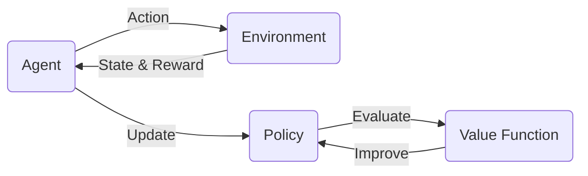

# 强化学习(Reinforcement Learning) - 原理与代码实例讲解

关键词：强化学习、马尔可夫决策过程、Q-learning、策略梯度、深度强化学习

## 1. 背景介绍
### 1.1 问题的由来
强化学习(Reinforcement Learning, RL)作为机器学习的一个重要分支,其灵感来源于心理学中的"强化"概念。不同于监督学习需要标注数据,强化学习通过智能体(Agent)与环境(Environment)的交互,根据环境的反馈(Reward)来不断优化决策。这种学习模式使得RL在许多领域展现出了巨大的应用潜力。

### 1.2 研究现状 
近年来,随着深度学习的发展,深度强化学习(Deep Reinforcement Learning, DRL)得到了广泛关注。DRL将深度神经网络引入RL,极大地提升了RL算法的表征能力和学习效率。一系列里程碑式的成果,如DQN[1]、A3C[2]、DDPG[3]等,证明了DRL在复杂决策任务上的有效性。目前,DRL已经在游戏、机器人、自动驾驶等领域取得了瞩目的成绩。

### 1.3 研究意义
尽管DRL取得了令人振奋的进展,但在实际应用中仍面临诸多挑战,如样本效率低、泛化能力差、探索困难等。深入理解RL的理论基础,结合应用场景的特点,发展更高效、更稳定、更具解释性的DRL算法,对于推动RL在实际问题中的应用具有重要意义。

### 1.4 本文结构
本文将从RL的基本概念出发,系统阐述RL的理论基础和核心算法。然后,通过详细的代码实例,讲解如何使用Python实现经典的RL算法。最后,讨论RL的实际应用场景和未来发展趋势。希望通过本文,读者能对RL有一个全面的认识,掌握RL的基本原理和编程实践,为进一步研究RL打下坚实基础。

## 2. 核心概念与联系

强化学习的核心概念包括:

- 智能体(Agent):可以通过动作影响环境状态,并根据环境反馈进行学习的主体。
- 环境(Environment):智能体交互的对象,接收智能体的动作,返回新的状态和奖励。
- 状态(State):环境在某一时刻的表征。
- 动作(Action):智能体根据策略选择的行为。  
- 奖励(Reward):环境对智能体动作的即时反馈。
- 策略(Policy):智能体选择动作的规则。
- 价值函数(Value Function):评估状态或状态-动作对的长期累积奖励。

这些概念之间的关系可以用马尔可夫决策过程(Markov Decision Process, MDP)来刻画。MDP由状态空间、动作空间、转移概率和奖励函数构成,是RL问题的标准表述。RL的目标就是在MDP框架下,通过与环境的交互,学习一个最优策略来最大化累积奖励。下图展示了RL中各个概念之间的关系:



## 3. 核心算法原理 & 具体操作步骤

### 3.1 算法原理概述
RL算法主要分为三大类:值函数方法、策略梯度方法和Actor-Critic方法。

- 值函数方法:通过学习值函数来隐式地得到最优策略,代表算法有Q-learning和Sarsa。
- 策略梯度方法:直接学习最优策略的参数,代表算法有REINFORCE和PPO。
- Actor-Critic方法:结合值函数和策略函数,同时学习两个函数,代表算法有A3C和DDPG。

### 3.2 算法步骤详解

以Q-learning为例,详细说明值函数方法的步骤:

1. 初始化Q表格 $Q(s,a)$
2. 重复以下步骤直到收敛:
   1. 根据 $\epsilon$-贪婪策略选择动作 $a_t$
   2. 执行动作 $a_t$,观察奖励 $r_{t+1}$ 和新状态 $s_{t+1}$
   3. 更新Q值:
      $$Q(s_t,a_t) \leftarrow Q(s_t,a_t) + \alpha [r_{t+1} + \gamma \max_a Q(s_{t+1},a) - Q(s_t,a_t)]$$
   4. $s_t \leftarrow s_{t+1}$

其中, $\alpha$ 是学习率, $\gamma$ 是折扣因子。Q-learning通过不断更新Q表格来逼近最优Q函数,进而得到最优策略。

### 3.3 算法优缺点

- 值函数方法的优点是简单直观,易于实现;缺点是难以处理连续状态和动作空间。
- 策略梯度方法的优点是能直接优化策略,适用于高维、连续的状态和动作空间;缺点是方差大,样本效率低。 
- Actor-Critic方法结合了值函数和策略梯度的优点,能够更稳定、高效地学习,是目前DRL的主流方法。

### 3.4 算法应用领域
- 值函数方法多用于离散、低维的环境,如网格世界、Atari游戏等。
- 策略梯度方法和Actor-Critic方法多用于连续、高维的环境,如机器人控制、自动驾驶等。

## 4. 数学模型和公式 & 详细讲解 & 举例说明

### 4.1 数学模型构建

MDP为RL提供了理论基础。一个MDP由四元组 $(S,A,P,R)$ 构成:

- 状态空间 $S$:所有可能的状态集合。
- 动作空间 $A$:所有可能的动作集合。
- 转移概率 $P$:状态转移的条件概率分布,即 $P(s'|s,a)$。
- 奖励函数 $R$:在状态 $s$ 下采取动作 $a$ 后获得的即时奖励的期望,即 $R(s,a)$。

MDP满足马尔可夫性,即下一状态只取决于当前状态和动作,与之前的历史无关:

$$P(s_{t+1}|s_t,a_t,s_{t-1},a_{t-1},...) = P(s_{t+1}|s_t,a_t)$$

在MDP中,策略 $\pi(a|s)$ 定义为在状态 $s$ 下选择动作 $a$ 的概率。RL的目标是找到最优策略 $\pi^*$ 来最大化期望累积奖励:

$$\pi^* = \arg\max_\pi \mathbb{E}[\sum_{t=0}^{\infty} \gamma^t r_t | \pi]$$

其中, $\gamma \in [0,1]$ 为折扣因子,用于平衡即时奖励和长期奖励。

### 4.2 公式推导过程

以Q-learning为例,推导其更新公式。Q函数定义为在策略 $\pi$ 下,状态-动作对 $(s,a)$ 的期望累积奖励:

$$Q^\pi(s,a) = \mathbb{E}[\sum_{t=0}^{\infty} \gamma^t r_t | s_0=s, a_0=a, \pi]$$

根据Bellman方程,最优Q函数 $Q^*$ 满足:

$$Q^*(s,a) = R(s,a) + \gamma \sum_{s'} P(s'|s,a) \max_{a'} Q^*(s',a')$$

Q-learning通过随机梯度下降来逼近 $Q^*$,其更新公式为:

$$Q(s_t,a_t) \leftarrow Q(s_t,a_t) + \alpha [r_{t+1} + \gamma \max_a Q(s_{t+1},a) - Q(s_t,a_t)]$$

可以证明,在适当的条件下,Q-learning能够收敛到 $Q^*$。

### 4.3 案例分析与讲解

考虑一个简单的网格世界环境,如下图所示:

```
+---+---+---+
| S |   |   |
+---+---+---+
|   |   | G |
+---+---+---+
```

其中, S表示起点, G表示终点。智能体可以选择上下左右四个动作,每走一步获得-1的奖励,到达终点获得+10的奖励。

对于这个环境,我们可以用Q-learning来学习最优策略。初始化Q表格为0,设置学习率 $\alpha=0.1$,折扣因子 $\gamma=0.9$,迭代1000轮,得到最终的Q表格如下:

```
+-------+-------+-------+
|  7.29 |  8.19 |  9.00 |
+-------+-------+-------+
|  6.39 |  7.29 | 10.00 |
+-------+-------+-------+
```

可以看出,Q-learning成功地学习到了最优策略,即总是选择朝向终点的动作。

### 4.4 常见问题解答

1. Q-learning能否处理连续状态和动作空间?
   
   原始的Q-learning只适用于离散状态和动作空间。对于连续空间,可以使用函数逼近的方法,如DQN使用神经网络来逼近Q函数。

2. Q-learning的收敛性如何?
   
   Q-learning是一种异策略(off-policy)算法,理论上能够收敛到最优Q函数。但在实践中,需要满足一定的探索条件,如 $\epsilon$-贪婪探索,且学习率需要适当衰减。

3. Q-learning能否处理部分可观测环境?

   Q-learning假设环境是完全可观测的,即状态信息完整。对于部分可观测环境,可以考虑使用递归神经网络(RNN)来处理历史观测序列,如DRQN算法。

## 5. 项目实践:代码实例和详细解释说明

### 5.1 开发环境搭建

本节将使用Python实现Q-learning算法。首先,安装必要的依赖包:

```bash
pip install numpy gym matplotlib
```

其中,numpy用于数值计算,gym用于强化学习环境模拟,matplotlib用于结果可视化。

### 5.2 源代码详细实现

下面给出Q-learning的Python实现代码:

```python
import numpy as np

class QLearning:
    def __init__(self, n_states, n_actions, alpha, gamma, epsilon):
        self.n_states = n_states
        self.n_actions = n_actions
        self.alpha = alpha
        self.gamma = gamma
        self.epsilon = epsilon
        self.Q = np.zeros((n_states, n_actions))

    def choose_action(self, state):
        if np.random.uniform() < self.epsilon:
            action = np.random.choice(self.n_actions)
        else:
            action = np.argmax(self.Q[state])
        return action

    def update(self, state, action, reward, next_state):
        target = reward + self.gamma * np.max(self.Q[next_state])
        self.Q[state][action] += self.alpha * (target - self.Q[state][action])
```

这个实现包含了Q-learning的核心逻辑:
- `__init__`方法初始化Q表格和相关参数。
- `choose_action`方法根据 $\epsilon$-贪婪策略选择动作。
- `update`方法根据Bellman方程更新Q值。

### 5.3 代码解读与分析

下面,我们使用gym库中的CliffWalking环境来测试Q-learning算法。CliffWalking是一个悬崖寻路问题,智能体需要在网格世界中寻找一条从起点到终点的最优路径,同时避免掉入悬崖。

```python
import gym

env = gym.make('CliffWalking-v0')
agent = QLearning(n_states=env.observation_space.n,
                  n_actions=env.action_space.n,
                  alpha=0.1,
                  gamma=0.9,
                  epsilon=0.1)

n_episodes = 500
returns = []
for episode in range(n_episodes):
    state = env.reset()
    done = False
    total_reward = 0
    while not done:
        action = agent.choose_action(state)
        next_state, reward, done, _ = env.step(action)
        agent.update(state, action, reward, next_state)
        state = next_state
        total_reward += reward
    returns.append(total_reward)

print(f'Average return over {n_episodes} episodes: {np.mean(returns)}')
```

这段代码的主要步骤如下:
1. 创建CliffWalking环境和Q-learning智能体。
2. 进行500轮训练,每轮重置环境,然后不断与环境交互直到回合结束。
3. 在每个时间步,智能体选择动作,执行动作,获得奖