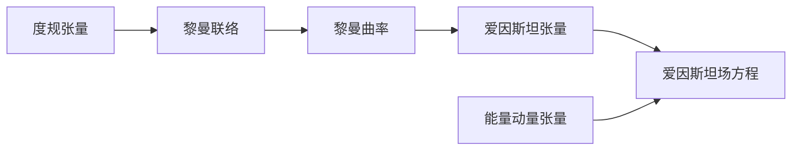

# 微分几何入门与广义相对论：空间张量场的时间导数

关键词：微分几何、广义相对论、张量场、时间导数、黎曼几何、爱因斯坦场方程

## 1. 背景介绍
### 1.1  问题的由来
微分几何作为数学的一个分支,在现代物理学,尤其是广义相对论中有着极其重要的应用。广义相对论是爱因斯坦在1915年提出的一种全新的时空理论,它的核心思想是将引力场等效为时空的曲率。而描述时空曲率的数学工具正是微分几何中的黎曼几何。

在广义相对论中,物理量通常表示为时空中的张量场。例如,度规张量描述了时空的几何结构,能量动量张量描述了物质的分布。研究这些张量场的动力学演化,需要计算它们的导数,特别是时间导数。然而,由于时空是弯曲的,普通的偏导数在广义相对论中并不是张量,因此需要引入协变导数的概念。

### 1.2  研究现状
目前,广义相对论已经成为描述引力相互作用的标准理论,在天体物理、宇宙学等领域取得了巨大的成功。人们利用广义相对论对许多引力现象给出了精确的预言,例如水星近日点的进动、引力透镜效应、引力红移、引力波等,这些预言都已经得到了实验的精确验证。

尽管如此,广义相对论作为一个经典理论,与描述微观世界的量子力学之间存在着难以调和的矛盾。如何将广义相对论与量子力学统一起来,构建一个量子引力理论,是当代理论物理学面临的最大挑战之一。这需要我们对时空的本质有更深入的理解。

### 1.3  研究意义
张量场的时间导数是研究广义相对论动力学不可或缺的工具。通过计算爱因斯坦场方程中张量的时间演化,我们可以研究引力场是如何随时间变化的,进而预言各种引力现象。同时,对张量场时间导数的深入理解,也有助于我们探索时空的本质,为将来建立量子引力理论奠定基础。

此外,张量分析的数学方法在其他领域也有广泛应用,例如流体力学、弹性力学、电动力学等。因此,掌握张量场时间导数的计算方法,对于理论物理和应用数学的研究都具有重要意义。

### 1.4  本文结构
本文将从微分几何的基本概念出发,系统地介绍张量场时间导数的计算方法。全文分为以下几个部分：

第2节介绍微分几何和广义相对论中的一些核心概念,例如流形、切丛、联络、黎曼曲率等,并阐明它们之间的内在联系。

第3节详细讲解计算张量场时间导数的核心算法和具体操作步骤。重点介绍李导数和协变导数的概念及其性质。

第4节利用微分几何的语言,对广义相对论的核心方程——爱因斯坦场方程进行数学上的推导,并结合具体的例子进行详细的讲解。

第5节给出张量场时间导数的代码实现,并对代码进行解释说明。

第6节讨论张量场时间导数在实际物理问题中的应用,例如宇宙学、黑洞物理学等。

第7节推荐一些学习微分几何和广义相对论的工具和资源。

第8节对全文进行总结,并展望张量分析方法在未来物理学研究中可能的发展方向。

第9节列出一些读者可能会遇到的常见问题,并给出详细的解答。

## 2. 核心概念与联系
在正式开始计算张量场时间导数之前,我们需要先了解一些微分几何的基本概念。

**流形(Manifold)**：流形是一个局部类似于欧氏空间的空间。更准确地说,一个n维流形是一个拓扑空间,其中每一点都有一个同胚于 $\mathbb{R}^n$ 的开邻域。直观地说,流形就是一个可以赋予坐标系的空间。在广义相对论中,时空就被模型化为一个4维的伪黎曼流形。

**切丛(Tangent Bundle)**：对于流形上的每一点 $p$,我们可以定义其切空间 $T_pM$,它是所有以 $p$ 为起点的切向量的集合。切丛 $TM$ 就是所有切空间的并集。切丛是一个非常重要的概念,张量场就是定义在切丛上的多重线性映射。

**联络(Connection)**：联络定义了切丛上的一种平行传输,它告诉我们如何将一个切向量从一点平移到另一点。在广义相对论中,我们通常使用的是黎曼联络(亦称莱维-奇维塔联络),它是唯一一个满足度规相容性和无挠性的联络。黎曼联络完全由度规张量决定。

**黎曼曲率(Riemann Curvature)**：黎曼曲率是对流形曲率的一种度量,它刻画了流形的内蕴几何性质。黎曼曲率张量由联络的导数给出,反映了平行传输的路径依赖性。在广义相对论中,爱因斯坦张量(黎曼曲率的缩并)正是场方程的左端项。

这些概念之间有着深刻的内在联系。度规张量给出了时空的几何结构,它决定了黎曼联络,进而决定了黎曼曲率。而爱因斯坦场方程则将时空的几何性质与物质的分布联系了起来。

## 3. 核心算法原理 & 具体操作步骤
### 3.1  算法原理概述
要计算张量场的时间导数,关键是要理解李导数和协变导数的概念。

**李导数(Lie Derivative)**：李导数是沿着向量场方向对张量场求导的一种方式。设 $\mathbf{X}$ 是流形 $M$ 上的一个向量场, $\mathbf{T}$ 是 $M$ 上的一个张量场,那么 $\mathbf{T}$ 沿 $\mathbf{X}$ 方向的李导数定义为

$$\mathcal{L}_\mathbf{X} \mathbf{T} = \lim_{t \to 0} \frac{\phi_{-t}^*\mathbf{T} - \mathbf{T}}{t}$$

其中 $\phi_t$ 是向量场 $\mathbf{X}$ 生成的单参数微分同胚群, $\phi_{-t}^*\mathbf{T}$ 表示张量场 $\mathbf{T}$ 沿流线反向平移 $t$ 单位时间后的新张量场。李导数满足莱布尼兹律,是一个张量。但它在一般情况下并不是协变的。

**协变导数(Covariant Derivative)**：协变导数是利用联络对张量求导的方式,得到的结果仍然是张量。设 $\nabla$ 是流形 $M$ 上的一个联络, $\mathbf{T}$ 是 $M$ 上的一个张量场,那么 $\mathbf{T}$ 沿向量场 $\mathbf{X}$ 的协变导数定义为

$$\nabla_\mathbf{X} \mathbf{T} = \lim_{t \to 0} \frac{P_{\gamma,0,t}\mathbf{T}_{\gamma(t)} - \mathbf{T}_p}{t}$$

其中 $\gamma$ 是以 $p$ 为起点、 $\mathbf{X}_p$ 为切向量的一条曲线, $P_{\gamma,0,t}$ 表示沿曲线 $\gamma$ 从 $\gamma(0)=p$ 平移到 $\gamma(t)$ 的平行传输, $\mathbf{T}_{\gamma(t)}$ 表示张量场 $\mathbf{T}$ 在点 $\gamma(t)$ 的值。

### 3.2  算法步骤详解
现在我们来看如何具体计算张量场的时间导数。设 $\mathbf{T}$ 是时空流形 $M$ 上的一个张量场, $\mathbf{u}$ 是观者的4速,即在每一点都有 $\mathbf{u} \cdot \mathbf{u} = -1$ 的类时向量场。我们定义 $\mathbf{T}$ 相对于观者 $\mathbf{u}$ 的时间导数为

$$\frac{D\mathbf{T}}{dt} = \nabla_\mathbf{u} \mathbf{T}$$

这实际上就是 $\mathbf{T}$ 沿 $\mathbf{u}$ 的协变导数。在局部坐标系 $\{x^\mu\}$ 下,其分量表示为

$$\left(\frac{D\mathbf{T}}{dt}\right)^{\mu_1\cdots\mu_p}_{\nu_1\cdots\nu_q} = u^\lambda \nabla_\lambda T^{\mu_1\cdots\mu_p}_{\nu_1\cdots\nu_q}$$

其中 $\nabla_\lambda$ 表示协变导数的分量形式。对于一个 $(p,q)$ 型张量场,其协变导数为

$$\nabla_\lambda T^{\mu_1\cdots\mu_p}_{\nu_1\cdots\nu_q} = \partial_\lambda T^{\mu_1\cdots\mu_p}_{\nu_1\cdots\nu_q} + \sum_{i=1}^p \Gamma^\mu_{i\lambda\kappa} T^{\mu_1\cdots\kappa\cdots\mu_p}_{\nu_1\cdots\nu_q} - \sum_{j=1}^q \Gamma^\kappa_{\lambda\nu_j} T^{\mu_1\cdots\mu_p}_{\nu_1\cdots\kappa\cdots\nu_q}$$

其中 $\Gamma^\mu_{\nu\lambda}$ 是联络系数,它完全由度规张量 $g_{\mu\nu}$ 及其一阶导数决定：

$$\Gamma^\mu_{\nu\lambda} = \frac{1}{2} g^{\mu\kappa} \left(\partial_\nu g_{\kappa\lambda} + \partial_\lambda g_{\nu\kappa} - \partial_\kappa g_{\nu\lambda}\right)$$

总结一下,计算张量场时间导数的步骤如下：

1. 选择一个局部坐标系 $\{x^\mu\}$。
2. 计算度规张量 $g_{\mu\nu}$ 的分量及其一阶偏导数 $\partial_\lambda g_{\mu\nu}$。
3. 由度规张量及其导数计算联络系数 $\Gamma^\mu_{\nu\lambda}$。
4. 将张量场 $\mathbf{T}$ 的分量 $T^{\mu_1\cdots\mu_p}_{\nu_1\cdots\nu_q}$ 及其偏导数 $\partial_\lambda T^{\mu_1\cdots\mu_p}_{\nu_1\cdots\nu_q}$ 代入协变导数公式,计算 $\nabla_\lambda T^{\mu_1\cdots\mu_p}_{\nu_1\cdots\nu_q}$。
5. 将观者的4速 $u^\lambda$ 与协变导数 $\nabla_\lambda T^{\mu_1\cdots\mu_p}_{\nu_1\cdots\nu_q}$ 相乘,得到时间导数 $\left(\frac{D\mathbf{T}}{dt}\right)^{\mu_1\cdots\mu_p}_{\nu_1\cdots\nu_q}$ 的分量表达式。

### 3.3  算法优缺点
上述算法的优点在于它完全基于张量分析,是一个坐标无关的公式。只要选定了坐标系,就可以机械地代入公式计算。这体现了广义相对论的一般协变性原理。

算法的缺点在于计算量较大,尤其是当张量的阶数较高时,协变导数的展开式会非常复杂。此外,不同的坐标系下,度规张量的形式不同,联络系数的表达式也会有所不同,因此需要对不同的问题选择合适的坐标系。

### 3.4  算法应用领域
张量场时间导数的计算在广义相对论中有着广泛的应用,主要体现在以下几个方面：

1. 研究引力场的动力学演化。爱因斯坦场方程的左端项是爱因斯坦张量 $G_{\mu\nu}$,它由度规张量的二阶导数构成。要研究引力场随时间的演化