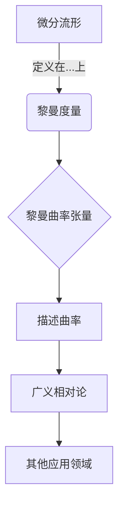

# 微分几何入门与广义相对论：黎曼（内禀）曲率张量

## 1. 背景介绍

### 1.1 问题的由来

自古以来，人类一直对宇宙的奥秘充满好奇。从最初的天体观测到后来的物理定律探索，我们不断地试图揭开宇宙运行的规律。然而，在相对论被提出之前，人们对时空的理解仍然停留在牛顿经典力学的框架内。牛顿力学虽然在描述低速运动时非常成功，但在极高速运动和极强引力场的情况下就显得力不从心了。

### 1.2 研究现状

1905年，爱因斯坦提出了狭义相对论理论，揭示了时空是相对的，质量和能量是等价的。这为后来的广义相对论奠定了基础。1915年，爱因斯坦进一步提出了广义相对论，描述了引力场对时空的曲曲变形。这个理论不仅解释了行星运动等宏观现象，也预言了黑洞等奇特天体的存在。

广义相对论的核心思想是，物质的存在会导致时空产生曲率，而物体在这种曲率时空中沿"最短"路径运动。因此，研究时空曲率的数学描述就成为了广义相对论的关键。

### 1.3 研究意义

广义相对论不仅在理论物理领域具有重大意义，也为现代科技发展做出了巨大贡献。例如GPS导航系统就需要考虑相对论效应的影响。此外，黑洞、暗物质等前沿课题的研究都离不开广义相对论的指导。

从数学角度来看，微分几何在广义相对论中扮演着核心角色。黎曼曲率张量作为描述时空曲率的重要工具，不仅在相对论中有着广泛应用，也在拓扑学、几何分析等数学分支中占据重要地位。

### 1.4 本文结构

本文将从微分几何的角度出发，介绍黎曼曲率张量的相关概念和性质。首先阐述一些基本概念和背景知识，然后详细讨论曲率张量的数学表示及其在广义相对论中的应用。最后，我们将探讨曲率张量在其他领域的作用，以及未来的发展方向。

## 2. 核心概念与联系

微分几何研究的核心对象是微分流形(Differentiable Manifold)。流形可以简单地理解为在局部看起来像欧几里得空间的拓扑空间。我们生活的时空就可以看作是一个4维的流形。

在流形上定义一种内积,就得到了黎曼度量(Riemannian Metric)。度量赋予了流形内在的几何结构,使我们能够定义长度、角度等概念。时空中的洛伦兹度量就是一种特殊的黎曼度量。

黎曼曲率张量(Riemann Curvature Tensor)是描述流形曲率的关键数学工具。它完全捕捉了流形内在的几何性质,是研究广义相对论的基石。实际上,爱因斯坦场方程就是用黎曼曲率张量来描述时空曲率和物质分布之间的关系。

除了广义相对论,黎曼曲率张量在拓扑学、几何分析等领域也有重要应用。它不仅是一个重要的数学概念,也是连接几何与物理的纽带。

## 3. 核心算法原理 & 具体操作步骤

### 3.1 算法原理概述

黎曼曲率张量的计算过程可以概括为以下几个步骤:

1. 构造流形和度量
2. 计算切向量的并行传输
3. 计算切向量的李导数
4. 将李导数的结果代入曲率张量公式

其中,并行传输和李导数是连接切向量场的重要方法,体现了流形内在的几何结构。

### 3.2 算法步骤详解

1. **构造流形和度量**

   首先,我们需要确定所研究的几何对象。对于广义相对论来说,就是4维时空流形以及洛伦兹度量。

2. **计算切向量的并行传输**

   $$
   \nabla_X Y = \lim_{t\to 0}\frac{Y(p+tX)-Y_p^X(t)}{t}
   $$

   并行传输是将一个切向量沿着另一条曲线平移的过程。公式中的$\nabla_X Y$表示沿向量场$X$方向对向量场$Y$做并行传输的结果。这个过程需要使用流形上的仿射连接。

3. **计算切向量的李导数**

   $$
   [X,Y]=\nabla_X Y - \nabla_Y X
   $$

   李导数描述了两个向量场在流形上的"扭曲"程度。公式中的$[X,Y]$就是$X$对$Y$的李导数。

4. **将李导数结果代入曲率张量公式**

   $$
   R(X,Y)Z = \nabla_X\nabla_Y Z - \nabla_Y\nabla_X Z - \nabla_{[X,Y]}Z
   $$

   上式就是黎曼曲率张量的显式表达式。$R(X,Y)Z$描述了在向量场$X,Y,Z$围成的小平行面上的内在曲率。

这个算法的关键在于理解并行传输和李导数的几何意义。通过这些操作,我们可以刻画流形内在的几何性质,进而得到描述曲率的黎曼张量。

### 3.3 算法优缺点

**优点:**

- 算法思路清晰,体现了微分几何的本质思想
- 计算过程有严格的数学基础,结果可靠
- 适用于任意维数的流形和各种类型的度量

**缺点:**

- 计算过程较为抽象,对初学者来说难以理解
- 手工计算过程冗长复杂,需要使用符号计算工具
- 只给出最终的张量表达式,需要进一步分析才能获得几何意义

### 3.4 算法应用领域

除了广义相对论之外,黎曼曲率张量在以下领域也有重要应用:

- **拓扑学:** 曲率张量是判定流形是否为欧几里得空间的重要工具
- **黎曼几何:** 研究具有常曲率的流形,如球面、超球面等
- **几何分析:** 研究微分方程在流形上的解的性质
- **理论物理:** 规范场论、弦论等使用了更高维度的流形和曲率张量

## 4. 数学模型和公式 & 详细讲解 & 举例说明

### 4.1 数学模型构建

在构建黎曼曲率张量的数学模型时,我们从最一般的情况出发,考虑一个$n$维流形$M$,上面定义了一个度量张量$g$。

首先引入一些基本概念:

- 切向量(Tangent Vector): 在流形的一点指向某个方向的向量
- 向量场(Vector Field): 在流形的每一点都赋予一个切向量
- 仿射连接(Affine Connection): 定义在流形上的一种微分算子,描述了向量场沿着曲线做并行传输时的变化规律

利用仿射连接,我们可以定义切向量场的导数(协变导数),进而得到曲率张量的表达式。

对于任意切向量场$X,Y,Z$,黎曼曲率张量$R$有如下表达式:

$$
R(X,Y)Z = \nabla_X\nabla_Y Z - \nabla_Y\nabla_X Z - \nabla_{[X,Y]}Z \tag{1}
$$

这里$\nabla$表示使用仿射连接做协变导数的算子,$[X,Y]$是$X$和$Y$的李括号(李导数)。

### 4.2 公式推导过程

我们从最一般的情况出发,考虑两个向量场$X,Y$在一点$p$处的值$X(p),Y(p)$,以及它们沿曲线$\gamma$做无穷小平移时的变化。

1) 定义$X$和$Y$沿$\gamma$做并行传输时的变化场:

$$
X'(t) = \frac{D}{dt}X(\gamma(t)), \quad Y'(t)=\frac{D}{dt}Y(\gamma(t))
$$

这里$\frac{D}{dt}$是使用仿射连接做协变导数。

2) 计算$X'(t)$和$Y'(t)$在$t=0$时的值:

$$
X'(0) = \nabla_{\dot{\gamma}(0)}X(p), \quad Y'(0)=\nabla_{\dot{\gamma}(0)}Y(p)
$$

3) 进一步对$X'(t)$做协变导数,并令$t=0$:

$$
\begin{aligned}
X''(0) &= \nabla_{\dot{\gamma}(0)}\nabla_{\dot{\gamma}(0)}X(p) \\
&= \nabla_{\dot{\gamma}(0)}\nabla_YX(p) + R(\dot{\gamma}(0),Y)X(p)
\end{aligned}
$$

上式的最后一步使用了导数的迁移公式,引入了曲率张量$R$。

4) 类似地,我们可以得到$Y''(0)$的表达式。将两式相减,并使用李导数的定义,就可以消去$\nabla_Y\nabla_X$和$\nabla_X\nabla_Y$的项,从而得到曲率张量的最终表达式(1)。

### 4.3 案例分析与讲解

为了更好地理解曲率张量的几何意义,我们来分析一个简单的例子。

考虑二维欧几里得平面$\mathbb{R}^2$,其中一点$p$处有两个单位切向量$X,Y$,它们之间成60度角。我们希望计算曲率张量$R(X,Y)Y$的值。

1) 首先,由于$\mathbb{R}^2$是平坦的,它的仿射连接就是平凡的李维之连接,即:

$$
\nabla_X Y = 0
$$

2) 将这个结果代入曲率张量公式,可以得到:

$$
\begin{aligned}
R(X,Y)Y &= \nabla_X\nabla_Y Y - \nabla_Y\nabla_X Y - \nabla_{[X,Y]}Y \\
         &= 0 - 0 - 0 \\
         &= 0
\end{aligned}
$$

这个结果符合我们的几何直觉:在平面内,两个向量做无穷小扭转后,最终的位置并没有发生改变。

3) 如果我们考虑球面,情况就会有所不同。球面是一个正曲率流形,这意味着两个向量在球面上做无穷小扭转后,它们之间的夹角会变小。

通过一系列计算,我们可以得到球面上曲率张量的一个分量为:

$$
R(X,Y)Y = \frac{1}{r^2}Y
$$

其中$r$是球面的半径。这说明,在球面上曲率张量的值与半径的平方成反比,半径越小,曲率就越大。

通过这个例子,我们可以直观地感受到曲率张量描述了流形内在的"扭曲"程度。在平面(曲率为0)上,两个向量做无穷小扭转后位置不变;而在球面(正曲率)上,它们之间的夹角会变小。曲率张量很好地刻画了这种几何性质的差异。

### 4.4 常见问题解答

1. **为什么需要并行传输和李导数这两个操作?**

   并行传输和李导数是描述向量场在曲线上变化的两个基本方式,它们反映了流形内在的几何结构。我们需要使用这两个操作,才能捕捉到流形的局部和整体性质,从而得到正确的曲率描述。

2. **为什么曲率张量有这么复杂的表达式?**

   曲率张量的表达式看似复杂,但实际上是由并行传输和李导数这两个相对简单的操作组合而成的。这种表达式能够很好地概括各种流形和度量情况,是一种自然的推广。

3. **曲率张量的每一个分量代表什么几何意义?**

   曲率张量是一个4阶张量,它的每一个分量都描述了流形在一个小平行面上的局部曲率。通过分析这些分量,我们可以全面刻画流形