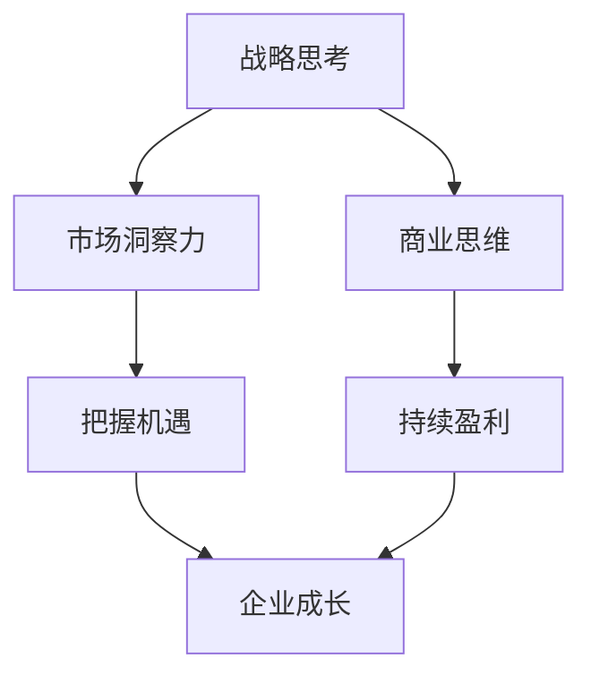

# 怎样培养敏锐的市场洞察力和商业思维

关键词：市场洞察力、商业思维、战略思考、用户洞察、商业模式

## 1. 背景介绍
### 1.1 问题的由来
在当今瞬息万变的商业环境中,企业要想立于不败之地,就必须具备敏锐的市场洞察力和商业思维。然而,许多企业和个人却往往忽视了这一点,导致错失良机,甚至陷入困境。培养市场洞察力和商业思维已经成为企业生存发展的关键能力。

### 1.2 研究现状
目前,国内外学术界和商界已经开始重视市场洞察力和商业思维的培养。哈佛商学院、斯坦福大学等知名学府纷纷开设相关课程,一些成功企业家也撰写了自己的心得体会。但总的来说,系统性的理论框架和实践指导仍然较为缺乏。

### 1.3 研究意义  
深入研究市场洞察力和商业思维的内涵、要素、途径,对于提升企业竞争力,把握发展机遇,实现基业长青具有重要意义。同时,对于个人职业发展,培养商业思维也是一项必备技能。本文将从 IT 专业人士的角度切入,为读者提供系统性的指导。

### 1.4 本文结构
本文将首先阐述市场洞察力和商业思维的核心概念,然后从战略思考、用户洞察、商业模式三个维度入手,详细讲解培养途径,并辅以案例分析。同时,文章还将介绍一些实用工具和学习资源,帮助读者提升能力。

## 2. 核心概念与联系
市场洞察力是指对市场环境、用户需求、行业趋势的敏锐洞察和把握能力。商业思维则是一种基于利润导向,重视价值创造,善于把握商机的思维模式。二者相辅相成,缺一不可。

拥有市场洞察力,才能及时发现潜在商机,规避风险陷阱。而商业思维则是将机会转化为利润的保障。培养市场洞察力和商业思维的关键是要从战略高度审视市场,深刻理解用户,并构建可持续的商业模式。它们之间的关系如下图所示:



## 3. 核心方法原理 & 具体操作步骤
### 3.1 战略思考
战略思考是市场洞察力和商业思维的基石。它要求我们跳出局部,从全局和长远的角度审视市场环境。具体来说需要关注以下几点:

1. 了解宏观经济形势,把握经济周期规律
2. 研判行业发展趋势,寻找行业生命周期的机会
3. 分析竞争对手动向,找准自身定位
4. 预测技术变革带来的机遇与挑战

这需要广泛学习经济金融、行业动态等知识,并培养系统性思维,学会用 PEST、SWOT、波特五力等战略分析工具来审视市场。

### 3.2 用户洞察
用户是市场的核心,深刻理解用户需求是市场洞察力的关键。以下是一些具体的实践步骤:

1. 收集用户数据,通过调研、访谈、数据分析等方式了解用户
2. 运用personas、用户旅程图等工具勾勒用户画像 
3. 挖掘用户痛点,寻找有价值的问题去解决
4. 洞察用户决策心理,优化产品设计与营销策略

比如,可口可乐通过大数据分析发现,下午3点是一天中最疲惫的时刻,于是开发了"Coke@3pm"营销活动,大受欢迎。

### 3.3 商业模式
商业模式是将市场洞察转化为利润的关键。需要考虑以下几个核心要素:

1. 价值主张:我们为谁创造了什么价值?
2. 核心资源与能力:我们依靠什么资源和能力?
3. 盈利模式:我们如何获得收入和利润?
4. 关键业务流程:如何运营才能高效盈利?

商业模式可以借鉴一些经典的模板,如免费模式、双边市场、订阅模式等,结合自身特点加以创新。比如,Spotify 通过免费+订阅的模式,成功占领了在线音乐市场。

## 4. 数学模型和公式 & 详细讲解 & 举例说明
### 4.1 PEST分析模型
PEST分析是评估宏观环境的常用战略工具。它从政治(Political)、经济(Economic)、社会(Social)、技术(Technological)四个维度分析影响企业的外部因素。

我们可以列出各个维度的影响因素,并根据重要性和不确定性赋予权重,综合评分。比如:

- P: 政策支持(+2), 监管趋严(-3)
- E: 经济增长(+3), 汇率波动(-1)
- S: 消费升级(+2), 人口老龄化(-2)  
- T: 移动互联网(+3), 人工智能(+1)

$PEST Score = \sum{Factors_i * Weight_i}$

通过量化分析,我们可以判断宏观环境对企业的总体影响,权衡机会和风险,及时调整战略。

### 4.2 用户生命周期价值(CLV)
用户生命周期价值(Customer Lifetime Value)是衡量单个用户价值的重要指标。我们可以根据用户的购买金额、购买频率、留存时间等因素,预测一个用户在未来可以为企业创造的价值。

$CLV = \sum_{t=1}^{T} \frac{(Price_t * Frequency_t * Margin_t)}{(1 + Discount)^t} * Retention_t$

其中,$Price_t$为第t期的客单价,$Frequency_t$为购买频率,$Margin_t$为利润率,$Discount$为贴现率,$Retention_t$为第t期的留存率。

例如,一个用户平均每月消费100元,购买频率为2次/月,我们的利润率为20%,月留存率为90%,预期生命周期为1年,贴现率为10%,则:

$CLV = \sum_{t=1}^{12} \frac{(100 * 2 * 20\%)}{(1 + 10\%)^t} * 0.9^t ≈ 388$

这意味着,平均每个用户可以为企业创造388元的价值。我们应该围绕高价值用户设计营销策略,重点留存和挖掘他们。

### 4.3 增长黑客模型
增长黑客(Growth Hacking)是一种快速实现用户和收入增长的方法。它强调创新的低成本获客方式,并通过快速迭代优化转化漏斗。我们可以用AARRR模型来评估一个增长黑客策略:

- Acquisition:获取用户
- Activation:激活用户
- Retention:留存用户 
- Revenue:变现用户
- Referral:推荐传播

$Growth Rate = Acquisition * Activation * Retention * Revenue * Referral$

一个好的增长策略需要在漏斗的每个环节都有所优化。比如,Airbnb 曾经允许用户将房源发布到 Craigslist 网站,从而获得了大量新用户。优化注册流程提高了激活率,个性化推荐提升了留存,定期举办优惠活动刺激重复消费,口碑效应带来了源源不断的新用户。

## 5. 项目实践:代码实例和详细解释说明
### 5.1 用户画像分析
我们可以使用 Python 的数据分析库,如 Pandas、Matplotlib、Seaborn 等,对用户数据进行分析挖掘,绘制用户画像。以下是一个简单的例子:

```python
import pandas as pd
import matplotlib.pyplot as plt

# 读取用户数据
users = pd.read_csv('users.csv')

# 分析用户年龄分布
users.Age.plot.hist(bins=20)
plt.xlabel('Age')
plt.ylabel('Count')
plt.title('User Age Distribution')
plt.show()

# 分析用户消费行为
user_orders = pd.merge(users, orders, on='User ID')
user_stats = user_orders.groupby('User ID').agg({
    'Order Amount': ['mean', 'sum', 'count']
})
user_stats.columns = ['Avg Order', 'Total Spend', 'Order Count']
user_stats.sort_values('Total Spend', ascending=False).head(10)
```

这段代码首先读取用户数据,然后分析用户年龄分布,绘制直方图。接着,它将用户数据与订单数据合并,计算每个用户的平均订单金额、总消费额、订单数等指标,筛选出重要的高价值用户。

通过这样的分析,我们可以洞察用户的基本特征和消费行为,为营销决策提供依据。

### 5.2 A/B测试
A/B测试是一种评估两个方案效果差异的试验方法。在增长黑客中,我们经常用它来测试不同的获客渠道、文案、页面设计等。以下是一个简单的 Python 实现:

```python
import numpy as np

def run_ab_test(n, conv_a, conv_b):
    """
    运行A/B测试
    n: 样本量
    conv_a: A组转化率
    conv_b: B组转化率
    """
    samples_a = np.random.binomial(1, conv_a, n)
    samples_b = np.random.binomial(1, conv_b, n)
    
    lift = (samples_b.mean() - samples_a.mean()) / samples_a.mean()
    p_value = ttest_ind(samples_a, samples_b).pvalue
    
    print(f'提升度: {lift:.2%}')
    print(f'P值: {p_value:.3f}')
    
run_ab_test(1000, 0.05, 0.06)
```

这个函数模拟了两组用户的转化情况,计算B组相对于A组的提升度和 P 值。P 值衡量了两组差异的统计显著性,一般要求 P < 0.05 才能认为有显著差异。

例如,我们对比两个付费广告的转化效果,发现B组的转化率提升了20%,P值为0.01,说明B的效果显著优于A,应该加大B的投放。

## 6. 实际应用场景
### 6.1 产品规划
市场洞察力可以帮助我们发现用户需求,指导产品规划。比如,通过社交网络数据分析,我们发现用户对短视频内容的喜好在不断变化,从最初的搞笑、萌宠视频转向知识科普、生活技能分享。因此,我们及时调整了内容策略,引入更多优质的 PUGC 内容,满足用户需求。

### 6.2 定价策略
商业思维让我们重视产品的定价策略。比如,我们的一款 SaaS 产品通过市场调研发现,竞争对手都采用按座位收费的策略,而我们的目标客户更在意使用频率。因此,我们创新性地推出了阶梯式的按使用量计费模式,让轻度用户可以低成本试用,重度用户有动力购买更高的套餐,取得了很好的市场反响。

### 6.3 品牌营销
品牌营销需要深刻洞察用户心理。比如,"得到"App 的广告语"只学有用的",就准确把握了当代知识付费用户的心理特点。他们渴望获得切实可行的知识,而不是泛泛而谈的道理。这一洞察指导"得到"邀请各领域实践专家来设计课程,推出了"职场进阶""跨界学习"等产品矩阵,获得了很高的付费转化率。

### 6.4 未来应用展望
随着大数据、人工智能等新技术的发展,市场洞察力和商业思维将有更广阔的应用前景。企业可以利用机器学习算法分析海量用户数据,预测市场趋势;利用自然语言处理技术分析用户评论,发现产品改进点;利用知识图谱技术探索行业图景,发现创新机会。这些都将极大提升企业的市场适应能力和商业决策水平。

## 7. 工具和资源推荐
### 7.1 学习资源推荐
- 《商业模式新生代》(亚历山大·奥斯特瓦德, 艾伯·皮尼尔) 
- 《增长