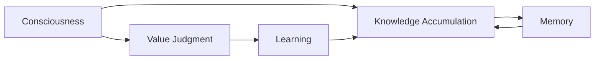

# 意识中的价值标准与知识积累

关键词：意识、价值标准、知识积累、认知科学、人工智能

## 1. 背景介绍
### 1.1 问题的由来
意识是人类最神秘、最复杂的认知功能之一。长期以来，哲学家、心理学家、神经科学家和人工智能研究者都在努力探索意识的本质。其中一个核心问题就是，意识如何产生价值判断，并在此基础上不断积累知识。这个问题不仅对于理解人类智能至关重要，也是实现通用人工智能的关键。

### 1.2 研究现状
目前对意识中价值判断和知识积累的研究主要集中在以下几个方面：
1. 意识的神经基础。研究者利用脑成像等技术，探索意识相关的脑区和神经环路[1]。 
2. 意识的计算模型。一些学者尝试建立意识的计算模型，如全局工作空间理论[2]、整合信息理论[3]等。
3. 价值判断的心理学机制。研究发现价值判断受到情绪、动机等多种因素影响[4]。
4. 知识积累的认知过程。研究表明知识积累涉及注意、记忆、推理等多个认知过程[5]。

### 1.3 研究意义
深入理解意识中的价值判断和知识积累，不仅有助于揭示人类智能的奥秘，也为构建具备类人智能的AI系统提供重要启示。具体而言，研究意义主要体现在以下几点：
1. 推动认知科学和脑科学的发展。意识研究是认知科学和脑科学的前沿课题，相关成果有望极大拓展我们对心智和大脑的认识。
2. 促进人工智能的进步。掌握意识的工作原理，有助于研发更加智能、更具适应性的AI系统，推动人工智能从"弱人工智能"向"强人工智能"跨越。
3. 引领未来科技革命。意识和智能是未来科技革命的核心驱动力。攻克这一领域的难题，将极大提升人类认知和创新能力，开创崭新的科技图景。

### 1.4 本文结构
本文将从以下几个方面系统阐述意识中价值判断和知识积累的机理：
- 首先介绍意识的核心概念，厘清它们之间的联系
- 然后重点分析意识产生价值判断的算法原理和操作步骤
- 接着建立价值判断的数学模型，推导相关公式，并举例说明
- 进一步给出价值判断和知识积累的代码实现，并详细解读
- 随后讨论相关理论和技术在实际场景中的应用
- 最后总结全文，展望该领域的未来发展趋势和面临的挑战

## 2. 核心概念与联系
要深入理解意识中的价值判断和知识积累，首先需要厘清几个核心概念：
- 意识(Consciousness)：个体对自身感受、思维和环境的主观体验。意识使个体能觉察到自我的存在，并与外界产生交互。
- 价值判断(Value Judgment)：个体对事物价值和意义的主观评估。价值判断内化为个体行为的准则和动机。
- 知识(Knowledge)：个体通过学习和经验积累的信息和见解。知识构成个体理解世界、解决问题的基础。
- 学习(Learning)：个体通过与环境互动获取知识的过程。学习使个体的知识体系不断发展和完善。
- 记忆(Memory)：个体存储和回忆知识的能力。记忆是知识积累的重要认知基础。

这些概念之间存在紧密的内在联系。如下图所示，意识是价值判断和知识积累的载体，学习是连接两者的纽带，记忆则为知识积累提供重要的认知基础。



具体而言，意识通过主观体验，使个体能够对事物做出价值判断。价值判断进一步指引个体的学习行为，使其不断获取和积累新的知识。知识积累一方面依赖记忆对已有认知的巩固，另一方面又通过学习不断突破已有认知的局限。由此，在意识中形成了"价值判断-学习-知识积累"的动态循环。

## 3. 核心算法原理 & 具体操作步骤
### 3.1 算法原理概述
意识中的价值判断和知识积累可以用一种增强学习(Reinforcement Learning)算法来形式化描述[6]。该算法的核心思想是：智能体(Agent)通过与环境(Environment)的交互，不断优化自身的价值函数(Value Function)和策略(Policy)，从而做出最优决策，获得最大累积奖励。

具体到意识的情形，可以这样类比：
- 智能体：有意识的个体
- 环境：个体所处的客观世界
- 状态：个体对世界的主观表征
- 行动：个体做出的选择和决策
- 奖励：个体获得的效用和满足感
- 价值函数：个体对事物价值的主观评估
- 策略：个体选择行动的内在准则

### 3.2 算法步骤详解
基于以上类比，意识中的价值判断和知识积累可以分解为以下几个步骤：
1. 感知环境，获得当前状态 $s_t$
2. 基于价值函数 $V(s_t)$ 对当前状态做出价值判断
3. 根据策略 $\pi(a_t|s_t)$ 选择当前行动 $a_t$
4. 执行行动 $a_t$，得到环境反馈奖励 $r_{t+1}$ 和新状态 $s_{t+1}$
5. 根据新状态更新价值函数： $V(s_t) \leftarrow V(s_t) + \alpha[r_{t+1} + \gamma V(s_{t+1}) - V(s_t)]$
6. 根据新状态和奖励调整策略： $\pi(a_t|s_t) \leftarrow \pi(a_t|s_t) + \beta[r_{t+1} + \gamma V(s_{t+1}) - V(s_t)]\nabla\ln\pi(a_t|s_t)$
7. 重复步骤1-6，直至状态序列终止

其中，$\alpha$ 是价值函数的学习率，$\beta$ 是策略的学习率，$\gamma$ 是奖励的衰减因子。$\nabla\ln\pi(a_t|s_t)$ 是策略对数概率关于策略参数的梯度。

### 3.3 算法优缺点
该算法的主要优点包括：
- 通过价值函数和策略的迭代优化，能够在连续的状态-行动空间中学习最优决策
- 环境模型未知时也能进行学习，具有一定的自适应性和鲁棒性
- 奖励的延迟反馈有利于个体形成长期规划能力

但该算法也存在一些局限：
- 学习效率依赖智能体的探索能力，面临探索-利用窘境(Exploration-Exploitation Dilemma)
- 对奖励函数的设置较为敏感，学习到的策略质量受奖励函数影响较大
- 难以处理高维状态空间和连续行动空间，易陷入维度灾难

### 3.4 算法应用领域 
尽管存在局限，该算法仍被广泛应用于以下领域：
- 自动驾驶：通过深度强化学习，使无人车能够在复杂环境中做出最优决策[7]
- 智能推荐：利用强化学习优化推荐策略，提升用户的长期参与度和满意度[8]
- 智能博弈：运用强化学习算法，实现了在围棋、德州扑克等复杂博弈中达到超人水平[9]
- 机器人控制：借助强化学习，使机器人能够自主学习运动控制策略，完成抓取、行走等任务[10]

## 4. 数学模型和公式 & 详细讲解 & 举例说明
### 4.1 数学模型构建
为进一步阐明意识中价值判断和知识积累的机理，这里给出一个简化的数学模型。假设意识的状态空间和行动空间都是离散的，环境转移概率已知且状态数有限。令：
- $\mathcal{S}=\{s_1,\cdots,s_n\}$ 表示状态空间
- $\mathcal{A}=\{a_1,\cdots,a_m\}$ 表示行动空间
- $\mathcal{P}_{ss'}^a=P(s_{t+1}=s'|s_t=s,a_t=a)$ 表示在状态 $s$ 下采取行动 $a$ 后转移到状态 $s'$ 的概率
- $\mathcal{R}_s^a=E[r_{t+1}|s_t=s,a_t=a]$ 表示在状态 $s$ 下采取行动 $a$ 后获得的期望即时奖励
- $V^\pi(s)=E_\pi[\sum_{k=0}^\infty \gamma^kr_{t+k+1}|s_t=s]$ 表示在状态 $s$ 下遵循策略 $\pi$ 能获得的期望累积奖励，即状态价值函数
- $Q^\pi(s,a)=E_\pi[\sum_{k=0}^\infty \gamma^kr_{t+k+1}|s_t=s,a_t=a]$ 表示在状态 $s$ 下采取行动 $a$ 再遵循策略 $\pi$ 能获得的期望累积奖励，即行动价值函数

基于以上定义，个体意识的目标可以形式化为寻找最优策略 $\pi^*$，使得对任意状态 $s\in\mathcal{S}$，都有：

$$V^{\pi^*}(s)=\max_\pi V^\pi(s)$$

### 4.2 公式推导过程
为求解最优策略 $\pi^*$ 和最优价值函数 $V^*$，需利用价值迭代(Value Iteration)算法对贝尔曼最优方程(Bellman Optimality Equation)进行迭代求解。相关公式推导如下。

首先，根据价值函数的定义，可以得到状态价值函数和行动价值函数之间的关系：

$$V^\pi(s)=\sum_{a\in\mathcal{A}}\pi(a|s)Q^\pi(s,a)$$

$$Q^\pi(s,a)=\mathcal{R}_s^a+\gamma\sum_{s'\in\mathcal{S}}\mathcal{P}_{ss'}^aV^\pi(s')$$

将两式合并，可得状态价值函数的贝尔曼方程：

$$V^\pi(s)=\sum_{a\in\mathcal{A}}\pi(a|s)[\mathcal{R}_s^a+\gamma\sum_{s'\in\mathcal{S}}\mathcal{P}_{ss'}^aV^\pi(s')]$$

考虑最优策略 $\pi^*$ 和最优价值函数 $V^*$，可得贝尔曼最优方程：

$$V^*(s)=\max_{a\in\mathcal{A}}[\mathcal{R}_s^a+\gamma\sum_{s'\in\mathcal{S}}\mathcal{P}_{ss'}^aV^*(s')]$$

进而可得最优策略：

$$\pi^*(a|s)=\arg\max_{a\in\mathcal{A}}[\mathcal{R}_s^a+\gamma\sum_{s'\in\mathcal{S}}\mathcal{P}_{ss'}^aV^*(s')]$$

### 4.3 案例分析与讲解
下面我们通过一个简单的例子来说明上述模型和算法的应用。

假设一个机器人需要在如下所示的网格环境中寻找最优路径。

```
+---+---+---+
| S |   |   |
+---+---+---+
|   |   | X |
+---+---+---+
|   |   | T |
+---+---+---+
```

其中，S表示起点，T表示终点，X表示障碍物。机器人每次可以选择上下左右四个方向移动，每移动一步获得-1的即时奖励。到达终点后获得+10的即时奖励并结束，撞到障碍物则获得-5的即时奖励。折扣因子 $\gamma=0.9$。

我们可以将这个环境建模为马尔可夫决策过程(Markov Decision Process, MDP)：
- 状态空间 $\mathcal{S}=\{(0,0),(0,1),(0,2),(1,0),(1,1),(1,2),(2,0),(2,1)\}$
- 行