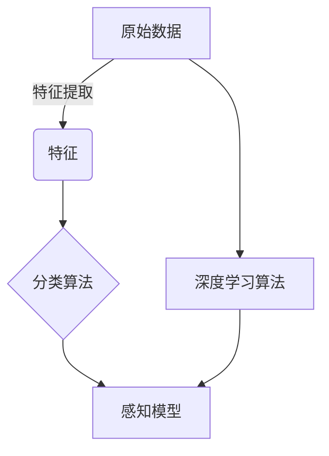

# 感知（Perception）是指Agent从环境中收集信息并从中提取相关知识的能力

## 1. 背景介绍

### 1.1 问题的由来

在人工智能领域中，赋予智能体(Agent)感知环境的能力是一个至关重要的课题。感知是指智能体从环境中获取信息并从中提取相关知识的过程。这个过程对于智能体理解周围环境、做出决策并采取相应行动至关重要。

在现实世界中,人类和动物都拥有先天的感知能力,可以通过视觉、听觉、触觉等感官从环境中获取信息。然而,对于人工智能系统来说,赋予其感知能力则是一个巨大的挑战。

### 1.2 研究现状

近年来,随着机器学习、计算机视觉和自然语言处理等技术的快速发展,人工智能系统的感知能力也得到了长足的进步。目前,感知技术已经广泛应用于自动驾驶、机器人技术、智能监控等领域。

然而,现有的感知技术仍然存在一些局限性。例如,在复杂环境下,智能体难以准确地识别和理解所有信息;在动态环境下,智能体难以及时地捕捉环境变化并作出相应反应。此外,现有技术也存在一些安全和隐私方面的问题。

### 1.3 研究意义

提高智能体的感知能力对于推动人工智能技术的发展具有重要意义。准确的感知能力可以帮助智能体更好地理解环境,从而做出更加合理的决策和行为。此外,强大的感知能力也是实现通用人工智能(AGI)的关键之一。

因此,深入研究感知技术,探索新的感知方法和模型,提高智能体的感知能力,对于推动人工智能技术的发展具有重要意义。

### 1.4 本文结构

本文将从以下几个方面对感知技术进行深入探讨:

1. 介绍感知的核心概念及其与其他人工智能技术的联系。
2. 详细阐述感知的核心算法原理和具体操作步骤。
3. 建立数学模型,推导公式,并通过案例分析进行详细讲解。
4. 提供代码实例,并对其进行详细解释和说明。
5. 介绍感知技术在实际应用中的场景。
6. 推荐相关的学习资源、开发工具和论文。
7. 总结感知技术的发展趋势和面临的挑战。
8. 解答常见问题。

## 2. 核心概念与联系

感知(Perception)是指智能体(Agent)从环境中收集信息并从中提取相关知识的能力。它是人工智能系统中一个非常重要的组成部分,与其他人工智能技术密切相关。

### 2.1 感知与机器学习

感知技术与机器学习技术密切相关。机器学习算法可以从大量的数据中学习到感知模型,从而赋予智能体感知能力。例如,在计算机视觉领域,卷积神经网络(CNN)可以从大量图像数据中学习到特征提取模型,从而实现对图像的识别和理解。

### 2.2 感知与计算机视觉

计算机视觉是感知技术的一个重要应用领域。计算机视觉技术赋予智能体视觉感知能力,使其能够从图像或视频中提取有用的信息,如物体检测、目标跟踪、场景理解等。

### 2.3 感知与自然语言处理

自然语言处理(NLP)技术也与感知技术密切相关。NLP技术赋予智能体语言感知能力,使其能够理解和生成自然语言,从而实现与人类的自然交互。

### 2.4 感知与机器人技术

在机器人技术中,感知是一个关键环节。机器人需要通过各种传感器从环境中获取信息,如视觉、声音、触觉等,并对这些信息进行处理和理解,从而做出相应的行为决策。

### 2.5 感知与智能系统

感知是构建智能系统的基础。只有具备良好的感知能力,智能系统才能够准确地理解环境,从而做出合理的决策和行为。因此,提高感知能力对于实现通用人工智能(AGI)至关重要。

## 3. 核心算法原理与具体操作步骤

### 3.1 算法原理概述

感知算法的核心原理是从原始数据(如图像、声音、文本等)中提取有用的特征,并基于这些特征构建感知模型。常见的感知算法包括:

1. **特征提取算法**: 如SIFT、HOG等用于从图像中提取特征的算法。
2. **分类算法**: 如支持向量机(SVM)、决策树等用于将特征映射到类别的算法。
3. **深度学习算法**: 如卷积神经网络(CNN)、递归神经网络(RNN)等端到端的算法,可以直接从原始数据中学习特征和模型。

这些算法通常需要大量的训练数据,并经过反复的训练和优化,才能获得高质量的感知模型。

### 3.2 算法步骤详解

以计算机视觉领域的目标检测任务为例,感知算法的具体步骤如下:

1. **数据预处理**: 对原始图像数据进行预处理,如调整大小、归一化等,以满足算法的输入要求。

2. **特征提取**: 使用特征提取算法(如SIFT、HOG等)从图像中提取特征,这些特征描述了图像的局部特征。

3. **建立训练集和测试集**: 将预处理后的图像及其对应的标注信息(如目标位置、类别等)划分为训练集和测试集。

4. **模型训练**: 使用分类算法(如SVM、决策树等)或深度学习算法(如CNN等)在训练集上训练感知模型。

5. **模型评估**: 在测试集上评估训练好的模型的性能,如准确率、召回率等指标。

6. **模型优化**: 根据评估结果,调整算法参数或增加训练数据,重复训练和评估,直至获得满意的模型性能。

7. **模型部署**: 将优化后的模型部署到实际系统中,用于目标检测任务。

### 3.3 算法优缺点

感知算法具有以下优缺点:

**优点**:

1. 能够从大量数据中自动学习特征和模型,减少了人工设计特征的工作。
2. 具有较强的泛化能力,可以应对复杂和多变的环境。
3. 算法性能随着数据量的增加而提高,具有可扩展性。

**缺点**:

1. 需要大量的标注数据用于训练,数据标注工作耗时耗力。
2. 算法的性能高度依赖于训练数据的质量和多样性。
3. 对于一些特殊场景,算法的性能可能不尽如人意。
4. 部分算法存在"黑盒"问题,难以解释决策过程。

### 3.4 算法应用领域

感知算法在多个领域都有广泛的应用:

1. **计算机视觉**: 如目标检测、图像分类、场景理解等。
2. **自然语言处理**: 如文本分类、机器翻译、问答系统等。
3. **语音识别**: 如语音转文本、语音命令识别等。
4. **机器人技术**: 如环境感知、障碍物检测、路径规划等。
5. **自动驾驶**: 如交通标志识别、行人检测、车道线检测等。
6. **医疗影像**: 如病灶检测、肿瘤分割等。

## 4. 数学模型和公式详细讲解与举例说明

### 4.1 数学模型构建

在感知任务中,我们通常需要构建数学模型来描述输入数据和输出目标之间的映射关系。以图像分类任务为例,我们可以将其建模为一个函数映射:

$$f: \mathcal{X} \rightarrow \mathcal{Y}$$

其中,$ \mathcal{X} $表示输入图像的空间,$ \mathcal{Y} $表示输出类别的空间。我们的目标是找到一个最优映射函数$ f^* $,使得对于任意输入图像$ x \in \mathcal{X} $,都能够正确预测其类别$ y \in \mathcal{Y} $。

在监督学习场景下,我们有一个训练数据集$ \mathcal{D} = \{(x_i, y_i)\}_{i=1}^N $,其中$ x_i $是输入图像,$ y_i $是对应的类别标签。我们可以将映射函数$ f $参数化为一个可学习的模型$ f(x; \theta) $,其中$ \theta $是模型参数。通过优化一个损失函数$ \mathcal{L} $,我们可以找到最优参数$ \theta^* $:

$$\theta^* = \arg\min_\theta \frac{1}{N} \sum_{i=1}^N \mathcal{L}(f(x_i; \theta), y_i)$$

对于不同的模型和任务,损失函数$ \mathcal{L} $的形式也不尽相同。例如,在图像分类任务中,我们常用的损失函数是交叉熵损失函数。

### 4.2 公式推导过程

以线性分类器为例,我们来推导其数学模型和公式。

对于一个二分类问题,我们的目标是找到一个超平面将两类样本分开。设输入样本为$ \boldsymbol{x} \in \mathbb{R}^d $,其类别标签为$ y \in \{-1, 1\} $。我们定义超平面的方程为:

$$\boldsymbol{w}^\top \boldsymbol{x} + b = 0$$

其中,$ \boldsymbol{w} \in \mathbb{R}^d $是超平面的法向量,$ b \in \mathbb{R} $是偏移项。我们希望对于每个样本$ (\boldsymbol{x}_i, y_i) $,都有:

$$y_i(\boldsymbol{w}^\top \boldsymbol{x}_i + b) \geq 1$$

这个式子表示,正类样本落在超平面的一侧,负类样本落在另一侧,且它们与超平面的距离至少为$ \frac{1}{\|\boldsymbol{w}\|} $。

为了找到最优的$ \boldsymbol{w} $和$ b $,我们可以构建如下优化问题:

$$\begin{aligned}
\min_{\boldsymbol{w}, b} &\quad \frac{1}{2}\|\boldsymbol{w}\|^2 \\
\text{s.t.} &\quad y_i(\boldsymbol{w}^\top \boldsymbol{x}_i + b) \geq 1, \quad i = 1, 2, \ldots, N
\end{aligned}$$

这个优化问题被称为硬间隔支持向量机(Hard-margin SVM)。通过引入松弛变量,我们可以推广到软间隔支持向量机(Soft-margin SVM),从而处理线性不可分的情况。

### 4.3 案例分析与讲解

让我们通过一个实际案例来进一步理解感知算法的原理和公式。

**案例背景**:

假设我们需要构建一个系统,用于识别图像中的数字。我们有一个包含手写数字图像及其对应标签的数据集$ \mathcal{D} = \{(x_i, y_i)\}_{i=1}^N $,其中$ x_i $是一个$ 28 \times 28 $像素的灰度图像,$ y_i \in \{0, 1, \ldots, 9\} $是对应的数字标签。

**模型构建**:

我们可以使用卷积神经网络(CNN)作为感知模型。CNN由多个卷积层、池化层和全连接层组成,能够自动从图像中提取特征并进行分类。

设CNN模型的参数为$ \theta $,我们的目标是通过优化交叉熵损失函数$ \mathcal{L} $找到最优参数$ \theta^* $:

$$\theta^* = \arg\min_\theta \frac{1}{N} \sum_{i=1}^N \mathcal{L}(f(x_i; \theta), y_i)$$

其中,$ f(x_i; \theta) $是CNN模型对输入图像$ x_i $的预测结果,$ y_i $是真实标签。

**模型训练**:

我们将数据集$ \mathcal{D} $划分为训练