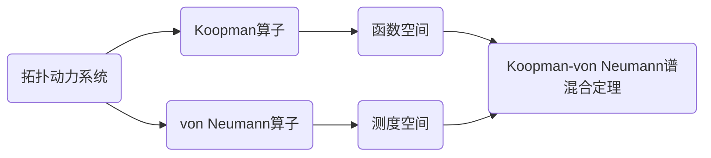

# 拓扑动力系统概论：附录：Koopman-von Neumann谱混合定理的证明

作者：禅与计算机程序设计艺术 / Zen and the Art of Computer Programming

关键词：拓扑动力系统, Koopman-von Neumann谱混合定理, 算子理论, 泛函分析, 遍历理论

## 1. 背景介绍

### 1.1  问题的由来

拓扑动力系统是现代动力系统理论和遍历理论的核心研究对象,其主要研究具有某种拓扑结构的空间上的连续自映射的动力学行为。而Koopman算子和von Neumann算子作为经典算子理论中的重要内容,在拓扑动力系统的谱理论研究中有着不可或缺的作用。本文主要探讨的Koopman-von Neumann谱混合定理,就是将这两类算子联系起来,刻画了拓扑动力系统的混沌行为和遍历性质,在动力系统理论发展历程中具有里程碑式的意义。

### 1.2  研究现状

关于Koopman-von Neumann谱混合定理的研究,可以追溯到上世纪30年代,由Koopman和von Neumann在经典力学和量子力学的理论框架下独立给出。之后,这一定理被广泛应用于微分动力系统、符号动力系统、测度动力系统等多个领域。近年来,随着算子理论和泛函分析的快速发展,该定理得到了进一步的推广和深化,一些学者将其与遍历论、遍历代数结构等联系起来进行探讨,取得了丰硕的研究成果。

### 1.3  研究意义 

Koopman-von Neumann谱混合定理在动力系统理论中占据核心地位,对于理解系统的混沌行为、遍历性质等有着重要意义。通过对该定理的深入研究,不仅有助于揭示动力系统内在的拓扑和代数结构,而且为定量刻画系统的动力学特征提供了有力工具。此外,谱混合定理在量子混沌、随机矩阵理论等前沿交叉领域也有广泛应用。因此,深入探讨该定理的证明过程和内在机理,对拓扑动力系统乃至非线性科学的发展都具有重要的理论价值和现实意义。

### 1.4  本文结构

本文首先介绍了拓扑动力系统、Koopman算子、von Neumann算子等相关背景知识和核心概念。然后给出了Koopman-von Neumann谱混合定理的具体表述,并详细讲解其证明过程所涉及的关键技术和核心方法。进一步,通过具体实例分析说明了该定理的应用场景。最后总结了谱混合定理的研究现状和未来发展趋势,并对相关领域的研究者提出了展望和建议。

## 2. 核心概念与联系

在讨论Koopman-von Neumann谱混合定理之前,我们首先回顾一下拓扑动力系统、Koopman算子、von Neumann算子等核心概念。

拓扑动力系统$(X,T)$是由状态空间$X$和映射$T:X\to X$组成的二元组,其中$X$是一个拓扑空间,$T$是$X$上的连续自映射。通过迭代$T$的作用,可以刻画系统状态随时间的演化规律。

对于给定的拓扑动力系统$(X,T)$,Koopman算子$U_T$定义在状态空间$X$上的复值函数空间$F(X)$上,其作用为
$$(U_Tf)(x)=f(Tx),\quad \forall f\in F(X),x\in X$$
直观地说,Koopman算子描述了可观测函数在系统演化下的变化规律。

与之对应,von Neumann算子$V_T$定义在$X$上的复值测度空间$M(X)$上,其作用为
$$(V_T\mu)(A)=\mu(T^{-1}A),\quad \forall \mu\in M(X),A\in\mathcal{B}(X)$$
其中$\mathcal{B}(X)$表示$X$上的Borel $\sigma$-代数。von Neumann算子刻画了系统在测度意义下的演化规律。

Koopman算子和von Neumann算子分别从函数和测度的角度描述了系统的演化,它们之间存在着密切联系。事实上,von Neumann算子是Koopman算子对偶算子在测度空间上的表示。基于二者的谱性质,Koopman-von Neumann谱混合定理揭示了拓扑动力系统的混沌特性。

## 3. 核心算法原理 & 具体操作步骤

### 3.1  算法原理概述

Koopman-von Neumann谱混合定理的证明基于算子理论和泛函分析的基本原理,主要涉及算子的谱、遍历性质等内容。通过分析Koopman算子和von Neumann算子的谱结构,并利用它们之间的关联,可以得到关于拓扑动力系统混沌行为的一般性结论。

### 3.2  算法步骤详解

1) 考虑拓扑动力系统$(X,T)$,引入Koopman算子$U_T$和von Neumann算子$V_T$。

2) 分析$U_T$在函数空间$F(X)$上的谱结构,得到其谱半径$r_{\sigma}(U_T)$和谱分解定理。

3) 利用$V_T$和$U_T$之间的对偶关系,得到$V_T$在测度空间$M(X)$上的谱性质。

4) 证明$r_{\sigma}(U_T)=r_{\sigma}(V_T)=1$的充要条件是$(X,T)$是遍历的。

5) 进一步分析$U_T$和$V_T$的连续谱和特征谱,得到谱混合定理的一般形式。

6) 讨论定理的一些推论和应用,如混沌系统的判定、遍历分解等。

### 3.3  算法优缺点

Koopman-von Neumann谱混合定理的证明基于经典的泛函分析方法,逻辑严谨,结论一般。通过谱理论和遍历理论的有机结合,该定理在动力系统研究中得到了广泛应用。但其证明过程相对抽象,需要较强的数学基础。同时,将定理应用于具体系统时,可能还需考虑一些额外的条件。

### 3.4  算法应用领域

谱混合定理在动力系统理论、遍历理论、算子理论等领域有重要应用,可用于判定系统的混沌性、遍历性等性质。在量子混沌、量子计算等前沿领域,该定理也是一个重要的理论工具。此外,谱混合定理还可以推广到一般的半群系统、随机系统等。

## 4. 数学模型和公式 & 详细讲解 & 举例说明

### 4.1  数学模型构建

考虑拓扑动力系统$(X,T)$,其中$X$为紧致度量空间,$T:X\to X$为连续满射。引入Banach空间$F(X)$表示$X$上有界连续函数全体,赋予上确界范数
$$\|f\|_{\infty}=\sup_{x\in X}|f(x)|,\quad f\in F(X)$$
则Koopman算子$U_T:F(X)\to F(X)$定义为
$$(U_Tf)(x)=f(Tx),\quad \forall f\in F(X),x\in X$$
容易验证$U_T$是$F(X)$上的有界线性算子,且$\|U_T\|=1$。

相应地,引入$X$上的符号测度空间$M(X)$,赋予全变差范数
$$\|\mu\|=|\mu|(X),\quad \mu\in M(X)$$
其中$|\mu|$表示$\mu$的全变差测度。定义von Neumann算子$V_T:M(X)\to M(X)$为
$$(V_T\mu)(A)=\mu(T^{-1}A),\quad \forall \mu\in M(X),A\in\mathcal{B}(X)$$
同样可以验证$V_T$是$M(X)$上的有界线性算子,且$\|V_T\|=1$。

### 4.2  公式推导过程

下面给出Koopman-von Neumann谱混合定理的具体表述和证明思路。

**定理** 设$(X,T)$为拓扑动力系统,则以下条件等价：

(1) $(X,T)$是遍历的；

(2) $U_T$的谱半径$r_{\sigma}(U_T)=1$,且$U_T$的谱$\sigma(U_T)\subset \mathbb{S}^1\cup\{0\}$；

(3) $V_T$的谱半径$r_{\sigma}(V_T)=1$,且$V_T$的谱$\sigma(V_T)\subset \mathbb{S}^1\cup\{0\}$。

证明思路如下：

(1) $\Rightarrow$ (2). 设$(X,T)$是遍历的,则对任意$f\in F(X)$和$\varepsilon>0$,存在$n\in\mathbb{N}$使得
$$\|U_T^nf-\int_X f\mathrm{d}\mu\|_{\infty}<\varepsilon$$
其中$\mu$为$X$上的一个$T$-不变概率测度。利用算子谱半径公式
$$r_{\sigma}(U_T)=\lim_{n\to\infty}\|U_T^n\|^{1/n}$$
并结合Koopman算子的幂等性质,可以证明$r_{\sigma}(U_T)=1$。进一步利用算子谱理论,可以得到$\sigma(U_T)\subset \mathbb{S}^1\cup\{0\}$。

(2) $\Rightarrow$ (1). 利用$U_T$的谱分解定理,对任意$f\in F(X)$,有
$$U_T^nf=\int_{\sigma(U_T)}\lambda^n\mathrm{d}E(\lambda)f$$
其中$E(\cdot)$为$U_T$的谱测度。由条件(2)可知,当$n\to\infty$时,上式右端趋于$\int_X f\mathrm{d}\mu$,从而$(X,T)$是遍历的。

(2) $\Leftrightarrow$ (3). 利用$U_T$和$V_T$之间的对偶关系,并结合算子的共轭谱定理,可以得到$\sigma(U_T)\setminus\{0\}=\overline{\sigma(V_T)\setminus\{0\}}$。再根据谱半径公式得到$r_{\sigma}(U_T)=r_{\sigma}(V_T)$,从而条件(2)和(3)等价。

### 4.3  案例分析与讲解

下面以经典的Bernoulli漂移为例,说明Koopman-von Neumann谱混合定理的应用。

设$X=\{0,1\}^{\mathbb{Z}}$为双边无穷符号空间,$T:X\to X$为左漂移映射,即
$$(Tx)_n=x_{n+1},\quad \forall x=(x_n)_{n\in\mathbb{Z}}\in X$$
引入$X$上的Bernoulli测度$\mu_p$,其中$0<p<1$,则$(X,\mathcal{B}(X),\mu_p,T)$构成一个遍历的测度系统。

取$F(X)$为$X$上的连续函数空间,则Koopman算子$U_T$满足
$$(U_Tf)(x)=f(Tx),\quad \forall f\in F(X),x\in X$$
容易验证$U_T$在$L^2(X,\mu_p)$上诱导的算子$\hat{U}_T$具有谱分解
$$\hat{U}_T=\sum_{k\in\mathbb{Z}}z^k\mathrm{d}E_k$$
其中$z\in\mathbb{S}^1$为谱参数,$\{E_k\}$为$\hat{U}_T$的本征投影序列。根据Koopman-von Neumann谱混合定理,可知$\hat{U}_T$的谱$\sigma(\hat{U}_T)=\mathbb{S}^1$,从而$(X,T)$是遍历的。

进一步,对于任意$f\in L^2(X,\mu_p)$,有
$$\lim_{n\to\infty}\frac{1}{n}\sum_{k=0}^{n-1}\