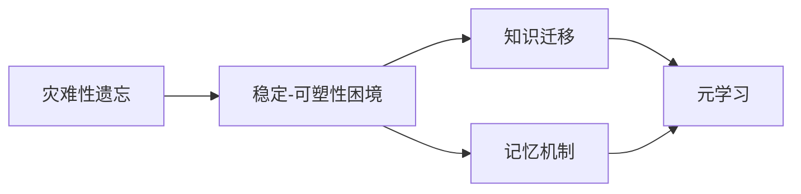
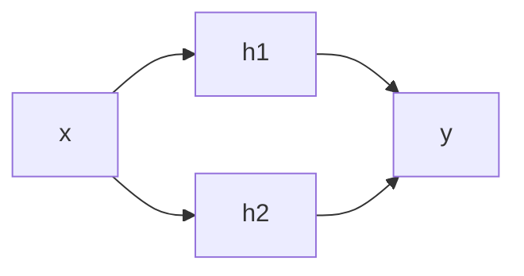

# 持续学习Continual Learning原理与代码实例讲解

## 1. 背景介绍

### 1.1 问题的由来
在传统的机器学习范式中,模型通常是在一个固定的数据集上进行训练,然后用于对新数据进行预测。然而,在现实世界中,数据往往是动态变化的,模型需要不断学习和适应新的知识,同时还要保留之前学到的知识。这就是持续学习(Continual Learning)要解决的问题。

### 1.2 研究现状 
近年来,持续学习受到了学术界和工业界的广泛关注。一些代表性的工作包括:
- Progressive Neural Networks (2016)
- Elastic Weight Consolidation (2017)  
- Learning without Forgetting (2017)
- Gradient Episodic Memory (2017)
- Variational Continual Learning (2018)

这些方法从不同角度解决了持续学习中的关键问题,如避免灾难性遗忘、提高知识迁移能力等。但现有方法仍存在一些局限性,如计算开销大、适用场景有限等。

### 1.3 研究意义
持续学习对于开发能够持续学习、适应动态环境的智能系统具有重要意义。它有望在以下领域得到应用:

- 自动驾驶:车辆需要适应不断变化的道路环境和驾驶策略
- 智能助理:需要不断学习新知识,满足用户多样化需求  
- 工业控制:需要根据生产状况实时调整控制策略
- 医疗诊断:需要持续学习新的医学知识,提高诊断准确率

总的来说,持续学习是实现通用人工智能的关键能力之一,对未来人工智能的发展具有重要意义。

### 1.4 本文结构
本文将从以下几个方面对持续学习进行系统阐述:

1. 介绍持续学习的核心概念与关键问题 
2. 讲解主要的持续学习算法原理和实现步骤
3. 介绍持续学习涉及的关键数学模型与公式
4. 通过代码实例演示如何实现持续学习算法
5. 分析持续学习的典型应用场景
6. 推荐持续学习相关的学习资源与工具
7. 总结持续学习的发展趋势与面临的挑战
8. 回答持续学习领域的一些常见问题

## 2. 核心概念与联系

持续学习的目标是让机器学习模型能够持续不断地学习新知识,同时尽可能保留之前学习到的知识。其涉及的核心概念包括:

- 灾难性遗忘(Catastrophic Forgetting):模型在学习新任务时,之前学习到的知识被严重干扰遗忘,导致性能急剧下降。这是持续学习面临的最大挑战。

- 稳定-可塑性困境(Stability-Plasticity Dilemma):模型需在保持稳定(对旧知识的记忆)和保持可塑性(对新知识的学习)之间取得平衡。过于稳定则无法学习新知识,过于可塑则会遗忘旧知识。

- 知识迁移(Knowledge Transfer):将之前学习到的知识迁移应用到新任务学习中,提高学习效率和性能。正向迁移有助于学习,负向迁移则有害。

- 记忆机制(Memory Mechanism):通过一定的记忆机制(如重放旧数据、参数正则化等),在学习新知识的同时保留对旧知识的记忆。

- 元学习(Meta Learning):通过学习一些元知识(如优化算法、损失函数等),使模型能够更高效地适应和学习新任务。

下图展示了这些核心概念之间的关联(使用Mermaid流程图绘制):

由图可见,灾难性遗忘是由稳定-可塑性困境引起的,而解决这一困境的主要思路包括知识迁移、记忆机制和元学习。这些概念与机制之间相互关联,共同构成了持续学习的理论基础。

## 3. 核心算法原理 & 具体操作步骤

### 3.1 算法原理概述
目前主流的持续学习算法可分为三类:

1. 基于正则化的方法:通过对模型参数或激活值添加正则化项,使得模型在学习新任务时尽量保持对之前任务的知识。代表算法包括EWC、MAS等。

2. 基于记忆回放的方法:通过存储一些旧任务的数据,在学习新任务时回放这些数据,减缓遗忘。代表算法包括GEM、A-GEM等。 

3. 基于动态架构的方法:通过动态增加网络容量(如增加神经元或层),为不同任务分配专门的子网络。代表算法包括PNN、DEN等。

此外还有一些将不同思路结合的混合方法,如基于正则化和记忆回放的VCL等。

### 3.2 算法步骤详解
下面以EWC算法为例,详细讲解其原理和实现步骤。

EWC全称Elastic Weight Consolidation,其核心思想是在损失函数中引入一个正则化项,使得模型参数在学习新任务时尽量与学习旧任务后的参数接近,减缓灾难性遗忘。

假设模型在任务A上训练后的参数为$\theta^{*}_A$,对应的Fisher信息矩阵为$F_A$。那么在学习新任务B时,EWC算法的损失函数定义为:

$$
L(\theta) = L_B(\theta) + \sum_i \frac{\lambda}{2} F_{A,i} (\theta_i - \theta^{*}_{A,i})^2
$$

其中$L_B$是任务B的原始损失, $\lambda$是正则化强度系数。直观理解,该正则化项施加了一个约束,使得每个参数$\theta_i$尽量与$\theta^{*}_{A,i}$接近,接近程度由$F_{A,i}$决定。$F_{A,i}$越大,表明参数$\theta_i$对任务A的重要程度越高,应尽量保持不变。

EWC的主要步骤如下:

1. 在任务A上训练模型,得到$\theta^{*}_A$
2. 计算$\theta^{*}_A$对应的Fisher信息矩阵$F_A$
3. 构造新的损失函数$L(\theta)$
4. 利用$L(\theta)$在任务B上训练模型,得到$\theta^{*}_B$
5. 重复步骤2-4,在后续任务上持续训练

可见,EWC算法无需存储旧数据,只需存储少量参数,因而具有较高的存储效率。但其计算开销相对较大,且有两个超参数需要调节。

### 3.3 算法优缺点
下面总结EWC算法的主要优缺点:

优点:
- 无需存储旧数据,节省存储开销
- 可适用于任务序列较长的情况
- 可与其他持续学习策略结合,如记忆回放

缺点:  
- 计算Fisher信息矩阵的开销较大
- 超参数$\lambda$需要调节,对性能影响较大
- 主要针对参数,对非参数层(如BN层)效果不佳

总的来说,EWC是一种简洁有效的持续学习算法,但仍有一些局限性,实际应用时需要权衡。

### 3.4 算法应用领域
EWC算法及其变体在一些领域得到了应用,如:

- 计算机视觉:物体识别、人脸识别等
- 自然语言处理:情感分析、语言模型等
- 推荐系统:根据用户反馈持续优化模型
- 机器人控制:适应不同环境和任务

## 4. 数学模型和公式 & 详细讲解 & 举例说明

### 4.1 数学模型构建
持续学习可以用概率图模型来描述。假设有一系列任务$\{T_1,\dots,T_N\}$,每个任务$T_i$都有对应的数据集$D_i$。模型的参数为$\theta$,我们的目标是最大化联合概率:

$$
p(\theta|D_1,\dots,D_N) \propto p(D_1,\dots,D_N|\theta)p(\theta)
$$

其中$p(\theta)$是先验分布,$p(D_1,\dots,D_N|\theta)$是似然。利用贝叶斯公式,可以将联合概率分解为:

$$
p(\theta|D_1,\dots,D_N) \propto p(D_N|\theta)p(\theta|D_1,\dots,D_{N-1})
$$

这启发我们可以通过不断迭代,在每个新任务到来时,利用之前任务得到的后验分布$p(\theta|D_1,\dots,D_{i-1})$作为新的先验分布,与新任务的似然$p(D_i|\theta)$相乘,得到新的后验分布。这一过程可以递归进行:

$$
\begin{aligned}
p(\theta|D_1) &\propto p(D_1|\theta)p(\theta) \\
p(\theta|D_1,D_2) &\propto p(D_2|\theta)p(\theta|D_1) \\
&\dots \\
p(\theta|D_1,\dots,D_N) &\propto p(D_N|\theta)p(\theta|D_1,\dots,D_{N-1})
\end{aligned}
$$

### 4.2 公式推导过程
以EWC算法为例,推导其正则化项。首先,利用泰勒展开,将新任务的对数似然$\log p(D_B|\theta)$在$\theta^{*}_A$处展开:

$$
\log p(D_B|\theta) \approx \log p(D_B|\theta^{*}_A) + g_B^T(\theta - \theta^{*}_A) + \frac{1}{2}(\theta - \theta^{*}_A)^T H_B (\theta - \theta^{*}_A)
$$

其中$g_B$和$H_B$分别是$\log p(D_B|\theta)$在$\theta^{*}_A$处的梯度和Hessian矩阵。

类似地,将旧任务的对数似然$\log p(D_A|\theta)$在$\theta^{*}_A$处展开:

$$
\log p(D_A|\theta) \approx \log p(D_A|\theta^{*}_A) - \frac{1}{2}(\theta - \theta^{*}_A)^T F_A (\theta - \theta^{*}_A)
$$

其中$F_A$是Fisher信息矩阵,可以用empirical Fisher代替,即:

$$
F_A = \mathbb{E}_{x \sim D_A}[\nabla_\theta \log p(x|\theta^{*}_A) \nabla_\theta \log p(x|\theta^{*}_A)^T]
$$

将两个对数似然相加,并忽略与$\theta$无关的项,得到EWC的损失函数:

$$
L(\theta) = -\log p(D_B|\theta) + \frac{1}{2}(\theta - \theta^{*}_A)^T F_A (\theta - \theta^{*}_A)
$$

其中第二项即为EWC的正则化项。直观理解,它约束新任务的参数$\theta$尽量接近旧任务的参数$\theta^{*}_A$,接近程度由$F_A$控制。

### 4.3 案例分析与讲解
下面以一个简单的例子说明EWC算法的效果。考虑一个两层神经网络,输入为一个实数$x$,输出为一个实数$y$。网络结构如下:

其中$h_1$和$h_2$是两个隐藏单元。假设我们依次训练该网络完成以下两个任务:

- 任务A:拟合函数$y=\sin(x)$,其中$x \in [0, \pi]$
- 任务B:拟合函数$y=\cos(x)$,其中$x \in [\pi, 2\pi]$

如果直接在任务A训练完成后,用同一个网络训练任务B,则网络很可能遗忘任务A学到的知识,在$[0, \pi]$上的拟合效果变差。这种现象称为灾难性遗忘。

而如果使用EWC算法,在任务B的损失函数中引入正则化项,则可以在学习任务B的同时,尽量保留对任务A的记忆。直观上,正则化项使得任务A中重要的参数(如对应$\sin$函数的参数)在任务B训练时受到较大约