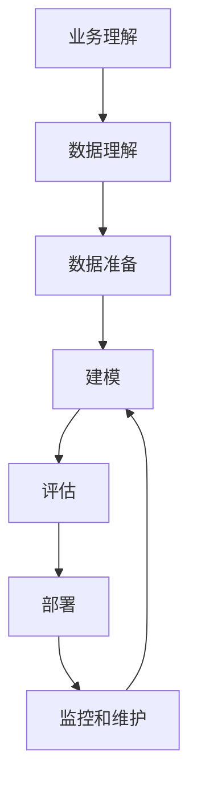

好的，我会按照您提供的要求和结构模板，以"数据挖掘 原理与代码实例讲解"为主题，撰写一篇专业的技术博客文章。请注意，由于文章篇幅较长，我会分多个回复完成。

# 数据挖掘 原理与代码实例讲解

## 1. 背景介绍

### 1.1 问题的由来

在当今时代，数据已经成为了一种新型的战略资源。无论是企业、政府还是个人,都在不断产生和收集海量的数据。然而,这些数据中蕴含着大量有价值的信息和知识,如何从这些原始数据中发现隐藏其中的知识,成为了一个亟待解决的问题。

数据挖掘(Data Mining)正是应运而生,旨在从大量的、不完全的、有噪声的、模糊的和随机的数据中,提取隐含在其中的、人们事先不知道且有价值的信息和知识。它是一门跨学科的研究领域,涉及多个领域,如数据库技术、统计学、机器学习、模式识别、人工智能等。

### 1.2 研究现状

数据挖掘技术经过多年的发展,已经形成了较为完善的理论体系和技术框架。目前,数据挖掘技术已广泛应用于多个领域,如金融、电信、零售、生物医学等,并取得了显著的经济效益和社会效益。

随着大数据时代的到来,数据挖掘技术也面临着新的机遇和挑战。一方面,海量数据为数据挖掘提供了广阔的应用空间;另一方面,大数据的特点(如数据量大、维度高、类型多样等)也对现有的数据挖掘算法和系统提出了新的要求。

### 1.3 研究意义

数据挖掘技术的研究和应用具有重要的理论意义和现实意义:

- 理论意义:数据挖掘融合了多个学科的理论和方法,推动了相关学科的发展,也促进了新理论和新方法的产生。
- 现实意义:数据挖掘技术可以帮助企业和组织从海量数据中发现有价值的知识,提高决策的科学性和前瞻性,从而获得竞争优势。

### 1.4 本文结构  

本文将系统地介绍数据挖掘的基本原理、核心算法、数学模型,并结合实际应用场景,通过代码实例对关键技术进行详细讲解。全文共分为8个部分:

1. 背景介绍
2. 核心概念与联系
3. 核心算法原理与具体操作步骤
4. 数学模型和公式详细讲解与举例说明  
5. 项目实践:代码实例和详细解释说明
6. 实际应用场景
7. 工具和资源推荐  
8. 总结:未来发展趋势与挑战

## 2. 核心概念与联系

数据挖掘是一个复杂的过程,涉及多个关键概念,下面我们逐一介绍。

**数据**

数据是数据挖掘的对象和基础。根据数据的特点,可将数据分为:结构化数据(如关系数据库)、半结构化数据(如XML文件)和非结构化数据(如文本、图像、视频等)。

**数据仓库**

数据仓库是一种面向主题的、集成的、相对稳定的、反映历史数据的数据集合,为数据挖掘提供了集中的数据源。

**数据集成**

数据集成是将来自不同源的数据统一起来,消除数据之间的不一致性,形成统一的数据存储。

**数据预处理**  

数据预处理是在数据挖掘之前对数据进行清洗、集成、转换和规范化等处理,以提高数据质量。

**模式(Pattern)**

模式是数据挖掘的最终目标,指从数据中提取出的有趣、新颖、潜在有用和最终可理解的结构。

**知识(Knowledge)**

知识是从数据中挖掘出的模式,并用某种形式来表达和解释这些模式。

**数据挖掘过程**

数据挖掘是一个迭代的过程,主要包括:业务理解、数据理解、数据准备、建模、评估和部署等阶段。

上图展示了数据挖掘的典型过程,需要不断迭代优化。接下来我们重点介绍数据挖掘的核心算法原理。