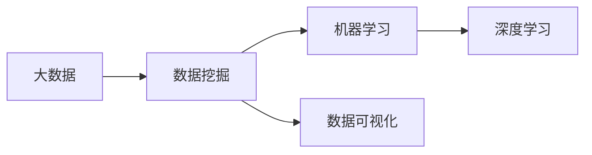

# 数据科学 (Data Science)

## 1. 背景介绍
### 1.1 问题的由来
在当今信息爆炸的时代,数据正以前所未有的速度和规模呈指数级增长。据统计,全球每天产生的数据量高达2.5EB(1EB=10^18字节)。面对如此海量的数据,传统的数据分析方法已经难以应对。迫切需要新的技术和方法来挖掘数据中蕴含的价值,这就是数据科学诞生的背景。

数据科学是一门融合了统计学、计算机科学、领域知识等多个学科的交叉学科。它致力于从海量数据中发现知识,用数据驱动决策。数据科学家利用机器学习、人工智能、数据挖掘等技术,从数据中提取有价值的信息和洞见,为商业决策提供支持。

### 1.2 研究现状
近年来,数据科学得到了学术界和工业界的广泛关注。各大高校纷纷开设数据科学相关专业,培养数据科学人才。工业界也在积极布局,谷歌、亚马逊、阿里巴巴等科技巨头都成立了数据科学部门,利用数据驱动业务创新。Gartner预测,到2022年,85%的AI项目都将以数据科学家为核心。

在研究领域,数据科学也取得了长足进展。一方面,深度学习等新技术不断涌现,极大提升了数据分析能力。另一方面,研究者们开发了众多开源工具,如TensorFlow、PyTorch、Scikit-learn等,降低了数据科学的门槛。在顶级学术会议如KDD、NIPS、ICML等,数据科学相关论文数量逐年攀升。

### 1.3 研究意义
数据科学研究对于推动人工智能发展、促进科技进步、引领产业变革都具有重要意义:

1. 推动人工智能发展。数据是人工智能的核心驱动力,数据科学为人工智能提供了数据基础。只有在高质量数据的支撑下,人工智能算法才能发挥威力。数据科学通过数据挖掘、特征工程等手段,为机器学习、深度学习等AI技术提供了优质"原料"。

2. 促进科技进步。科学研究越来越依赖数据驱动。在天文、生物、材料等领域,科学家利用数据科学方法分析海量实验数据,加速科学发现的步伐。数据科学为科研工作者提供了强大的分析工具,推动了科技创新。

3. 引领产业变革。数据已成为继土地、劳动力、资本之后的第四大生产要素。谁掌握了数据,谁就掌握了未来。数据科学赋能传统行业数字化转型,催生新业态新模式。在零售、金融、医疗等行业,数据科学创造了个性化推荐、智能投顾、辅助诊断等创新应用。

### 1.4 本文结构
本文将系统介绍数据科学的核心概念、关键技术、实践案例,内容安排如下:

- 第2部分,阐述数据科学的核心概念,揭示其内在联系。
- 第3部分,深入剖析数据科学的核心算法原理,给出具体操作步骤。
- 第4部分,建立数学模型,推导公式,并结合案例讲解。
- 第5部分,通过代码实例,演示数据科学项目的实践过程。
- 第6部分,展望数据科学在各行业的应用场景和未来前景。
- 第7部分,推荐数据科学学习的工具和资源。
- 第8部分,总结全文,指出数据科学面临的挑战和发展趋势。
- 第9部分,列举数据科学常见问题,给出专业解答。

## 2. 核心概念与联系

数据科学是一个涵盖广泛的学科,有许多核心概念值得关注:

- 数据挖掘:从大规模数据中发现模式和知识的计算过程。常用技术包括关联规则、聚类、异常检测等。
- 机器学习:让计算机系统从数据中学习,无需明确编程。分为监督学习、无监督学习、强化学习等。
- 深度学习:模拟人脑结构,构建多层神经网络,实现高级特征提取和模式识别。代表模型有CNN、RNN、GAN等。
- 数据可视化:将数据转化为图形图像,揭示数据中的模式和关系。常用工具如Matplotlib、Seaborn、D3.js等。
- 大数据:数据量大、类型多、处理速度快,难以用传统方法管理和分析。需借助分布式计算框架如Hadoop、Spark等。

这些概念环环相扣,构成了数据科学的核心体系:



从大数据中挖掘知识,需要数据挖掘技术。而机器学习是数据挖掘的主要手段,深度学习又是机器学习的前沿方向。数据可视化则是数据挖掘不可或缺的辅助工具,帮助人们直观理解数据。

## 3. 核心算法原理 & 具体操作步骤
### 3.1 算法原理概述
数据科学涉及众多算法,本节重点介绍几种常用的机器学习算法:

1. 决策树(Decision Tree):通过递归地划分数据空间,构建树形结构进行分类和回归。优点是模型具有可解释性,缺点是容易过拟合。

2. 支持向量机(SVM):在高维空间中寻找最优分类超平面,最大化类别间隔。优点是适合处理非线性问题,缺点是对参数敏感。

3. 逻辑回归(Logistic Regression):通过Sigmoid函数将线性回归的输出映射到(0,1),实现二分类。优点是直接估计后验概率,缺点是难以处理非线性问题。

4. K最近邻(KNN):根据样本的K个最近邻的标签来决定其类别。优点是思想简单,缺点是计算开销大。

### 3.2 算法步骤详解
以决策树算法为例,详细说明其构建步骤:

输入:训练集D,特征集A,阈值ε
输出:决策树T

1. 如果D中所有样本属于同一类别,则T为单节点树,将该类别作为节点的类标记,返回T;
2. 如果A为空集,则T为单节点树,将D中样本数最多的类别作为节点的类标记,返回T;
3. 否则,按照最大信息增益准则选择最优划分特征a*;
4. 如果a*的信息增益小于阈值ε,则T为单节点树,将D中样本数最多的类别作为节点的类标记,返回T;
5. 否则,对a*的每一个可能值ai,根据a*=ai将D分割为若干非空子集Di,将Di中样本数最多的类作为标记,构建子节点,由节点及其子节点构成树T,返回T;
6. 对第i个子节点,以Di为训练集,A-{a*}为特征集,递归调用1-5步,得到子树Ti,返回Ti。

### 3.3 算法优缺点

- 决策树:可解释性强,易于理解;容易过拟合,泛化能力差。
- SVM:适合高维小样本数据,泛化能力强;对参数敏感,训练开销大。
- 逻辑回归:直接估计后验概率,适合大规模二分类;难以处理非线性问题。
- KNN:思想简单,易于实现;计算开销大,预测效率低。

### 3.4 算法应用领域
- 决策树:金融风控、医疗诊断、营销响应预测等。
- SVM:文本分类、图像识别、生物信息学等。
- 逻辑回归:点击率预估、欺诈检测、疾病预测等。
- KNN:推荐系统、异常检测、手写识别等。

## 4. 数学模型和公式 & 详细讲解 & 举例说明
### 4.1 数学模型构建
以逻辑回归为例,说明其数学模型的构建过程。

假设有m个样本,每个样本n个特征,记为:

$X = (x^{(1)}, x^{(2)}, ..., x^{(m)})^T, x^{(i)} \in \mathbb{R}^n$

对应的二元标签为:

$Y = (y^{(1)}, y^{(2)}, ..., y^{(m)})^T, y^{(i)} \in \{0,1\}$

逻辑回归模型假设样本的后验概率服从Sigmoid分布:

$P(y=1|x) = \frac{1}{1+e^{-(\omega^T x + b)}}$

$P(y=0|x) = 1 - P(y=1|x) = \frac{e^{-(\omega^T x + b)}}{1+e^{-(\omega^T x + b)}}$

其中,$\omega$和$b$为待学习的参数。

### 4.2 公式推导过程
逻辑回归采用极大似然估计来求解参数。给定数据集,似然函数为:

$L(\omega,b) = \prod_{i=1}^m P(y^{(i)}|x^{(i)};\omega,b)$

取对数,得到对数似然函数:

$\ell(\omega,b) = \log L(\omega,b) = \sum_{i=1}^m \log P(y^{(i)}|x^{(i)};\omega,b)$

将Sigmoid函数代入,化简可得:

$\ell(\omega,b) = \sum_{i=1}^m [y^{(i)} \log \frac{1}{1+e^{-(\omega^T x^{(i)} + b)}} + (1-y^{(i)}) \log \frac{e^{-(\omega^T x^{(i)} + b)}}{1+e^{-(\omega^T x^{(i)} + b)}}]$

$= \sum_{i=1}^m [y^{(i)} (\omega^T x^{(i)} + b) - \log (1+e^{\omega^T x^{(i)} + b})]$

求导可得梯度:

$\frac{\partial \ell}{\partial \omega} = \sum_{i=1}^m (y^{(i)} - \frac{1}{1+e^{-(\omega^T x^{(i)} + b)}})x^{(i)}$

$\frac{\partial \ell}{\partial b} = \sum_{i=1}^m (y^{(i)} - \frac{1}{1+e^{-(\omega^T x^{(i)} + b)}})$

使用梯度上升法迭代优化,最终求得$\omega$和$b$。

### 4.3 案例分析与讲解
以一个简单的二维数据集为例,直观展示逻辑回归的分类效果。

假设有10个样本,每个样本包含2个特征x1和x2,标签为0或1。数据如下:

| x1 | x2 | y |
|----|----|----|
| 1  | 4  | 0 |
| 2  | 3  | 0 |
| 3  | 8  | 1 |
| 5  | 1  | 0 |
| 7  | 5  | 1 |
| 2  | 0  | 0 |
| 6  | 7  | 1 |
| 8  | 2  | 1 |
| 0  | 5  | 0 |
| 3  | 6  | 1 |

使用Python的sklearn库,调用LogisticRegression类,设置正则化系数为1,最大迭代次数为1000,训练逻辑回归模型。

```python
from sklearn.linear_model import LogisticRegression

X = [[1, 4], [2, 3], [3, 8], [5, 1], [7, 5], 
     [2, 0], [6, 7], [8, 2], [0, 5], [3, 6]]
y = [0, 0, 1, 0, 1, 0, 1, 1, 0, 1]

lr = LogisticRegression(C=1, max_iter=1000)  
lr.fit(X, y)

print(lr.coef_, lr.intercept_)
# 输出 [[-0.38213278  0.54366364]] [-1.61047285]
```

模型学习到的参数为:$\omega_1=-0.38, \omega_2=0.54, b=-1.61$。将这些参数代入Sigmoid函数,得到决策边界方程:

$\frac{1}{1+e^{-(-0.38x_1 + 0.54x_2 - 1.61)}} = 0.5$

化简得:$0.38x_1 - 0.54x_2 + 1.61 = 0$

绘制