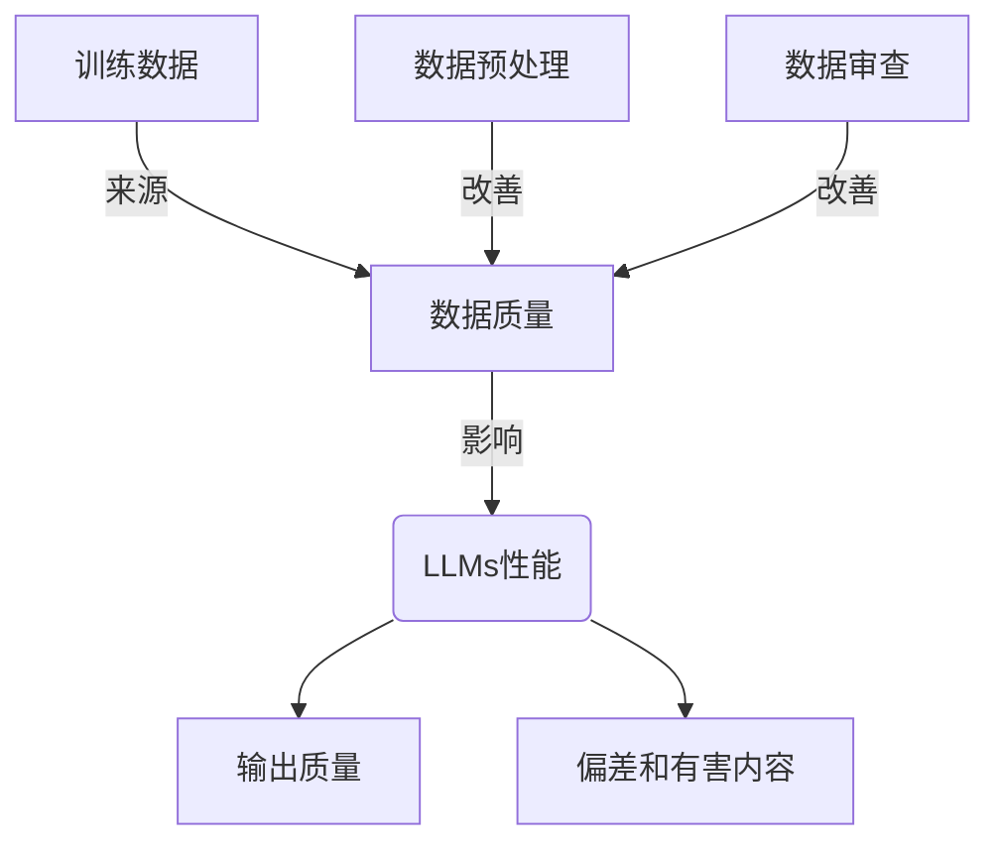

# 数据质量对LLMs的影响

## 1. 背景介绍

### 1.1 问题的由来

在过去几年中,大型语言模型(LLMs)取得了令人瞩目的进展,展现出惊人的自然语言处理能力。然而,训练这些模型所使用的数据质量对其性能和行为产生了深远影响。低质量的训练数据不仅会导致LLMs产生有偏差和不准确的输出,还可能加剧它们对有害内容和不当行为的学习。因此,确保训练数据的高质量对于构建可靠、公正和安全的LLMs至关重要。

### 1.2 研究现状

目前,已有多项研究探讨了训练数据质量对LLMs性能的影响。一些研究发现,数据中存在的偏差、噪声和不一致性会直接传递到模型的输出中。另一些研究则关注于检测和缓解训练数据中的有害内容,如仇恨言论、虚假信息和暴力内容。然而,由于LLMs训练数据的规模庞大,手动审查和清理数据是一项艰巨的任务。

### 1.3 研究意义

提高训练数据质量对于构建更加可靠、公正和安全的LLMs至关重要。高质量的训练数据不仅可以减少模型输出中的偏差和不当内容,还能提高模型的准确性和一致性。此外,通过改善数据质量,我们还可以减轻LLMs在现实世界应用中可能带来的潜在风险和伤害。

### 1.4 本文结构

本文将全面探讨数据质量对LLMs的影响。我们将首先介绍核心概念和它们之间的联系,然后深入探讨核心算法原理和数学模型。接下来,我们将通过代码实例和实际应用场景,展示如何在实践中应用这些概念和技术。最后,我们将总结未来的发展趋势和挑战,并提供相关资源和常见问题解答。

## 2. 核心概念与联系

在探讨数据质量对LLMs的影响之前,我们需要了解一些核心概念及它们之间的关系。

如上图所示,训练数据的质量直接影响LLMs的性能表现。低质量的训练数据会导致模型输出质量下降,并增加偏差和有害内容的风险。因此,我们需要从训练数据的来源入手,通过数据预处理和审查等手段来提高数据质量,从而改善LLMs的性能。

## 3. 核心算法原理与具体操作步骤

### 3.1 算法原理概述

提高训练数据质量是一个多步骤的过程,涉及多种算法和技术。常见的方法包括数据清洗、去重、平衡数据等。此外,我们还需要检测和过滤掉训练数据中的有害内容,如仇恨言论、暴力内容和虚假信息。

### 3.2 算法步骤详解

1. **数据清洗**:首先,我们需要对原始训练数据进行清洗,去除无关数据、格式错误、重复数据等。这一步骤通常涉及正则表达式、字符串处理等技术。

2. **数据去重**:由于训练数据通常来自多个来源,存在大量重复数据。我们需要使用哈希函数或其他算法来识别和去除重复数据。

3. **数据平衡**:训练数据中常常存在类别不平衡的问题,导致模型偏向于学习主导类别的特征。我们可以使用过采样或欠采样等技术来平衡数据。

4. **有害内容检测**:我们需要使用自然语言处理技术,如情感分析、主题建模等,来识别和过滤训练数据中的仇恨言论、暴力内容和虚假信息。

5. **数据标注**:对于需要监督学习的任务,我们还需要对训练数据进行标注,以提供正确的标签。这一步骤通常需要人工参与。

### 3.3 算法优缺点

上述算法和技术在提高训练数据质量方面具有一定效果,但也存在一些局限性:

- 优点:
  - 可以有效去除无关数据、重复数据和有害内容
  - 通过数据平衡,可以减少模型的偏差
  - 数据标注可以为监督学习任务提供正确的标签

- 缺点:
  - 算法的效果受到训练数据规模和复杂度的限制
  - 有害内容检测的准确性仍有待提高
  - 数据标注过程耗时耗力,且容易引入人为偏差

### 3.4 算法应用领域

上述算法和技术可以广泛应用于各种自然语言处理任务的训练数据预处理,如机器翻译、文本分类、问答系统等。此外,它们也可以用于其他领域的数据预处理,如计算机视觉、推荐系统等。

## 4. 数学模型和公式详细讲解举例说明

### 4.1 数学模型构建

在讨论具体的数学模型之前,我们先介绍一下数据质量评估的一般框架。该框架包括以下几个主要步骤:

1. **定义数据质量维度**:根据具体任务和应用场景,确定评估数据质量的关键维度,如完整性、准确性、一致性、相关性等。

2. **构建评估指标**:为每个数据质量维度设计相应的评估指标,这些指标可以是定性的,也可以是定量的。

3. **收集基准数据**:收集一些已知质量的数据作为基准,用于验证评估指标的有效性。

4. **建立数学模型**:根据评估指标和基准数据,构建数学模型来量化和预测数据质量。

5. **模型评估和优化**:在新的数据集上评估模型的性能,并根据需要进行模型调整和优化。

在构建具体的数学模型时,我们通常会借助机器学习、统计学和信息论等领域的理论和方法。下面我们将介绍一些常见的数学模型和公式。

### 4.2 公式推导过程

#### 4.2.1 数据完整性模型

数据完整性是评估数据质量的一个重要维度。我们可以使用以下公式来量化数据的完整性:

$$
C(D) = 1 - \frac{|M|}{|D|}
$$

其中,`$C(D)$`表示数据集`$D$`的完整性得分,`$M$`是缺失值的集合,`$|M|$`和`$|D|$`分别表示`$M$`和`$D$`的基数(元素个数)。

该公式的含义是:完整性得分等于1减去缺失值的比例。得分越高,数据的完整性越好。

#### 4.2.2 数据准确性模型

数据准确性也是评估数据质量的一个关键维度。我们可以使用以下公式来量化数据的准确性:

$$
A(D) = 1 - \frac{|I|}{|D|}
$$

其中,`$A(D)$`表示数据集`$D$`的准确性得分,`$I$`是不准确值的集合,`$|I|$`和`$|D|$`分别表示`$I$`和`$D$`的基数。

该公式的含义是:准确性得分等于1减去不准确值的比例。得分越高,数据的准确性越好。

#### 4.2.3 数据一致性模型

数据一致性反映了数据集中值之间的逻辑关系是否一致。我们可以使用以下公式来量化数据的一致性:

$$
O(D) = 1 - \frac{|V|}{|D|}
$$

其中,`$O(D)$`表示数据集`$D$`的一致性得分,`$V$`是违反一致性约束的值的集合,`$|V|$`和`$|D|$`分别表示`$V$`和`$D$`的基数。

该公式的含义是:一致性得分等于1减去违反一致性约束的值的比例。得分越高,数据的一致性越好。

#### 4.2.4 综合数据质量模型

在实际应用中,我们通常需要综合考虑多个数据质量维度。我们可以使用加权平均的方式来计算综合数据质量得分:

$$
Q(D) = \sum_{i=1}^{n} w_i q_i(D)
$$

其中,`$Q(D)$`表示数据集`$D$`的综合质量得分,`$n$`是数据质量维度的个数,`$w_i$`是第`$i$`个维度的权重,`$q_i(D)$`是第`$i$`个维度的质量得分。

权重`$w_i$`的设置取决于具体的应用场景和需求,可以通过专家评估或机器学习方法来确定。

### 4.3 案例分析与讲解

为了更好地理解上述数学模型,我们将通过一个案例来进行分析和讲解。

假设我们有一个包含1000条记录的数据集`$D$`,其中缺失值的个数为50,不准确值的个数为30,违反一致性约束的值的个数为20。我们将计算该数据集在完整性、准确性和一致性三个维度上的得分。

**完整性得分**:

$$
C(D) = 1 - \frac{|M|}{|D|} = 1 - \frac{50}{1000} = 0.95
$$

**准确性得分**:

$$
A(D) = 1 - \frac{|I|}{|D|} = 1 - \frac{30}{1000} = 0.97
$$

**一致性得分**:

$$
O(D) = 1 - \frac{|V|}{|D|} = 1 - \frac{20}{1000} = 0.98
$$

从上述结果可以看出,该数据集在三个维度上的得分都较高,但仍有一定的提升空间。

如果我们希望计算该数据集的综合质量得分,假设我们将完整性、准确性和一致性三个维度的权重分别设为0.4、0.3和0.3,那么综合质量得分为:

$$
Q(D) = 0.4 \times 0.95 + 0.3 \times 0.97 + 0.3 \times 0.98 = 0.965
$$

综合质量得分为0.965,表明该数据集的整体质量较高。

### 4.4 常见问题解答

**Q: 如何确定数据质量维度的权重?**

A: 数据质量维度的权重可以通过以下方式确定:

1. 专家评估:邀请领域专家根据具体应用场景对各个维度的重要性进行评估和打分。
2. 机器学习方法:使用监督或无监督的机器学习算法,基于历史数据和人工标注的结果来学习权重。
3. 用户反馈:收集用户对数据质量的反馈,并将其映射到相应的质量维度,从而确定权重。

**Q: 如何处理缺失值和异常值?**

A: 处理缺失值和异常值的常见方法包括:

1. 删除:直接删除包含缺失值或异常值的记录。
2. 插补:使用统计方法(如均值、中位数等)或机器学习模型来估计缺失值。
3. 标记:为缺失值和异常值添加特殊标记,让模型自行学习如何处理它们。

选择何种方法需要根据具体情况权衡利弊。

**Q: 如何评估数据质量模型的性能?**

A: 评估数据质量模型的性能可以采用以下方法:

1. 使用基准数据集:在已知质量的基准数据集上测试模型的预测能力。
2. 人工评估:邀请人工标注员评估模型预测的结果,计算精度、召回率等指标。
3. 在线评估:将模型应用于实际场景,收集用户反馈并进行评估。

## 5. 项目实践:代码实例和详细解释说明

在上一节中,我们介绍了一些用于评估数据质量的数学模型和公式。现在,我们将通过一个实际的代码示例,展示如何在Python中实现这些模型。

### 5.1 开发环境搭建

在开始编码之前,我们需要确保已经安装了以下Python库:

- NumPy: 用