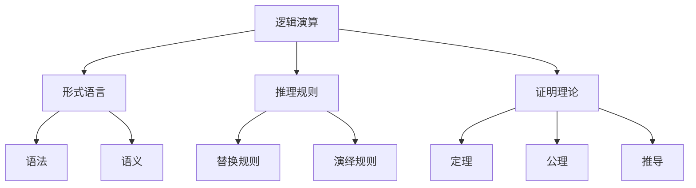

# 数理逻辑：第二章 逻辑演算的系统特征

## 1. 背景介绍

### 1.1 问题的由来

逻辑是一门研究有效推理规则和推理过程的学科。在数理逻辑领域中,逻辑演算是一个核心概念,它描述了如何从一组前提出发推导出结论的形式系统。逻辑演算的系统特征是指这些形式系统所具有的一些基本性质,这些性质对于评估和分析逻辑演算的有效性和一致性至关重要。

随着计算机科学和人工智能技术的快速发展,逻辑演算的研究变得越来越重要。在自动推理、知识表示、程序验证等领域,逻辑演算扮演着关键角色。因此,深入探讨逻辑演算的系统特征,对于构建健壮、可靠的智能系统具有重要意义。

### 1.2 研究现状

逻辑演算的系统特征一直是数理逻辑研究的核心课题之一。经典的系统特征包括可判定性、完全性和无矛盾性等。这些特征为逻辑演算提供了理论基础,并为评估和优化逻辑系统奠定了基础。

然而,随着逻辑演算在现代计算机科学中的广泛应用,一些新的系统特征也逐渐受到关注。例如,复杂性理论为分析逻辑演算的计算复杂度提供了工具;模态逻辑的发展则引入了新的系统特征,如可能世界语义等。

此外,一些新兴的逻辑系统,如非单调逻辑、缺省逻辑和模糊逻辑等,也带来了新的系统特征需要探讨。这些新的逻辑系统在处理不确定性、不完整信息等方面具有优势,在人工智能领域有着广泛的应用前景。

### 1.3 研究意义

深入研究逻辑演算的系统特征,对于以下几个方面具有重要意义:

1. **理论基础**: 系统特征为逻辑演算提供了坚实的理论基础,有助于我们更好地理解和分析逻辑系统的行为。

2. **系统评估**: 通过研究系统特征,我们可以评估逻辑演算的有效性、一致性和计算复杂度等,从而优化和改进现有的逻辑系统。

3. **新系统构建**: 对系统特征的深入理解,有助于我们设计和构建新的逻辑系统,以满足不同领域的需求。

4. **应用拓展**: 逻辑演算在人工智能、程序验证、知识表示等领域有着广泛的应用。研究其系统特征可以促进这些应用的发展和优化。

### 1.4 本文结构

本文将详细探讨逻辑演算的系统特征。首先,我们将介绍一些核心概念和它们之间的联系。然后,我们将重点阐述经典的系统特征,如可判定性、完全性和无矛盾性,并详细解释相关的算法原理和数学模型。接下来,我们将介绍一些新兴的系统特征,如复杂性理论、模态逻辑等,并探讨它们在实际应用中的作用。最后,我们将总结未来的发展趋势和面临的挑战。

## 2. 核心概念与联系

逻辑演算是一个形式系统,它由以下几个核心概念组成:

1. **形式语言**: 逻辑演算中使用的符号系统,包括语法和语义。语法定义了合法的符号序列,而语义则赋予这些符号以意义。

2. **推理规则**: 用于从前提推导出结论的规则集合。推理规则通常分为替换规则和演绎规则两种类型。

3. **证明理论**: 研究如何从一组公理和推理规则出发,推导出定理的理论体系。它包括公理、定理和推导过程。

这些核心概念相互关联,共同构成了逻辑演算的基础框架。形式语言提供了表达前提和结论的符号系统,推理规则则定义了如何从前提推导出结论,而证明理论则研究整个推导过程的有效性和一致性。

## 3. 核心算法原理 & 具体操作步骤

### 3.1 算法原理概述

逻辑演算的核心算法原理是基于推理规则进行推导。推理规则可以看作是一种从前提到结论的转换函数,它们定义了如何从一组前提出发推导出新的结论。

常见的推理规则包括模式匹配、替换和归结等。模式匹配是识别前提中符合特定模式的子式的过程。替换则是根据推理规则将前提中的某些子式替换为新的子式。归结是将两个前提组合起来,推导出一个新的结论。

这些推理规则可以组合使用,形成复杂的推导过程。算法的目标是找到一系列推理规则的应用顺序,从初始前提出发推导出目标结论。

### 3.2 算法步骤详解

逻辑演算算法的具体步骤如下:

1. **输入**: 接收一组初始前提和目标结论。

2. **预处理**: 对前提和结论进行规范化和简化,以便后续处理。

3. **推理规则选择**: 根据当前前提和目标结论,选择合适的推理规则。

4. **规则应用**: 将选定的推理规则应用于当前前提,生成新的前提。

5. **终止条件检查**: 检查新生成的前提是否包含目标结论,或者是否达到其他终止条件(如步数限制、资源限制等)。如果满足终止条件,则算法结束。

6. **回溯**: 如果当前推导路径行不通,则回溯到上一步,尝试其他推理规则或推导路径。

7. **输出**: 如果找到了从初始前提推导出目标结论的路径,则输出该推导路径;否则输出失败信息。

该算法的核心在于智能地选择和应用推理规则,以及合理地进行回溯,从而有效地探索推导空间,找到从前提到结论的推导路径。

### 3.3 算法优缺点

逻辑演算算法的优点包括:

1. **形式化**: 算法基于严格的形式系统,具有清晰的数学基础。

2. **可证明性**: 算法能够产生可证明的推导路径,确保结论的正确性。

3. **通用性**: 算法可以应用于各种逻辑系统,具有良好的通用性。

4. **可扩展性**: 算法可以通过引入新的推理规则和优化策略来扩展和改进。

然而,逻辑演算算法也存在一些缺点:

1. **复杂性**: 在一般情况下,逻辑演算问题是不可判定的,算法的时间和空间复杂度可能是指数级别的。

2. **局部最优陷阱**: 在推导过程中,算法可能陷入局部最优解,无法找到全局最优解。

3. **规则选择困难**: 在复杂的逻辑系统中,合理选择推理规则并非trivial的问题。

4. **知识获取困难**: 构建高质量的初始前提和推理规则库需要大量的领域知识和人工努力。

### 3.4 算法应用领域

逻辑演算算法在以下领域有着广泛的应用:

1. **自动定理证明**: 在数学、逻辑和计算机科学等领域,逻辑演算算法被用于自动证明定理。

2. **知识表示与推理**: 在人工智能领域,逻辑演算算法被用于表示和推理知识库。

3. **程序验证**: 在软件工程领域,逻辑演算算法被用于验证程序的正确性。

4. **规划和调度**: 在规划和调度领域,逻辑演算算法被用于推理和优化决策过程。

5. **自然语言处理**: 在自然语言处理领域,逻辑演算算法被用于语义分析和推理。

6. **机器学习**: 在机器学习领域,逻辑演算算法被用于表示和推理规则模型。

## 4. 数学模型和公式 & 详细讲解 & 举例说明

### 4.1 数学模型构建

为了形式化地描述逻辑演算系统,我们需要构建数学模型。一个典型的逻辑演算系统可以用一个四元组 $\mathcal{L} = \langle \Sigma, \Gamma, \vdash, \models \rangle$ 来表示,其中:

- $\Sigma$ 是一个形式语言,定义了合法的符号和公式。
- $\Gamma$ 是一组公理或推理规则。
- $\vdash$ 是一个推导关系,表示从一组前提 $\Phi$ 可以推导出结论 $\phi$,记作 $\Phi \vdash \phi$。
- $\models$ 是一个满足关系,表示前提 $\Phi$ 语义上蕴含结论 $\phi$,记作 $\Phi \models \phi$。

这个四元组捕捉了逻辑演算系统的语法、公理、推导和语义四个基本要素。

### 4.2 公式推导过程

在逻辑演算系统中,公式的推导过程可以用一个证明序列来表示。证明序列是一个有限序列 $\phi_1, \phi_2, \ldots, \phi_n$,其中每一个公式 $\phi_i$ 要么是公理,要么可以从前面的公式通过应用推理规则推导出来。

我们用 $\Gamma \vdash \phi$ 表示存在一个证明序列,从公理集 $\Gamma$ 出发推导出公式 $\phi$。推导关系 $\vdash$ 需要满足以下性质:

1. **反射性**: 对任意 $\phi \in \Gamma$,有 $\Gamma \vdash \phi$。
2. **单调性**: 如果 $\Gamma \vdash \phi$,那么对任意 $\Gamma' \supseteq \Gamma$,也有 $\Gamma' \vdash \phi$。
3. **传递性**: 如果 $\Gamma \vdash \phi$ 且 $\Gamma \cup \{\phi\} \vdash \psi$,那么 $\Gamma \vdash \psi$。

这些性质保证了推导关系的合理性和一致性。

### 4.3 案例分析与讲解

让我们以经典的命题逻辑为例,分析其推导过程。命题逻辑的形式语言由命题变元(如 $p, q, r$)和逻辑连接词(如 $\neg, \wedge, \vee, \rightarrow, \leftrightarrow$)构成。它的公理包括:

1. **重言式公理**: $\phi \rightarrow (\psi \rightarrow \phi)$
2. **合取公理**: $(\phi \rightarrow (\psi \rightarrow \chi)) \rightarrow ((\phi \rightarrow \psi) \rightarrow (\phi \rightarrow \chi))$
3. **换位公理**: $\phi \rightarrow (\psi \rightarrow \chi)$ 等价于 $\psi \rightarrow (\phi \rightarrow \chi)$

推理规则包括:

1. **模式匹配**: 在前提中寻找符合特定模式的子式。
2. **替换**: 将前提中的某些子式替换为新的子式。
3. **归结**: 从两个前提 $\phi \rightarrow \psi$ 和 $\phi$ 推导出 $\psi$。

现在,让我们试着从公理和推理规则出发,推导出一个著名的命题逻辑定理 $(\phi \rightarrow (\psi \rightarrow \chi)) \rightarrow ((\phi \rightarrow \psi) \rightarrow (\phi \rightarrow \chi))$:

1. 由合取公理,我们有:
   $$(\phi \rightarrow (\psi \rightarrow \chi)) \rightarrow ((\phi \rightarrow \psi) \rightarrow (\phi \rightarrow \chi))$$

2. 应用重言式公理和换位公理,我们可以推导出:
   $$(\phi \rightarrow \psi) \rightarrow (\phi \rightarrow (\psi \rightarrow \chi))$$

3. 再次应用重言式公理和换位公理,我们可以推导出:
   $$\phi \