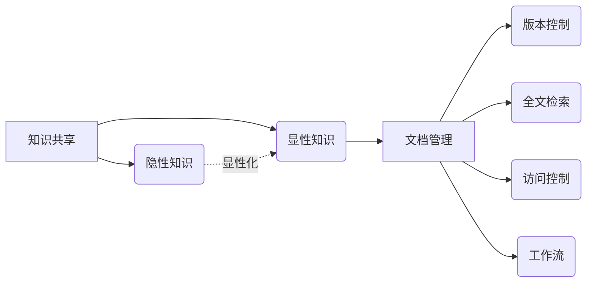

# 文档管理与知识共享原理与代码实战案例讲解

关键词：文档管理、知识共享、知识管理、协同办公、文档版本控制、全文检索、知识图谱、语义分析

## 1. 背景介绍
### 1.1  问题的由来
在现代企业和组织中，文档是记录和传播知识的重要载体。随着信息量的爆炸式增长，如何有效地管理和共享文档中蕴含的知识,已经成为一个亟待解决的问题。传统的文档管理方式效率低下,难以应对海量非结构化数据,知识难以沉淀积累和共享传播,严重制约了企业的创新和发展。
### 1.2  研究现状
目前,国内外学者对文档管理与知识共享开展了广泛的研究。微软的SharePoint、Google的Google Docs等产品已经在企业级文档管理和协同办公领域得到广泛应用。一些创新型企业如Atlassian的Confluence,结合Wiki的理念实现了知识的协同编辑与快速传播。语义分析、知识抽取、知识图谱等人工智能技术也被引入文档管理领域,以智能化手段提升知识管理与共享的效率。
### 1.3  研究意义
文档管理与知识共享是知识管理的核心内容,对提升组织效率、激发创新活力具有重要意义。系统研究文档管理与知识共享的理论和实践,开发出高效、智能的知识管理系统,将有力促进知识的积累、传承和创新,为企业的可持续发展提供强大的知识支撑和智力保障。
### 1.4  本文结构
本文将全面阐述文档管理与知识共享的相关理论、核心技术、架构设计和实战案例。第2部分介绍相关概念;第3部分讲解核心算法原理;第4部分建立数学模型并给出公式推导;第5部分提供项目实践的代码实例;第6部分分析实际应用场景;第7部分推荐相关工具和学习资源;第8部分总结全文并展望未来;第9部分给出常见问题解答。

## 2. 核心概念与联系
文档管理是指对电子文档的生命周期进行管理和维护的过程,包括文档的创建、组织、存储、分发、使用和归档等环节。知识共享则是指组织内部的成员将个人获得的知识经验传授给他人,并为整个组织所用的过程。二者相辅相成,高效的文档管理是知识共享的基础,知识共享则是文档管理的目的所在。

在文档管理过程中,需要用到版本控制、全文检索、安全访问控制、工作流等核心技术。版本控制可追踪文档的历史变更,方便回溯和协同编辑;全文检索帮助快速定位海量文档;访问控制保障文档安全;工作流实现文档的自动化流转。

知识共享需要解决显性知识和隐性知识的提炼、组织和分发问题。显性知识以文档、图表等外显形式存在,可通过文档管理系统直接共享。隐性知识则内化于人的头脑中,需要通过在实践中的传帮带、师徒制等方式传授。将隐性知识显性化,并融入到文档管理中,是知识共享的重点和难点。

## 3. 核心算法原理 & 具体操作步骤
### 3.1  算法原理概述
文档管理与知识共享涉及到信息检索、数据挖掘、自然语言处理等多个人工智能领域的核心算法。其中,向量空间模型(Vector Space Model)和潜在语义分析(Latent Semantic Analysis)在全文检索、文档聚类、知识抽取等任务中发挥着重要作用。

向量空间模型将文档和查询均表示成向量的形式,通过计算向量之间的夹角余弦值来衡量文档与查询的相关性。潜在语义分析则利用奇异值分解(SVD)等矩阵分解技术,从词-文档矩阵中抽取出隐含的语义信息,实现对文档主题和词汇语义的深层挖掘。

### 3.2  算法步骤详解
以潜在语义分析为例,其主要步骤如下:
1. 对文档进行分词、去停用词等预处理,生成词-文档矩阵A。矩阵元素A[i][j]表示词项i在文档j中的权重(如TF-IDF)。
2. 对矩阵A进行奇异值分解,得到三个矩阵U、Σ、V,其中U、V为正交矩阵,Σ为对角矩阵。
$$A_{m \times n} = U_{m \times m}\Sigma_{m \times n}V_{n \times n}^T$$
3. 取Σ矩阵中前k个最大奇异值及其对应的左右奇异向量,得到降维后的矩阵 $\hat{A}$,它是原矩阵A的最佳低秩近似。
$$\hat{A}_{m \times n} = U_{m \times k}\Sigma_{k \times k}V_{k \times n}^T$$
4. 通过 $\hat{A}$ 矩阵,可计算文档和词语在语义空间中的向量表示,进而进行相似度计算、聚类、分类等后续处理。

### 3.3  算法优缺点
潜在语义分析的优点是能够挖掘出词语和文档的隐含语义信息,一定程度上解决了同义词和多义词的问题,在文档聚类、信息检索等任务上效果显著。

但其缺点是计算复杂度高,矩阵分解耗时较长。并且需要领域专家参与,以人工方式确定合适的话题数k。当新文档加入时,需要重新计算矩阵分解,无法增量更新。

### 3.4  算法应用领域
潜在语义分析广泛应用于搜索引擎、推荐系统、情感分析、舆情监控等领域。在文档管理与知识共享场景下,LSA可用于:
- 文档语义检索:将用户输入的查询与文档库进行语义匹配,返回主题相关的结果。
- 文档自动分类:根据文档语义向量的相似度,对文档进行自动归类。
- 个性化推荐:分析用户的历史访问记录,挖掘隐含兴趣,推荐相关文档。
- 知识图谱构建:从文档语料中抽取实体、关系和属性,形成结构化的知识库。

## 4. 数学模型和公式 & 详细讲解 & 举例说明
### 4.1  数学模型构建
为描述文档语义信息,我们构建如下数学模型:
- 定义词项集合 $T=\{t_1,t_2,...,t_m\}$,文档集合 $D=\{d_1,d_2,...,d_n\}$。
- 定义词-文档矩阵 $A_{m \times n}$,元素 $a_{ij}$ 表示词项 $t_i$ 在文档 $d_j$ 中的权重。权重采用TF-IDF计算:
$$a_{ij}=tf_{ij} \cdot \log(\frac{N}{df_i})$$
其中 $tf_{ij}$ 为词频, $df_i$ 为文档频率,N为文档总数。
- 定义文档向量 $\vec{d_j}=(a_{1j},a_{2j},...,a_{mj})$,查询向量 $\vec{q}=(q_1,q_2,...,q_m)$。
- 定义文档相似度 $sim(d_i,d_j)$ 为向量 $\vec{d_i}$ 与 $\vec{d_j}$ 的夹角余弦值:
$$sim(d_i,d_j)=\cos \theta =\frac{\vec{d_i} \cdot \vec{d_j}}{\lVert \vec{d_i} \rVert \lVert \vec{d_j} \rVert}$$

### 4.2  公式推导过程
对词-文档矩阵A进行SVD分解,得到:
$$A=U \Sigma V^T$$
其中 $U_{m \times m},V_{n \times n}$ 为正交矩阵, $\Sigma_{m \times n}$ 为对角矩阵。

取 $\Sigma$ 前k个最大奇异值 $\sigma_1,\sigma_2,...,\sigma_k$,得到降维后的矩阵 $\hat{A}$:
$$\hat{A}=U_k \Sigma_k V_k^T$$
其中 $U_k$ 为 $U$ 的前k列, $\Sigma_k$ 为 $\Sigma$ 的左上角k阶子矩阵, $V_k$ 为 $V$ 的前k列。

由SVD的性质可知, $\hat{A}$ 是A的最佳秩为k的近似矩阵,即:
$$\hat{A}=\mathop{\arg\min}_{B} \lVert A-B \rVert_F, s.t. rank(B)=k$$
其中 $\lVert \cdot \rVert_F$ 为Frobenius范数。

在 $\hat{A}$ 空间中,文档 $d_i$ 的语义向量为矩阵 $U_k$ 的第i行 $u_i$,查询q的语义向量为:
$$\vec{q_k}=\vec{q}^T U_k \Sigma_k^{-1}$$
相似度计算公式变为:
$$sim(d_i,q)=\cos \theta =\frac{u_i \cdot \vec{q_k}}{\lVert u_i \rVert \lVert \vec{q_k} \rVert}$$

### 4.3  案例分析与讲解
以下是一个简单的例子。假设有3个文档和4个词项,词-文档矩阵为:
$$A=\begin{bmatrix} 
0.2 & 0.1 & 0.4\\ 
0.1 & 0.3 & 0.2\\
0 & 0.4 & 0.1\\
0.5 & 0 & 0.3
\end{bmatrix}$$

对A进行SVD分解,取前2个奇异值,得到:
$$U_2=\begin{bmatrix}
-0.46 & -0.21\\ 
-0.44 & 0.24\\
-0.52 & 0.59\\
-0.57 & -0.75
\end{bmatrix}, \Sigma_2=\begin{bmatrix}
1.31 & 0\\ 
0 & 0.39
\end{bmatrix}, V_2=\begin{bmatrix}
-0.64 & 0.17\\ 
-0.55 & -0.76\\
-0.54 & 0.62
\end{bmatrix}$$

假设查询向量 $\vec{q}=(0.3,0.2,0.1,0.4)$,则其在 $\hat{A}$ 空间中的表示为:
$$\vec{q_2}=\vec{q}^T U_2 \Sigma_2^{-1}=\begin{bmatrix}
-0.27 & -0.20
\end{bmatrix}$$

计算查询与各文档的相似度:
$$sim(d_1,q)=\frac{-0.64 \cdot (-0.27)}{\sqrt{(-0.64)^2+0.17^2} \sqrt{(-0.27)^2+(-0.20)^2}}=0.93$$
$$sim(d_2,q)=\frac{-0.55 \cdot (-0.27)}{\sqrt{(-0.55)^2+(-0.76)^2} \sqrt{(-0.27)^2+(-0.20)^2}}=0.52$$
$$sim(d_3,q)=\frac{-0.54 \cdot (-0.27)}{\sqrt{(-0.54)^2+0.62^2} \sqrt{(-0.27)^2+(-0.20)^2}}=0.50$$

可见,在原向量空间下,查询q与三个文档的相似度都不高。但在潜在语义空间 $\hat{A}$ 中,q与d1的相似度达到0.93,揭示了它们在语义上的高度相关性。这体现了LSA挖掘隐含语义信息的能力。

### 4.4  常见问题解答
Q: LSA的计算复杂度如何?
A: 对于m×n矩阵,完整SVD的时间复杂度为O(min(m^2n,mn^2))。但在实践中,我们通常只需要前k个奇异值,可使用Lanczos等算法,将复杂度降至O(mnk)。当数据规模很大时,还可采用随机SVD等近似算法。

Q: 如何选取合适的话题数k