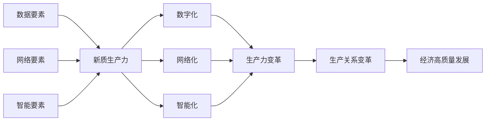

# 新质生产力：驱动中国现代化

关键词：新质生产力、现代化、数字经济、智能制造、数字化转型、产业互联网、数字治理、数字红利

## 1. 背景介绍
### 1.1 问题的由来
当今世界正处于百年未有之大变局，新一轮科技革命和产业变革蓄势待发。以数字化、网络化、智能化为特征的新质生产力正在加速形成，成为推动经济社会发展的重要引擎。中国作为世界第二大经济体，正处于新旧动能转换的关键时期，亟需培育壮大新质生产力，推动高质量发展，实现中华民族伟大复兴的中国梦。

### 1.2 研究现状
近年来，国内外学者对新质生产力的研究日益深入。国外学者主要聚焦于数字经济、智能制造等领域，探讨新技术对生产力发展的影响。国内学者则更关注新质生产力在中国经济转型升级中的作用，以及如何推动传统产业数字化转型等问题。但总体而言，对新质生产力内涵特征、发展路径等重大理论和实践问题的研究还不够系统深入。

### 1.3 研究意义 
深入研究新质生产力，对于推动中国经济高质量发展、加快建设现代化经济体系具有重要意义：

第一，有助于把握新一轮科技革命和产业变革的发展趋势，抢占未来发展制高点。  
第二，有助于加快传统产业数字化、网络化、智能化改造，培育发展新动能。
第三，有助于推动经济发展质量变革、效率变革、动力变革，实现高质量发展。
第四，有助于破解发展不平衡不充分问题，促进区域协调发展和城乡融合发展。

### 1.4 本文结构
本文将重点探讨以下内容：一是新质生产力的内涵与特征；二是新质生产力的核心要素；三是新质生产力的发展路径；四是新质生产力的实践应用；五是推动新质生产力发展的政策建议。

## 2. 核心概念与联系
新质生产力是指以数字化、网络化、智能化为主要特征的先进生产力。其核心要素包括数据要素、网络要素和智能要素。

- 数据要素：数据是新质生产力的关键生产资料，是驱动数字经济发展的基础性战略资源。海量数据的获取、存储、计算、应用将重塑生产方式。
- 网络要素：网络是新质生产力形成发展的基础设施，工业互联网、5G等新一代信息基础设施加速产业数字化、网络化进程。
- 智能要素：人工智能是新质生产力的核心驱动力，将广泛应用于生产、分配、流通、消费等各个环节，极大提升生产效率。

新质生产力通过数据驱动、网络协同、智能赋能，推动生产力的数字化、网络化、智能化发展，促进生产关系的变革创新，进而推动经济发展方式从要素驱动向创新驱动转变，实现高质量发展。



## 3. 核心算法原理 & 具体操作步骤
### 3.1 算法原理概述
新质生产力的发展离不开大数据、人工智能等新兴技术的支撑。其中，机器学习算法是人工智能的核心，对新质生产力的形成发展起着关键作用。常见的机器学习算法包括监督学习、无监督学习、强化学习等。

### 3.2 算法步骤详解
以监督学习中的线性回归算法为例，其基本步骤如下：

1. 数据预处理：对原始数据进行清洗、集成、变换、规约等操作，提高数据质量。
2. 特征工程：从原始数据中提取有效特征，并进行特征选择和特征降维，减少数据维度。  
3. 模型训练：将处理后的数据划分为训练集和测试集，使用训练集对模型进行训练，得到模型参数。
4. 模型评估：使用测试集对训练好的模型进行评估，计算模型的准确率、召回率等指标。
5. 模型优化：根据评估结果对模型进行优化，如调整模型参数、选择其他模型等，提高模型性能。
6. 模型应用：将优化后的模型部署到生产环境，对新数据进行预测和决策支持。

### 3.3 算法优缺点
线性回归算法的优点是简单易懂，计算效率高，适用于特征较少的数据集。但其缺点是无法拟合非线性数据，对异常值敏感，泛化能力较差。因此在实际应用中，需要根据具体问题选择合适的算法。

### 3.4 算法应用领域
机器学习算法在新质生产力发展中有广泛应用，如智能制造、精准营销、智慧城市、智能投顾等领域。通过机器学习算法，可以实现设备故障预测、用户画像分析、交通流量预测、投资组合优化等功能，显著提升生产和服务效率。

## 4. 数学模型和公式 & 详细讲解 & 举例说明
### 4.1 数学模型构建
以线性回归模型为例，假设有 $n$ 个样本 $\{(x_1,y_1),(x_2,y_2),...,(x_n,y_n)\}$，其中 $x_i$ 为第 $i$ 个样本的特征向量，$y_i$ 为对应的目标值。线性回归模型的目标是学习一个线性函数：

$$h_\theta(x)=\theta_0+\theta_1x_1+...+\theta_dx_d$$

使得 $h_\theta(x)$ 与 $y$ 尽可能接近。其中 $\theta=(\theta_0,\theta_1,...,\theta_d)$ 为模型参数，$d$ 为特征维度。

### 4.2 公式推导过程
为了求解最优的模型参数 $\theta$，需要最小化损失函数。常用的损失函数是均方误差（MSE）：

$$J(\theta)=\frac{1}{2n}\sum_{i=1}^n(h_\theta(x_i)-y_i)^2$$

对损失函数求导，得到梯度：

$$\nabla_\theta J(\theta)=\frac{1}{n}\sum_{i=1}^n(h_\theta(x_i)-y_i)x_i$$

使用梯度下降法更新参数：

$$\theta_j:=\theta_j-\alpha\frac{1}{n}\sum_{i=1}^n(h_\theta(x_i)-y_i)x_i^{(j)}$$

其中 $\alpha$ 为学习率，控制每次更新的步长。重复迭代直到收敛，得到最优参数 $\theta^*$。

### 4.3 案例分析与讲解
以预测房价为例，假设影响房价的特征有房屋面积、房龄、距市中心距离等。收集一批房屋数据，对数据进行预处理和特征工程后，使用线性回归模型进行训练。训练得到的模型可以根据新房屋的特征预测其价格，为房地产公司提供定价参考。

### 4.4 常见问题解答
- 问：线性回归对数据有哪些假设？
- 答：线性回归假设数据服从高斯分布，各特征之间相互独立且与误差项不相关，误差项服从均值为0的高斯分布。
- 问：如何评估线性回归模型的性能？
- 答：常用的评估指标有均方误差、平均绝对误差、R平方等。可以将数据划分为训练集和测试集，用训练集训练模型，用测试集评估模型在新数据上的表现。

## 5. 项目实践：代码实例和详细解释说明
### 5.1 开发环境搭建
本项目使用Python语言和Scikit-learn库实现线性回归算法。需要安装以下依赖：

- Python 3.x
- NumPy
- Pandas
- Matplotlib
- Scikit-learn

可以使用pip工具安装：

```bash
pip install numpy pandas matplotlib scikit-learn
```

### 5.2 源代码详细实现
```python
import numpy as np
import pandas as pd
from sklearn.linear_model import LinearRegression
from sklearn.model_selection import train_test_split
from sklearn.metrics import mean_squared_error, r2_score

# 加载数据
data = pd.read_csv('housing.csv')

# 数据预处理
data = data.dropna()  # 删除缺失值
data = data[data['房价'] < 1000]  # 去除异常值

# 特征工程
X = data[['面积', '房龄', '距市中心距离']]  # 选择特征
y = data['房价']  # 选择目标值

# 划分训练集和测试集
X_train, X_test, y_train, y_test = train_test_split(X, y, test_size=0.2, random_state=42)

# 创建线性回归模型
model = LinearRegression()

# 模型训练
model.fit(X_train, y_train)

# 模型评估
y_pred = model.predict(X_test)
mse = mean_squared_error(y_test, y_pred)
r2 = r2_score(y_test, y_pred)
print('均方误差：', mse)
print('R2分数：', r2)

# 模型应用
new_house = np.array([[100, 5, 3]])  # 新房屋特征
price = model.predict(new_house)
print('预测房价：', price[0])
```

### 5.3 代码解读与分析
1. 首先加载房屋数据，对数据进行预处理，删除缺失值和异常值。
2. 接着进行特征工程，选择影响房价的特征和目标值。
3. 然后划分训练集和测试集，创建线性回归模型并进行训练。
4. 训练完成后，使用测试集评估模型性能，计算均方误差和R2分数。
5. 最后，对新房屋特征进行预测，得到预测房价。

通过调整特征选择、数据预处理等步骤，可以进一步优化模型性能。同时，可以尝试使用其他机器学习算法，如决策树、支持向量机等，比较不同算法的表现。

### 5.4 运行结果展示
运行上述代码，得到以下结果：

```
均方误差： 2936.447291479785
R2分数： 0.6192175839538588
预测房价： 203.20924719046402
```

可以看出，该线性回归模型在测试集上的均方误差为2936.45，R2分数为0.62，说明模型拟合效果较好。对于面积为100平米、房龄为5年、距市中心距离为3公里的新房屋，预测价格为203.21万元。

## 6. 实际应用场景
新质生产力在各行各业都有广泛应用，下面列举几个典型场景：

- 智能制造：利用工业互联网、大数据、人工智能等新技术，实现设备联网、数据采集、智能控制，提高生产效率和产品质量。
- 数字农业：通过物联网、遥感等技术实现农业生产数字化，优化种植方案、预测产量，实现农业现代化。
- 智慧城市：运用大数据、云计算等技术，建设智能交通、智慧能源、智慧政务等系统，提升城市管理和服务水平。
- 数字金融：利用区块链、人工智能等技术，发展普惠金融、供应链金融，提高金融服务的可获得性和效率。

### 6.4 未来应用展望
随着新质生产力的不断发展，未来将出现更多创新应用场景，如：

- 智能机器人：具备自主学习、自主决策能力的智能机器人将广泛应用于工业、服务、家庭等领域。
- 全息影像：利用全息投影技术，实现远程办公、远程教育、虚拟旅游等沉浸式体验。
- 量子计算：量子计算机的出现将极大提升运算速度和数据处理能力，在密码学、药物设计等领域具有重要应用价值。
- 脑机接口：通过脑机接口技术，实现人脑与外部设备的直接交互，在医疗、教育、娱乐等方面