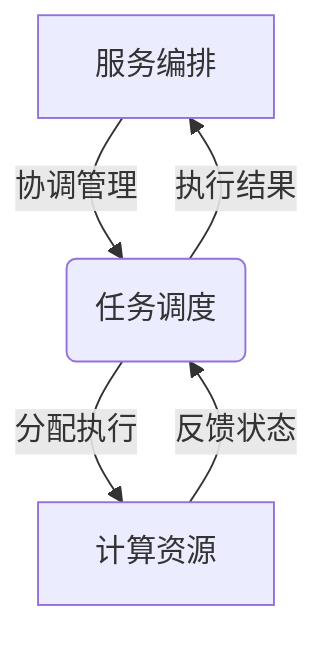
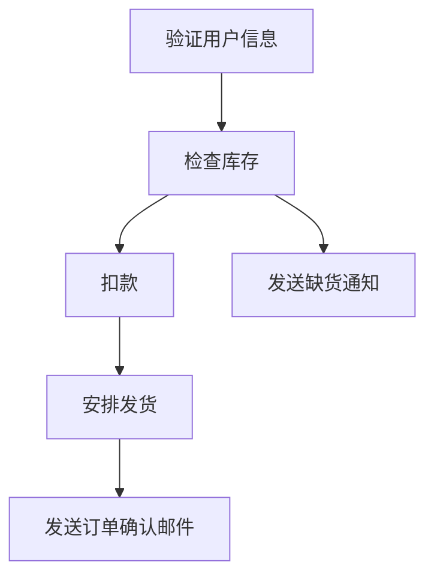

# 服务编排与任务调度原理与代码实战案例讲解

## 1. 背景介绍

### 1.1 问题的由来

在现代分布式系统中，应用程序通常由多个微服务组成,这些微服务需要协同工作才能完成复杂的业务流程。然而,随着系统规模和复杂性的增加,手动编排和管理这些微服务变得越来越困难。因此,需要一种自动化的方式来编排和调度这些服务,以确保系统的高效运行和可靠性。

### 1.2 研究现状

服务编排和任务调度是分布式系统领域的一个热门研究课题。目前,已经有多种编排引擎和调度框架被广泛使用,例如 Kubernetes、Apache Mesos、Nomad 等。这些工具提供了自动化的服务编排、资源调度、负载均衡、故障恢复等功能,大大简化了分布式系统的管理和运维。

### 1.3 研究意义

服务编排和任务调度技术对于构建高可用、可扩展、易维护的分布式系统至关重要。通过合理的编排和调度策略,可以充分利用系统资源,提高资源利用率,缩短应用部署时间,并且能够快速响应故障,确保系统的稳定运行。此外,良好的编排和调度机制也有利于实现自动化运维,降低人工运维成本。

### 1.4 本文结构

本文将首先介绍服务编排和任务调度的核心概念,然后详细阐述相关算法原理和数学模型。接下来,通过实际的代码实例和应用场景,深入探讨编排和调度的实现细节。最后,总结未来发展趋势和面临的挑战,并提供相关工具和资源推荐。

## 2. 核心概念与联系

服务编排(Service Orchestration)和任务调度(Task Scheduling)是密切相关的两个概念,但又有一定区别。

服务编排指的是根据预定义的工作流程,自动化地管理和协调多个微服务之间的交互和执行顺序。它关注的是如何将多个服务组合成一个完整的业务流程,并确保每个服务按照正确的顺序和时间执行。常见的编排技术包括基于事件驱动的编排、基于工作流的编排等。

任务调度则侧重于如何将计算任务合理地分配到可用的计算资源上执行。它需要考虑资源的可用性、任务的优先级、任务之间的依赖关系等因素,从而实现高效的资源利用和任务执行。常见的调度算法有先来先服务(FCFS)、最短作业优先(SJF)、最高响应比优先(HRRN)等。

服务编排和任务调度虽然侧重点不同,但在实际的分布式系统中,它们往往是相辅相成、密切配合的。一个完整的编排流程通常需要调度多个任务在不同的计算节点上执行,而任务调度器也需要根据编排引擎的指令来安排任务的执行顺序和资源分配。因此,设计一个高效的分布式系统需要同时考虑编排和调度两个方面,并且实现它们之间的良好协作。

## 3. 核心算法原理 & 具体操作步骤

### 3.1 算法原理概述

服务编排和任务调度涉及多种算法和策略,本节将重点介绍两种广泛应用的核心算法:基于工作流的服务编排算法和基于优先级的任务调度算法。

**基于工作流的服务编排算法**

这种算法将服务编排过程建模为一个工作流,其中每个节点代表一个服务或任务,边表示服务之间的依赖关系和执行顺序。编排引擎根据工作流定义,自动触发和协调各个服务的执行。常见的工作流模型包括有向无环图(DAG)、有限状态机(FSM)等。

**基于优先级的任务调度算法**

这种算法根据任务的优先级、到达时间、运行时间等属性,决定任务在可用资源上的执行顺序。常见的优先级调度算法包括最短作业优先(SJF)、最高响应比优先(HRRN)等。此外,还可以结合其他调度策略,如公平共享、保留资源等,以满足不同的调度目标。

### 3.2 算法步骤详解

**基于工作流的服务编排算法步骤**

1. 定义工作流模型,包括服务节点、依赖关系、执行条件等。
2. 解析工作流定义,构建内部数据结构(如DAG)表示。
3. 根据工作流入口,触发第一个服务的执行。
4. 监控服务执行状态,根据依赖关系决定下一步执行哪个服务。
5. 重复第4步,直到所有服务执行完毕或发生错误。
6. 处理错误和补偿操作(如回滚、重试等)。

**基于优先级的任务调度算法步骤**

1. 初始化调度队列,按照任务到达时间或优先级排序。
2. 检查是否有空闲资源可用。
3. 从调度队列取出优先级最高的任务。
4. 将任务分配到合适的资源上执行。
5. 监控任务执行状态,更新资源可用情况。
6. 重复第2-5步,直到所有任务执行完毕或无可用资源。

### 3.3 算法优缺点

**基于工作流的服务编排算法**

优点:
- 直观、易于理解和维护。
- 支持复杂的业务流程和条件判断。
- 具有较好的可扩展性和灵活性。

缺点:
- 工作流定义可能过于静态和僵化。
- 对于动态变化的场景,可能需要频繁修改工作流定义。
- 工作流模型可能过于复杂,增加了系统开销。

**基于优先级的任务调度算法**

优点:
- 实现相对简单,易于部署和维护。
- 对于大多数场景,能够提供较好的资源利用率和响应时间。
- 支持多种优先级策略,可以满足不同的调度目标。

缺点:
- 可能出现资源FragmentationFragment的情况,导致资源利用率下降。
- 对于特殊的任务类型(如MapReduce),调度效率可能不佳。
- 无法很好地处理任务之间的依赖关系。

### 3.4 算法应用领域

服务编排和任务调度算法在各种分布式系统中都有广泛的应用,包括但不限于:

- 微服务架构
- 容器编排(如Kubernetes)
- 大数据处理系统(如Hadoop、Spark)
- 科学计算和高性能计算(HPC)
- 云计算和资源管理
- 机器学习和深度学习训练
- 流处理和事件驱动架构

## 4. 数学模型和公式 & 详细讲解 & 举例说明

### 4.1 数学模型构建

为了更好地理解和优化服务编排和任务调度算法,我们可以构建相应的数学模型。以下是一些常见的数学模型:

**工作流模型**

工作流可以用有向无环图(DAG)来建模,其中节点表示服务或任务,边表示依赖关系。设$G=(V,E)$是一个DAG,其中$V$是节点集合,$E$是边集合。对于任意边$(u,v)\in E$,都有$u$必须在$v$之前执行。

我们可以定义一个函数$p:V\rightarrow\mathbb{R}^+$,表示每个节点的执行时间。则整个工作流的总执行时间为所有关键路径的最长路径长度,即:

$$
T(G)=\max\limits_{p\in P(G)}\sum\limits_{v\in p}p(v)
$$

其中$P(G)$表示$G$中所有路径的集合。

**任务调度模型**

假设有$n$个任务$\{T_1,T_2,...,T_n\}$,每个任务$T_i$有到达时间$r_i$、运行时间$p_i$和优先级$w_i$。我们的目标是找到一种调度方案,使得所有任务的加权完成时间之和最小,即:

$$
\min\limits_{\pi}\sum\limits_{i=1}^{n}w_iC_i^\pi
$$

其中$\pi$是一种任务执行顺序,$C_i^\pi$表示在顺序$\pi$下,任务$T_i$的完成时间。

这是一个经典的机器调度问题,是NP-Hard的,我们可以使用启发式算法(如最短作业优先)来获得近似最优解。

### 4.2 公式推导过程

**工作流模型推导**

设$G=(V,E)$是一个有向无环图,对于任意节点$v\in V$,定义它的最早开始时间$ES(v)$和最晚开始时间$LS(v)$如下:

$$
\begin{aligned}
ES(v)&=\max\limits_{(u,v)\in E}\{ES(u)+p(u)\} \\
LS(v)&=\min\limits_{(v,w)\in E}\{LS(w)-p(w)\}
\end{aligned}
$$

其中$p(u)$表示节点$u$的执行时间。

则关键路径的长度为:

$$
T(G)=\max\limits_{v\in V}\{LS(v)-ES(v)\}
$$

**任务调度模型推导**

设$C_i$表示任务$T_i$的完成时间,则我们的目标函数可以写为:

$$
\min\limits_{\pi}\sum\limits_{i=1}^{n}w_iC_i^\pi
$$

对于任一特定的调度顺序$\pi$,我们有:

$$
C_i^\pi=r_i+\sum\limits_{j\in\beta_i^\pi}p_j
$$

其中$\beta_i^\pi$表示在顺序$\pi$下,位于$T_i$之前的所有任务的集合。

将上式代入目标函数,我们得到:

$$
\min\limits_{\pi}\sum\limits_{i=1}^{n}w_i\left(r_i+\sum\limits_{j\in\beta_i^\pi}p_j\right)
$$

这是一个组合优化问题,我们可以使用贪心算法或其他启发式算法来求解。

### 4.3 案例分析与讲解

**工作流模型案例**

假设我们有一个电子商务网站,用户下单后需要经过以下步骤:

1. 验证用户信息
2. 检查库存
3. 如果有货,进行扣款操作
4. 如果无货,发送缺货通知
5. 如果扣款成功,安排发货
6. 发送订单确认邮件

我们可以用DAG来建模这个工作流,如下图所示:

在这个模型中,节点表示服务,边表示依赖关系。例如,扣款操作必须在检查库存之后执行。

我们可以计算每个节点的最早开始时间和最晚开始时间,从而得到关键路径长度,即整个工作流的最短执行时间。

**任务调度模型案例**

假设我们有5个任务,它们的属性如下:

| 任务 | 到达时间 | 运行时间 | 优先级 |
|------|----------|----------|--------|
| T1   | 0        | 3        | 2      |
| T2   | 2        | 6        | 1      |
| T3   | 4        | 4        | 3      |
| T4   | 6        | 5        | 2      |
| T5   | 8        | 2        | 4      |

我们的目标是找到一种调度顺序,使得所有任务的加权完成时间之和最小。

使用最高响应比优先(HRRN)算法,我们可以得到如下调度顺序:

1. T1
2. T3
3. T2
4. T4
5. T5

对应的加权完成时间之和为:

$$
2\times(3)+3\times(7)+1\times(15)+2\times(20)+4\times(22)=116
$$

而使用最短作业优先(SJF)算法,我们可以得到另一种调度顺序:

1. T5
2. T1
3. T3
4