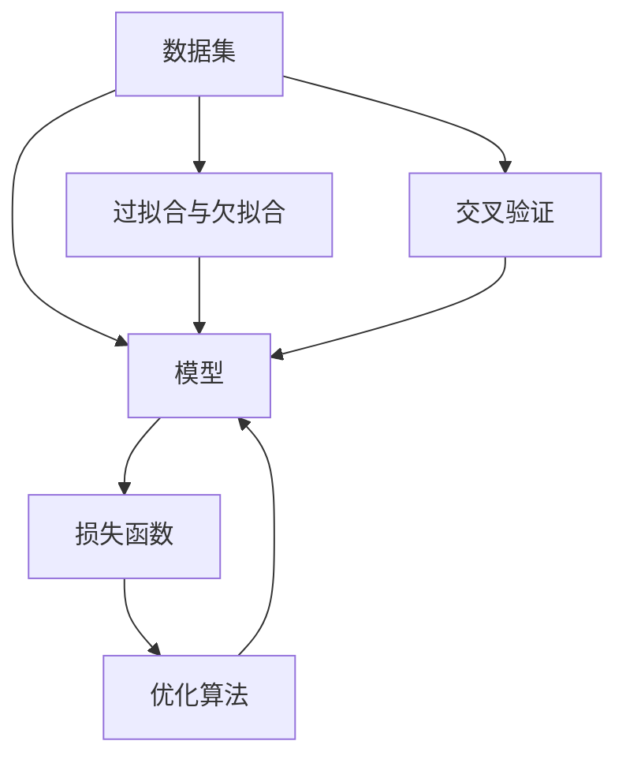

# 机器学习 原理与代码实例讲解

## 1. 背景介绍
### 1.1 问题的由来
机器学习作为人工智能的核心，在过去几十年里取得了长足的发展。从最初的感知机模型，到支持向量机的提出，再到近年来深度学习的崛起，机器学习一直是计算机科学领域最为活跃的研究方向之一。机器学习致力于从海量数据中自动提取知识和规律，让计算机系统具备自主学习和智能决策的能力，在图像识别、自然语言处理、智能推荐等众多领域取得了广泛应用。

### 1.2 研究现状
目前，机器学习已经成为人工智能领域的主流技术路线。各大科技公司纷纷投入巨资开展机器学习研究，推动相关算法不断更新迭代。从传统的浅层学习模型，到复杂的深度神经网络，再到近年来备受关注的迁移学习、强化学习、元学习等前沿方向，机器学习技术日新月异。同时，以 TensorFlow、PyTorch 为代表的深度学习框架也不断完善，为机器学习算法的实现提供了高效便捷的工具支持。

### 1.3 研究意义
机器学习的研究具有重要的理论意义和实践价值。一方面，机器学习揭示了人工智能系统的内在机理，探索了知识表示、推理决策等关键科学问题，推动了人工智能基础理论的发展。另一方面，机器学习为解决现实世界中的复杂问题提供了新的思路和方法，在工业制造、金融、医疗、教育等诸多领域得到广泛应用，为经济社会发展注入新的动力。因此，深入研究机器学习的原理和实现，对于推动人工智能的进步和应用具有重要意义。

### 1.4 本文结构
本文将全面介绍机器学习的原理和代码实现。首先，我们将阐述机器学习的核心概念和基本原理，探讨不同类型的机器学习算法之间的联系。然后，重点介绍几种经典的机器学习算法，如线性回归、逻辑回归、支持向量机、决策树、随机森林等，详细讲解其数学模型和推导过程。接下来，我们将通过具体的代码实例，演示如何使用 Python 和主流机器学习库实现这些算法。同时，探讨机器学习在实际应用场景中的使用案例和注意事项。最后，总结机器学习的发展趋势和面临的挑战，展望未来的研究方向。

## 2. 核心概念与联系

机器学习的核心概念包括以下几个方面：

1. **数据集**：机器学习算法的训练和测试都需要使用数据集。数据集通常由特征向量和对应的标签组成，用于描述待学习的问题。

2. **模型**：机器学习的目标是从数据中学习出一个模型，用于对新的未知数据进行预测或分类。模型可以是线性的，如线性回归；也可以是非线性的，如神经网络。

3. **损失函数**：衡量模型在训练数据上的预测误差，用于评估模型的性能。常见的损失函数包括均方误差、交叉熵等。

4. **优化算法**：用于最小化损失函数，找到最优的模型参数。常见的优化算法包括梯度下降、随机梯度下降、Adam 等。

5. **过拟合与欠拟合**：模型在训练数据上表现良好，但在测试数据上表现较差，称为过拟合；反之，模型在训练数据上表现不佳，称为欠拟合。需要采取正则化等措施来平衡模型的复杂度和泛化能力。

6. **交叉验证**：将数据集划分为多个子集，轮流将其中一个子集作为测试集，其余作为训练集，以评估模型的泛化性能。常见的交叉验证方法包括 k 折交叉验证、留一交叉验证等。

这些核心概念之间存在紧密的联系，如下图所示：

从图中可以看出，数据集是机器学习的基础，用于训练和评估模型。模型的选择和设计需要考虑问题的特点和复杂度。损失函数和优化算法用于训练模型，使其在数据集上达到最优性能。过拟合和欠拟合是模型训练中需要注意的问题，可以通过正则化等方法来缓解。交叉验证用于评估模型的泛化能力，避免过拟合。

理解这些核心概念之间的联系，有助于我们更好地把握机器学习的全貌，设计出高效、鲁棒的机器学习算法。

## 3. 核心算法原理 & 具体操作步骤
### 3.1 算法原理概述

机器学习算法可以分为监督学习、无监督学习和强化学习三大类。监督学习是指在已知标签的数据集上训练模型，常见的算法包括线性回归、逻辑回归、支持向量机、决策树、随机森林等。无监督学习是指在没有标签的数据集上寻找数据的内在结构和关联，常见的算法包括聚类、主成分分析、独立成分分析等。强化学习是指智能体通过与环境的交互，不断试错和优化策略，以获得最大的累积奖励。

本节重点介绍几种经典的监督学习算法的原理。

**线性回归**是一种简单而常用的回归算法，用于拟合连续型变量之间的线性关系。给定一组训练样本 $(x_i, y_i)$，线性回归的目标是找到一个线性函数 $f(x) = wx + b$，使得预测值与真实值之间的均方误差最小化。

**逻辑回归**是一种常用的分类算法，用于二分类问题。与线性回归类似，逻辑回归也是寻找一个线性函数，但将其输出值通过 Sigmoid 函数映射到 $(0, 1)$ 区间，表示样本属于正类的概率。优化目标是最大化似然函数，等价于最小化交叉熵损失。

**支持向量机**是一种基于间隔最大化的二分类算法。它的基本思想是在特征空间中寻找一个超平面，使得不同类别的样本能够被超平面正确分开，且间隔最大。支持向量机可以通过核技巧扩展到非线性分类问题。

**决策树**是一种基于树形结构的分类和回归算法。它通过递归地选择最优的特征和切分点，将数据集划分为不同的子集，直到满足停止条件。决策树的优点是可解释性强，缺点是容易过拟合。

**随机森林**是一种基于决策树的集成学习算法。它通过构建多个决策树，并将它们的预测结果进行组合，以提高模型的泛化性能。随机森林在特征选择和样本采样上引入随机性，有效地降低了过拟合风险。

### 3.2 算法步骤详解

以线性回归为例，详细介绍其算法步骤：

1. 数据预处理：对数据进行归一化、缺失值处理等操作，使其适合模型训练。

2. 初始化模型参数：随机初始化线性函数的权重 $w$ 和偏置 $b$。

3. 定义损失函数：使用均方误差作为损失函数，即 $L(w, b) = \frac{1}{2m} \sum_{i=1}^m (f(x_i) - y_i)^2$，其中 $m$ 为样本数。

4. 优化模型参数：使用梯度下降法优化损失函数，更新 $w$ 和 $b$。设学习率为 $\alpha$，则参数更新公式为：

$$
w := w - \alpha \frac{1}{m} \sum_{i=1}^m (f(x_i) - y_i) x_i
$$

$$
b := b - \alpha \frac{1}{m} \sum_{i=1}^m (f(x_i) - y_i)
$$

5. 迭代优化：重复步骤 4，直到达到预设的迭代次数或损失函数的变化小于阈值。

6. 模型评估：在测试集上评估模型的性能，计算均方误差、决定系数等指标。

7. 模型应用：使用训练好的模型对新的数据进行预测。

其他算法的步骤大同小异，主要区别在于模型的定义、损失函数的选择和优化算法的使用。

### 3.3 算法优缺点

每种算法都有其优缺点，需要根据具体问题选择合适的算法。

线性回归和逻辑回归的优点是模型简单、易于实现，适合处理线性可分的问题。缺点是对非线性关系的拟合能力有限。

支持向量机的优点是可以处理非线性问题，泛化性能好，鲁棒性强。缺点是训练时间较长，对参数敏感。

决策树的优点是可解释性强，可以处理离散和连续特征，缺点是容易过拟合。

随机森林的优点是泛化性能好，不容易过拟合，可以处理高维数据。缺点是模型复杂，训练时间较长。

### 3.4 算法应用领域

机器学习算法在各个领域都有广泛应用，如：

- 计算机视觉：图像分类、目标检测、语义分割等
- 自然语言处理：文本分类、情感分析、机器翻译等
- 推荐系统：个性化推荐、协同过滤等
- 金融风控：信用评分、反欺诈等
- 生物医学：疾病诊断、药物发现等

不同的应用场景对算法的要求不尽相同，需要综合考虑数据特点、计算资源、可解释性等因素，选择合适的算法。

## 4. 数学模型和公式 & 详细讲解 & 举例说明
### 4.1 数学模型构建

以线性回归为例，介绍其数学模型的构建过程。

假设有 $m$ 个训练样本 $(x_i, y_i), i=1,2,\cdots,m$，其中 $x_i \in \mathbb{R}^n$ 为 $n$ 维特征向量，$y_i \in \mathbb{R}$ 为对应的标量输出。线性回归的目标是学习一个线性函数：

$$
f(x) = w^Tx + b
$$

其中 $w \in \mathbb{R}^n$ 为权重向量，$b \in \mathbb{R}$ 为偏置项。

为了找到最优的 $w$ 和 $b$，需要定义一个损失函数来衡量预测值与真实值之间的误差。常用的损失函数是均方误差：

$$
J(w, b) = \frac{1}{2m} \sum_{i=1}^m (f(x_i) - y_i)^2
$$

优化目标是最小化损失函数：

$$
\min_{w, b} J(w, b)
$$

### 4.2 公式推导过程

为了求解最优的 $w$ 和 $b$，可以使用梯度下降法。首先计算损失函数对 $w$ 和 $b$ 的偏导数：

$$
\frac{\partial J}{\partial w_j} = \frac{1}{m} \sum_{i=1}^m (f(x_i) - y_i) x_{ij}, \quad j=1,2,\cdots,n
$$

$$
\frac{\partial J}{\partial b} = \frac{1}{m} \sum_{i=1}^m (f(x_i) - y_i)
$$

然后，按照梯度的反方向更新参数，设学习率为 $\alpha$，则更新公式为：

$$
w_j := w_j - \alpha \frac{\partial J}{\partial w_j}, \quad j=1,2,\cdots,n
$$

$$
b := b - \alpha \frac{\partial J}{\partial b}
$$

重复迭代，直到达到停止条件，即可得到最优的模型参数。

### 4.3 案例分析与讲解

考虑一个简单的例子，假设我们要根据房屋面积预测房价。给定以下训练数据：

| 面积 $(x)$ | 房价 $(y)$ |
|------------|------------|
| 100        | 50         |
| 120        | 60         |
| 150        | 75         |
| 200