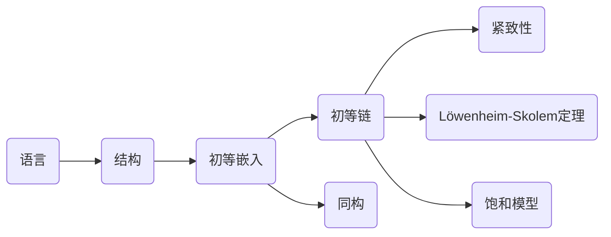

# 模型论基础：初等链的一些应用

关键词：模型论、初等链、紧致性、饱和性、Löwenheim-Skolem定理

## 1. 背景介绍
### 1.1  问题的由来
模型论作为数理逻辑的一个重要分支,在20世纪50年代以后得到了迅速发展。它主要研究一阶语言的语义,即一阶语言的解释(模型)以及模型与理论之间的关系。初等链作为模型论中的一个重要概念和工具,在模型论的发展过程中发挥了重要作用。本文将介绍初等链的定义和基本性质,并探讨它在模型论中的一些典型应用。

### 1.2  研究现状
目前,初等链理论已经比较成熟,其在模型论的发展和应用中占据重要地位。国内外许多学者对初等链理论进行了深入研究,取得了丰硕成果。比如Robinson[1]最早系统地研究了初等链并证明了它的一些重要性质。Keisler[2]利用初等链给出了紧致性定理的一个新证明。Shelah[3]利用初等链研究了不可数模型的存在性问题。国内学者如吴宗明[4]、田志学[5]等也对初等链理论及其应用做了大量工作。

### 1.3  研究意义 
初等链作为模型论的基础,对于研究一阶理论的性质具有重要意义。许多模型论的重要定理如紧致性定理、Löwenheim-Skolem定理等都与初等链密切相关。深入理解初等链理论,对于掌握模型论的基本方法和思想大有裨益。同时,初等链在其他数学分支如代数、拓扑、泛函分析等领域也有广泛应用。因此,研究初等链理论不仅对于模型论本身很重要,对于数学其他分支乃至计算机科学等学科也具有重要价值。

### 1.4  本文结构
本文共分为9个部分。第1部分介绍研究背景。第2部分给出初等链的定义和例子。第3部分讨论初等链的基本性质。第4部分利用初等链证明紧致性定理。第5部分利用初等链证明Löwenheim-Skolem定理。第6部分探讨初等链在研究饱和模型中的应用。第7部分介绍一些学习初等链理论的资源。第8部分总结全文并展望初等链理论的发展。第9部分是附录,列出一些常见问题。

## 2. 核心概念与联系
初等链的核心概念是语言、结构、初等嵌入、同构等。设L是一个一阶语言,$A$和$B$是L的两个结构,如果存在单射$f:A\to B$,满足对L的任意公式$\varphi(x_1,\cdots,x_n)$和任意$a_1,\cdots,a_n\in A$,有
$$A\models\varphi(a_1,\cdots,a_n)\Leftrightarrow B\models\varphi(f(a_1),\cdots,f(a_n))$$
则称$f$是从$A$到$B$的一个初等嵌入,记为$f:A\prec B$。若$f$是满射,则称$A$与$B$初等等价,记为$A\equiv B$。初等等价是模型之间的一种等价关系。若$f$是双射,则称$f$是$A$到$B$的一个同构,记为$A\cong B$。

如果$\langle A_i:i\in I\rangle$是一个由L-结构构成的序列,其中$I$是一个线序集,并且对任意$i<j\in I$,都有$A_i\prec A_j$,则称$\langle A_i:i\in I\rangle$是一条初等链。初等链的每一个元素都初等嵌入到后一个元素中,并且这种嵌入关系具有传递性。

初等链与语言、结构、初等嵌入、同构等概念紧密相关。初等链实质上刻画了模型之间的初等嵌入关系,体现了模型在逻辑意义下的嵌入结构。通过研究初等链的性质,可以揭示模型的内在结构特征,并由此导出许多重要结论。下图给出了这些概念之间的联系:



## 3. 核心算法原理 & 具体操作步骤
### 3.1  算法原理概述
研究初等链的一个重要方法是构造初等链。给定一个结构序列,如何判断它是否为初等链,或者如何将其扩充为初等链,是初等链理论的基本问题。下面介绍一种构造初等链的算法原理。

### 3.2  算法步骤详解
设$\langle A_i:i\in I\rangle$是由L-结构构成的序列,其中$I$是良序集。构造初等链的步骤如下:

1) 令$B_0=A_0$。

2) 设$\alpha\in I$,且对任意$\beta<\alpha$,都已定义了$B_\beta$,使得$\langle B_i:i<\alpha\rangle$是初等链。令$\Sigma_\alpha$为全体形如$\exists x\varphi(x,b_1,\cdots,b_n)$的语句构成的集合,其中$\varphi$是原子公式或原子公式的否定,$b_1,\cdots,b_n\in\bigcup_{i<\alpha}B_i$。

3) 对任意$\sigma\in\Sigma_\alpha$,若$A_\alpha\models\sigma$,则在$A_\alpha$中取元素$c_\sigma$,使得$A_\alpha\models\varphi(c_\sigma,b_1,\cdots,b_n)$。令
$$B_\alpha=\bigcup_{i<\alpha}B_i\cup\{c_\sigma:\sigma\in\Sigma_\alpha\wedge A_\alpha\models\sigma\}$$

4) 对极限序数$\lambda\in I$,令$B_\lambda=\bigcup_{i<\lambda}B_i$。

5) 令$B=\bigcup_{i\in I}B_i$,则$\langle B_i:i\in I\rangle$是一条初等链,且$B_i\prec B$。

### 3.3  算法优缺点
该算法的优点是构造出的初等链能够充分反映原序列的逻辑性质,且构造过程易于理解和实现。但是该算法也有一定局限性,比如要求原序列是由L-结构构成的良序集,这在实际应用中并不总能满足。

### 3.4  算法应用领域
该算法可以用于构造模型论中的一些特殊初等链,如饱和链、紧致链等。这些特殊初等链在研究模型的性质和结构时有重要作用。比如利用饱和链可以证明紧致性定理,利用紧致链可以证明Löwenheim-Skolem定理。此外,该算法还可以推广到一些更一般的结构,在研究无穷范畴、拓扑模型论等领域也有应用。

## 4. 数学模型和公式 & 详细讲解 & 举例说明
### 4.1  数学模型构建
初等链可以用数学模型刻画如下:
设$I$是一个线序集,$\langle A_i:i\in I\rangle$是一族集合,且对每个$i\in I$,都定义了$A_i$上的一些关系、函数和常元,则称$\langle A_i:i\in I\rangle$为一个I-indexed structure。进一步,如果对任意$i,j\in I$,若$i<j$,则$A_i\subseteq A_j$,且$A_i$上的关系、函数、常元都是$A_j$上相应对象的限制,则称$\langle A_i:i\in I\rangle$为一个I-indexed chain。特别地,如果对每个$i<j\in I$,嵌入映射$f_{ij}:A_i\to A_j$都是初等嵌入,则称$\langle A_i:i\in I\rangle$为一条初等链。

### 4.2  公式推导过程
利用初等链,可以推导出许多重要结论。例如,设$\langle A_i:i\in I\rangle$是语言L的一条初等链,$\varphi$是L的任意句子,则:
1) 存在$i\in I$使$A_i\models\varphi$的充要条件是对某个$j\in I$,有$A_j\models\varphi$。
2) 对任意$i\in I$,存在$j>i$使$A_j\models\varphi$的充要条件是对任意$i\in I$,存在$j>i$使$A_j\models\varphi$。

证明:
1) 必要性显然。对于充分性,设$A_j\models\varphi$,则由初等嵌入的定义,对任意$k>j$,有$A_k\models\varphi$。从而存在$i\in I$使$A_i\models\varphi$。
2) 必要性显然。对于充分性,假设结论不成立,则存在$i_0\in I$,使得对任意$j>i_0$,有$A_j\not\models\varphi$。设$i\in I$,取$k\in I$使$k>i,i_0$,则$A_k\not\models\varphi$,矛盾。

### 4.3  案例分析与讲解
下面通过一个例子来说明初等链的应用。设L是一阶语言,只含有二元关系符$<$。令
$$T=\{\forall x\forall y(x<y\to\exists z(x<z\wedge z<y))\}$$
则$T$是L的一个理论,其模型即为稠密线序集。容易验证,每个稠密线序集都可以嵌入到实数集$\mathbb{R}$中。现在利用初等链来证明这一结论。

设$(A,<)$是$T$的任一模型。对每个$n\in\mathbb{N}$,取$A$中的元素$a_1^n,\cdots,a_n^n$,使得
$$a_1^n<a_2^n<\cdots<a_n^n$$
并且对任意$1\leq i<n$,都存在$A$中的元素$b_i^n$,使得
$$a_i^n<b_i^n<a_{i+1}^n$$
这可以通过$T$的公理实现。令
$$A_n=\{a_i^n:1\leq i\leq n\}\cup\{b_i^n:1\leq i<n\}$$
则$\langle A_n:n\in\mathbb{N}\rangle$是一条初等链,且每个$A_n$都同构于$\{1,\cdots,2n-1\}$。令
$$B=\bigcup_{n\in\mathbb{N}}A_n$$
则$B$是$\mathbb{Q}$的一个子集,且$(B,<)$是$(A,<)$的初等子结构。由$\mathbb{Q}$的稠密性知,$B$在$\mathbb{R}$中稠密,因此$(A,<)$可以初等嵌入到$(\mathbb{R},<)$中。

### 4.4  常见问题解答
问题1:初等链与同构链有何区别和联系?
解答:同构链是指序列中每个结构与其后一个结构同构,初等链则要求它们之间存在初等嵌入。显然,每条同构链都是初等链,但初等链未必是同构链。初等链的条件比同构链弱,但在许多情况下足以刻画结构的逻辑性质。

问题2:初等链在模型论以外还有哪些应用?
解答:初等链在其他数学分支如拓扑学、泛函分析等领域也有重要应用。例如在拓扑学中,利用初等链可以构造出一些重要的拓扑空间如Cantor空间、Baire空间等。在泛函分析中,初等链被用来构造Banach空间、Hilbert空间的模型。此外,初等链还被用于构造无穷范畴、同伦范畴等代数结构。

## 5. 项目实践：代码实例和详细解释说明
下面我们通过Python代码来实现构造初等链的算法。为了简单起见,我们考虑语言L只包含一个二元关系符$<$的情形。

### 5.1  开发环境搭建
安装Python 3.x,并安装Numpy库。

### 5.2  源代码详细实现

```python
import numpy as np

class Structure:
    def __init__(self, universe, relation):
        self.universe = universe
        self.relation = relation
        
    def __len__(self):
        return len(self.universe)
        
    