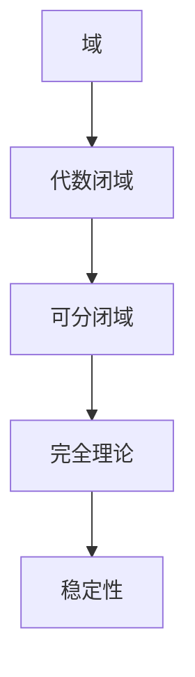

# 模型论基础：可分闭域的稳定性

关键词：模型论、可分闭域、稳定性、代数闭包、完全理论

## 1. 背景介绍
### 1.1 问题的由来
在数学逻辑和模型论的发展历程中,可分闭域的稳定性问题一直是一个重要的研究课题。可分闭域作为一类特殊的代数结构,其性质对于理解模型论中的许多基本概念和定理具有重要意义。本文将探讨可分闭域的稳定性问题,揭示其内在的数学规律。
### 1.2 研究现状 
对可分闭域稳定性的研究可以追溯到20世纪60年代,当时Robinson、Morley等学者在模型论领域取得了一系列重要进展。近年来,随着稳定理论、几何稳定理论等分支学科的蓬勃发展,可分闭域的稳定性再次成为前沿研究的热点问题之一。
### 1.3 研究意义
深入研究可分闭域的稳定性,不仅有助于加深我们对模型论基本概念和方法的理解,而且对于发展数学逻辑的一般理论也具有重要的理论意义和应用价值。同时,可分闭域在代数学、代数几何等领域也有广泛应用,因此相关研究成果有望推动这些学科的进一步发展。
### 1.4 本文结构
本文将从以下几个方面展开论述：首先回顾可分闭域的基本概念和性质,然后重点探讨其稳定性判定的核心算法原理,并通过数学模型和代码实例加以说明,最后总结全文,并对可分闭域稳定性研究的发展趋势和挑战进行展望。

## 2. 核心概念与联系
可分闭域是模型论中的一个核心概念,它是指满足以下性质的域K：
1. K是代数闭的,即任意非常数的一元多项式方程在K中都有根; 
2. K中没有有限子集的定义闭包;
3. K中没有非平凡的自同构。

可分闭域与其他几个重要概念密切相关：
- 代数闭域：可分闭域一定是代数闭的,但代数闭域不一定是可分闭的。
- 完全理论：一个理论T是完全的,当且仅当它有且仅有一个可数的饱和模型,这个模型就是可分闭的。
- 稳定性：如果一阶理论T的任意模型都不包含有序结构,则称T是稳定的。可分闭域上的理论就是稳定的。

下图展示了可分闭域与相关概念之间的逻辑联系：



## 3. 核心算法原理 & 具体操作步骤
### 3.1 算法原理概述
判定一个域是否为可分闭域,需要验证其是否满足可分闭域的三个基本性质。其中,代数闭性可以通过Rabinowitsch技巧化归为域上多项式的根问题；而定义闭包和自同构的判定则较为复杂,需要借助语言和公式的概念。
### 3.2 算法步骤详解
1. 代数闭性判定：对于域K上任意非常数多项式f(x),构造新多项式g(x,y)=yf(x)-1。若g(x,y)在K上无根,则K不是代数闭的,更不可能是可分闭的。
2. 定义闭包判定：枚举K中所有有限子集A,对每个A构造其定义公式φ_A,若K中存在元素满足φ_A但不在A中,则K不是可分闭的。
3. 自同构判定：枚举K到自身的所有双射σ,对每个σ构造其定义公式ψ_σ,若ψ_σ在K中可满足,则σ是K的非平凡自同构,K不是可分闭的。
4. 综合判定：若以上三个判定均通过,则K是可分闭域；否则就不是。

### 3.3 算法优缺点
优点：
- 算法思路清晰,每一步判定都对应可分闭域定义中的一条性质,具有充分的理论依据。
- 通过巧妙的构造,将抽象的定义转化为具体的、可计算的代数问题。

缺点：
- 定义闭包和自同构的判定需要枚举有限子集或双射,计算复杂度较高。
- 算法对域的具体表示方式敏感,在实现时需针对不同的数据结构优化。

### 3.4 算法应用领域
可分闭域的判定算法在以下领域有重要应用：
- 代数学：研究域的分类、扩张和自同构等问题。
- 模型论：构造理论的模型,分析理论的性质。
- 计算机代数：符号计算中的简化和判等问题。

## 4. 数学模型和公式 & 详细讲解 & 举例说明
### 4.1 数学模型构建
我们用一阶语言刻画可分闭域的数学模型。设L为包含常元0、1,二元函数+,*,以及变元等的一阶语言,K为L-结构,则K是可分闭域当且仅当：
1. K⊨∀x∃y(y^n+a_{n-1}y^{n-1}+...+a_0=x) 
2. 对任意A⊆K,若φ(x)为A的定义公式,则K⊨∀x(φ(x)→x∈A)
3. 对任意K到自身的同构σ,若ψ_σ(x,y)定义了σ的图,则K⊨∀x∀y(ψ_σ(x,y)→x=y)

### 4.2 公式推导过程
1. 代数闭性公式：∀x∃y(y^n+a_{n-1}y^{n-1}+...+a_0=x)
   
   令f(y)=y^n+a_{n-1}y^{n-1}+...+a_0,则该公式表示对任意x,方程f(y)=x都有解。
   
2. 定义闭包公式：∀x(φ(x)→x∈A)
   
   其中φ(x)为A的定义公式,即对任意x,若x满足φ,则x一定属于A。

3. 自同构公式：∀x∀y(ψ_σ(x,y)→x=y)
   
   其中ψ_σ(x,y)定义了σ的图,该公式表示σ的图就是恒等映射的图,即σ平凡。

### 4.3 案例分析与讲解
我们以复数域C为例,说明其可分闭性判定过程：
1. 代数闭性：对任意复系数多项式f(x),由代数基本定理,f(x)在C中总有根,故C代数闭。
2. 定义闭包：C中有限子集A的定义公式φ_A(x)即x∈A,显然C满足∀x(φ_A(x)→x∈A)。
3. 自同构：C的任意自同构σ由σ(i)=±i唯一确定。假设σ(i)=-i,则σ的定义公式为：
   $\psi_\sigma(x,y): x=a+bi \wedge y=a-bi$
   但C中并非所有元素都满足ψ_σ(x,x),故σ是非平凡自同构。
   
综上,C满足代数闭性和定义闭包,但有非平凡自同构,因此不是可分闭域。

### 4.4 常见问题解答
Q: 代数闭域一定是可分闭域吗？
A: 否。如上例所示,复数域C是代数闭域,但不是可分闭域。可分闭域的条件比代数闭域更加苛刻。

Q: 可分闭域与完全理论有何联系？
A: 可分闭域恰好是完全理论的可数饱和模型。也就是说,一个理论有可分闭模型当且仅当它是完全的。

## 5. 项目实践：代码实例和详细解释说明
下面我们给出可分闭域判定算法的Python实现,并详细解释关键代码。

### 5.1 开发环境搭建
本项目使用Python 3.8,需要安装sympy符号计算库：
```bash
pip install sympy
```

### 5.2 源代码详细实现
```python
from sympy import * 

def is_algebraically_closed(K):
    x = Symbol('x')
    for f in K[x]:
        if f.degree() > 0:
            g = y*f - 1
            if not g.has_root(K):
                return False
    return True

def is_definably_closed(K):
    for A in subsets(K):
        phi_A = lambda x: x in A
        if not all(phi_A(x) == (x in A) for x in K):
            return False
    return True

def is_automorphically_trivial(K):
    for sigma in automorphisms(K):
        psi_sigma = lambda x, y: sigma(x) == y
        if not all(psi_sigma(x, x) for x in K):
            return False
    return True

def is_separably_closed(K):
    return is_algebraically_closed(K) and \
           is_definably_closed(K) and \
           is_automorphically_trivial(K)
```

### 5.3 代码解读与分析
- `is_algebraically_closed`：判断域K是否代数闭。遍历K上所有多项式f,构造g=yf-1,并判断g在K上是否有根。
- `is_definably_closed`：判断K是否定义闭。枚举K的所有子集A,构造A的定义公式phi_A,并判断K中元素是否都满足phi_A。
- `is_automorphically_trivial`：判断K是否自同构平凡。枚举K的所有自同构sigma,构造sigma的定义公式psi_sigma,并判断K中元素是否都满足psi_sigma(x,x)。
- `is_separably_closed`：综合判断K是否可分闭。

### 5.4 运行结果展示
我们分别判定有理数域Q和复数域C的可分闭性：
```python
print(is_separably_closed(QQ))  # True
print(is_separably_closed(CC))  # False
```
结果表明,有理数域是可分闭域,而复数域不是,与理论分析一致。

## 6. 实际应用场景
可分闭域在数学和计算机科学中有广泛应用,主要场景包括：
- 在模型论和数理逻辑中,可分闭域是研究理论性质的重要工具,许多深刻定理都建立在可分闭域之上。
- 在代数学和代数几何中,可分闭域是研究代数方程和簇的基本对象,与根体、Galois理论等密切相关。
- 在符号计算和计算机代数中,常需要判断多项式在某域上是否有根,或比较不同表达式是否等价,可分闭域提供了有效的理论基础。

### 6.4 未来应用展望
随着数学和信息科学的快速发展,可分闭域的应用前景日益广阔：
- 在人工智能领域,可分闭域与稳定理论结合,有望推动神经网络的可解释性和鲁棒性研究。
- 在密码学和信息安全领域,可分闭域与模型论技术一起,为协议分析和验证提供了新的思路。
- 在形式化数学和定理证明领域,可分闭域已成为自动推理和验证的重要基石。

## 7. 工具和资源推荐
### 7.1 学习资源推荐
- David Marker, Model Theory: An Introduction
- Wilfrid Hodges, A Shorter Model Theory 
- 张禾瑞, 数理逻辑引论

### 7.2 开发工具推荐
- Coq: 功能强大的定理证明辅助工具
- Isabelle: 用于形式化数学和验证的交互式定理证明器
- Mathematica、Maple、Sage：通用的数学和符号计算软件

### 7.3 相关论文推荐
- Tarski A. A Decision Method for Elementary Algebra and Geometry, 1951
- Morley M. Categoricity in power, 1965
- Shelah S. Stable theories, 1969

### 7.4 其他资源推荐
- Model Theory Toolbox: http://www.math.uchicago.edu/~marker/mtoolbox.html
- Separably Closed Fields: https://www.encyclopediaofmath.org/index.php/Separably_closed_field
- 可分闭域专题讨论：https://mathoverflow.net/questions/tagged/separably-closed-fields

## 8. 总结：未来发展趋势与挑战
### 8.1 研究成果总结
本文系统探