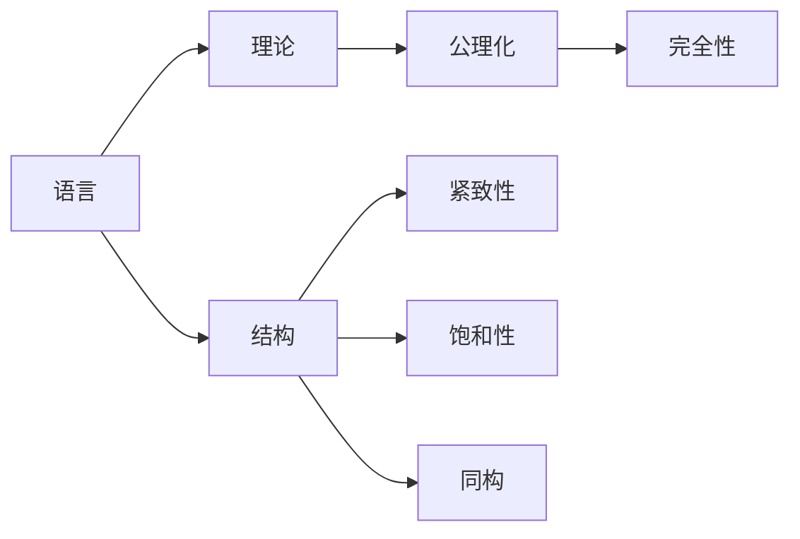

# 模型论基础：模型论及其概念的可计算化

关键词：模型论、可计算性、一阶逻辑、算法、形式化方法

## 1. 背景介绍
### 1.1 问题的由来
模型论是数理逻辑的一个重要分支,它主要研究数学结构及其性质。模型论在计算机科学中有着广泛的应用,尤其是在程序验证、自动定理证明、知识表示等领域。然而,模型论中的许多概念和结果都涉及到无穷结构,这给它在计算机科学中的应用带来了困难。因此,研究模型论概念的可计算化具有重要的理论意义和实践价值。

### 1.2 研究现状
目前,国内外学者对模型论概念的可计算化进行了广泛研究。Ershov等人研究了一阶理论的可判定性问题；Goncharov等人系统地研究了可构造模型的理论；Ershov和Puzarenko研究了一阶理论的相对可判定性；Millar、Morozov等研究了一阶理论的相对categorical理论等。这些研究极大地推动了模型论概念可计算化的发展,但仍有许多问题有待进一步探索。

### 1.3 研究意义 
模型论概念的可计算化研究对于计算机科学具有重要意义：

1. 有助于更好地理解程序逻辑的本质,为程序验证提供理论基础。  
2. 推动自动推理、定理证明等人工智能领域的发展。
3. 为知识表示、数据库理论等领域提供新的思路和方法。
4. 有助于探索可计算性理论与数理逻辑之间的关系,推动可计算性理论的发展。

### 1.4 本文结构
本文将从以下几个方面探讨模型论及其概念的可计算化：

1. 介绍模型论的核心概念及其联系
2. 讨论模型论中的核心算法原理及其具体步骤
3. 构建相关数学模型并给出详细推导和举例说明
4. 通过代码实例来展示相关算法的实现
5. 分析模型论及其概念的实际应用场景
6. 推荐相关学习资源和工具
7. 总结全文,展望模型论的未来发展趋势和面临的挑战
8. 附录部分给出常见问题解答

## 2. 核心概念与联系

模型论的核心概念包括：语言、结构、理论、公理化、完全性、紧致性、饱和性、同构等。其中：

- 语言是一阶逻辑的基本组成部分,由非逻辑符号(如常元、函数、谓词等)组成。
- 结构是语言的一个解释,由论域和对语言中符号的解释组成。
- 理论是语言中所有有效句子的集合,反映了结构的性质。
- 公理化是用语言的句子刻画一个理论,它保证了理论的相容性和完备性。
- 完全性是指理论中的每个句子都可以被证明或证伪。
- 紧致性刻画了结构在扩张时的性质,即每个理论若在有限子结构上都有模型,则它必有无穷模型。
- 饱和性反映了结构对于有限集的性质,即结构中任意有限集的类型在结构中都能实现。
- 同构反映了结构之间的关系,即两个结构之间存在一一对应,并且这种对应保持了函数、关系的性质。

这些概念之间有着紧密的联系。语言是构建理论的基础,结构是语言的解释,理论刻画了结构的性质。公理化保证了理论的相容无矛盾和完备性。紧致性和饱和性反映了结构的特殊性质。同构则刻画了结构之间的关系。

下图是这些概念之间关系的 Mermaid 流程图：



## 3. 核心算法原理 & 具体操作步骤
### 3.1 算法原理概述
模型论中的许多问题都可以转化为一阶逻辑可满足性问题,因此求解一阶逻辑可满足性是模型论算法的核心。目前主要有以下几种求解一阶逻辑可满足性的方法：

1. 基于演绎推理的方法,如Robinson算法、归结算法等。
2. 基于模型构造的方法,如Herbrand定理、Gentzen系统等。  
3. 基于自动机理论的方法,如Büchi自动机、Muller自动机等。
4. 基于博弈论的方法,如Ehrenfeucht-Fraïssé博弈、Banach-Mazur博弈等。

这些方法在模型检测、定理证明、知识推理等领域都有重要应用。

### 3.2 算法步骤详解

以下我们以归结算法为例,详细介绍其步骤。归结算法是一种基于演绎推理的算法,通过归结规则将一阶逻辑公式集归结为空集,从而证明原公式集的不可满足性。其基本步骤如下：

1. 将一阶逻辑公式集F预处理为子句集S。
2. 选择S中的两个子句C1和C2,按照归结规则产生归结式R。 
3. 将归结式R加入到S中。
4. 重复步骤2-3,直到产生空子句或无法继续归结。
5. 如果产生空子句,则原公式集F不可满足,否则F可满足。

归结规则是归结算法的核心,它保证了归结过程的正确性和完备性。常见的归结规则有：合一规则、分裂规则、factoring规则等。

### 3.3 算法优缺点

归结算法的主要优点有：
1. 适用范围广,对任意一阶逻辑公式都适用。
2. 便于实现,规则简单,易于编程实现。
3. 可结合其他优化技术,如子句删除、归结限制等,从而提高效率。

归结算法的缺点主要有：
1. 归结过程会产生大量的中间子句,空间复杂度高。
2. 归结步骤的选择对算法效率影响很大,需要引入启发式策略。
3. 无法很好地处理等词公理,需要引入专门的推理规则。

### 3.4 算法应用领域
归结算法在定理证明、程序验证、知识推理等领域有广泛应用,如：

1. 在自动定理证明系统中,用归结算法来证明数学定理。
2. 在程序验证中,用归结算法来检验程序的正确性。
3. 在专家系统中,用归结算法来推理和回答问题。
4. 在数据库领域,用归结算法优化查询、检查完整性约束等。

## 4. 数学模型和公式 & 详细讲解 & 举例说明
### 4.1 数学模型构建
我们以一阶逻辑可满足性问题为例,来构建其数学模型。设F是一个一阶逻辑公式集：

$F=\{f_1,f_2,\cdots,f_n\}$

其中 $f_i$ 是一阶逻辑公式,可满足性问题就是判断是否存在一个解释 $I$,使得 $I$ 满足 $F$ 中的每一个公式,即：

$$I \vDash f_i, \forall f_i \in F$$

如果存在这样的解释 $I$,则称 $F$ 是可满足的,否则称 $F$ 是不可满足的。

### 4.2 公式推导过程
在归结算法中,我们首先将 $F$ 转化为子句集 $S$：

$$S=\{C_1,C_2,\cdots,C_m\}$$

其中 $C_i$ 是子句,即文字的析取式。归结算法的目标是证明 $S$ 的不可满足性,即证明：

$$S \vdash \square$$

其中 $\square$ 表示空子句。归结算法的推导过程就是不断使用归结规则,由 $S$ 推出新的子句,直到推出空子句。设 $R_i$ 表示归结规则,则归结过程可表示为：

$$S \vdash_{R_1} S_1 \vdash_{R_2} S_2 \vdash_{R_3} \cdots \vdash_{R_k} S_k$$

其中 $S_k$ 包含空子句 $\square$。这个推导过程说明了 $S$ 的不可满足性,也就说明了原公式集 $F$ 的不可满足性。

### 4.3 案例分析与讲解
下面我们以一个简单的例子来说明归结算法的具体过程。设有以下一阶逻辑公式集：

$$
\begin{aligned}
F = \{ & \forall x \exists y P(x,y), \\
       & \forall x \forall y (P(x,y) \to \neg P(y,x)), \\
       & \exists x \forall y P(x,y) \}
\end{aligned}
$$

首先将其转化为子句集：

$$
\begin{aligned}
S = \{ & C_1: \{P(x,f(x))\}, \\  
       & C_2: \{\neg P(x,y), \neg P(y,x)\}, \\ 
       & C_3: \{P(a,y)\} \}
\end{aligned}
$$

然后使用归结规则进行推导。首先对 $C_1$ 和 $C_2$ 进行合一归结,得到：

$$C_4: \{\neg P(f(x),x)\}$$

再对 $C_3$ 和 $C_4$ 进行合一归结,得到：

$$C_5: \{\neg P(f(a),a)\}$$

再对 $C_3$ 和 $C_5$ 进行合一归结,得到：

$$C_6: \{\square\}$$

至此推出了空子句,说明原公式集 $F$ 是不可满足的。

### 4.4 常见问题解答

Q: 归结算法能否用于一阶逻辑之外的逻辑系统?
A: 归结算法是专门为一阶逻辑设计的,不能直接用于其他逻辑系统。但是其思想可以推广到其他逻辑系统,如高阶逻辑、模态逻辑等,需要针对这些逻辑的特点设计新的归结规则。

Q: 归结算法是否是一个完备的半可判定过程?  
A: 归结算法是相对完备的,即对于任意不可满足的一阶逻辑公式集,归结算法都能在有限步内终止并推出空子句。但是归结算法并不是可判定的,对于可满足的公式集,归结过程可能不终止。因此归结算法是一个半可判定过程。

Q: 除了归结算法之外,还有哪些常见的一阶逻辑可满足性判定算法?
A: 除了归结算法,还有 Davis-Putnam 算法、语义表算法、Gentzen 算法等。其中 Davis-Putnam 算法是基于命题逻辑的,先将一阶逻辑公式转化为命题逻辑公式,再判断其可满足性。语义表算法是直接构造一阶逻辑的语义表,判断公式在语义表上是否有模型。Gentzen 算法是基于 Gentzen 系统的推理算法。

## 5. 项目实践：代码实例和详细解释说明
### 5.1 开发环境搭建
我们使用 Python 语言来实现一个简单的归结算法,需要安装以下工具和库：

- Python 3.x 解释器
- SymPy 库:用于符号运算
- Kanren 库:用于逻辑编程

可以使用 pip 命令来安装这些库：

```bash
pip install sympy kanren
```

### 5.2 源代码详细实现
以下是归结算法的 Python 实现代码:

```python
from kanren import *
from sympy import *

def resolution(kb, alpha):
    clauses = kb + [to_cnf(~alpha)]
    new = set()
    while True:
        n = len(clauses)
        pairs = [(clauses[i], clauses[j]) for i in range(n) for j in range(i+1, n)]
        for (ci, cj) in pairs:
            resolvents = resolve(ci, cj)
            if False in resolvents:
                return True
            new = new.union(set(resolvents))
        if new.issubset(set(clauses)):
            return False
        for c in new:
            if c not in clauses:
                clauses.append(c)

def resolve(ci, cj):
    clauses = []
    for di in disjuncts(ci):
        for dj in disj