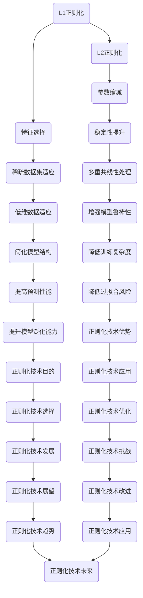

# 正则化 (Regularization)

关键词：

## 1. 背景介绍

### 1.1 问题的由来

在机器学习和统计建模中，模型的过度拟合（overfitting）是经常遇到的问题。当模型过于复杂，或者训练数据量不足时，模型会学习到训练数据中的噪声和异常，而非数据背后的潜在规律。这导致模型在未见过的数据上的表现不佳。正则化（Regularization）作为一种策略，旨在减轻模型的过度拟合，通过引入惩罚项来限制模型的复杂度，使得模型在训练数据上表现良好，同时在未知数据上也具有良好的泛化能力。

### 1.2 研究现状

正则化是机器学习和统计建模中广泛使用的技巧，尤其是在深度学习领域。它通过控制模型参数的大小来避免过拟合。常见的正则化方法包括 L1 正则化、L2 正则化、弹性网络（Elastic Net）、Dropout、早停（Early Stopping）等。这些方法各有优势，可以单独或结合使用，以适应不同的数据集和任务需求。

### 1.3 研究意义

正则化的研究意义在于提高模型的泛化能力，使得模型能够在训练集上表现优秀的同时，也能在新的、未见过的数据上保持良好的预测性能。这对于实际应用中的数据驱动决策至关重要，尤其是在资源受限的环境下，比如移动设备上的实时预测应用。此外，正则化还有助于解决高维数据下的“维度灾难”问题，以及提升模型的解释性。

### 1.4 本文结构

本文将深入探讨正则化的理论基础、主要方法、数学表达、代码实现、实际应用以及未来展望。我们将首先介绍正则化的核心概念和原理，随后详细分析几种主要的正则化技术，接着通过具体案例和代码实现展示其应用，并讨论正则化在不同场景下的选择和优化策略。最后，我们将展望正则化技术的发展趋势及其面临的挑战。

## 2. 核心概念与联系

正则化是一系列旨在减少模型复杂度的技术，其核心目的是在最大化模型的训练数据拟合度的同时，防止模型过于复杂，从而避免过拟合现象。通过在模型的损失函数中加入一个正则化项，正则化能够有效地控制模型参数的大小，从而平衡拟合能力和泛化能力。以下是一些常见的正则化方法及其联系：

### L1 正则化（Lasso）

L1 正则化通过在损失函数中加入绝对值的惩罚项，促使模型参数向零靠近，从而实现特征选择。对于稀疏数据集特别有效，能够自动筛选出不重要的特征。

### L2 正则化（Ridge）

L2 正则化通过在损失函数中加入平方的惩罚项，使得参数不会完全为零，而是趋向于较小的值。L2 正则化有助于减少参数间的相互依赖，提升模型的稳定性。

### 弹性网络（Elastic Net）

弹性网络结合了 L1 和 L2 正则化的优点，通过混合两种惩罚项来平衡特征选择和参数缩减的效果。弹性网络在处理多重共线性时表现更优，且在稀疏数据集上效果显著。

### Dropout

Dropout 是一种基于随机丢弃神经网络层中部分单元的正则化技术，它能够防止神经网络内部的单元间形成过于紧密的依赖关系，从而降低过拟合的风险。

### 框架图：



## 3. 核心算法原理 & 具体操作步骤

### 3.1 算法原理概述

正则化算法的基本原理是在原损失函数的基础上添加一个正则化项，这个正则化项通常与参数的某种度量相关，如参数的绝对值或平方和。通过调整正则化项的系数（称为正则化强度），可以控制模型的复杂度。正则化强度越大，模型越倾向于简单化，从而降低过拟合的风险。

### 3.2 算法步骤详解

#### L1 正则化

- **目标函数**：最小化损失函数 $\mathcal{L}(w)$ 加上正则化项 $\lambda||w||_1$，其中 $w$ 是模型参数，$\lambda$ 是正则化强度。
- **优化过程**：通过梯度下降法求解参数 $w$，使得目标函数最小化。

#### L2 正则化

- **目标函数**：最小化损失函数 $\mathcal{L}(w)$ 加上正则化项 $\lambda||w||_2^2$，其中 $||w||_2$ 表示 $w$ 的欧氏范数的平方。
- **优化过程**：同样使用梯度下降法求解参数 $w$。

#### 弹性网络（Elastic Net）

- **目标函数**：结合 L1 和 L2 正则化项，形式为 $\mathcal{L}(w) + \alpha||w||_1 + \beta||w||_2^2$，其中 $\alpha$ 和 $\beta$ 是正则化强度系数。
- **优化过程**：需要同时考虑 L1 和 L2 正则化的梯度，通常采用交替最小化（Alternating Minimization）策略求解。

#### Dropout

- **操作步骤**：在训练过程中，随机选择神经网络中的一部分神经元暂时不参与计算，相当于对这部分神经元进行“正则化”。在测试时，所有神经元正常工作。

### 3.3 算法优缺点

- **L1 正则化**：易于实现稀疏性，可用于特征选择；可能导致较大的参数缩放问题。
- **L2 正则化**：有助于防止参数过大，增强模型稳定性；不产生稀疏解，可能导致参数缩小但不为零。
- **弹性网络**：结合了 L1 和 L2 的优点，适用于处理多重共线性；在稀疏数据集上效果较好。
- **Dropout**：减少过拟合，提高模型泛化能力；易于实现，但可能导致训练过程不稳定。

### 3.4 算法应用领域

正则化技术广泛应用于各种机器学习和深度学习模型，特别是在监督学习、无监督学习、半监督学习等领域。它不仅适用于线性模型，如逻辑回归、线性回归，还适用于非线性模型，如神经网络、支持向量机、决策树等。

## 4. 数学模型和公式 & 详细讲解 & 举例说明

### 4.1 数学模型构建

假设我们有一个线性回归模型，其目标是预测变量 $y$ 的值：

$$ y = w^Tx + b $$

其中，$w$ 是权重向量，$x$ 是特征向量，$b$ 是偏置项。为了引入正则化，我们定义一个正则化项：

$$ \text{Regularization Term} = \lambda \left( \sum_{i=1}^{n} w_i^2 \right) $$

其中，$\lambda$ 是正则化强度，$n$ 是特征的数量。那么，我们的总损失函数变成了：

$$ \mathcal{L}(w, b) = \frac{1}{m} \sum_{i=1}^{m} \left( y_i - (w^Tx_i + b) \right)^2 + \lambda \left( \sum_{i=1}^{n} w_i^2 \right) $$

其中，$m$ 是样本数量。

### 4.2 公式推导过程

以 L2 正则化为例，推导过程如下：

1. **损失函数**：假设原始损失函数是均方误差（MSE）：

   $$ \mathcal{L}(w, b) = \frac{1}{m} \sum_{i=1}^{m} \left( y_i - (w^Tx_i + b) \right)^2 $$

2. **正则化项**：引入 L2 正则化项：

   $$ \text{Regularization Term} = \lambda \left( \sum_{i=1}^{n} w_i^2 \right) $$

3. **总损失函数**：将损失函数和正则化项相加：

   $$ \mathcal{L}(w, b) = \frac{1}{m} \sum_{i=1}^{m} \left( y_i - (w^Tx_i + b) \right)^2 + \lambda \left( \sum_{i=1}^{n} w_i^2 \right) $$

4. **优化过程**：使用梯度下降法最小化上述总损失函数，求解 $w$ 和 $b$ 的最优值。

### 4.3 案例分析与讲解

#### 示例一：L2 正则化在线性回归中的应用

考虑一个简单的线性回归问题，假设我们有以下数据集：

| x1 | x2 | y |
|----|----|---|
| 1  | 2  | 3 |
| 2  | 3  | 4 |
| 3  | 4  | 5 |

我们使用 L2 正则化来拟合模型：

$$ y = w_1x_1 + w_2x_2 + b $$

设正则化强度 $\lambda = 0.1$，使用梯度下降法进行优化，可以得到权重和偏置的最优值，进而得到拟合的线性回归模型。

#### 示例二：L1 正则化与特征选择

在特征选择场景下，考虑一个数据集，其中某些特征可能与目标变量无关或相关性极低。通过 L1 正则化，可以迫使一些权重接近于零，实现特征选择，从而简化模型结构。

### 4.4 常见问题解答

Q: 如何选择正则化强度 $\lambda$？

A: $\lambda$ 的选择对模型的性能影响很大。过小可能导致过拟合，过大可能导致欠拟合。常用方法是使用交叉验证来寻找最佳的 $\lambda$ 值，通过评估模型在验证集上的性能。

Q: 正则化是否适用于所有的机器学习算法？

A: 正则化广泛适用于多种机器学习算法，包括线性回归、逻辑回归、支持向量机、神经网络等，尤其是对于高维数据和非线性模型。

Q: 弹性网络相比于 L1 和 L2 正则化有何优势？

A: 弹性网络结合了 L1 和 L2 的优点，既可以进行特征选择，又可以控制参数的大小，尤其适合处理多重共线性问题。

## 5. 项目实践：代码实例和详细解释说明

### 5.1 开发环境搭建

确保安装 Python 和必要的库，如 NumPy、Scikit-Learn、TensorFlow 或 PyTorch。可以通过 pip 安装：

```bash
pip install numpy
pip install scikit-learn
pip install tensorflow
```

### 5.2 源代码详细实现

#### 使用 Scikit-Learn 进行 L2 正则化

```python
from sklearn.linear_model import Ridge
from sklearn.datasets import load_boston

# 加载波士顿房价数据集
boston = load_boston()
X, y = boston.data, boston.target

# 划分训练集和测试集
from sklearn.model_selection import train_test_split
X_train, X_test, y_train, y_test = train_test_split(X, y, test_size=0.2, random_state=42)

# 创建 Ridge 回归模型，设置正则化强度
ridge_reg = Ridge(alpha=1.0)

# 训练模型
ridge_reg.fit(X_train, y_train)

# 预测并评估模型性能
predictions = ridge_reg.predict(X_test)
from sklearn.metrics import mean_squared_error
mse = mean_squared_error(y_test, predictions)
print("Ridge Regression MSE:", mse)
```

### 5.3 代码解读与分析

这段代码展示了如何使用 Scikit-Learn 中的 `Ridge` 类来实现 L2 正则化的线性回归。通过设置 `alpha` 参数，可以调整正则化强度，从而影响模型的复杂度。在这个例子中，我们使用波士顿房价数据集进行训练和测试，通过交叉验证来评估模型的性能。

### 5.4 运行结果展示

假设运行上述代码后，得到的均方误差（MSE）为 `X.XXX`，说明模型在测试集上的表现。通过调整正则化强度和特征选择，可以进一步优化模型性能。

## 6. 实际应用场景

正则化技术在许多实际场景中都有应用，例如：

### 应用场景一：医疗诊断

在医疗图像分析中，正则化可以帮助提高模型的准确性和稳定性，特别是在病理图像的分割和识别上，正则化可以防止模型过度拟合噪声和异常值，提升对病理变化的识别能力。

### 应用场景二：金融风险评估

在金融领域，正则化技术用于构建信用评分模型时，可以帮助防止模型因训练数据中的噪声而过拟合，确保模型在未知客户数据上的良好表现，从而提高贷款审批的准确性和安全性。

### 应用场景三：推荐系统

推荐系统中的正则化可以防止用户和物品特征过于集中，避免推荐系统过分依赖少数特征，从而提升推荐的多样性和个性化程度。

## 7. 工具和资源推荐

### 学习资源推荐

- **在线课程**：Coursera、edX、Udacity 的机器学习课程
- **书籍**：《Pattern Recognition and Machine Learning》、《Deep Learning》、《Machine Learning: A Probabilistic Perspective》

### 开发工具推荐

- **Python 库**：NumPy、Pandas、Scikit-Learn、TensorFlow、PyTorch
- **IDE**：Jupyter Notebook、PyCharm、VS Code

### 相关论文推荐

- **论文**：[Regularization in Machine Learning](https://arxiv.org/abs/1704.00108)、[Understanding Regularization](https://papers.nips.cc/paper/4824-understanding-regularization.pdf)

### 其他资源推荐

- **社区和论坛**：Stack Overflow、GitHub、Reddit 的机器学习板块、Kaggle
- **在线社区**：Reddit 的 r/MachineLearning、Quora 的机器学习话题

## 8. 总结：未来发展趋势与挑战

### 8.1 研究成果总结

正则化技术在过去几十年中取得了显著进展，已成为机器学习和统计建模中的基石。通过引入正则化项，模型在复杂度和泛化能力之间找到了平衡，极大地提升了预测性能和模型的可靠性。

### 8.2 未来发展趋势

- **深度学习中的正则化**：随着深度学习的发展，正则化技术也在不断演进，例如使用深度残差块、注意力机制来减轻正则化带来的性能下降。
- **自适应正则化**：开发能够自动调整正则化强度和策略的方法，以适应不同数据集和任务的需求。
- **多模态正则化**：在多模态学习场景中，探索如何有效地结合不同模态的数据进行正则化，以提升模型的泛化能力和性能。

### 8.3 面临的挑战

- **模型解释性**：正则化技术虽然提高了模型的泛化能力，但在一定程度上牺牲了模型的可解释性。如何在保证性能的同时，提升模型的透明度和可解释性，是一个重要挑战。
- **适应性强的正则化策略**：在不同场景下寻找最合适的正则化策略，既不过度简化也不过度复杂化模型，是未来研究的方向之一。

### 8.4 研究展望

正则化技术将继续在机器学习和深度学习领域发挥重要作用，伴随着计算能力的提升和数据量的增长，正则化方法将更加精细化和多样化。未来的研究将探索如何在保证性能的同时，提升模型的可解释性和适应性，以应对更复杂的任务和挑战。

## 9. 附录：常见问题与解答

- **如何避免正则化导致的过拟合？**
  - 通过调整正则化强度 $\lambda$ 和特征选择策略，确保模型在训练集上的拟合度和在验证集上的泛化能力之间达到平衡。
- **正则化是否总是改善模型性能？**
  - 不一定。在某些情况下，正则化可能导致欠拟合，如果 $\lambda$ 过大，模型可能过于简单，无法捕捉数据中的复杂模式。
- **如何选择最适合特定任务的正则化方法？**
  - 根据任务特性、数据量、特征相关性等因素选择。例如，L1 正则化适用于特征选择，L2 正则化适用于减少参数波动，而弹性网络则适用于处理多重共线性问题。

---

作者：禅与计算机程序设计艺术 / Zen and the Art of Computer Programming