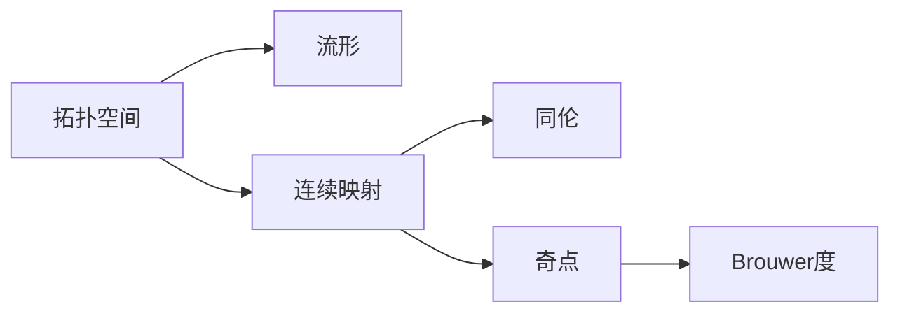
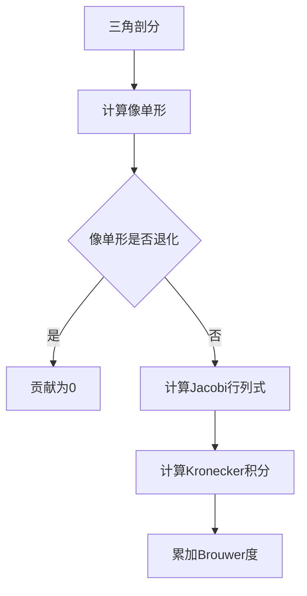

# 流形拓扑学：映射的Brouwer拓扑度

关键词：流形、拓扑度、Brouwer度、同伦、奇点

## 1. 背景介绍
### 1.1 问题的由来
拓扑学是数学的一个分支,研究空间在连续变换下保持不变的性质。在拓扑学中,流形是一类特殊的拓扑空间,局部具有欧氏空间的性质。流形之间的连续映射在拓扑学和微分几何中有着重要的应用。

荷兰数学家Brouwer在20世纪初提出了映射的拓扑度的概念,用来刻画连续映射在奇点处的局部行为。Brouwer度是一个整数,反映了映射在奇点附近缠绕的次数。

### 1.2 研究现状
Brouwer度在微分拓扑、非线性分析、偏微分方程等领域有广泛应用。许多存在性定理,如Brouwer不动点定理、Borsuk-Ulam定理的证明都用到了拓扑度理论。近年来,拓扑度在计算机辅助证明、图像处理、机器人运动规划等应用领域也受到关注。

目前对拓扑度的研究主要集中在以下几个方面:
1. 拓扑度的计算方法,如Kronecker积分、Gauss映射等。
2. 拓扑度的性质和应用,如同伦不变性、解的存在性等。
3. 拓扑度概念的推广,如Leray-Schauder度、Conley指标等。
4. 拓扑度在计算机辅助证明中的应用。

### 1.3 研究意义
拓扑度是研究流形映射的重要工具,对于解决许多几何、分析问题具有重要意义:

1. 在微分方程理论中,拓扑度可用于证明解的存在性、唯一性和稳定性。
2. 在计算机辅助证明领域,利用拓扑度可以验证数值解的正确性,为定理机器证明提供理论基础。  
3. 在图像处理、计算机视觉中,拓扑度可用于提取图像拓扑特征,进行目标检测和识别。
4. 在机器人运动规划中,拓扑度可用于分析机器人避障路径的拓扑等价性。

因此,深入研究流形映射的拓扑度具有重要的理论价值和应用前景。

### 1.4 本文结构
本文将从以下几个方面介绍流形映射的Brouwer拓扑度:

1. 介绍流形、连续映射等核心概念。 
2. 给出Brouwer度的定义,阐述其几何意义。
3. 详细讲解Brouwer度的数学模型和计算公式。
4. 通过具体代码实例演示如何编程计算拓扑度。
5. 总结拓扑度的主要性质及其应用。
6. 介绍拓扑度的推广和研究进展。
7. 讨论拓扑度研究面临的挑战和未来发展方向。

## 2. 核心概念与联系
要理解Brouwer拓扑度,首先需要了解一些核心概念:

- 拓扑空间:满足一定公理的点集,是研究连续概念的数学模型。
- 流形:局部同胚于欧氏空间的拓扑空间,如球面、环面等。
- 连续映射:两个拓扑空间之间映射,保持开集和闭集的性质。
- 同伦:两个连续映射之间可以连续变形的关系。
- 奇点:映射的临界点,雅可比行列式为零。

这些概念之间的联系可以用下面的Mermaid图表示:

## 3. 核心算法原理 & 具体操作步骤
### 3.1 算法原理概述
Brouwer度反映了连续映射在奇点处的缠绕情况。直观上,可以将映射在奇点附近的像看作一个小圆环,Brouwer度就是这个圆环绕奇点的缠绕数。

Brouwer度具有整数值,满足如下性质:
1. 非奇点处的Brouwer度为0。
2. 恒等映射的Brouwer度处处为1。
3. 若两个映射同伦,则它们的Brouwer度相等。
4. 若区域可分解为有限个不交的子区域,则总的Brouwer度等于各子区域Brouwer度的代数和。

利用这些性质,可以将Brouwer度的计算归结为一些特殊映射(如恒等映射)的Brouwer度,从而得到一般映射的Brouwer度。

### 3.2 算法步骤详解
计算Brouwer度的一般步骤如下:

1. 对区域进行三角剖分,得到有限个单形。
2. 对每个单形,计算其顶点在映射下的像,得到像单形。  
3. 判断像单形是否退化,即像单形维数是否低于原单形。若退化,则该单形对总度的贡献为0。
4. 对非退化单形,计算其Jacobi行列式在各顶点的值,判断正负号。
5. 根据Jacobi行列式的符号变化情况,利用Kronecker积分公式,计算该单形的Brouwer度。
6. 将各单形的Brouwer度相加,得到总的Brouwer度。

以上步骤可以用如下Mermaid流程图表示:

### 3.3 算法优缺点
Brouwer度计算算法的主要优点是:
1. 几何直观,便于理解映射的拓扑性质。
2. 计算步骤清晰,适合计算机编程实现。
3. 与其他拓扑不变量(如基本群)有密切联系。

算法的缺点包括:  
1. 计算量大,三角剖分的单形数量会随维数指数增长。
2. 对退化映射,如折叠映射,Brouwer度会出现不连续现象。
3. 只适用于光滑流形,对一般的拓扑空间无法定义。

### 3.4 算法应用领域
Brouwer度在以下领域有重要应用:

1. 偏微分方程:判断解的存在性和多重性。
2. 优化理论:判断临界点的性质,构造下降流。
3. 动力系统:判断不动点、周期轨和混沌吸引子。 
4. 计算机视觉:提取图像拓扑特征,进行目标检测。
5. 机器人学:分析机器人避障路径的拓扑等价性。

## 4. 数学模型和公式 & 详细讲解 & 举例说明
### 4.1 数学模型构建
设 $M^n,N^n$ 是两个 $n$ 维定向流形,$f:M\to N$ 是连续映射。对任意 $y\in N$ 的原像 $f^{-1}(y)$,定义映射 $f$ 在 $y$ 点的Brouwer度为:

$$
\deg(f,y) = \sum_{x\in f^{-1}(y)} \mathrm{sgn} J_f(x)
$$

其中 $J_f$ 是 $f$ 的Jacobi行列式。这个定义直观上反映了原像点处Jacobi行列式的符号变化情况。

进一步,对任意开子集 $D\subset N$,映射 $f$ 在 $D$ 上的Brouwer度定义为:

$$
\deg(f,D) = \sum_{y\in D} \deg(f,y)
$$

可以证明,在一定条件下,Brouwer度是良定义的,且满足如下性质:

1. 非奇点处的Brouwer度为0。即若 $y$ 是 $f$ 的非奇点,则 $\deg(f,y)=0$。

2. 恒等映射 $\mathrm{id}$ 的Brouwer度处处为1。即对任意 $y\in N$,有 $\deg(\mathrm{id},y)=1$。

3. 同伦不变性。即若 $f\simeq g$,则对任意 $y\in N$,有 $\deg(f,y)=\deg(g,y)$。 

4. 可加性。若 $D=\bigcup_{i=1}^n D_i$,其中 $D_i$ 互不相交,则
$$
\deg(f,D) = \sum_{i=1}^n \deg(f,D_i)
$$

利用这些性质,可以将一般映射的Brouwer度归结为一些特殊映射(如恒等映射)的Brouwer度。

### 4.2 公式推导过程
为了计算Brouwer度,需要将连续映射离散化。一种常用的方法是对流形进行单纯复形剖分,将连续映射近似为复形之间的映射。

设 $f:M\to N$ 是连续映射,$K,L$ 分别是 $M,N$ 的单纯复形剖分,且 $f(K)\subset L$。记 $K_n,L_n$ 分别为 $K,L$ 的 $n$ 维单形全体,定义复形映射 $f_n:K_n\to L_n$,满足

$$
f(\sigma^n)=f_n(\sigma^n),\quad \forall \sigma^n\in K_n
$$

其中 $\sigma^n$ 表示 $n$ 维单形。

对任意 $\tau^n\in L_n$,定义其原像单形集合为

$$
f_n^{-1}(\tau^n)=\{\sigma^n\in K_n:f_n(\sigma^n)=\tau^n\}
$$

则 $f$ 在 $\tau^n$ 上的Brouwer度可近似为

$$
\deg(f,\tau^n)\approx \sum_{\sigma^n\in f_n^{-1}(\tau^n)} \mathrm{sgn}J_{f_n}(\sigma^n)
$$

其中 $J_{f_n}$ 是 $f_n$ 在 $\sigma^n$ 上的Jacobi矩阵。

当剖分 $K,L$ 的网格尺寸趋于0时,上述近似等式趋于精确。这个离散化的计算公式即为Kronecker积分公式:

$$
\deg(f,D)=\lim_{\|K\|\to 0}\sum_{\sigma^n\subset f^{-1}(D)} \mathrm{sgn}J_{f_n}(\sigma^n)
$$

其中 $\|K\|$ 表示剖分 $K$ 的最大单形直径。

### 4.3 案例分析与讲解
下面通过一个简单例子说明Brouwer度的计算方法。

设 $f:S^1\to S^1$ 是单位圆周到自身的连续映射,在复平面中表示为

$$
f(z)=z^n,\quad |z|=1
$$

其中 $n$ 是整数。直观上,这个映射将圆周缠绕了 $n$ 圈。

取 $S^1$ 的剖分 $K$ 为正 $m$ 边形的边集,记为 $\{e_1,\cdots,e_m\}$。则 $f$ 在 $e_i$ 上的像为

$$
f(e_i)=\{z^n:|z|\in e_i\}
$$

可以验证,对任意 $1\leq i\leq m$,都有

$$
\mathrm{sgn}J_f(e_i)=\mathrm{sgn}(n)
$$

因此,对任意 $y\in S^1$,Kronecker积分公式给出

$$
\deg(f,y)=\sum_{e_i\ni f^{-1}(y)} \mathrm{sgn}(n) = n
$$

这说明映射 $f(z)=z^n$ 的Brouwer度恰好等于 $n$,与直观理解一致。

### 4.4 常见问题解答
Q: Brouwer度一定是整数吗?  
A: 是的,根据定义,Brouwer度等于Jacobi行列式符号的代数和,因此必为整数。

Q: Brouwer度与映射的连续性有何关系?  
A: Brouwer度的定义需要映射是连续的。对不连续映射,Brouwer度可能无法良定义。

Q: 不同维数的流形之间的映射是否有Brouwer度?  
A: 一般来说没有。Brouwer度要求定义域和值域流形具有相同的维数。

Q: Brouwer度与基本群有何