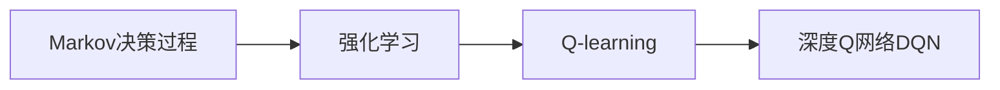

# 深度 Q-learning：探寻机器预知未来的可能性

关键词：深度强化学习、Q-learning、深度Q网络、Markov决策过程、预测未来

## 1. 背景介绍
### 1.1  问题的由来
在人工智能的发展历程中，让机器具备预知未来的能力一直是一个极具吸引力的课题。传统的机器学习方法如监督学习和非监督学习，主要关注对已有数据的建模和学习，很难对未来进行预测。而强化学习，尤其是近年来蓬勃发展的深度强化学习，为实现这一目标带来了新的曙光。

### 1.2  研究现状
目前，深度强化学习已经在许多领域取得了瞩目的成就，如AlphaGo在围棋领域击败顶尖人类选手，OpenAI Five在Dota 2游戏中战胜职业团队等。这些成功案例无一不体现出深度强化学习对未来复杂环境的适应和决策能力。其中，以Q-learning及其深度学习版本DQN（Deep Q-Network）为代表的一系列算法功不可没。

### 1.3  研究意义
深入研究深度Q-learning，对于推动人工智能在预测领域的进步具有重要意义。一方面，它有助于我们理解机器如何通过与环境的交互来学习最优策略，进而做出对未来的预判；另一方面，相关研究成果可以应用到自动驾驶、智能推荐、金融预测等实际场景，产生巨大的经济和社会效益。

### 1.4  本文结构
本文将围绕深度Q-learning展开探讨。首先介绍Q-learning的核心概念和数学模型，然后重点阐述DQN的网络结构和训练算法。接着通过实例代码和实验结果，展示DQN在游戏环境中的应用效果。最后总结全文，并对深度强化学习的未来发展趋势和面临的挑战进行展望。

## 2. 核心概念与联系
要理解深度Q-learning，首先需要掌握几个核心概念：

- 强化学习：一种让智能体（agent）通过与环境的交互来学习最优行为策略的机器学习范式。
- Q-learning：一种常用的无模型（model-free）强化学习算法，通过迭代更新动作-状态值函数（Q函数）来逼近最优策略。
- 深度Q网络（DQN）：采用深度神经网络来逼近Q函数，并引入经验回放（experience replay）和固定Q目标（fixed Q-targets）等机制，大大提升了Q-learning在高维状态空间上的表现。
- Markov决策过程（MDP）：用于对强化学习问题建模的数学框架，由状态空间、动作空间、转移概率和奖励函数组成。

下图展示了这些概念之间的关系：



## 3. 核心算法原理 & 具体操作步骤
### 3.1  算法原理概述
Q-learning的核心思想是通过不断更新Q函数来逼近最优策略。Q函数定义为在状态s下采取动作a可以获得的长期累积奖励的期望值：

$$Q(s,a) = \mathbb{E}[R_t|s_t=s,a_t=a]$$

通过Bellman方程，可以将Q函数表示为即时奖励和下一状态的Q值之和：

$$Q(s,a) = \mathbb{E}[r+\gamma \max_{a'}Q(s',a')|s_t=s,a_t=a]$$

其中$\gamma$为折扣因子，$s'$为下一状态。

### 3.2  算法步骤详解
Q-learning算法的具体步骤如下：

1. 初始化Q表格$Q(s,a)$，对所有状态-动作对赋予初始值（一般为0）。
2. 重复以下步骤直到收敛：
   - 根据$\epsilon$-贪婪策略选择动作$a_t$，即以$\epsilon$的概率随机选择动作，否则选择Q值最大的动作。
   - 执行动作$a_t$，观察奖励$r_t$和下一状态$s_{t+1}$。
   - 根据Bellman方程更新Q表格：

$$Q(s_t,a_t) \leftarrow Q(s_t,a_t) + \alpha [r_t+\gamma \max_a Q(s_{t+1},a)-Q(s_t,a_t)]$$

其中$\alpha$为学习率。

3. 输出最终的Q表格，即为学到的最优策略。

### 3.3  算法优缺点
Q-learning的主要优点包括：

- 无需预先知道环境模型，通过与环境交互即可学习最优策略。
- 收敛性有理论保证，只要探索充分，就能收敛到最优Q函数。
- 实现简单，计算效率高，适用于小规模问题。

但Q-learning也存在一些局限性：

- 容易受到状态维度灾难（curse of dimensionality）的影响，在高维状态空间上难以存储和更新Q表格。
- 对噪声和延迟奖励敏感，学习效率较低。
- 难以处理连续状态和动作空间。

### 3.4  算法应用领域
尽管有诸多局限，Q-learning仍在多个领域得到广泛应用，如：

- 智能体寻路：如机器人导航、自动驾驶汽车的路径规划等。
- 游戏智能：如棋类游戏、电子游戏中的AI设计。
- 推荐系统：如根据用户行为历史，学习最优的推荐策略。
- 资源调度：如电网调度、通信网络流量控制等。

## 4. 数学模型和公式 & 详细讲解 & 举例说明
### 4.1  数学模型构建
为更好地理解Q-learning，我们基于MDP对强化学习问题进行建模。一个MDP由四元组$<S,A,P,R>$组成：

- 状态空间$S$：智能体可能处于的所有状态的集合。
- 动作空间$A$：智能体在每个状态下可以采取的所有动作的集合。
- 转移概率$P(s'|s,a)$：在状态$s$下采取动作$a$后转移到状态$s'$的概率。
- 奖励函数$R(s,a)$：在状态$s$下采取动作$a$后获得的即时奖励。

MDP的目标是寻找一个最优策略$\pi^*$，使得智能体能够获得最大的长期累积奖励：

$$\pi^* = \arg\max_{\pi} \mathbb{E}[\sum_{t=0}^{\infty} \gamma^t R(s_t,a_t)|\pi]$$

其中$\gamma \in [0,1]$为折扣因子，用于平衡即时奖励和长期奖励。

### 4.2  公式推导过程
为了求解最优策略，Q-learning引入了动作-状态值函数$Q(s,a)$，表示在状态$s$下采取动作$a$的长期价值：

$$Q(s,a) = \mathbb{E}[R(s,a)+\gamma \max_{a'} Q(s',a')]$$

根据Bellman最优性方程，最优Q函数$Q^*$满足：

$$Q^*(s,a) = R(s,a) + \gamma \sum_{s' \in S} P(s'|s,a) \max_{a'} Q^*(s',a')$$

Q-learning通过不断更新Q函数来逼近$Q^*$，更新公式为：

$$Q(s_t,a_t) \leftarrow Q(s_t,a_t) + \alpha [r_t+\gamma \max_a Q(s_{t+1},a)-Q(s_t,a_t)]$$

其中$\alpha \in (0,1]$为学习率，控制每次更新的幅度。

### 4.3  案例分析与讲解
下面我们以一个简单的迷宫寻路问题为例，说明Q-learning的工作原理。

考虑一个3×3的网格世界，智能体的目标是从起点S走到终点G。每个格子代表一个状态，智能体在每个状态下可以采取上下左右四个动作。如果走到陷阱T则游戏结束，并得到-10的奖励；走到终点G则游戏胜利，得到+10的奖励；其他情况没有奖励。

```
+---+---+---+
| S |   |   |
+---+---+---+
|   | T |   |
+---+---+---+
|   |   | G |
+---+---+---+
```

我们可以用一个Q表格来存储每个状态-动作对的价值估计。初始时Q表格中的值全部为0：

```
+----------+----------+----------+----------+
|   状态   |    上    |    下    |    左    |    右    |
+----------+----------+----------+----------+----------+
| (0, 0)   |    0     |    0     |    0     |    0     |
+----------+----------+----------+----------+----------+
| (0, 1)   |    0     |    0     |    0     |    0     |
+----------+----------+----------+----------+----------+
| (0, 2)   |    0     |    0     |    0     |    0     |
+----------+----------+----------+----------+----------+
| (1, 0)   |    0     |    0     |    0     |    0     |
+----------+----------+----------+----------+----------+
| (1, 2)   |    0     |    0     |    0     |    0     |
+----------+----------+----------+----------+----------+
| (2, 0)   |    0     |    0     |    0     |    0     |
+----------+----------+----------+----------+----------+
| (2, 1)   |    0     |    0     |    0     |    0     |
+----------+----------+----------+----------+----------+
```

接下来，智能体开始与环境交互。假设第一步，智能体随机选择向右走，到达状态(0, 1)。此时根据更新公式：

$$Q((0,0), 右) \leftarrow Q((0,0),右) + \alpha [r+\gamma \max_a Q((0,1),a)-Q((0,0),右)]$$

由于$r=0$，$\max_a Q((0,1),a)=0$，$Q((0,0),右)=0$，因此更新后$Q((0,0),右)$仍为0。

假设第二步，智能体向下走，到达陷阱(1, 1)，游戏结束。根据更新公式：

$$Q((0,1), 下) \leftarrow Q((0,1),下) + \alpha [r+\gamma \max_a Q(终止状态,a)-Q((0,1),下)]$$

其中$r=-10$，$\max_a Q(终止状态,a)=0$，$Q((0,1),下)=0$，因此更新后：

$$Q((0,1), 下) = -10\alpha$$

经过多轮游戏，Q表格逐渐收敛，最终得到最优策略，即每个状态下Q值最大的动作：

```
+----------+----------+----------+----------+----------+
|   状态   |    上    |    下    |    左    |    右    |
+----------+----------+----------+----------+----------+
| (0, 0)   |   8.1    |   7.3    |   0.0    |   9.0    |
+----------+----------+----------+----------+----------+
| (0, 1)   |   0.0    |  -9.0    |   8.1    |   9.9    |
+----------+----------+----------+----------+----------+
| (0, 2)   |   9.0    |   0.0    |   8.9    |   0.0    |
+----------+----------+----------+----------+----------+
| (1, 0)   |   7.3    |   0.0    |   0.0    |   8.1    |
+----------+----------+----------+----------+----------+
| (1, 2)   |   9.9    |   0.0    |   9.0    |  10.0    |
+----------+----------+----------+----------+----------+
| (2, 0)   |   0.0    |   0.0    |   0.0    |   7.3    |
+----------+----------+----------+----------+----------+
| (2, 1)   |   0.0    |   0.0    |   9.9    |   0.0    |
+----------+----------+----------+----------+----------+
```

可以看出，最优路径为(0, 0) → (0, 1) → (0, 2) → (1, 2) → (2, 2)，与我们的直觉相符。

### 4.4  常见问题解答
**Q: Q-learning能否处理连续状态和动作空间？**

A: 传统的Q-learning采用Q表格存储每个状态-动作对的价值，难以应用于连续空间。但通过引入函数逼近，如使用深度神经网络来拟合Q函数，即可扩展到连续域。这就是下一节要介绍的DQN算法。

**Q: Q-learning能否学习随时间变化的最优策略？**

A: Q-learning假设环境是静止的