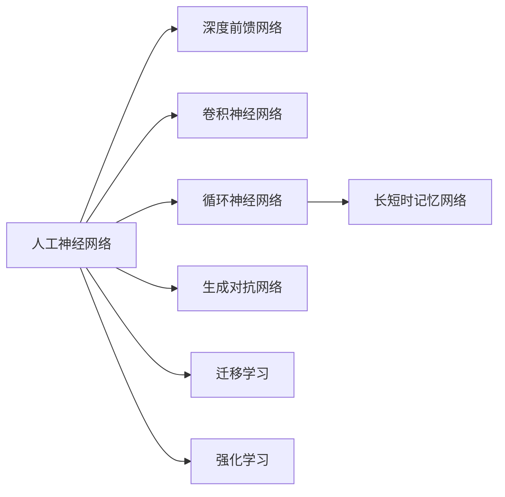

# 深度学习 原理与代码实例讲解

## 1. 背景介绍
### 1.1 问题的由来
人工智能的发展历史可以追溯到20世纪50年代，但直到2012年深度学习的突破性进展，才真正掀起了人工智能的新浪潮。深度学习作为机器学习的一个分支，通过模拟人脑的神经网络结构，利用多层次的特征提取和表示，实现了对复杂模式的识别和学习。深度学习在计算机视觉、语音识别、自然语言处理等领域取得了巨大成功，甚至在某些任务上已经达到或超越了人类的水平。

### 1.2 研究现状
目前，深度学习已经成为人工智能领域的研究热点和主流技术。各大科技公司和研究机构都在积极投入深度学习的研究和应用，不断推动着该领域的发展。从学术界到工业界，从理论研究到实际应用，深度学习正在改变着人们的生活和工作方式。

一方面，深度学习的理论研究不断深入，新的网络结构、训练方法、优化算法层出不穷。例如，卷积神经网络(CNN)、循环神经网络(RNN)、生成对抗网络(GAN)等模型的提出和改进，极大地提升了深度学习的性能和适用范围。

另一方面，深度学习在各个领域的应用也取得了显著进展。在计算机视觉方面，深度学习实现了图像分类、目标检测、语义分割等任务的突破；在语音识别方面，深度学习使得语音转文本的准确率大幅提升；在自然语言处理方面，基于深度学习的机器翻译、情感分析、问答系统等应用日趋成熟。

### 1.3 研究意义
深度学习的研究具有重要的理论意义和实践价值：

1. 揭示人工智能的内在机理。深度学习模型通过多层次的特征学习，一定程度上模拟了人脑认知的过程，有助于探索人工智能的实现原理和智能行为的形成机制。

2. 推动人工智能的跨越式发展。深度学习突破了传统机器学习的瓶颈，实现了对海量复杂数据的高效处理和学习，大大提升了人工智能系统的性能和适用性，推动人工智能进入新的发展阶段。

3. 促进人工智能与行业应用的深度融合。深度学习为人工智能赋能，使得人工智能技术在更广泛的领域得到应用，如智慧医疗、自动驾驶、智能金融等，极大地提升了行业效率和服务质量，创造了巨大的经济和社会价值。

### 1.4 本文结构
本文将全面介绍深度学习的原理和代码实践。内容安排如下：

第2部分介绍深度学习的核心概念及其内在联系；第3部分重点阐述深度学习的核心算法原理和操作步骤；第4部分从数学角度对深度学习的模型和公式进行详细讲解；第5部分通过代码实例演示深度学习的具体实现；第6部分探讨深度学习的实际应用场景；第7部分推荐深度学习的相关工具和学习资源；第8部分总结全文，展望深度学习的未来发展趋势和挑战；第9部分为附录，解答深度学习的常见问题。

## 2. 核心概念与联系
深度学习的核心概念包括：

1. 人工神经网络(Artificial Neural Network)：模仿生物神经网络结构，由大量的节点(神经元)和连接(权重)组成，通过前向传播和反向传播实现信息的处理和学习。

2. 深度前馈网络(Deep Feedforward Network)：也称为多层感知机(MLP)，是最基础的深度学习模型，由输入层、隐藏层和输出层组成，层与层之间全连接。

3. 卷积神经网络(Convolutional Neural Network, CNN)：一种专门用于处理网格拓扑结构数据(如图像)的神经网络，通过局部连接和权重共享，能够有效地提取空间特征。

4. 循环神经网络(Recurrent Neural Network, RNN)：一种适用于处理序列数据的神经网络，通过引入循环连接，能够捕捉数据的时序依赖关系。

5. 长短时记忆网络(Long Short-Term Memory, LSTM)：RNN的一种改进结构，通过引入门控机制，能够缓解RNN的梯度消失问题，更好地建模长距离依赖。

6. 生成对抗网络(Generative Adversarial Network, GAN)：由生成器和判别器组成，通过二者的博弈学习，能够生成与真实数据分布接近的样本数据。

7. 迁移学习(Transfer Learning)：将一个领域学习到的知识迁移到另一个相关领域，实现知识的复用和泛化，减少训练数据和时间。

8. 强化学习(Reinforcement Learning)：通过智能体与环境的交互，根据环境反馈的奖励信号，不断优化智能体的决策策略。

这些概念之间存在着紧密的联系：

- 人工神经网络是深度学习的基础，其他模型如CNN、RNN、LSTM、GAN等都是在此基础上的改进和扩展。 

- CNN主要用于处理图像等网格数据，RNN和LSTM主要用于处理文本等序列数据，二者可以结合构建更加强大的模型。

- GAN通过生成器和判别器的对抗，可以用于生成逼真的图像、视频、文本等，在数据增强、风格迁移等任务中有广泛应用。

- 迁移学习和强化学习是深度学习的两个重要分支，前者注重知识的迁移和复用，后者注重智能体的决策优化，二者可以与深度模型结合，扩展深度学习的应用范围。

下面是这些核心概念之间关系的 Mermaid 流程图：

## 3. 核心算法原理 & 具体操作步骤
### 3.1 算法原理概述
深度学习的核心算法是反向传播(Backpropagation)算法，其基本原理如下：

1. 前向传播：将输入数据通过神经网络的各层进行计算，得到输出结果。

2. 损失计算：将输出结果与真实标签进行比较，计算损失函数值，衡量模型的预测误差。

3. 反向传播：根据损失函数，利用链式法则，计算每个参数的梯度，将误差信号从输出层反向传播到输入层。

4. 参数更新：根据梯度下降算法，沿着负梯度方向更新网络的权重和偏置，使得损失函数值不断减小。

5. 迭代优化：重复以上步骤，直到损失函数收敛或达到预设的迭代次数，得到训练好的模型。

### 3.2 算法步骤详解
以一个简单的三层全连接神经网络为例，详细说明反向传播算法的步骤。

1. 定义网络结构：输入层、隐藏层、输出层的节点数，激活函数等。

2. 初始化参数：随机初始化各层的权重矩阵 $W$ 和偏置向量 $b$。

3. 前向传播：
   - 输入层到隐藏层：$a^{[1]} = W^{[1]} \cdot x + b^{[1]}$，$z^{[1]} = \sigma(a^{[1]})$
   - 隐藏层到输出层：$a^{[2]} = W^{[2]} \cdot z^{[1]} + b^{[2]}$，$\hat{y} = \sigma(a^{[2]})$

4. 计算损失函数：$L = \frac{1}{2} \lVert \hat{y} - y \rVert^2$

5. 反向传播：
   - 输出层误差：$\delta^{[2]} = (\hat{y} - y) \odot \sigma'(a^{[2]})$  
   - 隐藏层误差：$\delta^{[1]} = (W^{[2]})^T \cdot \delta^{[2]} \odot \sigma'(a^{[1]})$
   - 输出层梯度：$\frac{\partial L}{\partial W^{[2]}} = \delta^{[2]} \cdot (z^{[1]})^T$，$\frac{\partial L}{\partial b^{[2]}} = \delta^{[2]}$
   - 隐藏层梯度：$\frac{\partial L}{\partial W^{[1]}} = \delta^{[1]} \cdot x^T$，$\frac{\partial L}{\partial b^{[1]}} = \delta^{[1]}$

6. 参数更新：
   - $W^{[2]} := W^{[2]} - \alpha \frac{\partial L}{\partial W^{[2]}}$，$b^{[2]} := b^{[2]} - \alpha \frac{\partial L}{\partial b^{[2]}}$
   - $W^{[1]} := W^{[1]} - \alpha \frac{\partial L}{\partial W^{[1]}}$，$b^{[1]} := b^{[1]} - \alpha \frac{\partial L}{\partial b^{[1]}}$

7. 迭代优化：重复步骤3-6，直到满足停止条件。

其中，$\sigma$ 表示激活函数，$\odot$ 表示Hadamard乘积，$\alpha$ 表示学习率。

### 3.3 算法优缺点
反向传播算法的优点：
- 可以有效地训练多层神经网络，实现复杂模式的学习。
- 通过梯度下降优化，能够找到局部最优解，使模型性能不断提升。
- 计算高效，可以利用矩阵运算和 GPU 加速，处理大规模数据和模型。

反向传播算法的缺点：
- 容易陷入局部最优，难以找到全局最优解。
- 对参数初始化和超参数选择敏感，需要进行调参优化。
- 训练时间长，计算和存储开销大，对硬件要求高。

### 3.4 算法应用领域
反向传播算法是深度学习的核心，广泛应用于以下领域：

- 计算机视觉：图像分类、目标检测、语义分割、人脸识别等。
- 语音识别：语音转文本、说话人识别、情感识别等。
- 自然语言处理：机器翻译、情感分析、命名实体识别、文本分类等。
- 推荐系统：个性化推荐、协同过滤等。
- 生物信息学：基因表达分析、药物发现等。
- 金融科技：风险评估、反欺诈、股票预测等。

## 4. 数学模型和公式 & 详细讲解 & 举例说明
### 4.1 数学模型构建
深度学习的数学模型可以用一个多层复合函数来表示：

$$f(x) = f^{[L]}(f^{[L-1]}(\cdots f^{[2]}(f^{[1]}(x))\cdots))$$

其中，$L$ 表示网络的层数，$f^{[l]}$ 表示第 $l$ 层的函数映射，通常由线性变换和非线性激活函数组成：

$$f^{[l]}(x) = \sigma(W^{[l]} \cdot x + b^{[l]})$$

$W^{[l]}$ 和 $b^{[l]}$ 分别表示第 $l$ 层的权重矩阵和偏置向量，$\sigma$ 表示激活函数，常见的有 Sigmoid、Tanh、ReLU 等。

网络的训练目标是找到最优的参数 $W$ 和 $b$，使得在训练集上的损失函数最小化：

$$\min_{W,b} \frac{1}{m} \sum_{i=1}^m L(f(x^{(i)}), y^{(i)})$$

其中，$m$ 表示训练样本数，$x^{(i)}$ 和 $y^{(i)}$ 表示第 $i$ 个样本的特征和标签，$L$ 表示损失函数，常见的有均方误差、交叉熵等。

### 4.2 公式推导过程
以均方误差损失函数为例，推导反向传播算法中的梯度计算公式。

假设样本 $(x,y)$，网络输出 $\hat{y} = f(x)$，损失函数为：

$$L = \frac{1}{2}