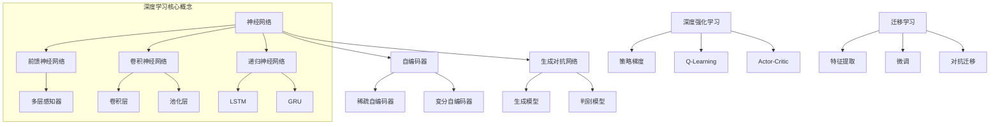

好的，我会按照您的要求，以《深度学习原理与代码实例讲解》为主题，撰写一篇逻辑严谨、内容全面、实例丰富的技术博客文章。文中将详细介绍深度学习的背景、核心概念、算法原理、数学模型、项目实践、应用场景、工具资源等方面的内容。我会努力使用专业但通俗易懂的语言，配合代码示例、公式推导和流程图等，让读者能够较为深入地理解深度学习的本质。

# 深度学习原理与代码实例讲解

## 1. 背景介绍

### 1.1 问题的由来

在过去的几十年里，人工智能领域取得了长足的进步。从最初的专家系统、决策树算法,到后来兴起的支持向量机、贝叶斯方法等传统机器学习算法,已经能够较好地解决一些简单的人工智能问题。但是,这些传统方法在处理诸如计算机视觉、自然语言处理、语音识别等复杂的人工智能任务时,往往会遇到瓶颈。

传统机器学习算法需要人工设计特征,而对于复杂的高维数据(如图像、语音、视频等),很难确定哪些特征对任务是最重要的。同时,这些算法对数据的表征能力有限,难以对抽象的高层次模式进行建模。因此,我们需要一种能够自动从原始数据中学习数据特征表示的方法,这就是深度学习(Deep Learning)的目的和出发点。

### 1.2 研究现状 

深度学习是机器学习研究中的一个新的热点领域,其在计算机视觉、自然语言处理、语音识别、推荐系统等领域展现出了令人惊叹的性能。作为一种有监督或无监督的特征学习技术,深度学习可以通过组合低层次特征形成更加抽象的高层次模式表示,并用于分析物体、文本、语音等。

近年来,由于算力的飞速提升、训练数据的日益丰富,以及一些新的突破性算法模型的提出,使得深度学习能够在更多领域展现强大的能力。随着技术的不断发展,深度学习也在持续推动人工智能的进步,为解决更多复杂的人工智能问题注入了新的活力。

### 1.3 研究意义

深度学习作为一种端到端的机器学习范式,具有以下重要意义:

1. 自动从数据中学习特征表示,无需人工设计特征,大大降低了特征工程的工作量。
2. 能够学习多层次的抽象特征表示,对复杂的高维模式有更强的建模能力。
3. 在计算机视觉、自然语言处理、语音识别等领域展现出卓越的性能,推动了人工智能的发展。
4. 为解决更多复杂的人工智能问题提供了新的思路和方法。

因此,深入理解深度学习的原理、算法和实践应用,对于提高人工智能系统的性能,拓展人工智能的应用领域都具有重要的意义。

### 1.4 本文结构

本文将全面介绍深度学习的相关知识,内容安排如下:

- 第2部分阐述深度学习的核心概念,如神经网络、前馈神经网络、卷积神经网络等。
- 第3部分详细讲解深度学习的核心算法原理和具体操作步骤。
- 第4部分推导深度学习中的数学模型和公式,并结合案例进行讲解。
- 第5部分提供深度学习的项目实践,包括代码实例、开发环境搭建、代码解析等。
- 第6部分介绍深度学习在计算机视觉、自然语言处理等领域的实际应用场景。
- 第7部分推荐一些深度学习的学习资源、开发工具和相关论文。
- 第8部分总结深度学习的研究成果、发展趋势和面临的挑战。
- 第9部分列出深度学习常见问题并给出解答。

接下来,我们正式开始深度学习的理论与实践之旅。

## 2. 核心概念与联系

深度学习的核心概念是基于人工神经网络的一系列模型和算法。神经网络是一种广义的计算模型,包括前馈神经网络、卷积神经网络、递归神经网络等多种具体形式。

1. **前馈神经网络**(Feedforward Neural Network)是最基本和传统的神经网络形式,由输入层、隐藏层和输出层组成。其中,多层感知器(Multilayer Perceptron)就是一种典型的前馈神经网络。

2. **卷积神经网络**(Convolutional Neural Network, CNN)在网络结构中引入了卷积层和池化层,能够有效地捕捉输入数据(如图像)的局部特征,在计算机视觉等领域表现出色。

3. **递归神经网络**(Recurrent Neural Network, RNN)通过将序列当前的输出与前一时刻的隐藏状态相结合,适合处理序列数据(如文本、语音),其中Long Short-Term Memory(LSTM)和门控循环单元(Gated Recurrent Unit, GRU)是较为常用的RNN变种。

除了有监督的神经网络外,深度学习还包括一些无监督学习模型,如**自编码器**(Autoencoder)及其变种稀疏自编码器、变分自编码器等,用于无监督特征学习和数据压缩。

**生成对抗网络**(Generative Adversarial Network, GAN)则由生成模型和判别模型组成,可用于生成式建模,在图像生成、语音合成等领域有重要应用。

**深度强化学习**将深度神经网络应用到强化学习领域,包括策略梯度(Policy Gradient)、Q-Learning、Actor-Critic等算法,可用于解决连续控制、游戏AI等问题。

**迁移学习**则是将在某个领域学习到的知识迁移到另一个领域的技术,包括特征提取、微调(Fine-tuning)、对抗迁移等方法,能够在训练数据较少时,提高模型在新领域的性能表现。

上述这些都是深度学习中的核心概念,它们相互关联、有机结合,共同构建了深度学习的理论体系和应用框架。接下来,我们将深入探讨其中的算法原理、数学模型和项目实践。

## 3. 核心算法原理 & 具体操作步骤

### 3.1 算法原理概述

深度学习算法的核心思想是通过构建神经网络模型,并使用大量数据对模型进行训练,从而学习数据的内在特征表示,并用于执行各种任务,如分类、回归、聚类等。

神经网络模型的基本运作原理如下:

1. **前向传播(Forward Propagation)**: 输入数据通过神经网络的各层网络,在每一层通过加权求和、激活函数等操作进行特征转换,最终在输出层获得模型的预测输出。

2. **反向传播(Backpropagation)**: 将模型预测输出与真实标记值进行对比,计算损失函数(Loss Function),然后沿着神经网络的反方向,依次计算每层的误差梯度,并更新每层的权重和偏置参数,使得损失函数值不断减小。

3. **优化算法(Optimization)**: 通过梯度下降(Gradient Descent)等优化算法,在训练过程中不断迭代地调整网络参数,使得模型在训练数据上的损失函数值不断减小,从而提高模型的准确性。

4. **正则化(Regularization)**: 为了防止过拟合,可以采用L1/L2正则化、Dropout、BN层等正则化技术,提高模型的泛化能力。

不同类型的神经网络在具体的网络结构和计算细节上有所区别,但是总体上都遵循上述基本原理。我们将在下一小节对一些核心算法进行详细介绍。

### 3.2 算法步骤详解

#### 3.2.1 前馈神经网络

前馈神经网络(如多层感知器)是深度学习中最基础和常见的一种网络结构,其算法步骤如下:

1. **网络初始化**: 根据输入数据的维度、隐藏层数量和神经元数量,随机初始化网络的权重矩阵和偏置向量。

2. **前向传播**:
   - 输入层: $\boldsymbol{a}^{(0)} = \boldsymbol{x}$
   - 隐藏层: $\boldsymbol{z}^{(l)} = \boldsymbol{W}^{(l)}\boldsymbol{a}^{(l-1)} + \boldsymbol{b}^{(l)}$
     $\boldsymbol{a}^{(l)} = \sigma(\boldsymbol{z}^{(l)})$
   - 输出层: $\boldsymbol{\hat{y}} = \boldsymbol{a}^{(n_l)} = \sigma(\boldsymbol{z}^{(n_l)})$

   其中,$\boldsymbol{W}^{(l)}$为第$l$层的权重矩阵,$\boldsymbol{b}^{(l)}$为第$l$层的偏置向量,$\sigma$为激活函数(如Sigmoid、ReLU等)。

3. **计算损失函数**:
   $$ J(\boldsymbol{W},\boldsymbol{b};\boldsymbol{x},y) = \frac{1}{m}\sum_{i=1}^{m}L(\boldsymbol{\hat{y}}^{(i)},y^{(i)})$$
   
   其中,$L$为损失函数(如交叉熵损失函数、均方误差损失函数等),$m$为训练样本数量。

4. **反向传播**:
   - 输出层: $\delta^{(n_l)} = \nabla_{\boldsymbol{a}^{(n_l)}}L\odot\sigma'(\boldsymbol{z}^{(n_l)})$
   - 隐藏层: $\delta^{(l)} = (\boldsymbol{W}^{(l+1)})^T\delta^{(l+1)}\odot\sigma'(\boldsymbol{z}^{(l)})$

   计算每层的梯度:
   $\frac{\partial J}{\partial \boldsymbol{W}^{(l)}} = \frac{1}{m}\delta^{(l+1)}(\boldsymbol{a}^{(l)})^T$
   $\frac{\partial J}{\partial \boldsymbol{b}^{(l)}} = \frac{1}{m}\sum_{i=1}^{m}\delta^{(l+1)}$

5. **更新权重和偏置**:
   $\boldsymbol{W}^{(l)} := \boldsymbol{W}^{(l)} - \alpha\frac{\partial J}{\partial \boldsymbol{W}^{(l)}}$
   $\boldsymbol{b}^{(l)} := \boldsymbol{b}^{(l)} - \alpha\frac{\partial J}{\partial \boldsymbol{b}^{(l)}}$

   其中,$\alpha$为学习率。

6. **重复步骤2-5**,不断迭代直至收敛或达到最大训练轮次。

#### 3.2.2 卷积神经网络

卷积神经网络(CNN)常用于计算机视觉领域,能够有效地捕捉图像的局部特征,算法步骤如下:

1. **输入层**:接收原始图像数据。

2. **卷积层**:
   - 使用多个不同的卷积核(权重矩阵)在输入特征图上滑动,进行卷积操作。
   - 对卷积结果加上偏置,并通过激活函数(如ReLU),得到新的特征图。
   - 通过多个卷积核可以提取不同的局部特征。

3. **池化层**:
   - 在特征图上滑动窗口,采用最大池化或均值池化等策略,对