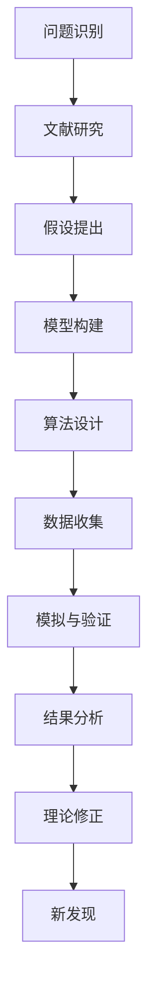

# 理解无法解释事物的渐进过程

## 1. 背景介绍

### 1.1 问题的由来

在科学和技术的发展历程中,我们总会遇到一些无法完全解释的现象或事物。这些"无法解释的事物"可能源于我们对自然规律的认知不足,也可能是由于现有理论和工具的局限性。无论原因是什么,这些难以解释的问题都成为了推动科学进步的重要动力。

随着时间的推移,通过不断的探索和研究,我们对这些原本无法解释的事物逐步加深了理解。这种"理解无法解释事物的渐进过程"是科学发展的一个重要特征,也是人类获取知识的关键途径之一。

### 1.2 研究现状

在各个学科领域,都存在着一些尚未完全解决的难题。例如,在物理学领域,我们仍然无法完全解释黑洞的本质;在生物学领域,人类对于生命的起源和进化机制的理解仍然有待深入;在计算机科学领域,量子计算的实现路径和应用前景仍存在诸多未解之谜。

虽然这些难题目前尚未得到圆满的解决,但科学家们正在通过不懈的努力,逐步揭开它们的神秘面纱。每一次新的发现和突破,都让我们更加接近真相,也为解决这些难题带来了新的契机。

### 1.3 研究意义

理解无法解释的事物对于推动科学发展具有重要意义。首先,它激发了人类对未知领域的好奇心和探索欲望,这是科学进步的根本动力。其次,在解决这些难题的过程中,我们往往需要开拓新的研究方法和理论体系,从而推动了相关学科的发展。此外,解开这些谜团也有助于我们更好地认识和利用自然规律,为人类社会的可持续发展提供重要支撑。

### 1.4 本文结构

本文将围绕"理解无法解释事物的渐进过程"这一主题,从多个角度进行深入探讨。我们将首先介绍相关的核心概念和理论基础,然后分析核心算法原理及其数学模型,并通过实际案例进行详细说明。接下来,我们将探讨该过程在实际应用中的体现,并推荐一些有用的工具和资源。最后,我们将总结研究成果,展望未来发展趋势和面临的挑战。

## 2. 核心概念与联系

在探讨"理解无法解释事物的渐进过程"之前,我们需要先了解一些核心概念和理论基础。这些概念和理论为我们提供了分析和解决问题的框架,也是后续讨论的重要支撑。

### 2.1 科学方法论

科学方法论是指导科学研究活动的一系列原则和步骤。它包括观察、提出假设、设计实验、收集数据、分析数据、验证或否定假设等环节。科学方法论强调通过严谨的逻辑推理和实证过程来获取知识,是理解无法解释事物的基础。

### 2.2 系统思维

系统思维是一种综合性的思维方式,它强调从整体出发,关注事物之间的相互关系和相互影响。在理解复杂的无法解释事物时,我们需要运用系统思维,将问题放在更大的背景中进行考虑,而不是孤立地看待单个现象或事实。

### 2.3 建模与模拟

建模和模拟是科学研究中常用的工具。建模是将现实世界中的事物或现象抽象为数学或计算机模型的过程,而模拟则是在模型的基础上进行实验和预测。对于无法解释的事物,我们可以通过建模和模拟来探索其潜在的规律和机制。

### 2.4 理论发展与范式转换

理论发展和范式转换是科学进步的重要驱动力。当现有理论无法解释新发现的现象时,我们需要提出新的理论假说,并通过实证过程进行验证。如果新理论得到广泛接受,就会发生范式转换,从而推动科学的飞跃发展。

这些核心概念和理论为我们理解无法解释事物提供了重要的思路和方法。它们之间存在着密切的联系,相互支撑和影响,共同构成了我们探索未知领域的理论基础。

## 3. 核心算法原理 & 具体操作步骤

在理解无法解释事物的过程中,我们通常需要借助各种算法和模型来进行分析和预测。这些算法和模型体现了我们对问题的理解,也是推动研究进展的关键工具。

### 3.1 算法原理概述

理解无法解释事物的渐进过程可以概括为以下几个关键步骤:

1. **问题识别**: 首先,我们需要明确无法解释的现象或事物,并将其形式化为一个具体的问题。

2. **文献研究**: 接下来,我们需要全面地查阅相关领域的文献资料,了解当前的研究进展和局限性。

3. **假设提出**: 基于现有知识和理论,我们提出初步的假设,试图解释无法解释的事物。

4. **模型构建**: 为了验证假设,我们需要构建数学或计算机模型,将问题形式化并进行模拟。

5. **算法设计**: 在模型的基础上,我们设计相应的算法,用于数据处理、模拟和预测。

6. **数据收集**: 我们收集相关的实验数据或观测数据,为模型提供输入和验证依据。

7. **模拟与验证**: 运行算法,进行模拟和预测,并将结果与实际数据进行比对,验证模型和假设的准确性。

8. **结果分析**: 分析模拟结果,总结规律和发现,并评估模型的优缺点。

9. **理论修正**: 根据分析结果,我们可能需要修正原有的理论假设,或者提出全新的理论。

10. **新发现**: 在这个过程中,我们可能会产生新的发现和突破,推动对无法解释事物的理解向前迈进一步。

这个过程是循环迭代的,我们需要不断地重复上述步骤,直到对问题有足够深入的理解。

### 3.2 算法步骤详解

接下来,我们将详细解释上述算法的每一个步骤,以加深对整个过程的理解。

#### 3.2.1 问题识别

问题识别是整个过程的起点。我们需要清晰地定义无法解释的现象或事物,并将其形式化为一个具体的问题。这个步骤需要我们具备敏锐的观察力和批判性思维,能够发现现有理论和知识的不足之处。

#### 3.2.2 文献研究

在提出假设之前,我们需要全面地了解相关领域的现有研究成果。通过查阅文献资料,我们可以掌握当前的理论基础、研究方法和发现,从而避免重复工作,并为后续的假设提出和模型构建奠定基础。

#### 3.2.3 假设提出

基于现有知识和理论,我们提出初步的假设,试图解释无法解释的事物。这个步骤需要我们具备创新思维和逻辑推理能力,能够结合已有的证据和观察,提出合理的假设。

#### 3.2.4 模型构建

为了验证假设,我们需要构建数学或计算机模型,将问题形式化并进行模拟。模型的构建需要我们具备抽象思维和建模能力,能够将现实世界中的事物或现象抽象为数学或计算机模型。

#### 3.2.5 算法设计

在模型的基础上,我们设计相应的算法,用于数据处理、模拟和预测。算法设计需要我们具备编程能力和算法思维,能够将模型转化为可执行的计算步骤。

#### 3.2.6 数据收集

我们收集相关的实验数据或观测数据,为模型提供输入和验证依据。数据收集需要我们具备实验设计和数据采集能力,能够获取高质量、可靠的数据。

#### 3.2.7 模拟与验证

运行算法,进行模拟和预测,并将结果与实际数据进行比对,验证模型和假设的准确性。这个步骤需要我们具备数据分析和模型评估能力,能够客观地评估模型的性能和局限性。

#### 3.2.8 结果分析

分析模拟结果,总结规律和发现,并评估模型的优缺点。这个步骤需要我们具备深入的领域知识和分析能力,能够从结果中提炼出有价值的见解和启示。

#### 3.2.9 理论修正

根据分析结果,我们可能需要修正原有的理论假设,或者提出全新的理论。这个步骤需要我们具备开放的思维和创新能力,能够勇于挑战现有的理论体系,并提出新的解释和假说。

#### 3.2.10 新发现

在这个过程中,我们可能会产生新的发现和突破,推动对无法解释事物的理解向前迈进一步。这个步骤需要我们具备持之以恒的探索精神和创新意识,不断追求新的知识和突破。

### 3.3 算法优缺点

上述算法具有以下优点:

1. **系统性**: 该算法提供了一个系统的框架,涵盖了从问题识别到理论修正的全过程,确保了研究的完整性和严谨性。

2. **循环迭代**: 算法采用了循环迭代的方式,允许我们不断地修正假设和模型,直到达到满意的结果。这种方式有利于我们逐步深入地理解无法解释的事物。

3. **多元融合**: 算法融合了多种方法和技术,如文献研究、建模与模拟、数据分析等,提供了多角度的分析视角。

4. **可扩展性**: 该算法具有良好的可扩展性,可以应用于各个学科领域,用于解决不同类型的无法解释的问题。

然而,该算法也存在一些局限性和缺点:

1. **计算复杂度**: 对于一些复杂的问题,构建精确的数学模型和设计高效的算法可能是一个巨大的挑战,需要大量的计算资源和时间。

2. **数据依赖**: 算法的有效性在很大程度上依赖于可用数据的质量和数量。如果缺乏足够的高质量数据,模拟和验证的结果可能会受到影响。

3. **主观性**: 在提出假设、构建模型和分析结果的过程中,研究者的主观判断和偏好可能会对结果产生一定影响。

4. **局限性**: 即使经过多次迭代,我们得到的理论和模型也可能只是对真实情况的近似描述,存在一定的局限性和不确定性。

### 3.4 算法应用领域

上述算法可以应用于各个学科领域,用于理解和解决无法解释的问题。以下是一些典型的应用场景:

1. **物理学**: 理解宇宙起源、黑洞本质、量子力学等无法解释的现象。

2. **生物学**: 探索生命起源、进化机制、基因调控网络等未解之谜。

3. **计算机科学**: 研究量子计算、人工智能、复杂系统等前沿领域的挑战性问题。

4. **社会科学**: 分析社会现象、经济模式、人类行为等复杂的系统性问题。

5. **医学**: 探索疾病机理、药物作用机制、大脑认知过程等未知领域。

6. **环境科学**: 研究气候变化、生态系统演化、资源可持续利用等全球性挑战。

7. **工程技术**: 解决新材料设计、结构优化、智能制造等工程难题。

无论是在基础科学还是应用科学领域,该算法都可以为我们理解和解决无法解释的问题提供有力的支撑和指导。

## 4. 数学模型和公式 & 