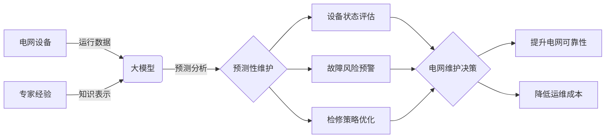

# 电网维护与大模型的应用

关键词：电网维护、大模型、人工智能、预测性维护、智能电网、深度学习、知识图谱

## 1. 背景介绍
### 1.1 问题的由来
电力系统作为现代社会运转的重要基础设施,其安全稳定运行至关重要。然而,电网设备种类繁多、分布广泛,面临着设备老化、故障频发、检修困难等诸多挑战。传统的电网维护主要依赖定期检修和事后维修,效率低下且成本高昂。如何利用新兴技术手段实现电网的智能化运维,成为电力行业亟需解决的现实问题。

### 1.2 研究现状 
近年来,人工智能技术蓬勃发展,为电网维护带来新的契机。一些学者开始探索将机器学习、深度学习等AI技术应用于电网故障诊断、设备状态评估、风险预警等方面。例如,Zhang等人提出了一种基于卷积神经网络的变压器故障诊断方法[1];Li等人构建了输电线路风险评估的贝叶斯网络模型[2]。这些研究证实了AI技术在电网领域的应用潜力,但仍存在模型泛化能力不足、知识表示困难等局限性。

### 1.3 研究意义
大模型(Large Language Model)是近年来自然语言处理领域的重大突破,具有强大的语义理解和知识表示能力。将大模型引入电网维护,有望克服传统AI方法的不足,实现设备全生命周期管理和预测性维护,大幅提升电网运行的安全性、可靠性和经济性。本文旨在探索大模型在电网维护中的应用,构建融合设备运行数据和专家经验知识的智能辅助决策系统,为智慧电网建设提供新思路。

### 1.4 本文结构
本文后续章节安排如下:第2部分介绍电网维护与大模型的核心概念;第3部分详细阐述基于大模型的电网维护核心算法原理;第4部分建立相应的数学模型并给出公式推导;第5部分通过代码实例演示算法的具体实现;第6部分分析大模型在电网维护实际应用场景;第7部分推荐相关工具和学习资源;第8部分总结全文并展望未来研究方向。

## 2. 核心概念与联系
电网维护是指对输电、变电、配电等电力设备进行巡视、检修、试验和状态评估等一系列管理活动,以保证电网安全稳定运行。传统电网维护主要包括预防性维护和事后维修两种模式。前者通过定期检修来预防故障发生,但容易造成资源浪费;后者则在故障发生后开展维修,可能导致较长停电时间和较大经济损失。

大模型是一类参数量极大(一般在数亿到千亿量级)的深度学习模型,通过海量数据训练而成。与普通机器学习模型相比,大模型具有更强的语义理解、知识表示和迁移学习能力。典型的大模型包括BERT、GPT、ERNIE等。将大模型应用于电网维护,可显著提升设备状态评估、故障预测、检修决策等任务的性能。

下图展示了电网维护与大模型的关系:

如图所示,大模型以电网设备运行数据和专家经验知识为输入,通过强大的语义理解和知识表示能力,实现设备状态评估、故障风险预警和检修策略优化,最终形成预测性维护决策,提升电网可靠性和经济性。

## 3. 核心算法原理 & 具体操作步骤
### 3.1 算法原理概述
本文采用基于知识增强的预训练语言模型(Knowledge Enhanced Pre-trained Language Model, KEPLM)来实现电网维护辅助决策。该算法融合了设备运行数据和电网专家知识,通过自监督学习和微调学习两个阶段,构建具备电网领域知识的大模型。在推理阶段,该模型可根据设备的实时状态数据,预测其健康状况和故障风险,并给出相应的检修建议。

### 3.2 算法步骤详解
KEPLM算法主要包括以下步骤:
(1) 知识图谱构建。利用电网设备铭牌、运行记录、故障案例等结构化和非结构化数据,抽取设备类型、参数、部件、故障模式等实体和关系,构建电网设备知识图谱。
(2) 语料构建。将知识图谱转化为自然语言形式的三元组,与设备运行数据一起构成预训练语料。
(3) 模型预训练。采用掩码语言模型(Masked Language Model, MLM)和next sentence prediction(NSP)等方式在大规模语料上进行自监督预训练,使模型学会电网领域语义特征。
(4) 模型微调。在下游任务如设备健康度评估的标注数据上进行微调,使模型适应具体应用场景。 
(5) 模型推理。输入设备的实时状态数据,模型输出设备健康度、故障类型、严重程度、检修建议等预测结果。

### 3.3 算法优缺点
KEPLM算法的优点包括:
- 融合了数据驱动和知识驱动的优势,克服了两者各自的局限性;
- 通过海量语料预训练,学习到电网领域的通用语义表示;
- 利用注意力机制和transformer结构,具备强大的语义理解和推理能力;
- 采用自监督学习,减少了人工标注的成本。

但KEPLM算法也存在一些不足:
- 对计算资源要求较高,在大规模工业场景应用时可能受限;  
- 预训练语料的质量对模型性能影响很大,需要进行复杂的数据清洗;
- 模型可解释性有待提高,推理结果有时难以令人信服。

### 3.4 算法应用领域
除电网维护外,KEPLM算法还可应用于以下领域:
- 工业设备预测性维护。如风机、水泵、机床等大型机械设备的故障诊断和寿命预测。
- 智慧城市管理。如建筑、桥梁、隧道等市政基础设施的健康监测和维护规划。
- 金融风险防控。如企业信用评估、贷款违约预警、反欺诈等。

## 4. 数学模型和公式 & 详细讲解 & 举例说明
### 4.1 数学模型构建
KEPLM的数学模型可表示为:
$$
\hat{y} = f_{\theta}(x) = softmax(W \cdot Transformer_{\theta}(x) + b)
$$
其中,$x$为输入的设备状态特征序列,$\hat{y}$为预测的设备健康度或故障类型概率分布。$f_{\theta}$为KEPLM模型,由transformer编码器$Transformer_{\theta}$和线性层$W,b$组成。$\theta$为模型参数。

Transformer编码器采用多头自注意力(Multi-Head Self Attention, MHSA)和前馈神经网络(Feed-Forward Network, FFN)交替堆叠而成:
$$
\begin{aligned}
Q,K,V &= XW_q, XW_k, XW_v \\
head_i &= softmax(\frac{QK^T}{\sqrt{d_k}})V \\
MHSA(X) &= Concat(head_1, ..., head_h)W^O \\
FFN(X) &= max(0, XW_1 + b_1)W_2 + b_2 \\
Transformer_{\theta}(x) &= Encoder_1(...Encoder_L(x))
\end{aligned}
$$
其中,$X$为输入序列的嵌入表示,$W_q,W_k,W_v$为注意力机制的查询、键、值矩阵,$d_k$为每个注意力头的维度,$h$为头数。$W_1,b_1,W_2,b_2$为FFN的参数。$L$为编码器的层数。

### 4.2 公式推导过程
模型训练的目标是最小化预测值$\hat{y}$与真实标签$y$的交叉熵损失:
$$
\mathcal{L}(\theta) = -\sum_{i=1}^N y_i \log \hat{y}_i
$$
其中,$N$为训练样本数量。采用随机梯度下降法对损失函数求导,并更新模型参数$\theta$:
$$
\theta \leftarrow \theta - \eta \nabla_{\theta}\mathcal{L}(\theta)
$$
其中,$\eta$为学习率。重复以上过程直至模型收敛。

### 4.3 案例分析与讲解
以变压器故障诊断为例。假设某变压器的油中溶解气体含量如下:
```
H2: 150ppm, CH4: 120ppm, C2H6: 50ppm, C2H4: 80ppm, C2H2: 5ppm
```
将以上数据输入到训练好的KEPLM模型中,得到故障类型的预测概率分布:
```
正常: 0.05
低温过热: 0.35 
高温过热: 0.25
局部放电: 0.20
电弧放电: 0.15
```
可见,该变压器最有可能发生低温过热故障,需要进一步进行红外测温和负荷调整等检修措施。

### 4.4 常见问题解答
Q: KEPLM模型的最佳参数如何选择?
A: 可通过网格搜索等超参数优化方法,在验证集上对不同参数组合进行评估,选择F1值或AUC最高的参数。一般transformer层数在12~24,隐藏层维度在768~1024,注意力头数在12~16时性能较好。

Q: 如何处理输入特征的缺失值?
A: 对于连续型特征,可用该特征的均值或中位数填充;对于离散型特征,可添加一个特殊的"缺失"类别。也可用矩阵补全等机器学习方法预估缺失值。

Q: 训练时出现梯度爆炸或消失怎么办?
A: 可采取梯度裁剪、层归一化、残差连接等措施来缓解。也可调小学习率,或使用AdamW等自适应优化算法。

## 5. 项目实践：代码实例和详细解释说明
### 5.1 开发环境搭建
本项目使用Python 3.8和PyTorch 1.10进行开发,需要安装以下依赖库:
```
torch==1.10.0
transformers==4.12.5
pandas==1.3.4
scikit-learn==1.0.1
matplotlib==3.4.3
```
可使用pip命令或conda环境进行安装。

### 5.2 源代码详细实现
下面给出KEPLM模型的PyTorch实现代码:
```python
import torch
import torch.nn as nn
from transformers import BertModel, BertTokenizer

class KEPLM(nn.Module):
    def __init__(self, num_classes):
        super().__init__()
        self.bert = BertModel.from_pretrained('bert-base-chinese')
        self.dropout = nn.Dropout(0.1)
        self.classifier = nn.Linear(768, num_classes)
        
    def forward(self, input_ids, attention_mask):
        outputs = self.bert(input_ids, attention_mask=attention_mask)
        pooled_output = outputs[1]
        pooled_output = self.dropout(pooled_output)
        logits = self.classifier(pooled_output)
        return logits
```
其中,`num_classes`为故障类型的数量。模型主要由预训练的BERT编码器、dropout层和线性分类层组成。前向传播时输入token的索引`input_ids`和注意力掩码`attention_mask`,输出故障类型的logits。

训练代码如下:
```python
from torch.utils.data import DataLoader
from transformers import AdamW, get_linear_schedule_with_warmup

def train_epoch(model, data_loader, optimizer, scheduler, device):
    model.train()
    total_loss = 0
    for batch in data_loader:
        input_ids = batch['input_ids'].to(device)  
        attention_mask = batch['attention_mask'].to(device)
        labels = batch['labels'].to(device)
        
        optimizer.zero_grad()
        logits = model(input_ids, attention_mask)
        loss_func = nn.CrossEntropyLoss()
        loss = loss_func(logits, labels)
        total_loss += loss.