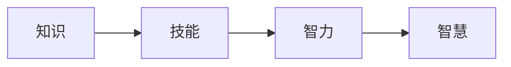

# 真正的智慧，源自对事物本质的深刻理解认知与洞察

关键词：智慧、认知、洞察、本质、理解、计算机科学、人工智能

## 1. 背景介绍
### 1.1 问题的由来
人类对智慧的追求由来已久。从古希腊哲学家苏格拉底的"认识你自己"，到当代科技巨擘乔布斯的"Stay hungry, stay foolish"，无不彰显了人类对智慧的渴望和思考。然而，什么是真正的智慧？它从何而来？这些问题值得我们深入探讨。

### 1.2 研究现状
当前，关于智慧的研究主要集中在认知科学、神经科学、人工智能等领域。认知科学家试图揭示人类认知的奥秘，了解智慧产生的机制；神经科学家探索大脑的结构与功能，寻找智慧的生物学基础；人工智能专家则致力于创造能模拟甚至超越人类智慧的机器。尽管取得了长足进展，但对智慧的本质，仍有许多未解之谜。

### 1.3 研究意义 
深入理解智慧的本质，对于个人成长、社会进步乃至人类文明的发展都具有重要意义。它不仅能帮助我们更好地认识自己，发挥潜能，也为人工智能的发展指明方向，让机器更好地服务人类。同时，探寻智慧的奥秘，也是人类求知欲的体现，是我们不断进步的动力。

### 1.4 本文结构
本文将从以下几个方面来探讨智慧的本质：
- 首先，我们将厘清智慧的内涵，辨析其与知识、技能等相关概念的联系与区别。
- 其次，深入剖析人类认知的奥秘，了解洞察力、创造力等智慧特质的形成机制。 
- 再次，总结人工智能发展历程中的重要算法与模型，看机器如何一步步迈向智慧。
- 然后，通过经典的数学原理与编程案例，体会计算机科学的智慧结晶。
- 最后，展望智慧在未来社会中的应用前景，思考人工智能时代的机遇与挑战。

## 2. 核心概念与联系
要探究智慧的本质，首先需要厘清与之相关的几个核心概念：知识、技能、智力和智慧。它们相辅相成，又各有侧重。

知识是人类认识世界的结果，是对客观事物的反映。它是智慧的基础，但本身并不等同于智慧。知识可以传授，但智慧需要自己去领悟。

技能是运用知识解决实际问题的能力。它不仅包括简单的动作技能，也包括复杂的认知技能。技能需要通过反复训练来获得提升。

智力是运用知识技能处理新问题、适应新环境的综合能力。它涉及记忆、理解、分析、推理、想象等多种认知能力。智力水平因人而异，但可以通过后天训练来提高。

智慧则是在智力的基础上，洞悉事物的本质，做出正确判断，解决复杂问题的能力。它不仅需要广博的知识和高超的技能，更需要敏锐的洞察力、独到的见解和深邃的思想。智慧是人类认知能力的最高境界。

总之，知识是基础，技能是工具，智力是手段，智慧是归宿。真正的智慧源自对事物本质的深刻理解、认知和洞察。



## 3. 核心算法原理 & 具体操作步骤
### 3.1 算法原理概述
人工智能发展至今，涌现出许多优秀的算法模型，它们或多或少都体现了人类智慧的影子。这其中最具代表性的要数深度学习算法。

深度学习是机器学习的一个重要分支，其核心思想是通过构建多层神经网络，让机器像人脑一样对数据进行特征提取和抽象，从而对未知数据做出判断。深度学习网络一般包括输入层、多个隐藏层和输出层，每一层都由大量神经元节点组成，层与层之间通过权重矩阵连接。

### 3.2 算法步骤详解
以最经典的卷积神经网络（CNN）为例，它主要包含以下几个步骤：

1. 卷积层：使用卷积核对输入图像进行特征提取，得到特征图。卷积核在图像上滑动，通过点乘实现局部连接，同时减少参数量。
2. 激活层：对卷积层输出的特征图进行非线性变换，提高网络的表达能力。常用的激活函数有ReLU、sigmoid、tanh等。  
3. 池化层：对特征图进行下采样，减小数据维度，提取主要特征。常用的池化方式有最大池化和平均池化。
4. 全连接层：将前面提取的特征"拉平"，通过若干个全连接层，生成最后的分类或预测结果。

网络训练时，通过前向传播计算损失函数，再用反向传播算法更新权重，不断优化模型。

### 3.3 算法优缺点
CNN在图像识别、语音识别等领域取得了巨大成功，其优势在于：
- 局部连接和权重共享，大大减少了参数量，降低了过拟合风险。
- 卷积核可以自动提取图像特征，避免了手工设计特征的繁琐。
- 多层网络能够逐层抽象，学习到更加复杂和抽象的特征表示。

但CNN也存在一些局限：
- 需要大量标注数据进行训练，获取成本高。
- 网络结构和超参数需要精心设计，对专业知识要求高。
- 训练时间长，计算资源消耗大。
- 泛化能力有待提高，容易受到对抗样本攻击。

### 3.4 算法应用领域
尽管有这些局限，CNN及其变体（如AlexNet、VGGNet、GoogLeNet等）已在多个领域得到广泛应用，展现了机器智慧的雏形：
- 计算机视觉：图像分类、目标检测、语义分割等
- 语音识别：语音转文本、声纹识别、情感分析等
- 自然语言处理：机器翻译、情感分析、问答系统等
- 医疗影像：辅助诊断、病灶检测、影像分割等
- 无人驾驶：障碍物识别、车道线检测、交通标志识别等

## 4. 数学模型和公式 & 详细讲解 & 举例说明
### 4.1 数学模型构建
CNN的数学模型可以用以下公式来表示：

$$a^{(l)}=\sigma(W^{(l)}a^{(l-1)}+b^{(l)})$$

其中，$a^{(l)}$表示第$l$层网络的输出，$W^{(l)}$和$b^{(l)}$分别表示该层的权重矩阵和偏置向量，$\sigma$表示激活函数，$a^{(l-1)}$表示上一层网络的输出。

对于卷积层，还需要引入卷积运算：

$$a^{(l)}_{i,j}=\sigma(\sum_{m}\sum_{n}W^{(l)}_{m,n}a^{(l-1)}_{i+m,j+n}+b^{(l)})$$

其中，$a^{(l)}_{i,j}$表示第$l$层特征图的第$(i,j)$个元素，$W^{(l)}_{m,n}$表示卷积核的第$(m,n)$个权重，$a^{(l-1)}_{i+m,j+n}$表示上一层特征图中与卷积核对应的元素。

### 4.2 公式推导过程
这些公式的推导过程涉及矩阵运算、卷积运算、链式求导等数学知识，限于篇幅这里不再赘述。感兴趣的读者可以参考相关教材和论文。

### 4.3 案例分析与讲解
下面我们以手写数字识别为例，直观感受CNN的工作原理。假设我们要识别一张28x28像素的手写数字图片，可以设计如下CNN结构：
- 输入层：28x28x1
- 卷积层1：16个5x5卷积核，stride=1，padding=2
- 激活层1：ReLU
- 池化层1：2x2最大池化，stride=2
- 卷积层2：32个5x5卷积核，stride=1，padding=2
- 激活层2：ReLU 
- 池化层2：2x2最大池化，stride=2
- 全连接层1：128个节点，ReLU激活
- 全连接层2：10个节点，softmax激活

输入一张手写数字"5"的图片，经过两轮卷积、激活、池化，提取出图片的主要特征。再通过两个全连接层，将特征映射到0~9十个类别上，输出各个类别的概率。概率最大的类别"5"即为识别结果。

这个过程可以直观地理解为：机器通过层层抽象，从原始像素中总结出数字"5"的本质特征（如弧形、尖角等），再将其与已学习的数字模板进行匹配，得出最可能的答案。这种通过特征学习，完成分类任务的思路，体现了机器学习的智慧。

### 4.4 常见问题解答
问：为什么要用卷积而不是全连接？
答：卷积通过局部连接和权重共享，大大减少了参数量，使得网络更容易优化。同时卷积具有平移不变性，更适合处理图像这种数据。

问：激活函数有什么作用？  
答：激活函数为网络引入非线性，增加了网络的表达能力。没有激活函数，多层网络也可以等效为单层线性网络。

问：pooling是否必要？
答：pooling虽然会损失一些信息，但它可以减小特征图尺寸，降低计算量。同时pooling使得网络具有一定的平移、旋转、尺度不变性。

问：如何选择网络的超参数？
答：超参数的选择需要根据具体任务和数据集而定。一般可以先用较小的网络试验，再逐渐增加网络的深度和宽度。也可以参考一些经典网络结构。此外，还需要调节学习率、batch size、正则化参数等。

## 5. 项目实践：代码实例和详细解释说明
### 5.1 开发环境搭建
要实现CNN，需要选择一个深度学习框架。这里我们使用谷歌的TensorFlow。首先安装TensorFlow：

```bash
pip install tensorflow
```

然后导入所需的库：

```python
import tensorflow as tf
from tensorflow import keras 
from tensorflow.keras import layers
```

### 5.2 源代码详细实现
接下来我们用Keras API来搭建CNN网络：

```python
model = keras.Sequential(
    [
        layers.Conv2D(16, 5, strides=1, padding='same', activation='relu', input_shape=(28, 28, 1)),
        layers.MaxPooling2D(pool_size=(2, 2), strides=(2, 2), padding='same'),
        layers.Conv2D(32, 5, strides=1, padding='same', activation='relu'),
        layers.MaxPooling2D(pool_size=(2, 2), strides=(2, 2), padding='same'),
        layers.Flatten(),
        layers.Dense(128, activation='relu'),
        layers.Dense(10, activation='softmax')
    ]
)
```

这段代码定义了一个序贯模型，依次添加了卷积层、池化层、全连接层，与前面的网络结构一一对应。

接着编译模型，设置优化器、损失函数和评估指标：

```python
model.compile(optimizer=keras.optimizers.Adam(),
              loss=keras.losses.SparseCategoricalCrossentropy(),
              metrics=['accuracy'])
```

然后加载MNIST手写数字数据集，并进行归一化预处理：

```python
(x_train, y_train), (x_test, y_test) = keras.datasets.mnist.load_data()
x_train = x_train.reshape((60000, 28, 28, 1)) / 255.0
x_test = x_test.reshape((10000, 28, 28, 1)) / 255.0
```

最后启动训练，并在测试集上评估模型性能：

```python
history = model.fit(x_train, y_train, batch_size=64, epochs=5, validation_split=0.1)
test_scores = model.evaluate(x_test, y_test, verbose=2)
```

### 5.3 代码解读与分析
这段代码展