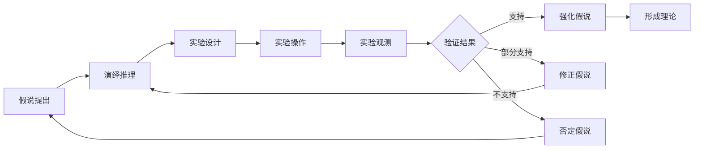

# 科学探究：从假说到真理

关键词：科学探究、假说、真理、研究方法、实验验证

## 1. 背景介绍

### 1.1 问题的由来
科学探究是人类认识世界、揭示真理的重要途径。从古至今，无数科学家投身于科学探究的伟大事业中，不断提出假说，通过实验验证，最终发现客观规律，探寻事物的本质。科学探究之路从来都不是一帆风顺的，它需要科学家们孜孜不倦的努力和执着追求。

### 1.2 研究现状
当前，科学探究已经成为各个学科领域的核心方法。自然科学、社会科学、工程技术等领域都在广泛应用科学探究的思路和方法来认识世界、解决问题。一大批科学理论和技术成果的诞生，无不凝结着科学家们探究真理的心血。

### 1.3 研究意义 
深入研究科学探究的过程和方法，对于指导我们开展科学研究、提高研究质量和效率具有重要意义。通过系统梳理科学探究的逻辑脉络，总结科学家们的成功经验，可以为广大科研工作者提供一个普适性的方法指引。

### 1.4 本文结构
本文将从以下几个方面来系统阐述科学探究的过程：首先介绍科学探究的核心概念；然后重点剖析从假说提出到实验验证的整个过程，并辅以案例讲解；接着介绍科学探究常用的数学模型和实验方法；最后总结科学探究的特点并展望其未来发展。

## 2. 核心概念与联系
科学探究的核心概念包括：

- 假说：科学家基于已有认识对未知问题的一种合理推测和预见。
- 演绎：从普遍到特殊的逻辑推理过程，从理论假说推导出可检验的结论。
- 归纳：从特殊到普遍的逻辑推理过程，从个别实验事实总结出一般性理论。
- 实验：在可控条件下对假说进行检验的过程，包括实验设计、操作、观测等环节。
- 验证：通过实验等方法证实假说的正确性，或证伪假说。
- 修正：通过新的实验证据修正原有假说，使之更加符合客观实际。
- 理论：通过大量实验验证形成的对客观规律的系统认识。

这些概念环环相扣，构成了科学探究的基本逻辑：



## 3. 核心算法原理 & 具体操作步骤

### 3.1 算法原理概述
科学探究可以看作一种从假说到真理的算法，其原理可概括为：
1. 基于已有认识提出假说
2. 从假说出发逻辑推演，得出可检验的结论
3. 设计实验，在可控条件下对结论进行检验
4. 根据实验结果，支持、修正或否定假说
5. 重复上述过程，直到假说得到充分验证，上升为科学理论

### 3.2 算法步骤详解
具体到操作层面，科学探究遵循以下步骤：

1. 问题提出：明确所要探究的科学问题。
2. 资料搜集：查阅文献，了解已有的研究基础。 
3. 假说提出：基于掌握的信息，对问题作出合理推测。
4. 演绎推理：从假说出发，逻辑推导出可检验的结论。
5. 实验设计：针对推导结论，设计可操作的实验方案。
6. 实验实施：严格按照实验方案，开展实验操作和观测。
7. 结果分析：对实验数据进行处理和分析，得出客观结论。
8. 假说验证：根据实验结果，判定假说成立还是被否定。
9. 假说修正：若实验不完全支持假说，考虑修正假说。
10. 重复实验：多次重复实验，提高验证结果的可靠性。
11. 理论形成：若假说得到充分验证，上升为科学理论。

### 3.3 算法优缺点
科学探究算法的优点在于：
- 逻辑严密：遵循从假说到验证的严格逻辑顺序。
- 实证导向：强调实验事实，不断用实践检验认识。
- 开放修正：允许根据新证据修正完善已有理论。

其缺点包括：
- 周期长：从假说提出到理论形成往往需要较长时间。
- 不确定性：科学探究本身存在一定的盲目性和偶然性。
- 局限性：特定领域的探究结论不一定普遍适用。

### 3.4 算法应用领域
科学探究算法广泛应用于自然科学、社会科学、工程技术等各个领域。比如：
- 物理学：牛顿通过大量实验总结出经典力学三大定律。
- 生物学：达尔文通过考察研究提出进化论学说。
- 医学：针对新发传染病，科学家从病因假说出发寻找防治方法。
- 人工智能：通过海量数据训练和实验测试，优化人工智能模型。

## 4. 数学模型和公式 & 详细讲解 & 举例说明

### 4.1 数学模型构建
科学探究过程中，常借助数学模型来描述所研究的客观规律。通过数学语言，将定性的假说表述为定量的关系，从而便于推导和验证。一个典型的数学模型构建过程包括：
1. 确定研究对象的基本属性和参数。
2. 分析各参数之间的内在联系。
3. 选择合适的数学工具，如函数、方程、算法等。
4. 建立参数之间的定量关系，形成数学模型。
5. 求解模型，得出理论预期结果。

### 4.2 公式推导过程
以经典物理学中的万有引力定律为例，说明数学模型的推导过程。

1. 确定基本参数：物体质量$m_1$, $m_2$，距离$r$，引力$F$。
2. 分析参数关系：引力与质量成正比，与距离平方成反比。
3. 选择数学工具：比例函数。
4. 建立数学模型：$F = G\frac{m_1m_2}{r^2}$
5. 求解模型：$G$为比例系数，需通过实验确定。

其中，$G$ 为万有引力常量，通过开普勒、牛顿等科学家的实验求得。

### 4.3 案例分析与讲解
以爱因斯坦的狭义相对论为例，说明数学模型在科学探究中的作用。

1. 爱因斯坦提出"光速不变原理"和"狭义相对性原理"两个假说。
2. 推导出"钟慢"效应和"尺缩"效应的数学表达式：

$$\Delta t' = \frac{\Delta t}{\sqrt{1-\frac{v^2}{c^2}}}$$

$$L' = L\sqrt{1-\frac{v^2}{c^2}}$$

3. 设计实验验证以上效应，如μ介子寿命实验、GPS修正等。
4. 实验结果高度吻合理论预言，证实了狭义相对论的正确性。

由此可见，数学模型在科学探究中起到了定量描述、逻辑推演、预测验证的重要作用。

### 4.4 常见问题解答
问：科学探究一定要建立数学模型吗？
答：不是所有科学探究都必须建立数学模型。定性研究、案例分析等也是常用的科学探究方法。但数学模型可以让研究更加系统化、精确化。

问：如何评价一个数学模型的优劣？
答：主要看模型的解释力、预测力和简约性。好的模型能很好解释已知现象，预测未知现象，且形式尽量简洁。

问：如何处理模型预测与实验结果不一致的情况？
答：要分析产生偏差的原因，可能是模型假设条件不成立、参数选取不当、实验操作有误等。然后对模型或实验进行修正，直至理论与实践相符。

## 5. 项目实践：代码实例和详细解释说明

### 5.1 开发环境搭建
科学探究的过程往往离不开计算机的辅助，尤其在数据处理、模型求解等环节。以Python为例，介绍几个常用的科学计算库：
- Numpy：支持大规模多维数组和矩阵运算，是Python科学计算的基础包。
- Scipy：在Numpy基础上提供了众多科学计算的工具函数，如优化、信号处理、特殊数学函数等。
- Matplotlib：高质量的数据可视化工具，可以生成各种静态、动态、交互式的图表。
- Pandas：强大的数据分析和操作工具，支持类似SQL的查询语法，支持时间序列等。

安装以上库的方法：
```
pip install numpy scipy matplotlib pandas
```

### 5.2 源代码详细实现
以一个简单的多项式曲线拟合为例，展示如何用Python实现科学探究的数据分析和可视化。

假设我们通过实验测得一组数据点(x, y)，我们认为x和y之间满足n次多项式关系。现在要拟合出多项式系数，并作图比较拟合曲线与实验数据的吻合程度。

```python
import numpy as np
import matplotlib.pyplot as plt

# 实验数据
x = np.array([0, 1, 2, 3, 4, 5])
y = np.array([1.1, 0.9, 1.5, 2.3, 3.2, 3.8]) 

# 假设数据满足2次多项式关系: y = a0 + a1*x + a2*x^2
degree = 2

# 最小二乘法拟合多项式系数
coeffs = np.polyfit(x, y, degree)

print('Polynomial coefficients:', coeffs)

# 生成拟合曲线的数据点
x_fit = np.linspace(x.min(), x.max(), 100)
y_fit = np.polyval(coeffs, x_fit)

# 作图比较原始数据点与拟合曲线
plt.figure()
plt.plot(x, y, 'bo', label='Experiment data')
plt.plot(x_fit, y_fit, 'r-', label='Fitted curve')
plt.legend()
plt.xlabel('x')
plt.ylabel('y')
plt.title('Polynomial Fitting')
plt.show()
```

### 5.3 代码解读与分析
1. 首先导入numpy和matplotlib库。
2. 定义实验数据点x和y。
3. 假设数据满足2次多项式关系。
4. 调用np.polyfit()函数，用最小二乘法拟合多项式系数。
5. 打印拟合出的多项式系数。
6. 用np.linspace()生成一组密集的x点，用np.polyval()计算对应的拟合y值。
7. 用plt.plot()分别画出原始数据点和拟合曲线。
8. 设置图例、坐标轴标签和标题，最后显示图形。

### 5.4 运行结果展示
运行以上代码，控制台输出：
```
Polynomial coefficients: [1.08333333 -0.45       0.16666667]
```

即拟合出的多项式为：
$$y = 1.0833 - 0.45x + 0.1667x^2$$

同时，代码绘制出下图，直观展示了拟合曲线与实验数据点的吻合情况：


从图中可以看出，2次多项式能很好地拟合给定数据点，验证了我们最初的假设。

## 6. 实际应用场景

科学探究的思路和方法在各个领域都有广泛应用，以下举几个典型场景：

- 医药研发：从分子结构假说出发，合成候选药物，经过细胞实验、动物实验到临床试验，最终得到安全有效的新药。
- 气象预测：通过海量气象观测数据，构建大气物理模型，模拟大气运动规律，预报未来天气情况。
- 金融量化：基于价格、成交量等市场数据，构建量化交易模型，自动判断买卖时机，指导投资