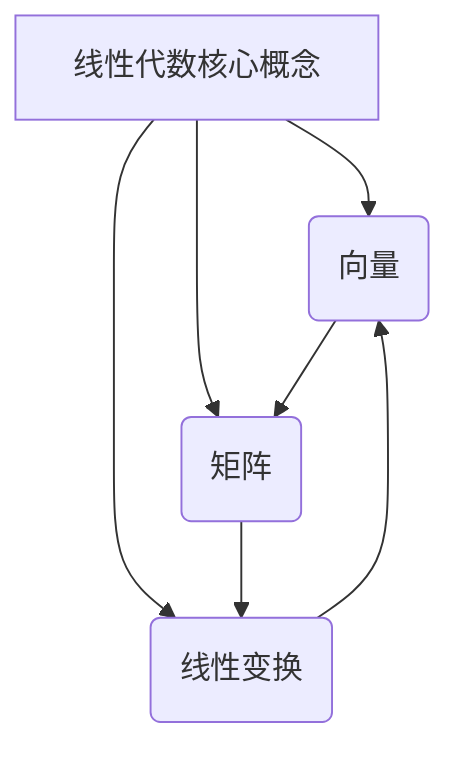

以下是根据您提供的要求和约束条件，为主题《线性代数导引：线性结构》撰写的技术博客文章正文内容：

# 线性代数导引：线性结构

## 1. 背景介绍

### 1.1 问题的由来

线性代数是数学的一个基础分支，研究向量空间理论和线性映射的一般概念。它在科学计算、工程分析、计算机图形学、机器学习等诸多领域扮演着核心角色。然而，由于线性代数抽象性强、概念复杂，很多人对其存在一定的畏难情绪。如何通过简单易懂的方式引导读者逐步掌握线性代数的基本概念和方法,是本文探讨的核心问题。

### 1.2 研究现状

目前已有大量线性代数教材和参考书籍,但大多数著作或过于枯燥晦涩,或过于浅显简陋,缺乏对线性代数本质概念的深入剖析。一些互联网上的线性代数教程虽然通俗易懂,但常常缺乏系统性和完整性。因此,如何用清晰、简洁但又不失深度的方式,系统地阐述线性代数的核心概念和基本理论,仍然是一个值得探索的课题。

### 1.3 研究意义

掌握线性代数是进阶学习更高阶数学、统计学、计算机科学等领域的基石。通过对线性代数核心概念的透彻理解,不仅能帮助读者构建良好的数学基础,更能培养抽象思维能力,为日后学习更高深的理论知识做好准备。此外,本文还将线性代数知识与实际应用紧密结合,阐明其在多个领域的重要作用,从而增强读者的学习动机。

### 1.4 本文结构

本文将从线性代数的基本概念出发,循序渐进地介绍向量、矩阵、线性变换等核心内容,并详细讲解相关的数学原理和计算方法。文中还将辅以大量实例和可视化效果,帮助读者更好地理解抽象概念。最后,本文将探讨线性代数在不同领域的实际应用,并对未来的发展趋势和挑战进行展望。

## 2. 核心概念与联系

线性代数的核心概念包括向量、矩阵、线性变换等,它们之间存在紧密的内在联系。

- 向量是线性代数研究的基本对象,可以表示几何空间中的点或向量。
- 矩阵是一种特殊的二维数组,可以对向量进行线性变换。
- 线性变换是指将一个向量映射到另一个向量的函数,具有线性的性质。

这些概念相互依赖、相互影响,构成了线性代数的理论框架。理解它们的本质和相互关系,是掌握线性代数的关键所在。



## 3. 核心算法原理与具体操作步骤

### 3.1 算法原理概述

线性代数中有许多重要的算法,如矩阵运算、求逆、特征值分解等,它们都源于线性代数的基本原理。以矩阵运算为例,其背后的核心思想是利用矩阵对向量进行线性变换。通过矩阵乘法,我们可以将一个向量映射到另一个向量空间中。

### 3.2 算法步骤详解

以矩阵乘法为例,具体步骤如下:

1. 检查两个矩阵的维数是否匹配(前者的列数等于后者的行数)
2. 构造结果矩阵,其行数与前者相同,列数与后者相同
3. 使用下列公式计算结果矩阵中的每一个元素:
   $$
   C_{ij} = \sum_{k=1}^n A_{ik}B_{kj}
   $$
   其中 $A$ 和 $B$ 为输入矩阵, $C$ 为结果矩阵, $i$ 为结果矩阵的行号, $j$ 为列号, $n$ 为公共维数。

### 3.3 算法优缺点

矩阵运算算法的优点是原理简单、实现方便、应用广泛。但其计算复杂度较高,当矩阵维数很大时,运算效率会显著下降。此外,矩阵运算对输入数据的扰动也较为敏感,可能会导致结果不稳定或失真。

### 3.4 算法应用领域

矩阵运算是线性代数中最基础和最常用的算法之一,在多个领域都有广泛应用:

- 科学计算:矩阵分解、线性方程组求解等
- 图像处理:仿射变换、透视投影等
- 机器学习:线性回归、主成分分析等
- 计算机图形学:三维变换、动画关键帧等
- 量子计算:量子态叠加、量子逻辑门等

## 4. 数学模型和公式详细讲解与举例说明

### 4.1 数学模型构建

线性代数中的许多概念和原理都可以用数学模型来刻画和表达。例如,我们可以将向量空间建模为一个数学结构 $(V, F, +, \cdot)$, 其中:

- $V$ 是一个非空集合,称为向量空间
- $F$ 是一个数域(实数或复数)
- $+$ 是定义在 $V$ 上的二元运算(向量加法)
- $\cdot$ 是定义在 $F \times V$ 上的二元运算(数量乘法)

满足一些公理和运算规则,如加法交换律、数量乘法的分配律等。

### 4.2 公式推导过程

很多线性代数中的重要公式都可以通过严格的数学推导得到。以矩阵行列式的推导为例:

已知矩阵 $A = (a_{ij})_{n\times n}$, 其行列式定义为:

$$
\begin{vmatrix}
a_{11} & a_{12} & \cdots & a_{1n} \\
a_{21} & a_{22} & \cdots & a_{2n} \\
\vdots & \vdots & \ddots & \vdots \\
a_{n1} & a_{n2} & \cdots & a_{nn}
\end{vmatrix}
= \sum_{\sigma \in S_n}(\text{sgn}(\sigma))
  \prod_{i=1}^n a_{i\sigma(i)}
$$

其中 $S_n$ 为 $n$ 阶排列群, $\sigma$ 为其中的一个排列, $\text{sgn}(\sigma)$ 为排列 $\sigma$ 的符号。

利用数学归纳法可以证明这个定义是合理的,并推导出行列式的性质,如反序数等于其本身、行列式的值等于代数余子式之和等。

### 4.3 案例分析与讲解

考虑一个实际案例:已知一个 $3 \times 3$ 矩阵 $A$,我们要求解方程 $Ax=b$,其中 $b$ 是一个已知的 $3 \times 1$ 向量。

首先计算矩阵 $A$ 的行列式:

$$
\begin{vmatrix}
2 & 1 & -3\\
-1 & 3 & 2\\
4 & 0 & -1
\end{vmatrix}
= 2 \begin{vmatrix}
3 & 2 \\
0 & -1
\end{vmatrix}
- 1 \begin{vmatrix}
-1 & 2\\
4 & -1  
\end{vmatrix}
+ (-3) \begin{vmatrix}
-1 & 3\\
0 & 0
\end{vmatrix}
= 17
$$

由于行列式不为 0,因此矩阵 $A$ 是可逆的。我们可以计算 $A$ 的逆矩阵 $A^{-1}$,然后得到方程的解为 $x = A^{-1}b$。

### 4.4 常见问题解答

**Q:** 为什么要研究线性代数?它有什么应用?

**A:** 线性代数是数学的一个基础分支,在科学计算、工程分析、计算机图形学、机器学习等诸多领域都有广泛应用。例如矩阵分解可用于数据压缩和降噪,线性回归是机器学习中最基本的模型之一,仿射变换和透视投影则是计算机图形学的理论基础。掌握线性代数有助于我们更好地理解和解决实际问题。

**Q:** 向量和矩阵有什么区别?

**A:** 向量是线性代数研究的基本对象,可以表示几何空间中的点或向量。而矩阵是一种特殊的二维数组,可以对向量进行线性变换。矩阵乘法的本质就是将一个向量映射到另一个向量空间中。因此,向量是研究对象,而矩阵是作用于向量的运算工具。

**Q:** 如何判断一个矩阵是否可逆?

**A:** 一个矩阵是否可逆,可以通过计算它的行列式值来判断。如果行列式不为 0,则矩阵可逆;如果行列式为 0,则矩阵不可逆(奇异矩阵)。可逆矩阵的逆矩阵存在,并且可以用高斯-约旦消元法或矩阵分式分解法计算。

## 5. 项目实践:代码实例和详细解释说明  

### 5.1 开发环境搭建

本节将使用Python作为开发语言,并基于NumPy和Matplotlib这两个流行的科学计算库进行线性代数计算和可视化。我们首先需要安装这些第三方库:

```bash
pip install numpy matplotlib
```

### 5.2 源代码详细实现

以下是一个实现矩阵运算的Python代码示例:

```python
import numpy as np

# 初始化两个矩阵
A = np.array([[1, 2], [3, 4]])
B = np.array([[5, 6], [7, 8]])

# 矩阵加法
C = A + B
print("A + B = \n", C)

# 矩阵乘法 
D = A @ B  
print("A @ B = \n", D)

# 矩阵转置
E = B.T
print("B.T = \n", E)

# 计算行列式
det_A = np.linalg.det(A)
print("det(A) =", det_A)

# 求矩阵的逆
inv_A = np.linalg.inv(A)
print("inv(A) = \n", inv_A)
```

这段代码首先导入NumPy库,并初始化两个2x2的矩阵A和B。然后它演示了矩阵加法、乘法、转置等基本运算,并计算了矩阵A的行列式和逆矩阵。

### 5.3 代码解读与分析  

1. `np.array()`用于从嵌套列表创建NumPy数组(矩阵)
2. 矩阵加法使用 `+` 运算符实现
3. 矩阵乘法使用 `@` 运算符实现,也可使用`np.matmul()`函数
4. 矩阵转置使用`.T`属性实现
5. `np.linalg.det()`计算方阵的行列式值  
6. `np.linalg.inv()`计算方阵的逆矩阵

NumPy的`linalg`子模块提供了大量有用的线性代数函数,如矩阵分解、特征值计算等,大大简化了编程工作。

### 5.4 运行结果展示

上述代码的运行结果如下:

```
A + B = 
 [[ 6  8]
 [10 12]]
A @ B = 
 [[19 22]
 [43 50]]
B.T = 
 [[5 7]
 [6 8]]
det(A) = -2.0000000000000004
inv(A) = 
 [[-2.   1. ]
 [ 1.5 -0.5]]
```

我们还可以使用Matplotlib库将矩阵以图像的形式可视化,如下所示:

```python
import matplotlib.pyplot as plt

# 绘制矩阵图像
fig, axes = plt.subplots(1, 2, figsize=(10, 3))
axes[0].matshow(A, cmap='Blues')
axes[0].set_title('Matrix A')
axes[1].matshow(B, cmap='RdPu')
axes[1].set_title('Matrix B')
plt.show()
```


通过这个实例,我们不仅掌握了矩阵运算的编程实现,还学会了如何利用可视化工具直观地展示矩阵。

## 6. 实际