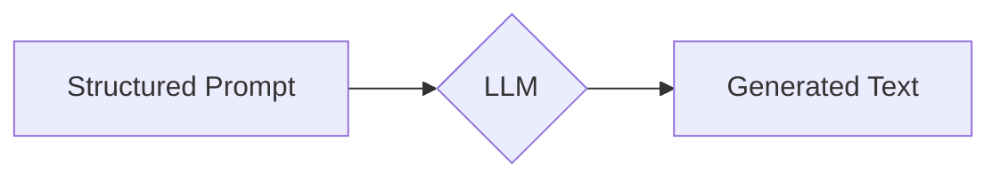

# 结构化Prompt:通过提供清晰的指令和格式要求，帮助AI更准确地捕捉用户的意图

## 1. 背景介绍
### 1.1 问题的由来
近年来，随着人工智能技术的飞速发展，大语言模型(LLM)在自然语言处理领域取得了突破性进展。然而，由于自然语言的模糊性和歧义性，即使是最先进的LLM，在理解用户意图方面仍然存在局限性。这导致AI系统在执行任务时经常出现偏离用户预期的情况。

### 1.2 研究现状
目前，业界主要通过两种方式来提高LLM理解用户意图的能力：1)扩大模型参数规模和训练数据量；2)优化Prompt设计。前者虽然可以提升模型的泛化能力，但成本高昂且收益递减。相比之下，后者通过精心设计输入文本，引导模型朝着期望的方向生成输出，是一种更加灵活高效的方法。

### 1.3 研究意义  
探索如何设计结构化Prompt以提高AI理解用户意图的准确性，对于实现人机高效协作、开发实用的智能应用具有重要意义。一方面，它可以降低用户使用AI工具的门槛，提升人机交互体验；另一方面，它有助于充分发挥LLM的潜力，扩大其应用范围。

### 1.4 本文结构
本文将首先介绍Prompt的核心概念及其与LLM的关系。然后，重点阐述结构化Prompt的设计原则和具体方法。接着，通过实例演示如何应用这些方法指导LLM生成符合预期的输出。最后，总结全文内容并展望结构化Prompt的未来发展方向。

## 2. 核心概念与联系
Prompt是指输入给LLM的文本序列，通常由任务描述、指令、示例、格式要求等部分组成。LLM根据Prompt生成相应的输出文本。Prompt的设计质量直接影响LLM输出的质量。

结构化Prompt的核心思想是通过精心组织Prompt的内容和格式，为LLM提供清晰、具体、全面的指令，从而最大限度地消除歧义，引导模型朝着期望的方向生成输出。它强调Prompt要素的模块化、层次化组织，以及格式的规范化、标准化。

下图展示了结构化Prompt与LLM的关系：



## 3. 核心算法原理 & 具体操作步骤
### 3.1 算法原理概述
结构化Prompt的生成可以看作一个模板填充的过程。我们预先定义一个Prompt模板，其中包含若干个槽位(slot)。每个槽位对应Prompt的一个要素，如任务描述、约束条件、输出格式等。然后，根据具体应用场景，我们往槽位中填充相应的内容，从而得到一个完整的结构化Prompt。

### 3.2 算法步骤详解
1. 定义Prompt模板。一个典型的Prompt模板如下：

```
[Task Description]
[Detailed Instructions]
[Examples]
[Format Requirements] 
[Constraints]
```

2. 根据应用场景，确定每个槽位要填充的具体内容。比如：

```
[Task Description]: 请你扮演一名电影评论家，根据下面的电影简介，撰写一篇300字左右的影评。
[Detailed Instructions]: 影评要求言之有物，不能空洞无聊；要有独到见解，不能人云亦云；要结构严谨，主次分明，不能杂乱无章。
[Examples]: 电影简介：xxx
[Format Requirements]: 影评需要包含影片信息、内容梗概、个人观点三部分。每部分用二级标题分隔。 
[Constraints]: 字数在300左右，误差不超过20；不得出现攻击性、歧视性言论；不得剧透关键情节。
```

3. 将每个槽位填充的内容，替换到Prompt模板中的相应位置，从而得到完整的结构化Prompt。

4. 将生成的结构化Prompt输入给LLM，得到相应输出。

5. 评估LLM输出的质量。如果不够理想，考虑优化Prompt设计，重复步骤2-4。

### 3.3 算法优缺点
优点：
- 通过模块化组织Prompt要素，提高了Prompt的可读性和可维护性。  
- 通过提供清晰、具体的指令，减少了LLM理解的歧义和不确定性。
- 通过规范化Prompt格式，提高了Prompt的一致性，便于比较和优化。

缺点：
- 需要对Prompt的设计进行精心组织，工作量较大。
- 过于详细的指令可能会限制LLM的创造力。
- 某些开放性任务难以用结构化Prompt表达。

### 3.4 算法应用领域
结构化Prompt可以应用于各种需要LLM参与的任务，如问答系统、对话生成、文本摘要、创意写作等。特别是在任务要求比较明确、输出格式相对固定的场合，结构化Prompt能发挥最大效用。

## 4. 数学模型和公式 & 详细讲解 & 举例说明
### 4.1 数学模型构建
我们可以用一个函数 $f$ 来表示结构化Prompt的生成过程：

$$f(t, s) = P$$

其中，$t$ 表示Prompt模板，$s$ 表示槽位填充的内容，$P$ 表示生成的结构化Prompt。

进一步地，我们可以将 $s$ 表示为一个槽位-内容对的集合：

$$s = \{(slot_1, content_1), (slot_2, content_2), ..., (slot_n, content_n)\}$$

其中，$slot_i$ 表示第 $i$ 个槽位的名称，$content_i$ 表示填充到第 $i$ 个槽位的内容。

### 4.2 公式推导过程
根据上述定义，结构化Prompt的生成过程可以表示为：

$$P = t[slot_1:=content_1, slot_2:=content_2, ..., slot_n:=content_n]$$

其中，$t[slot_i:=content_i]$ 表示将 $t$ 中的第 $i$ 个槽位替换为 $content_i$。

### 4.3 案例分析与讲解
以3.2节中的例子为例，我们有：

$t$ = 
```
[Task Description]
[Detailed Instructions]
[Examples]
[Format Requirements]
[Constraints]
```

$s$ = 
```
{
  (Task Description, "请你扮演一名电影评论家，根据下面的电影简介，撰写一篇300字左右的影评。"),
  (Detailed Instructions, "影评要求言之有物，不能空洞无聊；要有独到见解，不能人云亦云；要结构严谨，主次分明，不能杂乱无章。"),
  (Examples, "电影简介：xxx"),
  (Format Requirements, "影评需要包含影片信息、内容梗概、个人观点三部分。每部分用二级标题分隔。"),
  (Constraints, "字数在300左右，误差不超过20；不得出现攻击性、歧视性言论；不得剧透关键情节。")
}
```

代入公式，我们得到：

$P$ =
```
请你扮演一名电影评论家，根据下面的电影简介，撰写一篇300字左右的影评。
影评要求言之有物，不能空洞无聊；要有独到见解，不能人云亦云；要结构严谨，主次分明，不能杂乱无章。
电影简介：xxx
影评需要包含影片信息、内容梗概、个人观点三部分。每部分用二级标题分隔。
字数在300左右，误差不超过20；不得出现攻击性、歧视性言论；不得剧透关键情节。
```

这就是一个结构化Prompt的实例。

### 4.4 常见问题解答
Q: 结构化Prompt的槽位是固定的吗？
A: 不是。槽位的设置应根据具体任务而定。但一般应包括任务描述、指令、格式要求等基本要素。

Q: 所有槽位都必须填充内容吗？
A: 不一定。根据需要，有些槽位可以留空。但完全省略一个槽位可能会影响Prompt的完整性。

Q: 填充内容是否有长度限制？  
A: 原则上没有硬性限制，但为了Prompt的简洁性，建议填充内容要言简意赅。过长的填充内容可能会淹没关键信息。

## 5. 项目实践：代码实例和详细解释说明
### 5.1 开发环境搭建
本项目使用Python实现结构化Prompt的生成。需要安装以下依赖库：

- jinja2：用于实现Prompt模板的渲染。

可以通过以下命令安装：

```bash
pip install jinja2
```

### 5.2 源代码详细实现
我们使用Jinja2库来实现结构化Prompt的生成。核心代码如下：

```python
from jinja2 import Template

prompt_template = """
[Task Description]
[Detailed Instructions]
[Examples]
[Format Requirements]
[Constraints]
"""

prompt_data = {
    "Task Description": "请你扮演一名电影评论家，根据下面的电影简介，撰写一篇300字左右的影评。",
    "Detailed Instructions": "影评要求言之有物，不能空洞无聊；要有独到见解，不能人云亦云；要结构严谨，主次分明，不能杂乱无章。",
    "Examples": "电影简介：xxx",
    "Format Requirements": "影评需要包含影片信息、内容梗概、个人观点三部分。每部分用二级标题分隔。",
    "Constraints": "字数在300左右，误差不超过20；不得出现攻击性、歧视性言论；不得剧透关键情节。"
}

template = Template(prompt_template)
structured_prompt = template.render(prompt_data)

print(structured_prompt)
```

### 5.3 代码解读与分析
1. 首先，我们定义了一个包含若干槽位的Prompt模板 `prompt_template`。
2. 然后，我们定义了一个字典 `prompt_data`，其中的键表示槽位名称，值表示填充内容。
3. 接着，我们使用 `Template` 函数将 `prompt_template` 转化为一个模板对象。
4. 最后，我们调用模板对象的 `render` 方法，传入 `prompt_data`，生成最终的结构化Prompt。

这段代码的关键是利用了Jinja2模板引擎的功能，通过占位符实现了Prompt的参数化生成。这种方式使得Prompt的模板和数据相分离，提高了代码的可读性和可维护性。

### 5.4 运行结果展示
运行上述代码，我们得到以下输出：

```
请你扮演一名电影评论家，根据下面的电影简介，撰写一篇300字左右的影评。
影评要求言之有物，不能空洞无聊；要有独到见解，不能人云亦云；要结构严谨，主次分明，不能杂乱无章。
电影简介：xxx
影评需要包含影片信息、内容梗概、个人观点三部分。每部分用二级标题分隔。
字数在300左右，误差不超过20；不得出现攻击性、歧视性言论；不得剧透关键情节。
```

可以看到，这个结果与我们在4.3节手工生成的结构化Prompt是一致的。这说明我们的代码是正确的。

## 6. 实际应用场景
结构化Prompt在许多需要LLM参与的应用场景中都能发挥作用，比如：

- 智能写作助手：通过结构化Prompt引导LLM生成特定风格、主题、格式的文章。
- 客服聊天机器人：通过结构化Prompt引导LLM生成符合业务需求的回复。
- 代码生成工具：通过结构化Prompt引导LLM生成特定功能、接口的代码片段。
- 游戏剧情生成器：通过结构化Prompt引导LLM生成符合游戏设定的任务、对话等内容。

### 6.4 未来应用展望
随着LLM的不断发展，结构化Prompt的应用范围也将不断扩大。未来，我们可以期待以下应用场景：

- 智能教学系统：通过结构化Prompt引导LLM生成个性化的学习内容和练习题。
- 创意灵感激发器：通过结构化Prompt引导LLM生成各种创意点子，激发人的灵感。
- 自动报告生成器：通过结构化Prompt引导L