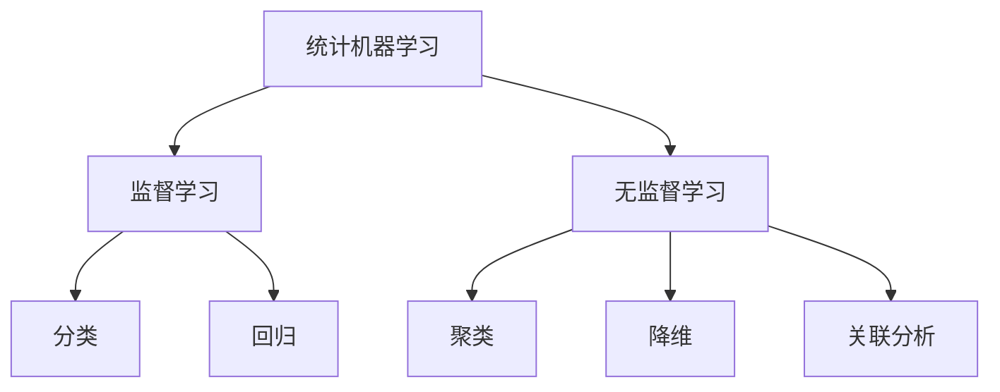

# 统计机器学习 (Statistical Machine Learning) 原理与代码实例讲解

关键词：统计机器学习、监督学习、无监督学习、数学模型、代码实现

## 1. 背景介绍
### 1.1  问题的由来
在人工智能和数据科学的快速发展中,机器学习已经成为了一个重要的研究领域。机器学习旨在让计算机系统从数据中自动学习,并根据学习结果对未知数据做出预测或决策。其中,统计机器学习作为机器学习的一个重要分支,利用概率论和统计学的方法来建立数学模型,并应用到实际问题中。

### 1.2  研究现状
近年来,统计机器学习受到了学术界和工业界的广泛关注。许多顶级会议如NIPS、ICML、KDD等都设有专门的统计机器学习分会场。同时,谷歌、微软、亚马逊等科技巨头也纷纷成立了统计机器学习研究团队,并将其应用到搜索、推荐、语音识别等领域,取得了显著成果。

### 1.3  研究意义
统计机器学习可以帮助我们从海量数据中挖掘出有价值的信息和知识,为科学研究和商业决策提供有力支持。同时,统计机器学习也推动了人工智能的发展,使得计算机系统具备一定的智能和学习能力。因此,深入研究统计机器学习的原理和应用,对于推动人工智能和大数据分析技术的发展具有重要意义。

### 1.4  本文结构
本文将从以下几个方面对统计机器学习进行深入探讨：
- 第2部分介绍统计机器学习的核心概念与联系
- 第3部分阐述统计机器学习的核心算法原理和具体操作步骤
- 第4部分建立统计机器学习的数学模型,并给出公式推导和案例分析
- 第5部分提供统计机器学习的代码实例和详细解释说明
- 第6部分讨论统计机器学习的实际应用场景
- 第7部分推荐统计机器学习的学习资源和开发工具
- 第8部分总结全文,并展望统计机器学习的未来发展趋势和挑战
- 第9部分列出统计机器学习的常见问题与解答

## 2. 核心概念与联系
统计机器学习的核心概念包括:
- 数据集(Dataset):由多个数据样本构成,每个样本通常由特征(Feature)和标签(Label)组成。
- 特征(Feature):描述数据样本属性的变量,通常为实数向量。
- 标签(Label):与数据样本相关联的目标变量,可以是离散值(分类问题)或连续值(回归问题)。
- 假设(Hypothesis):关于数据集的潜在规律或模式的估计函数。
- 损失函数(Loss Function):度量模型预测值与真实值之间差异的函数。
- 经验风险(Empirical Risk):模型在训练集上的平均损失。
- 结构风险(Structural Risk):模型的经验风险与模型复杂度的加权和。
- 泛化能力(Generalization Ability):模型在新数据上的预测性能。

根据是否使用标签数据,统计机器学习可分为监督学习(Supervised Learning)和无监督学习(Unsupervised Learning)两大类:
- 监督学习:使用带标签的训练数据来学习预测模型,代表算法有决策树、支持向量机、逻辑回归等。
- 无监督学习:使用不带标签的数据来发现数据内在结构和规律,代表算法有聚类、降维、关联分析等。

此外,根据任务类型,统计机器学习还可分为分类(Classification)、回归(Regression)、聚类(Clustering)等问题。它们之间的联系如下图所示:

## 3. 核心算法原理 & 具体操作步骤
### 3.1  算法原理概述
统计机器学习的核心思想是利用概率统计理论,通过对训练数据的学习来估计未知参数,建立数据与标签之间的映射关系。常用的统计机器学习算法包括:
- 朴素贝叶斯(Naive Bayes)
- 决策树(Decision Tree)
- 逻辑回归(Logistic Regression) 
- 支持向量机(Support Vector Machine)
- K最近邻(K-Nearest Neighbor)
- K均值聚类(K-Means Clustering)
- 主成分分析(Principal Component Analysis)

这些算法虽然原理不同,但一般都遵循以下步骤:
1. 数据预处理:对原始数据进行清洗、转换、集成等操作,提高数据质量。
2. 特征工程:从原始数据中提取或构造有效特征,为模型训练提供更好的输入。
3. 模型训练:用训练数据拟合模型参数,使模型能够很好地拟合数据。
4. 模型评估:用测试数据评估模型性能,并进行超参数调优,选择最优模型。
5. 模型预测:用训练好的模型对新数据进行预测。

### 3.2  算法步骤详解
下面以逻辑回归算法为例,详细说明统计机器学习的具体步骤。

逻辑回归是一种常用的分类算法,它利用Sigmoid函数将线性回归的输出转化为概率,再根据概率值预测样本的类别标签。其数学形式为:

$$
P(y=1|x) = \frac{1}{1+e^{-(\beta_0+\beta_1 x_1+...+\beta_n x_n)}}
$$

其中,$x=(x_1,x_2,...,x_n)$为输入特征向量,$y\in\{0,1\}$为二元类别标签,$\beta=(\beta_0,\beta_1,...,\beta_n)$为待估计的模型参数。

逻辑回归的训练过程就是估计参数$\beta$的过程,常用的估计方法是极大似然估计。它的目标是最大化似然函数:

$$
L(\beta) = \prod_{i=1}^{m} P(y^{(i)}|x^{(i)};\beta)
$$

其中,$(x^{(i)},y^{(i)}),i=1,2,...,m$为训练样本。

为了便于求解,我们通常对似然函数取对数,得到对数似然函数:

$$
\ell(\beta) = \log L(\beta) = \sum_{i=1}^{m} [y^{(i)}\log P(y^{(i)}=1|x^{(i)};\beta) + (1-y^{(i)})\log P(y^{(i)}=0|x^{(i)};\beta)]
$$

然后,用梯度上升法求解对数似然函数的最大值,得到$\beta$的估计值。

逻辑回归的具体步骤如下:
1. 数据预处理:对数据进行归一化、缺失值处理等。
2. 特征工程:提取有效特征,如词袋模型、TF-IDF等。
3. 模型训练:
   - 初始化参数$\beta$
   - 计算对数似然函数$\ell(\beta)$及其梯度$\nabla_\beta \ell(\beta)$ 
   - 用梯度上升法更新参数$\beta := \beta + \alpha \nabla_\beta \ell(\beta)$,其中$\alpha$为学习率
   - 重复上述步骤直到收敛
4. 模型评估:用准确率、AUC等指标评估模型性能,并调优超参数。  
5. 模型预测:对新样本$x$,计算$P(y=1|x;\beta)$,根据阈值预测其类别标签。

### 3.3  算法优缺点
逻辑回归的优点包括:
- 直接估计类别概率,易于理解和实现。
- 训练和预测速度快,适合大规模数据。
- 可解释性强,特征权重反映了特征的重要性。
- 对缺失数据和异常值不敏感。

逻辑回归的缺点包括:  
- 难以拟合非线性数据。
- 对特征尺度敏感,需要对特征进行归一化。
- 容易受到多重共线性的影响。
- 不能直接用于多分类问题。

### 3.4  算法应用领域
逻辑回归在许多领域都有广泛应用,如:
- 金融风控:预测客户是否会违约、信用卡欺诈检测等。
- 医疗诊断:根据症状预测患者是否患病。
- 营销推荐:预测用户是否会对广告进行点击。
- 自然语言处理:情感分析、主题分类等。

## 4. 数学模型和公式 & 详细讲解 & 举例说明
### 4.1  数学模型构建
逻辑回归的数学模型基于Sigmoid函数:

$$
S(z) = \frac{1}{1+e^{-z}}
$$

它将实数z映射到(0,1)区间,可用于表示概率。

假设二元类别标签$y\in\{0,1\}$,我们用Sigmoid函数建立$y$与特征$x$之间的关系:

$$
P(y=1|x) = S(\beta^T x) = \frac{1}{1+e^{-(\beta_0+\beta_1 x_1+...+\beta_n x_n)}}
$$

其中,$\beta=(\beta_0,\beta_1,...,\beta_n)$为模型参数。

相应地,标签为0的概率为:

$$
P(y=0|x) = 1 - P(y=1|x) = \frac{e^{-(\beta_0+\beta_1 x_1+...+\beta_n x_n)}}{1+e^{-(\beta_0+\beta_1 x_1+...+\beta_n x_n)}}
$$

模型的目标是估计出参数$\beta$,使得模型能够很好地拟合训练数据。

### 4.2  公式推导过程
为了估计参数$\beta$,逻辑回归采用极大似然估计的方法。

给定m个独立同分布的训练样本$(x^{(i)},y^{(i)}),i=1,2,...,m$,我们可以写出似然函数:

$$
L(\beta) = \prod_{i=1}^{m} P(y^{(i)}|x^{(i)};\beta) = \prod_{i=1}^{m} [P(y^{(i)}=1|x^{(i)};\beta)]^{y^{(i)}} [1-P(y^{(i)}=1|x^{(i)};\beta)]^{1-y^{(i)}}
$$

为了便于求解,我们对$L(\beta)$取对数,得到对数似然函数:

$$
\begin{aligned}
\ell(\beta) &= \log L(\beta) \\
&= \sum_{i=1}^{m} [y^{(i)}\log P(y^{(i)}=1|x^{(i)};\beta) + (1-y^{(i)})\log P(y^{(i)}=0|x^{(i)};\beta)] \\
&= \sum_{i=1}^{m} [y^{(i)}\log \frac{1}{1+e^{-\beta^T x^{(i)}}} + (1-y^{(i)})\log \frac{e^{-\beta^T x^{(i)}}}{1+e^{-\beta^T x^{(i)}}}]
\end{aligned}
$$

我们的目标是找到$\beta$的值,使得$\ell(\beta)$最大化。

求$\ell(\beta)$对$\beta_j$的偏导数:

$$
\begin{aligned}
\frac{\partial \ell(\beta)}{\partial \beta_j} &= \sum_{i=1}^{m} [y^{(i)} \frac{-e^{-\beta^T x^{(i)}}(-x_j^{(i)})}{1+e^{-\beta^T x^{(i)}}} + (1-y^{(i)}) \frac{-x_j^{(i)}}{1+e^{-\beta^T x^{(i)}}}] \\
&= \sum_{i=1}^{m} [y^{(i)} - \frac{1}{1+e^{-\beta^T x^{(i)}}}]x_j^{(i)} \\
&= \sum_{i=1}^{m} [y^{(i)} - P(y^{(i)}=1|x^{(i)};\beta)]x_j^{(i)}
\end{aligned}
$$

令$\frac{\partial \ell(\beta)}{\partial \beta_j}=0$,我们得到$\beta$的极大似然估计满足:

$$
\sum_{i=1}^{m} [y^{(i)} - P(y^{(i)}=1|x^{(i)};\beta)]x_j^