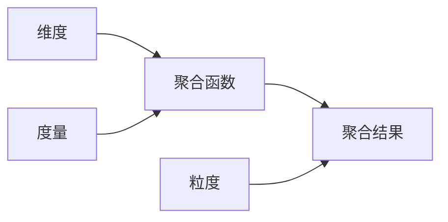
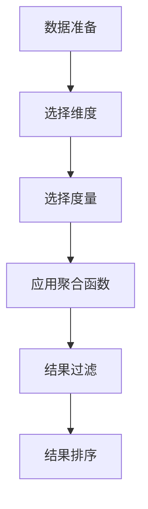

# 聚合分析 原理与代码实例讲解

关键词：聚合分析，数据分析，SQL，大数据，数据仓库

## 1. 背景介绍
### 1.1  问题的由来
在当今大数据时代，企业每天都会产生海量的数据。如何从这些原始数据中快速提取有价值的信息，成为企业数据分析工作的重点和难点。聚合分析作为一种常用的数据分析方法，能够将大量数据汇总到不同维度，揭示数据背后隐藏的规律和趋势，为企业决策提供重要依据。

### 1.2  研究现状
目前，聚合分析已广泛应用于数据仓库、商业智能、在线分析处理（OLAP）等领域。各大数据库厂商如Oracle、MySQL、SQL Server等都提供了强大的聚合分析功能。同时，大数据技术的发展也为聚合分析提供了更多的实现方式，如Hive、Spark SQL等。学术界对聚合分析的研究主要集中在性能优化、算法改进等方面。

### 1.3  研究意义
深入研究聚合分析的原理和实现方法，对于提升数据分析效率、支撑企业决策具有重要意义。一方面，可以帮助分析人员更好地理解和应用聚合分析技术，从海量数据中快速挖掘有价值的信息。另一方面，通过优化聚合分析的性能，可以大幅提升数据处理和分析的速度，为实时业务提供有力支撑。

### 1.4  本文结构
本文将从以下几个方面对聚合分析进行深入探讨：
- 介绍聚合分析的核心概念与联系
- 详细讲解聚合分析的核心算法原理和具体操作步骤
- 构建聚合分析的数学模型，推导相关公式，并结合案例进行分析
- 通过代码实例，演示聚合分析的具体实现过程
- 总结聚合分析的实际应用场景和未来发展趋势
- 推荐聚合分析相关的学习资源、开发工具和研究论文
- 梳理聚合分析领域的常见问题，给出解答思路和方法

## 2. 核心概念与联系
聚合分析的核心概念包括：
- 聚合函数：对一组值执行计算，返回单个值的函数，如SUM、AVG、MAX、MIN、COUNT等。
- 维度：数据分析的角度，如时间维度、地域维度、产品维度等。
- 度量：需要聚合分析的数据指标，一般为数值型，如销售额、利润、数量等。
- 粒度：数据聚合的级别，如年、季度、月、日、小时等。

这些概念之间的关系如下图所示：



在聚合分析中，我们选择一个或多个维度，利用聚合函数对度量值进行计算，在不同粒度下生成对应的聚合结果。例如，统计不同地区、不同产品的月度销售总额，就是一个典型的聚合分析需求。

## 3. 核心算法原理 & 具体操作步骤
### 3.1  算法原理概述
聚合分析的核心是分组与聚合。即先按照指定的维度将数据分成若干组，再对每组数据的度量值应用聚合函数进行计算。以SQL为例，一个典型的聚合分析语句结构如下：

```sql
SELECT 维度1,维度2,...,聚合函数(度量) 
FROM 表名
WHERE 过滤条件
GROUP BY 维度1,维度2,...
HAVING 分组过滤条件
ORDER BY 排序字段
```

其中，GROUP BY子句指定分组维度，聚合函数应用于SELECT子句中的度量字段。WHERE子句对原始数据进行过滤，HAVING子句对聚合后的结果进行过滤。

### 3.2  算法步骤详解
聚合分析算法的一般步骤如下：
1. 数据准备：选择需要分析的数据集，对数据进行清洗和预处理。
2. 选择维度：确定聚合分析的角度，选择一个或多个维度构成分组条件。
3. 选择度量：确定需要聚合计算的数值型指标。 
4. 应用聚合函数：对每个分组内的度量值应用聚合函数进行计算。
5. 结果过滤：根据分析需求，使用HAVING子句对聚合结果进行过滤。
6. 结果排序：按照特定字段对聚合结果进行排序，方便查看。

以上步骤可以用下图表示：



### 3.3  算法优缺点
聚合分析算法的优点包括：
- 计算简单高效，可以快速得到聚合结果。
- 支持多维度、多粒度的灵活分析。
- 与SQL结合紧密，应用范围广泛。

但是，聚合分析算法也存在一些局限性：
- 仅支持数值型的聚合计算，对非数值型数据无能为力。
- 聚合函数种类有限，只能进行简单的统计分析。
- 难以处理数据倾斜问题，可能出现某些分组数据过多的情况。

### 3.4  算法应用领域
聚合分析算法在各个领域都有广泛应用，例如：
- 电商：统计各个类目的销售额、订单量等。
- 游戏：统计各个区服的活跃用户数、充值金额等。
- 金融：统计各个交易所的成交量、交易额等。
- 制造：统计各种设备的产量、合格率等。

聚合分析与OLAP、数据挖掘等技术结合，可以实现更加复杂和智能的分析功能，如多维数据分析、数据预测等。

## 4. 数学模型和公式 & 详细讲解 & 举例说明
### 4.1  数学模型构建
聚合分析可以用数学语言进行抽象描述。假设有 $n$ 个分组 $G_1,G_2,...,G_n$，每个分组 $G_i$ 包含 $m_i$ 个元素。在分组 $G_i$ 上应用聚合函数 $f$，可以得到聚合值 $v_i$。即：

$$
v_i = f(G_i), i=1,2,...,n
$$

其中，$f$ 可以是求和、求平均、求最大最小值等常见聚合函数。

### 4.2  公式推导过程
以求和函数为例，假设分组 $G_i$ 包含的元素为 $\lbrace x_1,x_2,...,x_{m_i}\rbrace$，则求和聚合的数学表达式为：

$$
\begin{aligned}
v_i &= \sum_{j=1}^{m_i} x_j \\
&= x_1 + x_2 + ... + x_{m_i}
\end{aligned}
$$

类似地，求平均函数的数学表达式为：

$$
\begin{aligned}
v_i &= \frac{1}{m_i} \sum_{j=1}^{m_i} x_j \\
&= \frac{x_1 + x_2 + ... + x_{m_i}}{m_i}
\end{aligned}
$$

求最大值函数的数学表达式为：

$$
v_i = \max\lbrace x_1,x_2,...,x_{m_i}\rbrace
$$

求最小值函数的数学表达式为：

$$
v_i = \min\lbrace x_1,x_2,...,x_{m_i}\rbrace
$$

### 4.3  案例分析与讲解
下面以一个具体的例子来说明聚合分析的过程。假设有一张销售数据表 `sales`，包含以下字段：

| 字段 | 类型 | 说明 |
| --- | --- | --- |
| date | DATE | 销售日期 |
| region | VARCHAR(20) | 销售地区 |
| product | VARCHAR(20) | 产品名称 |
| amount | DECIMAL(10,2) | 销售金额 |

现在需要统计2023年一季度各地区的总销售额，SQL语句如下：

```sql
SELECT region, SUM(amount) AS total_amount
FROM sales
WHERE date BETWEEN '2023-01-01' AND '2023-03-31'
GROUP BY region
```

这个查询的聚合分析过程如下：
1. 数据准备：选择 `sales` 表作为数据集。
2. 选择维度：选择 `region` 作为分组维度。
3. 选择度量：选择 `amount` 作为度量值。
4. 应用聚合函数：对每个地区的 `amount` 值求和，生成聚合字段 `total_amount`。
5. 结果过滤：使用 WHERE 子句过滤出2023年一季度的数据。

假设查询结果为：

| region | total_amount |
| --- | --- |
| 华东 | 1000000.00 |
| 华北 | 800000.00 |
| 华南 | 600000.00 |

从结果可以看出，2023年一季度华东地区的总销售额最高，达到100万元，华北和华南地区分别为80万元和60万元。这为销售策略的制定提供了重要参考。

### 4.4  常见问题解答
1. 如何处理NULL值？
   - 在聚合函数中，NULL值一般被忽略。如 SUM、AVG 等函数不会将 NULL 计入运算，但 COUNT 函数例外，NULL 也会被计数。
2. 如何实现行转列？
   - 可以使用 CASE WHEN 语句将不同条件下的聚合值转换为不同列，再用聚合函数统计。也可以用 PIVOT 子句实现行转列。
3. 如何计算占比？
   - 对分子分母分别进行聚合，再用聚合结果相除。可以用 RATIO_TO_REPORT 函数简化占比计算。
4. 如何处理数据倾斜？
   - 数据倾斜会导致某些分组数据过多，可以采取加盐取模、加随机数、分桶等方法进行负载均衡。

## 5. 项目实践：代码实例和详细解释说明
### 5.1  开发环境搭建
以下示例使用 MySQL 8.0 版本进行演示。首先需要安装 MySQL 数据库，并创建示例数据表：

```sql
CREATE TABLE sales (
  `date` DATE,
  `region` VARCHAR(20),
  `product` VARCHAR(20),
  `amount` DECIMAL(10,2)
);

INSERT INTO sales VALUES
('2023-01-01','华东','手机',5000.00),
('2023-01-02','华东','电脑',8000.00),
('2023-01-03','华北','手机',4000.00),
('2023-02-01','华东','平板',3000.00),
('2023-02-02','华北','电脑',9000.00),
('2023-02-03','华南','手机',6000.00),
('2023-03-01','华南','平板',2000.00),
('2023-03-02','华东','电脑',7000.00),
('2023-03-03','华南','手机',5000.00);
```

### 5.2  源代码详细实现
1. 统计各地区的总销售额

```sql
SELECT region, SUM(amount) AS total_amount
FROM sales
GROUP BY region;
```

2. 统计各产品的平均销售额

```sql
SELECT product, AVG(amount) AS avg_amount
FROM sales
GROUP BY product;
```

3. 统计各地区最畅销的产品

```sql
SELECT region, product, SUM(amount) AS total_amount
FROM sales
GROUP BY region, product
HAVING SUM(amount) = (
  SELECT MAX(total)
  FROM (
    SELECT region, product, SUM(amount) AS total
    FROM sales
    GROUP BY region, product
  ) t
  WHERE t.region = sales.region
);
```

4. 统计月度销售额和累计销售额

```sql
SELECT 
  DATE_FORMAT(`date`,'%Y-%m') AS `month`,
  SUM(amount) AS month_amount,
  (SELECT SUM(amount) FROM sales s2 
   WHERE s2.`date` <= s1.`date`) AS total_amount
FROM sales s1
GROUP BY `month`;  
```

### 5.3  代码解读与分析
示例1中，按照 `region` 字段分组，使用 `SUM` 函数对 `amount` 字段求和，生成总销售额字段 `total_amount`。

示例2中，按照 `product` 字段分组，使用 `AVG` 函数对 `amount` 字段求平均值，生成平均销售额字段 `avg_amount`。

示例3中，需要找出每个地区销售额最高的产品。先按 `region