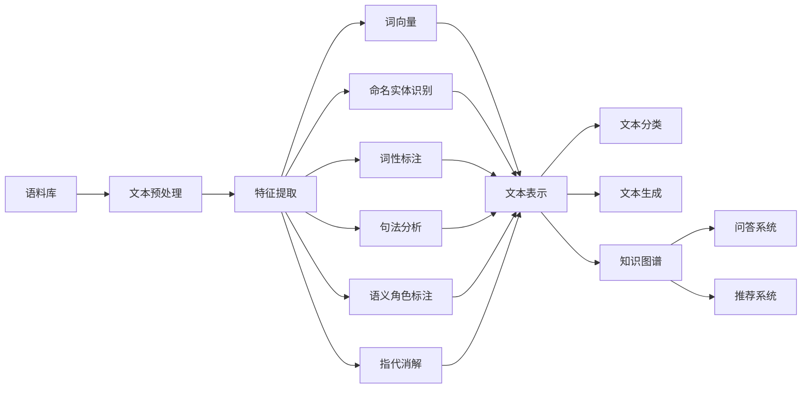

# 自然语言处理(Natural Language Processing) - 原理与代码实例讲解

关键词：自然语言处理、NLP、文本分析、机器学习、深度学习、Transformer、BERT、GPT、知识图谱

## 1. 背景介绍
### 1.1  问题的由来
自然语言处理(Natural Language Processing, NLP)是人工智能(Artificial Intelligence, AI)的一个重要分支,旨在让计算机能够理解、生成和处理人类语言。随着互联网和移动互联网的快速发展,每天都会产生海量的非结构化文本数据,如新闻、博客、社交媒体、用户评论等。如何从这些海量文本数据中快速准确地获取有价值的信息,成为了自然语言处理领域亟待解决的问题。

### 1.2  研究现状
近年来,随着深度学习的兴起,自然语言处理取得了长足的进步。一系列基于深度学习的NLP模型相继被提出,如word2vec、GloVe、FastText等词向量模型,Seq2Seq、Attention等序列建模方法,以及Transformer、BERT、GPT等预训练语言模型,大大提升了各项NLP任务的性能,如机器翻译、文本分类、命名实体识别、关系抽取、问答系统等。

### 1.3  研究意义 
自然语言处理在很多领域都有广泛应用,如搜索引擎、智能客服、舆情监测、知识图谱、医疗健康、金融科技等。通过自然语言处理技术,可以快速分析海量文本数据,挖掘隐藏在文本中的知识和价值,为企业和个人提供更加智能、高效的信息服务。因此,自然语言处理的研究对于推动人工智能在各行各业的落地应用具有重要意义。

### 1.4  本文结构
本文将全面介绍自然语言处理的原理和代码实践。首先,我们将介绍NLP的核心概念和主要任务。然后,重点讲解几种主流的NLP算法,包括传统的机器学习方法和深度学习方法。接着,我们将通过代码实例,演示如何使用Python和一些主流的NLP工具包来实现文本分类、命名实体识别等任务。最后,总结NLP技术的发展趋势和面临的挑战。

## 2. 核心概念与联系

自然语言处理涉及到多个学科领域,包括计算机科学、语言学、统计学等。以下是NLP的一些核心概念:

- 语料库(Corpus):大规模的文本数据集合,用于训练和评估NLP模型。常见的语料库有维基百科、新闻语料库、Twitter数据集等。
- 词向量(Word Embedding):将词映射为实数向量的方法。通过词向量,可以计算词语之间的语义相似度,常见的词向量模型有word2vec、GloVe等。
- 命名实体识别(Named Entity Recognition, NER):从文本中识别出人名、地名、机构名等命名实体。常用的方法有基于规则、统计机器学习和深度学习的方法。
- 词性标注(Part-of-Speech Tagging, POS):为文本中的每个词标注词性,如名词、动词、形容词等。常用的方法有隐马尔可夫模型、条件随机场等。
- 句法分析(Syntactic Parsing):分析句子的语法结构,生成句法树。常用的方法有基于规则的方法和基于统计的方法。
- 语义角色标注(Semantic Role Labeling, SRL):识别句子中的语义角色,如施事、受事、时间、地点等。常用的方法有基于特征工程的方法和基于深度学习的方法。
- 指代消解(Coreference Resolution):确定文本中代词或其他指示语指代的对象。常用的方法有基于规则的方法和基于机器学习的方法。
- 文本分类(Text Classification):将文本分类到预定义的类别中。常用的方法有朴素贝叶斯、支持向量机、卷积神经网络、循环神经网络等。
- 文本生成(Text Generation):根据上下文生成自然语言文本。常用的方法有基于模板的方法、基于统计的方法和基于深度学习的方法。
- 知识图谱(Knowledge Graph):以图的形式表示实体及其关系的知识库。知识图谱可以用于问答、推荐等任务。常见的知识图谱有Freebase、DBpedia等。

这些概念之间有着密切的联系。例如,词向量可以作为各种NLP任务的输入特征。命名实体识别、词性标注、句法分析等任务可以为知识图谱构建提供重要的语言学特征。文本分类、文本生成等任务可以利用知识图谱中的知识。因此,全面理解和掌握这些概念,对于开展NLP研究和应用非常重要。

## 3. 核心算法原理 & 具体操作步骤

### 3.1 算法原理概述
自然语言处理的核心是将非结构化的文本数据转化为结构化的表示,并利用这些表示完成各种NLP任务。传统的NLP方法主要基于人工定义的特征和规则,如词袋模型(Bag-of-Words)、TF-IDF等。这些方法的优点是简单直观,但无法很好地刻画词语和句子的语义信息。

随着深度学习的发展,一系列神经网络模型被引入到NLP领域,极大地提升了NLP任务的性能。这些模型可以端到端地学习文本的分布式表示,自动提取高级语义特征。下面重点介绍几种主流的NLP深度学习算法。

### 3.2 算法步骤详解

#### 3.2.1 词向量(Word Embedding)

词向量是一种将词映射为实数向量的方法,可以刻画词语之间的语义关系。常见的词向量模型包括:

- Word2Vec:由Google提出,包括CBOW和Skip-Gram两种架构。CBOW根据上下文预测中心词,Skip-Gram根据中心词预测上下文。
- GloVe:由斯坦福大学提出,基于全局词频统计,通过最小化重构损失来学习词向量。
- FastText:由Facebook提出,在Word2Vec的基础上引入了字符级别的n-gram特征,可以更好地处理未登录词。

词向量的训练步骤如下:
1. 对语料库进行预处理,如分词、去停用词、转小写等。
2. 构建词汇表,将每个词映射为唯一的整数ID。
3. 定义词向量矩阵,初始化为随机值。
4. 定义损失函数,如负采样损失、层序softmax损失等。
5. 使用随机梯度下降等优化算法训练词向量矩阵,最小化损失函数。
6. 得到训练好的词向量,可用于下游NLP任务。

#### 3.2.2 循环神经网络(Recurrent Neural Network, RNN)

RNN是一种适合处理序列数据的神经网络模型,广泛用于NLP任务。RNN可以根据当前输入和之前的隐藏状态来更新隐藏状态,从而捕捉序列的长距离依赖关系。常见的RNN变体有LSTM和GRU,引入了门控机制来缓解梯度消失问题。

RNN的训练步骤如下:
1. 将输入文本序列映射为词向量序列。
2. 定义RNN模型,包括输入层、隐藏层和输出层。
3. 根据任务定义损失函数,如交叉熵损失、平方损失等。
4. 使用反向传播算法计算梯度,更新模型参数。
5. 不断迭代,直到模型收敛或达到预定的迭代次数。

#### 3.2.3 卷积神经网络(Convolutional Neural Network, CNN)

CNN最初用于图像识别,后来也被引入到NLP领域。CNN通过卷积和池化操作,可以提取局部特征并降低维度。在文本分类、情感分析等任务中,CNN可以自动学习n-gram特征,无需人工设计特征。

CNN的训练步骤如下:
1. 将输入文本转化为词向量矩阵。
2. 定义CNN模型,包括卷积层、池化层和全连接层。
3. 根据任务定义损失函数和评估指标。
4. 使用梯度下降算法优化模型参数。
5. 在验证集上评估模型性能,调整超参数。
6. 在测试集上评估模型的泛化能力。

#### 3.2.4 Transformer

Transformer是一种基于自注意力机制(Self-Attention)的神经网络模型,摒弃了RNN中的循环结构,可以更高效地并行计算。Transformer在机器翻译、阅读理解等任务上取得了显著的性能提升。

Transformer的训练步骤如下:
1. 对输入序列进行词嵌入(Word Embedding)和位置编码(Positional Encoding)。
2. 将编码后的序列输入到若干个Transformer Block中,每个Block包括多头自注意力(Multi-Head Attention)和前馈神经网络(Feed-Forward Network)。
3. 在Encoder的输出上添加线性层和Softmax层,得到每个位置的概率分布。
4. 使用交叉熵损失函数,计算预测概率分布与真实标签之间的差异。
5. 通过反向传播算法更新模型参数,最小化损失函数。
6. 重复以上步骤,直到模型收敛或达到预定的迭代次数。

### 3.3 算法优缺点

- 词向量的优点是可以刻画词语之间的语义关系,缺点是无法解决一词多义问题。
- RNN的优点是可以处理任意长度的序列,缺点是难以并行计算,训练时间长。
- CNN的优点是可以提取局部特征,训练速度快,缺点是难以捕捉长距离依赖关系。 
- Transformer的优点是可以并行计算,处理长序列,缺点是计算复杂度高,需要大量的训练数据。

### 3.4 算法应用领域

- 词向量可以用于文本分类、聚类、信息检索等任务。
- RNN可以用于机器翻译、文本生成、序列标注等任务。
- CNN可以用于文本分类、情感分析、句子建模等任务。
- Transformer可以用于机器翻译、阅读理解、文本摘要等任务。

## 4. 数学模型和公式 & 详细讲解 & 举例说明

### 4.1 数学模型构建

自然语言处理任务可以形式化为一个函数学习问题。给定一个输入文本序列 $\mathbf{x}=(x_1,\dots,x_T)$,其中 $x_t$ 表示第 $t$ 个词,目标是学习一个函数 $f:\mathbf{x} \rightarrow \mathbf{y}$,将输入序列映射为输出序列 $\mathbf{y}=(y_1,\dots,y_{T'})$。输出序列可以是离散的类别标签、词性标签、命名实体标签等,也可以是连续的概率值或实数向量。

假设函数 $f$ 由参数 $\theta$ 定义,我们的目标是找到最优的参数 $\theta^*$,使得预测函数 $f(x;\theta)$ 在训练数据上的损失最小化:

$$
\theta^* = \arg\min_\theta \sum_{(\mathbf{x},\mathbf{y})\in D} L(f(\mathbf{x};\theta), \mathbf{y})
$$

其中,$D$ 表示训练数据集,$L$ 表示损失函数,衡量预测值与真实值之间的差异。

### 4.2 公式推导过程

以下以词向量模型Word2Vec的Skip-Gram架构为例,推导其数学公式。

Skip-Gram的目标是根据中心词预测上下文词。假设词汇表大小为 $V$,词向量维度为 $d$,词向量矩阵为 $\mathbf{W} \in \mathbb{R}^{V \times d}$。给定一个中心词 $w_c$,Skip-Gram的目标是最