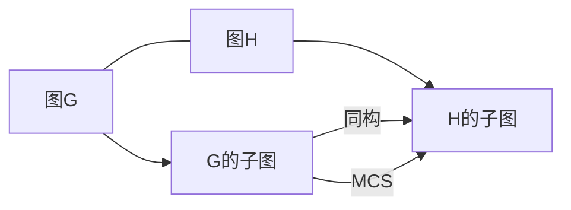
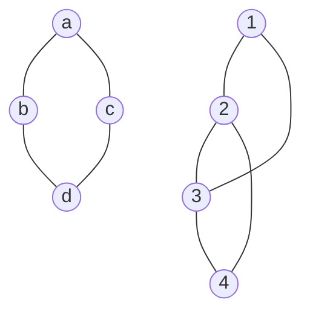

# 计算：第四部分 计算的极限 第 9 章 计算复杂性 图同构问题

作者：禅与计算机程序设计艺术 / Zen and the Art of Computer Programming 

## 1. 背景介绍
### 1.1  问题的由来
图论作为离散数学的重要分支,在计算机科学、人工智能、生物信息学等领域有着广泛的应用。其中,图同构问题是图论中一个基本而又极具挑战性的问题。判断两个图是否同构,乍一看似乎很简单,但实际上却是一个至今仍未被完全解决的难题。图同构问题不仅对图论本身的发展具有重要意义,更在密码学、化学、生物学等诸多领域有着实际应用价值。

### 1.2  研究现状
目前,图同构问题尚未找到多项式时间复杂度的算法。现有的解决方案,如Ullmann算法、VF2算法等,在理论上都是指数级别的时间复杂度。虽然一些特殊类型的图,如树、平面图等,已经有了高效的同构判定算法,但对于一般图来说,多项式时间算法仍是一个公开问题。近年来,随着复杂网络研究的深入,图同构问题在社交网络匹配、生物网络比对等实际场景中得到了新的应用,进一步推动了相关理论的发展。

### 1.3  研究意义 
研究图同构问题,不仅有助于图论算法的进步,更对诸多交叉学科领域具有重要意义:

(1)在密码学中,很多加密算法都是基于找到某些特定图的同构问题的困难性。若图同构问题被证明是多项式时间可解的,则意味着这些密码体制可能被攻破。

(2)在化学中,分子结构可以用图来表示,判断两个分子是否同构,实质上就是判断相应的分子图是否同构。高效的图同构算法,将极大促进分子结构比对、药物筛选等研究。 

(3)在人工智能领域,图同构在图像识别、场景匹配等问题中有重要应用。解决图同构问题,有助于提升模式识别的效率和精度。

(4)在生物信息学中,蛋白质互作网络、基因调控网络等都可以用图模型来刻画。发掘不同物种、组织间网络的同构关系,对于理解生命系统的演化、功能至关重要。

### 1.4  本文结构
本文将围绕图同构问题展开深入探讨。第2部分给出图同构问题的形式化定义,并阐述其与子图同构、最大公共子图等问题的关系。第3部分重点介绍图同构问题的几种主要算法,并分析其原理、复杂度和优化技术。第4部分从数学角度对图同构问题进行建模,给出基于群论、线性代数的理论分析。第5部分通过实际代码实例,演示图同构算法的具体实现。第6部分讨论图同构在密码学、化学、模式识别等领域的典型应用场景。第7部分推荐图同构问题的学习资源和研究工具。第8部分对全文进行总结,并展望图同构问题的研究前景与挑战。

## 2. 核心概念与联系

图同构问题的核心是判断两个图在结构上是否等价。形式化地说,对于两个简单无向图G1=(V1,E1)和G2=(V2,E2),若存在一个双射f:V1→V2,使得对任意的u,v∈V1,有(u,v)∈E1当且仅当(f(u),f(v))∈E2,则称G1和G2是同构的,记为G1≌G2。其中,双射f称为G1到G2的一个同构映射。直观地看,两个图同构的充要条件是,可以通过适当的顶点重标号,使得它们的邻接矩阵完全一致。

图同构与其他一些图问题密切相关:

- 子图同构(Subgraph Isomorphism):给定图G和H,判断H是否与G的某个子图同构。子图同构是图同构的推广,其判定问题是NP完全的。 

- 最大公共子图(Maximum Common Subgraph,MCS):给定图G1和G2,找到它们的最大公共子图,即同时与G1和G2同构的最大子图。MCS问题在化学信息学、计算机视觉等领域有重要应用。

- 图的规范标号(Canonical Labeling):对图G的顶点进行重新标号,使得无论G的初始标号如何,其规范标号都是唯一的。图的规范标号问题与图同构问题是多项式等价的。

下图展示了图同构、子图同构、最大公共子图三者之间的关系:

## 3. 核心算法原理 & 具体操作步骤
### 3.1  算法原理概述
解决图同构问题的算法,大致可分为三类:

(1) 基于回溯搜索的精确算法,如Ullmann算法、VF2算法等。这类算法采用深度优先搜索策略,穷举所有可能的顶点映射,直到找到同构映射或穷尽整个搜索空间。理论上,它们的最坏时间复杂度都是指数级的。

(2) 基于规范标号的精确算法,如Nauty算法、Traces算法等。这类算法先计算输入图的某种规范标号,然后比较两个图的规范标号是否一致。规范标号往往基于图的自同构群,计算复杂度较高。

(3) 基于图不变量的启发式算法。图不变量是指与图的标号无关的某些特征量,如点数/边数、度序列等。若两个图同构,则它们的图不变量必然相等。因此,可以用图不变量作为过滤条件,快速判断两图不同构。这类方法一般只能给出必要条件,难以保证充分性。

### 3.2  算法步骤详解
以经典的Ullmann算法为例,其基本步骤如下:

输入:图G1=(V1,E1),图G2=(V2,E2),其中|V1|=|V2|=n。
输出:G1和G2之间的同构映射f,或不存在。

(1) 初始化n×n的布尔矩阵M,M[i][j]=1表示V1中的顶点i可能映射到V2中的顶点j。

(2) 从M中选择一个未确定的顶点映射(i,j),令f(i)=j,并将M中第i行和第j列的其他元素置为0。

(3) 根据同构映射的定义,对M进行一致性检查:对于每个与i相邻的顶点k,若(k,l)∈E1,则要求(f(k),f(l))∈E2;否则,要回溯并尝试其他映射。

(4) 重复步骤(2)和(3),直到找到完整的同构映射,或穷举了所有可能的映射。

可以看出,Ullmann算法本质上是一个带回溯的深度优先搜索过程。为了提高搜索效率,可以引入一些剪枝策略,如先比较两图的度序列、邻域结构等,尽早发现不可能的映射。此外,选择映射时优先考虑度数较大的顶点,也有助于减少搜索空间。

### 3.3  算法优缺点
Ullmann算法的主要优点是:
- 思路简单,易于实现。
- 适用于任意两个简单图,没有特殊限制。
- 若两图同构,则一定能找到一个同构映射。

其缺点包括:
- 最坏情况下需要O(n!)的搜索次数,时间复杂度很高。
- 没有考虑图的对称性,存在大量冗余计算。
- 缺乏有效的启发式信息,剪枝策略有限。

针对这些不足,后续的VF、VF2、LAD等算法都做了相应的改进和优化。但总的来说,图同构问题的精确算法目前仍无法突破指数级的复杂度瓶颈。

### 3.4  算法应用领域
尽管复杂度很高,图同构算法在一些规模较小的应用场景中还是发挥着重要作用,如:

- 在分子数据库中,根据结构相似性搜索同构或近似同构的分子。
- 在社交网络中,识别不同网络之间的对应用户。
- 在电路设计中,判断两个电路原理图是否等价。
- 在软件工程中,检测代码克隆、比对数据流图等。

此外,图同构算法还是解决其他一些图问题的基础,如求解最大公共子图、图规范化、图核学习等。对图同构问题的深入研究,有助于推动图论算法在更广领域的应用。

## 4. 数学模型和公式 & 详细讲解 & 举例说明
### 4.1  数学模型构建
从数学角度看,判断两个图是否同构,可以归结为寻找图的自同构群。对于图G=(V,E),其自同构群Aut(G)定义为:

$$
Aut(G)=\{f:V \to V | \forall u,v \in V, (u,v) \in E \Leftrightarrow (f(u),f(v)) \in E\}
$$

即Aut(G)是G到自身的所有同构映射的集合,显然它在映射复合运算下构成一个群。直观地说,Aut(G)刻画了图G的对称性,即在保持边关系不变的前提下,顶点可以进行的所有置换。

若图G1和G2同构,则Aut(G1)和Aut(G2)必然同构。进一步,G1到G2的任一同构映射f,都对应了Aut(G1)到Aut(G2)的一个群同构。因此,要判定两图是否同构,只需比较它们的自同构群是否同构。

### 4.2  公式推导过程
基于自同构群的图同构判定算法,一般包括两个主要步骤:

(1) 计算输入图G的自同构群Aut(G)。这可以通过搜索G的所有顶点置换,并检查每个置换是否保持边关系不变来实现。但由于置换的数量高达n!,暴力搜索的复杂度是阶乘级的。

为了降低复杂度,可以利用Aut(G)的一些性质进行优化,如:
- Aut(G)的任意元素都将G的每个连通分支映射到其自身。
- 若f∈Aut(G),则对任意v∈V,f(v)和v的度数必须相等。
- 对于G的任一顶点子集S,Aut(G)在S上的作用也构成一个置换群。

利用这些性质,可以设计出更高效的Aut(G)计算算法,如Nauty算法、Traces算法等。这些算法通过逐步细化顶点分类,构造出G的规范标号,从而得到Aut(G)的生成元。

(2) 比较两个图G1和G2的自同构群是否同构。这等价于判断Aut(G1)和Aut(G2)作为置换群是否同构。经典的置换群同构算法有Luks算法,其基本思想是:
- 先计算两个置换群的组合不变量,如阶、迹、循环类型等,作为初步的过滤条件。
- 然后枚举其中一个置换群的所有生成元集,检查是否存在一个与另一个置换群的生成元集构成双射。
- 若找到了这样的双射,则说明两个置换群同构,否则不同构。

Luks算法的时间复杂度为$O(n^{O(d)})$,其中n为置换集合的大小,d为置换群的生成元个数。可以看出,置换群同构问题虽然比一般的图同构问题简单一些,但复杂度仍然很高。

### 4.3  案例分析与讲解
下面我们以一个具体的例子,来说明如何利用自同构群判定图的同构性。

考虑两个无向图G1和G2:

可以验证,G1和G2是同构的,且它们之间存在两个同构映射:
- f1:1→a,2→b,3→c,4→d
- f2