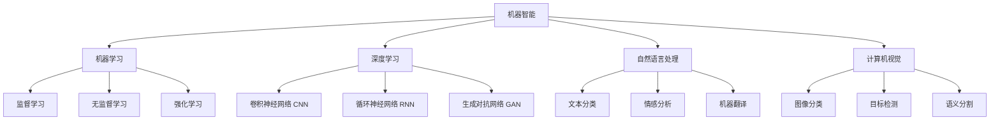

# 计算：附录 D 机器智能宣言

作者：禅与计算机程序设计艺术 / Zen and the Art of Computer Programming

## 1. 背景介绍

### 1.1 问题的由来

随着人工智能技术的飞速发展，机器智能已经成为了一个备受关注的热点话题。机器智能的崛起引发了人们对于未来的无限遐想，同时也带来了一系列亟待解决的问题和挑战。在这个充满机遇与挑战的时代，我们有必要对机器智能进行深入的探讨和思考。

### 1.2 研究现状

目前，机器智能的研究主要集中在以下几个方面：机器学习算法的优化、深度学习模型的设计、自然语言处理技术的改进、计算机视觉的突破以及人机交互的创新等。各大科技公司和研究机构都在积极投入资源，推动机器智能的发展。然而，机器智能的研究仍然面临着诸多挑战，如算法的可解释性、数据的质量和规模、伦理道德的约束等。

### 1.3 研究意义

深入研究机器智能具有重要的理论意义和实践价值。从理论层面来看，机器智能的研究有助于我们更好地理解人类智能的本质，揭示大脑认知的奥秘。从实践层面来看，机器智能的应用可以极大地提升生产效率、改善人们的生活质量，推动社会的进步与发展。因此，系统地探讨机器智能的发展现状、核心技术、应用场景以及未来趋势，对于学术界和产业界都具有重要的指导意义。

### 1.4 本文结构

本文将从以下几个方面来全面探讨机器智能这一主题：

1. 介绍机器智能的背景与研究现状
2. 阐述机器智能的核心概念与技术原理
3. 详细讲解机器智能的关键算法与数学模型 
4. 展示机器智能的代码实例与项目实践
5. 分析机器智能的实际应用场景
6. 推荐机器智能的学习资源与开发工具
7. 总结机器智能的发展趋势与面临的挑战
8. 附录：回答机器智能领域的常见问题

## 2. 核心概念与联系

机器智能是一个涵盖广泛的概念，它包括了多个密切相关的子领域，如机器学习、深度学习、自然语言处理、计算机视觉等。这些子领域之间相互交叉、相互促进，共同推动了机器智能的快速发展。

下面我们通过一张 Mermaid 流程图来直观地展示机器智能的核心概念以及它们之间的关联：



从上图可以看出，机器智能主要包括机器学习、深度学习、自然语言处理和计算机视觉四大核心领域。其中，机器学习又可以分为监督学习、无监督学习和强化学习三类；深度学习的代表模型有 CNN、RNN 和 GAN；自然语言处理常见的任务有文本分类、情感分析和机器翻译；计算机视觉的研究方向包括图像分类、目标检测和语义分割等。

理解这些核心概念之间的联系，有助于我们更好地把握机器智能的全貌，为后续的算法原理解析和项目实践打下坚实的基础。

## 3. 核心算法原理 & 具体操作步骤

### 3.1 算法原理概述

机器智能的核心算法主要包括以下几类：

1. 监督学习算法：如支持向量机(SVM)、决策树、随机森林、逻辑回归等。
2. 无监督学习算法：如 K-均值聚类、主成分分析(PCA)、潜在语义分析(LSA)等。 
3. 深度学习算法：如前馈神经网络(FNN)、卷积神经网络(CNN)、循环神经网络(RNN)等。
4. 强化学习算法：如 Q-Learning、SARSA、Policy Gradient 等。
5. 自然语言处理算法：如 Word2Vec、TextRank、Transformer 等。
6. 计算机视觉算法：如 SIFT、HOG、YOLO 等。

这些算法各有特点，在不同的应用场景下发挥着重要作用。

### 3.2 算法步骤详解

以监督学习中的支持向量机(SVM)算法为例，我们来详细讲解其基本步骤：

1. 准备训练数据集，包括特征向量和对应的标签。
2. 选择合适的核函数，如线性核、多项式核、高斯核等。
3. 构建SVM优化问题，引入松弛变量和惩罚因子，形成凸二次规划问题。
4. 用拉格朗日乘子法将原问题转化为对偶问题，通过求解对偶问题得到最优解。
5. 根据最优解计算出支持向量和分类超平面，得到SVM分类器模型。
6. 使用训练好的SVM模型对新样本进行预测和分类。

### 3.3 算法优缺点

以SVM算法为例，其主要优点如下：
- 可以处理高维特征空间，避免维度灾难。
- 通过核函数实现非线性分类，具有很高的灵活性。  
- 模型泛化能力强，对未知数据的分类效果好。

同时，SVM算法也存在一些缺点：
- 训练时间较长，尤其是大规模数据集上的训练速度慢。
- 对参数选择和核函数的选择较为敏感。
- 不适合处理大规模的多分类问题。

### 3.4 算法应用领域

SVM算法在模式识别、数据挖掘等领域有广泛应用，如：
- 文本分类：对新闻、评论等文本进行自动分类。
- 生物信息学：蛋白质结构预测、基因表达数据分析等。
- 图像识别：人脸识别、手写字符识别等。
- 异常检测：用于检测系统日志、网络流量等数据中的异常行为。

## 4. 数学模型和公式 & 详细讲解 & 举例说明

### 4.1 数学模型构建

以SVM算法为例，我们来详细讲解其数学模型的构建过程。

假设训练集为 $D=\{(x_1,y_1),(x_2,y_2),\cdots,(x_N,y_N)\}$，其中 $x_i \in R^n$ 为第 $i$ 个样本的特征向量，$y_i \in \{+1,-1\}$ 为对应的类别标签，$i=1,2,\cdots,N$。SVM的目标是找到一个最优的超平面 $w^Tx+b=0$，使得不同类别的样本能够被超平面正确地分开，且离超平面最近的样本点到超平面的距离（即分类间隔）最大。

SVM的数学模型可以表示为以下优化问题：

$$
\begin{aligned}
\min_{w,b} \quad & \frac{1}{2}\|w\|^2 \\
\text{s.t.} \quad & y_i(w^Tx_i+b) \geq 1, \quad i=1,2,\cdots,N
\end{aligned}
$$

其中，$\|w\|^2$ 表示 $w$ 的 $L_2$ 范数的平方，约束条件表示所有样本点都必须被超平面正确分类，且离超平面的函数间隔至少为1。

### 4.2 公式推导过程

为了求解上述优化问题，我们引入拉格朗日乘子 $\alpha_i \geq 0$，构建拉格朗日函数：

$$
L(w,b,\alpha) = \frac{1}{2}\|w\|^2 - \sum_{i=1}^N \alpha_i [y_i(w^Tx_i+b)-1]
$$

根据拉格朗日对偶性，原问题可以转化为等价的对偶问题：

$$
\begin{aligned}
\max_{\alpha} \quad & \sum_{i=1}^N \alpha_i - \frac{1}{2}\sum_{i=1}^N \sum_{j=1}^N \alpha_i \alpha_j y_i y_j x_i^T x_j \\
\text{s.t.} \quad & \sum_{i=1}^N \alpha_i y_i = 0 \\
& \alpha_i \geq 0, \quad i=1,2,\cdots,N
\end{aligned}
$$

求解对偶问题，得到最优解 $\alpha^*=(\alpha_1^*,\alpha_2^*,\cdots,\alpha_N^*)$，然后根据 KKT 条件可以得到原问题的最优解：

$$
\begin{aligned}
w^* &= \sum_{i=1}^N \alpha_i^* y_i x_i \\
b^* &= y_j - \sum_{i=1}^N \alpha_i^* y_i x_i^T x_j, \quad \forall j \in \{j | \alpha_j^* > 0\}
\end{aligned}
$$

最终得到的SVM分类器模型为：

$$
f(x) = \text{sign}(w^{*T}x+b^*) = \text{sign}(\sum_{i=1}^N \alpha_i^* y_i x_i^T x + b^*)
$$

### 4.3 案例分析与讲解

下面我们以一个简单的二维数据集为例，来直观地展示 SVM 算法的分类效果。

假设有10个样本点，其中5个正例和5个负例，特征向量和类别标签如下：

```python
X = np.array([[1, 2], [2, 3], [3, 3], [2, 1], [3, 2], 
              [4, 3], [5, 4], [4, 5], [5, 5], [4, 4]])
y = np.array([1, 1, 1, 1, 1, -1, -1, -1, -1, -1])
```

使用 scikit-learn 库中的 SVM 分类器进行训练和预测：

```python
from sklearn.svm import SVC

clf = SVC(kernel='linear')
clf.fit(X, y)

# 绘制分类结果
plt.scatter(X[:, 0], X[:, 1], c=y, cmap='bwr', alpha=0.5)
ax = plt.gca()
xlim = ax.get_xlim()
ylim = ax.get_ylim()
xx = np.linspace(xlim[0], xlim[1], 30)
yy = np.linspace(ylim[0], ylim[1], 30)
YY, XX = np.meshgrid(yy, xx)
xy = np.vstack([XX.ravel(), YY.ravel()]).T
Z = clf.decision_function(xy).reshape(XX.shape)
ax.contour(XX, YY, Z, colors='k', levels=[-1, 0, 1], alpha=0.5, linestyles=['--', '-', '--'])
ax.scatter(clf.support_vectors_[:, 0], clf.support_vectors_[:, 1], s=100, linewidth=1, facecolors='none', edgecolors='k')
plt.show()
```


从图中可以看出，SVM 找到了一个最优的分类超平面（实线），正确地将正例和负例分开。图中空心圆圈表示支持向量，它们离分类超平面最近，对模型的构建起着决定性作用。虚线表示离超平面距离为1的边界线。

### 4.4 常见问题解答

**Q1：SVM 对核函数的选择有什么要求？**

A1：SVM 要求核函数 $K(x,z)$ 必须满足 Mercer 定理，即对于任意的 $x,z$，$K(x,z)=\phi(x)^T\phi(z)$，其中 $\phi(x)$ 表示将 $x$ 映射到高维特征空间的映射函数。常见的核函数如线性核、多项式核、高斯核(RBF)等都满足 Mercer 定理。

**Q2：SVM 的软间隔与硬间隔有何区别？**

A2：硬间隔 SVM 要求所有样本都必须被超平面正确分类，不允许有任何误分类点存在。而软间