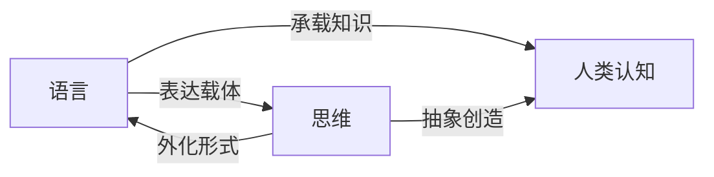

# 语言≠思维：大模型的认知障碍

## 1. 背景介绍
### 1.1 问题的由来
近年来，随着深度学习技术的飞速发展，大规模语言模型如GPT-3、PaLM、Megatron-Turing NLG等不断涌现。这些大模型展现出了令人惊叹的自然语言处理能力，在对话、写作、问答等多个任务上取得了接近甚至超越人类的表现。然而，在人们为之欢呼雀跃的同时，一个值得深思的问题逐渐浮出水面：语言能力是否等同于思维能力？大模型是否真的具备类人的认知和理解能力？

### 1.2 研究现状
目前，学术界对大模型的认知能力存在不同看法。一些研究者认为，大模型强大的语言建模和生成能力，表明其已经具备了一定程度的理解和思考能力。但也有学者提出质疑，认为大模型更多是对海量语料的统计学习，本质上是复杂的"语言搭积木"，缺乏人类思维所具备的抽象、推理、创造等高级认知能力。这一争议引发了学界对语言与思维关系的重新审视。

### 1.3 研究意义
探讨大模型的认知障碍，对于深入理解人工智能的本质和局限性具有重要意义。一方面，它有助于厘清语言能力与思维能力的区别与联系，推动认知科学和人工智能理论的发展。另一方面，它为大模型的应用和改进指明了方向，避免对其能力的过度解读和滥用，同时为未来更高级的认知AI系统研发提供思路。

### 1.4 本文结构
本文将从以下几个方面展开论述：
- 首先，梳理语言与思维的关系，分析二者的异同。
- 其次，剖析大模型的工作原理，指出其在认知方面的内在局限。 
- 再次，从符号操作、概念抽象、因果推理、目标规划等角度，论证大模型与人类思维的本质差异。
- 最后，展望未来认知AI系统的发展路径，提出可能的技术方向和挑战。

## 2. 核心概念与联系
要探讨大模型的认知障碍，首先需要厘清两个核心概念：语言与思维。

语言是人类表达和交流思想的符号系统，包括词汇、语法等要素。语言具有任意性、线性性、结构性等特点。不同语言在表层形式上存在差异，但在深层语义上具有一定的普遍性。

思维则是人脑对客观世界的反映，是认识事物本质、规律的高级认知活动。思维包括感知、记忆、想象、判断、推理等多个环节。抽象概括、逻辑推理是思维的基本规律。

语言与思维密切相关但又不完全等同。一方面，语言是思维的载体和外化形式，语言符号承载了人类积累的知识和经验。另一方面，思维超越了语言的局限，人脑可以进行语言难以表达的抽象思考和创造性活动。语言能力是思维能力的必要但非充分条件。



## 3. 核心算法原理 & 具体操作步骤
### 3.1 算法原理概述
主流的大规模语言模型如GPT-3、PaLM等，基本采用Transformer的编码器-解码器架构。模型通过自监督学习，在大规模无标注文本语料上进行预训练，学习语言的统计规律和隐含语义。预训练后的模型可以通过少量样本或提示微调，应用于下游的各种自然语言任务。

### 3.2 算法步骤详解
以GPT-3为例，其训练过程可分为以下步骤：

1. 语料准备：收集海量高质量的无标注文本语料，覆盖各个领域。
2. 文本预处理：对语料进行清洗、分词、编码等预处理，转化为模型可以接受的输入格式。
3. 模型构建：搭建基于Transformer的自回归语言模型，包括多层的注意力机制和前馈神经网络。
4. 预训练：使用极大似然估计，让模型学习给定上文预测下一个词的条件概率。损失函数通常为交叉熵。
5. 微调与应用：在下游任务的小样本数据上微调预训练模型，或者通过提示工程引导模型执行任务。


### 3.3 算法优缺点
大规模语言模型的优点在于：
- 通过自监督学习，充分利用无标注数据，减少人工标注成本。
- 模型参数量巨大，可以学习语言的深层模式和知识。
- 通用性强，可以应用于多种自然语言任务。
- 效果出色，在许多任务上接近甚至超越人类表现。

但其缺点也不容忽视：
- 训练和推理成本高昂，对算力和数据规模要求极高。
- 模型是黑盒，缺乏可解释性，难以分析其内部机制。
- 容易产生幻觉，对事实性和逻辑一致性把控不足。
- 在认知能力和常识推理等方面存在先天局限。

### 3.4 算法应用领域
大规模语言模型已在多个领域得到广泛应用，如：
- 智能对话：客服机器人、虚拟助手等。
- 内容生成：文案撰写、文本摘要、机器翻译等。
- 信息抽取：命名实体识别、关系抽取、事件抽取等。
- 知识问答：开放域问答、阅读理解等。

## 4. 数学模型和公式 & 详细讲解 & 举例说明
### 4.1 数学模型构建
大规模语言模型的核心是建立文本序列的概率分布模型。给定一个长度为$n$的文本序列$x=(x_1,x_2,...,x_n)$，语言模型的目标是估计其概率$P(x)$。根据概率论的链式法则，这个概率可以分解为：

$$P(x)=\prod_{i=1}^n P(x_i|x_1,x_2,...,x_{i-1})$$

其中$P(x_i|x_1,x_2,...,x_{i-1})$表示在给定前$i-1$个词的上下文下，第$i$个词$x_i$出现的条件概率。语言模型的任务就是学习这个条件概率分布。

### 4.2 公式推导过程
在Transformer的自注意力机制中，第$l$层第$i$个位置的隐状态$h_i^l$的计算公式为：

$$h_i^l=\sum_{j=1}^n \alpha_{ij}(W_V h_j^{l-1})$$

其中，$\alpha_{ij}$是注意力权重，表示位置$i$对位置$j$的注意力分配，计算公式为：

$$\alpha_{ij}=\frac{\exp(e_{ij})}{\sum_{k=1}^n \exp(e_{ik})}$$

$$e_{ij}=\frac{(W_Q h_i^{l-1})(W_K h_j^{l-1})^T}{\sqrt{d}}$$

$W_Q,W_K,W_V$是可学习的参数矩阵，$d$是隐状态维度。

Transformer的解码器在生成第$t$个词$x_t$时，计算公式为：

$$P(x_t|x_1,x_2,...,x_{t-1})=\mathrm{softmax}(W_o h_t^L)$$

其中$h_t^L$是解码器最后一层第$t$个位置的隐状态，$W_o$是输出层的参数矩阵。

### 4.3 案例分析与讲解
我们以一个简单的例子来说明语言模型的工作原理。假设有一个句子"The cat sat on the mat"，我们希望计算其概率。

首先，将句子编码为数字序列：
```
The cat sat on the mat
 1   2   3  4  1   5
```
然后，语言模型逐词计算条件概率：
- $P(1|)=P(\mathrm{The}|)$
- $P(2|1)=P(\mathrm{cat}|\mathrm{The})$
- $P(3|1,2)=P(\mathrm{sat}|\mathrm{The,cat})$
- ...
- $P(5|1,2,3,4,1)=P(\mathrm{mat}|\mathrm{The,cat,sat,on,the})$

最后，将各词的条件概率相乘，得到整个句子的概率估计：

$$P(\mathrm{The,cat,sat,on,the,mat})=P(1|)P(2|1)P(3|1,2)P(4|1,2,3)P(1|1,2,3,4)P(5|1,2,3,4,1)$$

语言模型通过最小化这个概率分布与真实文本数据的交叉熵，来学习人类语言的统计规律。

### 4.4 常见问题解答
Q: 为什么语言模型使用自回归而不是自编码？
A: 自编码语言模型如BERT，主要用于自然语言理解任务。而自回归语言模型如GPT，则侧重于自然语言生成任务。两者各有侧重，可以互补。

Q: 为什么要使用自注意力机制？
A: 相比RNN等序列模型，自注意力机制可以更高效地建模长程依赖，并且便于并行计算。同时注意力权重也赋予了模型一定的可解释性。

Q: 除了文本生成外，语言模型还可以完成哪些自然语言任务？  
A: 通过引入特殊标记如[CLS]和[SEP]，语言模型可以用于文本分类、序列标注、自然语言推理等理解任务。通过引入任务描述和少量样本，语言模型还可以进行少样本学习，完成问答、摘要等生成任务。

## 5. 项目实践：代码实例和详细解释说明
### 5.1 开发环境搭建
本节我们将使用PyTorch和Hugging Face的Transformers库，来搭建一个基于GPT-2的文本生成模型。首先安装所需库：

```bash
pip install torch transformers
```

### 5.2 源代码详细实现
完整的代码实现如下：

```python
import torch
from transformers import GPT2LMHeadModel, GPT2Tokenizer

# 加载预训练的GPT-2模型和分词器
model = GPT2LMHeadModel.from_pretrained('gpt2')
tokenizer = GPT2Tokenizer.from_pretrained('gpt2')

# 设置生成参数
max_length = 100
num_return_sequences = 3
prompt = "Once upon a time,"

# 对提示词编码
input_ids = tokenizer.encode(prompt, return_tensors='pt')

# 生成文本
output = model.generate(
    input_ids, 
    max_length=max_length,
    num_return_sequences=num_return_sequences,
    no_repeat_ngram_size=2,
    early_stopping=True
)

# 解码并打印生成的文本
for i in range(num_return_sequences):
    generated_text = tokenizer.decode(output[i], skip_special_tokens=True)
    print(f"Generated text {i+1}: {generated_text}")
```

### 5.3 代码解读与分析
- 第1-2行：导入PyTorch和Transformers库。
- 第5-6行：加载预训练的GPT-2模型和对应的分词器。
- 第9-11行：设置生成参数，包括最大长度、生成句子数量和提示词。
- 第14行：对提示词进行编码，转化为模型可接受的输入张量。
- 第17-22行：调用模型的generate方法生成文本，设置最大长度、生成句子数、n-gram重复惩罚和早停等参数。
- 第25-27行：对生成的输出进行解码，并打印生成的文本。

### 5.4 运行结果展示
运行上述代码，可能得到如下输出：

```
Generated text 1: Once upon a time, there was a little girl who lived in a small village. She had a very happy life with her family and friends. One day, she decided to go on an adventure in the forest near her village.

Generated text 2: Once upon a time, in a faraway land, there was a beautiful princess who was loved by everyone in the kingdom. She was kind, gentle, and always ready to help those in need. The princess had a special gift - she could talk to animals.

Generated text 3: Once upon a time