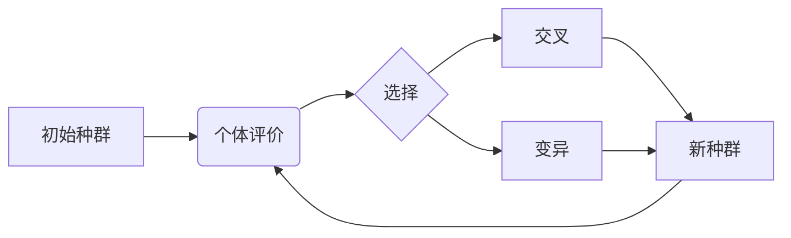

# 遗传算法(Genetic Algorithms) - 原理与代码实例讲解

关键词：遗传算法、优化问题、进化计算、自然选择、遗传操作、适应度函数、编码、选择、交叉、变异

## 1. 背景介绍

### 1.1 问题的由来
在现实世界中,我们经常会遇到一些复杂的优化问题,如旅行商问题(TSP)、背包问题、车间调度问题等。这些问题通常具有搜索空间大、约束条件多、求解难度高等特点,传统的精确算法难以在可接受的时间内找到最优解。因此,人们开始寻求一种新的求解思路。

### 1.2 研究现状
遗传算法(Genetic Algorithms, GA)作为一种模拟生物进化过程的随机搜索方法,由美国密歇根大学的John Holland教授于1975年首次提出。它借鉴了达尔文的进化论思想和孟德尔遗传学说,通过模拟自然界中"适者生存"的法则,利用随机搜索技术在复杂的解空间中寻找最优解。经过几十年的发展,GA已成为求解复杂优化问题的重要工具之一,在人工智能、机器学习、组合优化等领域得到了广泛应用。

### 1.3 研究意义 
遗传算法作为一种通用的优化算法,具有通用性强、鲁棒性好、易于并行化等优点。深入研究GA的原理及其工程应用,对于拓展优化理论、解决实际工程问题具有重要意义。同时,GA思想对于启发人工智能、进化计算等研究也有重要价值。

### 1.4 本文结构
本文将从以下几个方面对遗传算法进行系统介绍:
- 第2部分介绍GA的核心概念;
- 第3部分详细讲解GA的基本原理和操作步骤;
- 第4部分给出GA的数学模型和公式推导;
- 第5部分结合代码实例对GA进行讲解;
- 第6部分总结GA的实际应用场景;
- 第7部分推荐GA相关的学习资源;
- 第8部分对GA的研究现状及未来发展进行总结展望。

## 2. 核心概念与联系

遗传算法中有几个核心概念:
- **个体(Individual)**: 问题的一个候选解,通常由一个编码后的染色体(Chromosome)表示。
- **种群(Population)**: 多个个体的集合,代表一个解的搜索空间。 
- **适应度(Fitness)**: 衡量个体优劣的指标,与目标函数相关。适应度越高,个体越优秀。
- **选择(Selection)**: 从当前种群中优先选择适应度高的个体。
- **交叉(Crossover)**: 两个父代个体的染色体交换片段,产生新的子代个体。
- **变异(Mutation)**: 个体编码的某些基因发生变化,引入新的基因特征。

它们的关系可以用下图表示:



## 3. 核心算法原理 & 具体操作步骤

### 3.1 算法原理概述
遗传算法模拟生物进化过程,以"适者生存"为原则,通过迭代进化不断产生和优化解,最终收敛到最优解。其主要原理可概括为:
1. 初始化一个种群,种群由一定数量的个体组成,每个个体对应一个问题的候选解;
2. 计算每个个体的适应度,适应度反映个体的优劣; 
3. 基于适应度对个体进行选择,淘汰劣质个体;
4. 对选择后的个体进行交叉变异等遗传操作,生成新一代种群;
5. 重复步骤2-4,直到满足终止条件,输出最优解。

### 3.2 算法步骤详解

1. **初始化**
   
   随机生成一定数量的个体,构成初始种群。个体通常用二进制、整数、浮点数等方式编码。种群大小(个体数量)根据具体问题确定,通常取20-200。

2. **适应度评估**

   针对每个个体,根据其解码后的值,计算目标函数,得到适应度。设计合理的适应度函数是GA的关键。
   
3. **选择**

   以一定的概率从当前种群中选择一部分个体,优质个体被选中的概率更大。常见的选择算子有:
   - 轮盘赌选择(Roulette Wheel Selection)
   - 锦标赛选择(Tournament Selection)
   - 排序选择(Ranking Selection)

4. **交叉**

   从选择后的个体中随机选择两个作为父母,对它们的染色体以一定概率 $p_c$ 执行交叉,常见的交叉算子有:
   - 单点交叉(Single Point Crossover)
   - 多点交叉(Multi-point Crossover)
   - 均匀交叉(Uniform Crossover)
   
5. **变异**

   对交叉后的个体,以一定概率 $p_m$ 对染色体上的某些基因进行变异,引入新的基因特征。常见的变异算子有:
   - 二进制变异(Binary Mutation)
   - 高斯变异(Gaussian Mutation)
   
6. **终止条件判断**

   若满足终止条件(如达到最大迭代次数、找到可接受解等),则输出当前最优解;否则,回到步骤2,继续迭代。

### 3.3 算法优缺点

遗传算法的主要优点有:
- 通用性强,适用于多种优化问题
- 容易并行化,计算效率高
- 搜索能力强,不易陷入局部最优
- 鲁棒性好,对初值不敏感

主要缺点有:
- 编码和适应度函数的设计有一定难度
- 对某些问题收敛速度慢
- 理论分析和数学推导相对困难

### 3.4 算法应用领域

遗传算法在许多领域得到了成功应用,如:
- 函数优化
- 组合优化(TSP、背包问题等) 
- 机器学习(特征选择、参数优化等)
- 工程设计(电路设计、天线设计等)
- 计算机视觉(图像分割、特征提取等)
- 自然语言处理

## 4. 数学模型和公式 & 详细讲解 & 举例说明

### 4.1 数学模型构建

考虑一个优化问题:

$$
\begin{aligned}
\min \quad & f(x) \\
\text{s.t.} \quad & g_i(x) \leq 0, \quad i=1,2,\ldots,m \\  
& h_j(x) = 0, \quad j=1,2,\ldots,n
\end{aligned}
$$

其中, $x=(x_1,\ldots,x_d)$ 为 $d$ 维决策变量, $f(x)$ 为目标函数, $g_i(x)$ 和 $h_j(x)$ 分别为不等式约束和等式约束。

遗传算法将上述问题转化为无约束优化问题:

$$
\max \quad F(x) = f(x) + \sum_{i=1}^m \alpha_i G_i(x) + \sum_{j=1}^n \beta_j |H_j(x)|
$$

其中, $F(x)$ 为适应度函数, $\alpha_i$ 和 $\beta_j$ 为惩罚因子, $G_i(x)$ 和 $H_j(x)$ 分别由 $g_i(x)$ 和 $h_j(x)$ 构造而来,当约束满足时为0,否则为正值。

### 4.2 公式推导过程

以单点交叉和二进制变异为例,推导相关公式。

设二进制编码的染色体 $v=(v_1,\ldots,v_l)$,交叉点位置为 $k$,交叉概率为 $p_c$,则单点交叉操作为:

$$
\begin{aligned}
v' &= (v_1,\ldots,v_k,w_{k+1},\ldots,w_l) \\
w' &= (w_1,\ldots,w_k,v_{k+1},\ldots,v_l)
\end{aligned}
$$

其中, $v$ 和 $w$ 为父代个体, $v'$ 和 $w'$ 为子代个体。

对于每个基因 $v_i$,若变异概率为 $p_m$,则二进制变异操作为:

$$
v_i' = 
\begin{cases}
1-v_i, & \text{with probability } p_m \\
v_i, & \text{with probability } 1-p_m
\end{cases}
$$

### 4.3 案例分析与讲解

考虑一个背包问题:有 $n$ 个物品,每个物品有重量 $w_i$ 和价值 $v_i$,背包容量为 $C$,如何选择物品使得总价值最大?

定义决策变量 $x_i \in \{0,1\}$,其中 $x_i=1$ 表示选择第 $i$ 个物品,否则不选。目标函数和约束条件为:

$$
\begin{aligned}
\max \quad & \sum_{i=1}^n v_i x_i \\
\text{s.t.} \quad & \sum_{i=1}^n w_i x_i \leq C \\
& x_i \in \{0,1\}, \quad i=1,2,\ldots,n
\end{aligned}
$$

将其转化为适应度函数:

$$
F(x) = \sum_{i=1}^n v_i x_i - \alpha \max\left(0, \sum_{i=1}^n w_i x_i - C\right)
$$

其中 $\alpha$ 为惩罚因子。个体编码为 $(x_1,\ldots,x_n)$。

### 4.4 常见问题解答

**Q**: 遗传算法的时间复杂度如何?

**A**: 设种群大小为 $N$,进化代数为 $T$,则时间复杂度为 $O(NT)$。通常适应度计算是最耗时的,若适应度计算复杂度为 $O(f)$,则总复杂度为 $O(NTf)$。

**Q**: 遗传算法容易收敛到局部最优吗?

**A**: 与传统优化方法相比,遗传算法由于采用了群体搜索和概率跳转,不易陷入局部最优。但若问题过于复杂或算法参数设置不当,仍可能过早收敛。可以通过合理设置算法参数、采用新型遗传算子等方法改善。

## 5. 项目实践：代码实例和详细解释说明

### 5.1 开发环境搭建
本项目使用Python3语言,需要安装以下库:
- NumPy: 数值计算库
- Matplotlib: 绘图库

可以通过以下命令安装:

```bash
pip install numpy matplotlib
```

### 5.2 源代码详细实现

以下是一个简单的遗传算法Python实现,以求解函数 $f(x)=x^2$ 在 $[-10,10]$ 区间内的最小值为例。

```python
import numpy as np
import matplotlib.pyplot as plt

class GA:
    def __init__(self, pop_size, chrom_len, pc, pm, max_gen):
        self.pop_size = pop_size  # 种群大小
        self.chrom_len = chrom_len  # 染色体长度
        self.pc = pc  # 交叉概率
        self.pm = pm  # 变异概率
        self.max_gen = max_gen  # 最大迭代次数
        
    def encode(self, x):
        """编码"""
        a, b = -10, 10
        x = (x - a) / (b - a)  # 归一化
        x = np.round(x * (2**self.chrom_len-1))  # 量化
        chrom = np.zeros(self.chrom_len, dtype=int)
        for i in range(self.chrom_len):
            chrom[i] = x % 2
            x //= 2
        return chrom
        
    def decode(self, chrom):
        """解码"""
        x = 0
        a, b = -10, 10
        for i in range(self.chrom_len):
            x += chrom[i] * 2**i
        x = x / (2**self.chrom_len-1) * (b-a) + a
        return x
        
    def fitness(self, chrom):
        """适应度"""
        x = self.decode(chrom)
        return -x**2
        
    def select(self, pop, fit):
        """选择"""
        fit = fit - np.min(fit)  # 适应度非负化
        fit = fit / np.sum(fit)  # 归一化
        idx = np.random.choice(np.arange(self.pop_size), size=self.pop_size,