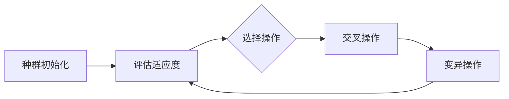

以下是对《遗传算法(Genetic Algorithms) - 原理与代码实例讲解》的详细解读和分析:

# 遗传算法(Genetic Algorithms) - 原理与代码实例讲解

## 1. 背景介绍

### 1.1 问题的由来

在现实世界中,我们经常会遇到一些复杂的优化问题,例如旅行商问题、作业调度问题、投资组合优化等。这些问题通常具有以下几个特点:

- 解空间巨大,甚至无限
- 目标函数非线性、非凸、多峰值
- 存在多个约束条件
- 计算复杂度高

传统的数学方法和确定性算法很难高效地解决这类问题。于是,人们开始借鉴生物进化的自然规律,提出了一种新型的随机搜索算法——遗传算法(Genetic Algorithms, GA)。

### 1.2 研究现状

遗传算法最早可以追溯到20世纪60年代,由美国学者John Holland在密西根大学提出。之后,它在全球范围内得到了广泛的研究和应用,成为了解决复杂优化问题的有力工具。目前,遗传算法已经在机器学习、计算机视觉、自然语言处理、机器人技术等多个领域获得成功应用。

### 1.3 研究意义

遗传算法是一种高效的随机搜索优化算法,具有以下优点:

- 不依赖问题的具体细节,具有良好的通用性
- 不需要连续可导,适用于非线性、非凸、多峰值问题
- 基于种群进化,具有全局寻优能力
- 易于并行实现,提高计算效率

因此,研究遗传算法的原理和实现方法,对于解决现实世界中的复杂优化问题具有重要意义。

### 1.4 本文结构

本文将全面介绍遗传算法的基本原理、数学模型、核心算法流程,并结合实例代码进行详细讲解。主要内容包括:

- 遗传算法的核心概念
- 遗传算法的数学模型和公式推导
- 遗传算法的具体实现步骤
- 遗传算法的代码实例分析
- 遗传算法在实际问题中的应用
- 遗传算法的发展趋势和挑战

## 2. 核心概念与联系

遗传算法借鉴了生物进化的自然规律,主要包括以下几个核心概念:

1. **个体(Individual)**: 对应优化问题的一个可行解,通常使用某种编码方式表示。

2. **种群(Population)**: 由多个个体组成,模拟生物群落。

3. **适应度(Fitness)**: 衡量个体优劣的指标函数,对应优化问题的目标函数。

4. **选择(Selection)**: 根据适应度从种群中选择优秀个体,模拟"适者生存"。

5. **交叉(Crossover)**: 在两个优秀个体之间交换部分编码,产生新的个体,模拟生物"交配"。

6. **变异(Mutation)**: 在个体编码上引入少量随机变化,模拟"基因突变"。

以上概念相互关联、相互作用,构成了遗传算法的核心思想。个体编码、适应度函数、选择、交叉、变异等操作按照一定策略在种群中循环进行,使种群不断进化,最终获得满意的解。

## 3. 核心算法原理 & 具体操作步骤

### 3.1 算法原理概述

遗传算法的核心思想是模拟生物进化的自然选择和遗传机理,通过种群进化的方式搜索最优解。算法流程如下:

1. 初始化种群,对应问题的可行解编码为多个个体。
2. 计算每个个体的适应度,衡量其优劣程度。 
3. 根据适应度选择优秀个体,模拟"适者生存"。
4. 对选择的个体进行交叉操作,产生新的个体。
5. 对新产生的个体进行变异操作,引入少量随机变化。
6. 重复2-5步骤,直至满足终止条件(如达到期望解或进化代数上限)。

通过不断进化,种群中个体的适应度不断提高,最终获得问题的(近似)最优解。

### 3.2 算法步骤详解

1. **种群初始化**

根据优化问题,选择合适的编码方式(如二进制编码、实数编码等),随机生成一定数量的个体,组成初始种群。

2. **适应度评估**

设计适应度函数,用于评估每个个体的优劣程度。适应度函数的设计直接影响算法的收敛性和性能。

$$
\begin{align*}
\text{Fitness}(x) &= f(x) & & \text{(最大化问题)} \\
\text{Fitness}(x) &= -f(x) & & \text{(最小化问题)}
\end{align*}
$$

其中 $f(x)$ 是优化问题的目标函数。

3. **选择操作**

根据个体的适应度值,使用某种选择策略(如轮盘赌选择、锦标赛选择等)从当前种群中选择优秀个体,模拟"适者生存"。

4. **交叉操作**

在选择的个体之间进行交叉操作,交换部分编码,产生新的个体。交叉操作的目的是探索解空间,增加种群的多样性。常用的交叉方式有:

- 单点交叉
- 多点交叉
- 均匀交叉
- 算术交叉(实数编码)

5. **变异操作**

对新产生的个体进行变异操作,在编码上引入少量随机变化,模拟"基因突变"。变异操作的目的是维护种群的多样性,防止过早收敛。常用的变异方式有:

- 位反转变异(二进制编码)
- 均匀变异(实数编码)
- 非均匀变异(实数编码)
- 高斯变异(实数编码)

6. **终止条件判断**

重复2-5步骤,直至满足终止条件。常用的终止条件有:

- 达到期望的最优解
- 进化代数达到上限
- 适应度收敛(种群多样性丢失)

### 3.3 算法优缺点

**优点**:

- 全局寻优能力强,不易陷入局部最优
- 不依赖问题的具体细节,具有良好的通用性
- 可以并行实现,提高计算效率
- 容易处理非线性、非凸、多峰值等复杂问题

**缺点**:

- 缺乏理论收敛性证明
- 算法性能依赖于参数设置(如种群规模、交叉概率、变异概率等)
- 对于高维、多约束问题,收敛速度较慢
- 无法保证获得真正的全局最优解

### 3.4 算法应用领域

由于其全局寻优能力和通用性,遗传算法已经广泛应用于多个领域的优化问题,包括但不限于:

- 组合优化问题:如旅行商问题、背包问题、作业调度问题等
- 机器学习与模式识别:如神经网络训练、聚类分析等
- 计算机视觉与图像处理:如图像分割、目标检测等
- 工程设计与优化:如结构优化设计、控制系统参数优化等
- 生物信息学:如基因编码、蛋白质结构预测等
- 金融领域:如投资组合优化、风险管理等

## 4. 数学模型和公式 & 详细讲解 & 举例说明

### 4.1 数学模型构建

为了形式化描述遗传算法,我们需要构建相应的数学模型。假设优化问题为:

$$
\begin{align*}
\max\limits_{x \in S} &\ f(x) \\
\text{s.t.} &\ g_i(x) \leq 0, \quad i = 1, 2, \ldots, m \\
           &\ h_j(x) = 0, \quad j = 1, 2, \ldots, p
\end{align*}
$$

其中:

- $x$ 为决策变量向量
- $S$ 为决策变量的定义域(解空间)
- $f(x)$ 为目标函数(适应度函数)
- $g_i(x)$ 为不等式约束
- $h_j(x)$ 为等式约束

遗传算法的目标是在满足约束条件的前提下,寻找目标函数的(近似)最大值。

为了应用遗传算法求解,我们需要对决策变量 $x$ 进行编码,通常采用二进制编码或实数编码。假设个体编码为 $\boldsymbol{c}$,则遗传算法的数学模型可以表述为:

$$
\begin{align*}
\max\limits_{\boldsymbol{c} \in \mathcal{C}} &\ F(\boldsymbol{c}) \\
\text{s.t.} &\ \boldsymbol{c} \in \mathcal{F}
\end{align*}
$$

其中:

- $\mathcal{C}$ 为编码空间
- $F(\boldsymbol{c})$ 为适应度函数,对应原问题的目标函数 $f(x)$
- $\mathcal{F}$ 为可行解空间,对应原问题的约束条件

遗传算法通过对种群中个体的选择、交叉和变异操作,使种群不断进化,最终获得满足约束条件的(近似)最优解。

### 4.2 公式推导过程

在遗传算法中,适应度函数的设计非常关键,直接影响算法的收敛性和性能。对于最大化问题,适应度函数通常与目标函数 $f(x)$ 成正比;对于最小化问题,适应度函数通常与目标函数成反比。

$$
\begin{align*}
\text{Fitness}(x) &= f(x) & & \text{(最大化问题)} \\
\text{Fitness}(x) &= -f(x) & & \text{(最小化问题)}
\end{align*}
$$

但是,在实际应用中,目标函数可能存在负值或无界值,这会导致适应度函数失效。为了解决这个问题,我们可以对适应度函数进行线性缩放变换:

$$
\text{Fitness}(x) = a \cdot f(x) + b
$$

其中 $a$ 和 $b$ 为缩放系数,需要根据具体问题进行设置。

另一种常用的适应度函数是基于排序的适应度分配策略,即根据个体在种群中的排序来分配适应度值,而不直接使用目标函数值。这种策略可以避免目标函数值过大或过小的影响,提高算法的稳定性。

对于约束优化问题,我们还需要考虑如何处理不可行解。常见的策略有:

1. 惩罚函数法:对不可行解的适应度值进行惩罚,降低其被选择的概率。
2. 可行性优先法:在选择操作时,先选择可行解,再选择不可行解。
3. 修复算子法:对不可行解进行修复,使其满足约束条件。

### 4.3 案例分析与讲解

以下是一个最大化函数 $f(x, y) = x^2 + y^2$ 的案例,使用遗传算法求解。

1. **编码方式**

采用实数编码,每个个体由两个实数 $(x, y)$ 表示。

2. **适应度函数**

$$
\text{Fitness}(x, y) = x^2 + y^2
$$

3. **初始化种群**

随机生成 $N$ 个个体,组成初始种群。

4. **选择操作**

使用锦标赛选择策略,每次从种群中随机选取 $k$ 个个体,选择其中适应度最高的个体。

5. **交叉操作**

对选择的个体进行算术交叉,产生新的个体:

$$
\begin{align*}
(x_1', y_1') &= \alpha(x_1, y_1) + (1 - \alpha)(x_2, y_2) \\
(x_2', y_2') &= (1 - \alpha)(x_1, y_1) + \alpha(x_2, y_2)
\end{align*}
$$

其中 $\alpha \in [0, 1]$ 为交叉系数。

6. **变异操作**

对新产生的个体进行高斯变异:

$$
\begin{align*}
x' &= x + N(0, \sigma_