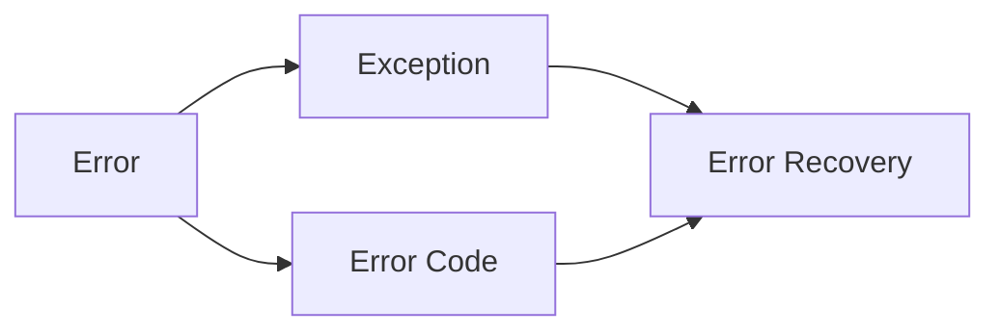

# 错误处理机制的基本概念

关键词：错误处理、异常、错误码、错误恢复、健壮性

## 1. 背景介绍
### 1.1 问题的由来
在软件开发过程中,错误和异常是不可避免的。如何优雅地处理这些错误,提高系统的健壮性和可靠性,是每个开发者都需要考虑的问题。一个完善的错误处理机制可以帮助我们快速定位问题,减少故障时间,提升用户体验。
### 1.2 研究现状
目前,主流编程语言如Java、C++、Python等都提供了异常处理机制,但在具体项目实践中,错误处理的方式和粒度差异较大。有的采用返回错误码的方式,有的采用抛出异常的方式,也有的将二者结合使用。业界对于如何设计一套行之有效的错误处理机制还在不断探索中。
### 1.3 研究意义
深入研究错误处理机制的基本概念,总结和梳理各种错误处理的最佳实践,对于提高代码质量,构建高可靠软件系统具有重要意义。本文将从错误处理的核心概念出发,结合具体案例剖析和代码实践,为开发者提供一些切实可行的参考。
### 1.4 本文结构
本文将分为以下几个部分：
- 第一部分介绍错误处理的背景和研究现状
- 第二部分阐述错误、异常等核心概念
- 第三部分总结常见的错误处理方法和优缺点
- 第四部分建立错误分类和数学模型,并举例说明
- 第五部分给出错误处理的代码实例和解释
- 第六部分分析错误处理机制在实际项目中的应用
- 第七部分推荐一些错误处理的工具和学习资源
- 第八部分对错误处理的发展趋势和面临的挑战做出展望

## 2. 核心概念与联系
在讨论错误处理机制之前,我们需要厘清几个核心概念：
- 错误(Error):指程序运行结果与预期不符,包括语法错误、逻辑错误、环境错误等。
- 异常(Exception):指在程序运行过程中发生的特殊情况,导致程序的正常流程被中断,如除零异常、空指针异常等。
- 错误码(Error Code):一种用数值表示错误类型和原因的方式,不同的数值对应不同的错误情况。
- 错误恢复(Error Recovery):发生错误后,能够使程序继续执行或优雅退出的过程。

这些概念之间的联系如下:


## 3. 核心算法原理 & 具体操作步骤 
### 3.1 算法原理概述
错误处理的核心算法可以概括为:检测异常 -> 捕获异常 -> 处理异常 -> 恢复执行。其中关键是如何设计异常类的层次结构,以及在何处进行异常检测和捕获。
### 3.2 算法步骤详解
1. 定义异常类:根据错误类型设计对应的异常类,通过继承实现层次化管理。
2. 异常检测:在可能出现异常的代码段进行异常检测。可以显式检查,如判断指针是否为空;也可以隐式检查,如除法操作可能抛出除零异常。
3. 异常捕获:一旦检测到异常,就要进行捕获,获取异常的类型和信息,决定后续处理逻辑。
4. 异常处理:对捕获的异常进行处理,可以选择忽略、重试、上报、终止等处理方式。
5. 恢复执行:根据处理结果,恢复程序执行,或者优雅地退出程序。
### 3.3 算法优缺点
优点:
- 能够阻止错误扩散,避免程序崩溃
- 分离了正常逻辑和错误处理逻辑,提高代码可读性
- 统一了错误处理方式,便于管理和维护

缺点:  
- 可能会打乱正常的执行流程,增加控制流复杂度
- 如果异常处理逻辑复杂,可能会让代码膨胀
- 异常的跨方法传递会影响性能

### 3.4 算法应用领域
错误处理算法被广泛应用于各种软件系统,如操作系统、数据库、网络通信、Web服务等领域。任何需要保证稳定性和数据一致性的系统,都离不开完善的错误处理机制。

## 4. 数学模型和公式 & 详细讲解 & 举例说明
### 4.1 数学模型构建
我们可以用数学语言来刻画错误处理过程。定义以下符号:

- $E$:表示错误事件的集合
- $D$:表示错误检测机制
- $C$:表示错误捕获机制
- $H$:表示错误处理机制
- $R$:表示错误恢复机制

则整个错误处理过程可以表示为:

$$
\begin{aligned}
\forall e \in E, \exists d \in D, \exists c \in C, \exists h \in H, \exists r \in R \\
s.t. \quad d(e) \rightarrow c(e) \rightarrow h(e) \rightarrow r(e)
\end{aligned}
$$

含义是:对于错误事件集合$E$中的每个错误$e$,都存在错误检测机制$d$、捕获机制$c$、处理机制$h$和恢复机制$r$,使得$e$能够被检测、捕获、处理并恢复。

### 4.2 公式推导过程
为了评估错误处理机制的有效性,我们定义以下指标:

- $P_d$:错误检测的准确率,即检测出的错误占所有错误的比例
- $P_c$:错误捕获的成功率,即捕获的错误占检测出错误的比例 
- $P_h$:错误处理的正确率,即正确处理的错误占捕获错误的比例
- $P_r$:错误恢复的成功率,即恢复执行的错误占处理错误的比例

则错误处理机制的有效性$P$可以表示为:

$$
\begin{aligned}
P &= P_d \times P_c \times P_h \times P_r \\
&= \frac{|D(E)|}{|E|} \times \frac{|C(D(E))|}{|D(E)|} \times \frac{|H(C(D(E)))|}{|C(D(E))|} \times \frac{|R(H(C(D(E))))|}{|H(C(D(E)))|}
\end{aligned}
$$

其中$|·|$表示集合的基数,即元素个数。$D(E)$表示$E$中被$D$检测出的错误集合,以此类推。

### 4.3 案例分析与讲解
举一个简单的例子,假设一个系统有100个潜在错误,错误检测机制检测出其中80个,错误捕获机制成功捕获65个,错误处理机制正确处理60个,错误恢复机制使其中50个错误恢复执行,则:

$$
\begin{aligned}
P_d &= \frac{80}{100} = 80\% \\
P_c &= \frac{65}{80} = 81.25\% \\  
P_h &= \frac{60}{65} = 92.31\% \\
P_r &= \frac{50}{60} = 83.33\% \\
P &= 80\% \times 81.25\% \times 92.31\% \times 83.33\% \approx 50.13\%
\end{aligned}
$$

即该系统的错误处理有效性约为50.13%,还有较大的提升空间。我们可以分析每个环节的薄弱点,有针对性地改进。

### 4.4 常见问题解答
- 问:如何设计异常类的层次结构?
- 答:可以根据错误的严重程度、类型、来源等维度设计层次结构。通常分为Error(严重错误)和Exception(普通异常)两大类,再细分为各种子类,如空指针异常、IO异常、超时异常等。

- 问:在哪些地方进行错误检测最合适?
- 答:一般在可能出错的地方都需要检测,如方法入口、资源分配、数据输入等。选择检测点需要平衡错误检测的成本和收益,过多的检测会影响性能,过少的检测可能错过错误。

- 问:捕获异常后,如何选择合适的处理方式?
- 答:根据错误的严重程度和影响范围,可以选择忽略、重试、上报、终止等处理方式。严重错误需要立即终止,并记录日志;普通异常可以重试或忽略;跨系统边界的异常需要上报。同时要考虑与其他系统的兼容性。

## 5. 项目实践：代码实例和详细解释说明
下面以Java代码为例,展示如何实现一个基本的错误处理逻辑。
### 5.1 开发环境搭建
- JDK版本:1.8 
- IDE:IntelliJ IDEA
- 构建工具:Maven
- 依赖库:Junit(单元测试)

### 5.2 源代码详细实现
定义一个自定义异常类`CustomException`:
```java
public class CustomException extends Exception {
    public CustomException(String message) {
        super(message);
    }
}
```

实现一个带有异常检测和处理的方法`divide`:
```java
public static int divide(int a, int b) throws CustomException {
    if (b == 0) {
        throw new CustomException("除数不能为0");
    }
    return a / b;
}
```

在主程序中调用该方法,并捕获异常:
```java
public static void main(String[] args) {
    try {
        int result = divide(10, 0);
        System.out.println(result);
    } catch (CustomException e) {
        System.out.println("捕获到异常: " + e.getMessage());
    } finally {
        System.out.println("异常处理完毕,程序继续执行");
    }
}
```

### 5.3 代码解读与分析
- 自定义异常类`CustomException`继承自`Exception`,构造函数接受一个字符串作为异常信息。这样可以抛出更精准的异常。
- `divide`方法实现了除法操作,在除数为0时主动抛出`CustomException`,并传入相应的异常信息。
- 主程序用`try-catch-finally`语句块捕获可能抛出的`CustomException`,并打印异常信息,finally块保证无论是否发生异常,都会执行清理逻辑。
- 整个代码实现了异常的抛出、捕获和处理,是一个典型的错误处理流程。可以根据需要在catch块中实现重试、恢复等逻辑。

### 5.4 运行结果展示
运行上述代码,控制台输出如下:
```
捕获到异常: 除数不能为0
异常处理完毕,程序继续执行
```

说明异常被成功捕获和处理,程序没有崩溃,而是继续执行后续逻辑。

## 6. 实际应用场景
错误处理机制在实际项目中有广泛的应用,下面列举几个常见的场景。
- Web应用:对于用户的非法输入,要及时检测和拦截,避免引发SQL注入、XSS等安全问题。对于系统内部错误,要捕获并记录日志,尽量不影响用户体验。
- 分布式系统:在各个微服务之间通信时,要考虑网络超时、服务不可用等异常情况。可以使用熔断、降级等错误处理手段,提高系统的可用性。
- 数据库操作:执行SQL语句时,要捕获可能发生的异常,如唯一键冲突、死锁等。根据错误类型选择重试或回滚事务等恢复策略。
- 文件IO:读写文件时,要检测文件是否存在、权限是否足够等。出错时给出明确的提示信息,必要时创建默认文件。
### 6.4 未来应用展望
随着云计算、大数据、人工智能等新技术的发展,软件系统变得越来越复杂,错误处理也面临新的挑战。
- 智能化错误处理:利用机器学习等技术,自动分析错误日志,定位问题根源,给出修复建议。
- 细粒度错误隔离:在云环境下,要实现不同租户之间的错误隔离,避免一个租户的问题影响整个系统。
- 错误可视化:通过图形化界面展示系统的错误状况,如错误率、平均恢复时间等,帮助运维人员快速定