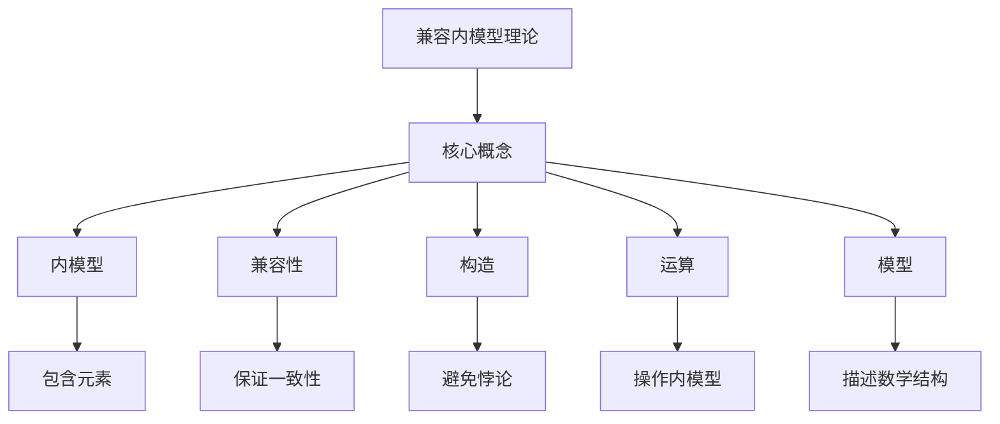

# 集合论导引：兼容内模型

## 1. 背景介绍

### 1.1 问题的由来

在数学和计算机科学领域中,集合论是一个基础理论,它研究集合及其运算的性质。集合论为数学和逻辑奠定了坚实的基础,并在计算机科学中发挥着重要作用。然而,传统的集合论存在一些局限性,特别是在处理无限集合和自我指涉集合时会出现一些悖论和困难。

### 1.2 研究现状

为了解决这些问题,数学家和逻辑学家提出了各种新理论,其中最著名的是新基础论(New Foundations)。新基础论是一种基于可构造性原则的集合论,它避免了传统集合论中的悖论,并提供了一种更加一致和可靠的集合理论框架。然而,新基础论也存在一些局限性,例如它无法完全捕捉传统集合论中的所有概念和结构。

### 1.3 研究意义

兼容内模型(Conformable Modeloid)是一种新兴的集合论理论,它试图结合传统集合论和新基础论的优点,提供一种更加通用和灵活的集合理论框架。兼容内模型不仅能够避免传统集合论中的悖论,同时也保留了传统集合论中的许多有用概念和结构。它为数学和计算机科学提供了一种新的视角,有望解决一些长期存在的难题。

### 1.4 本文结构

本文将全面介绍兼容内模型的理论基础、核心概念和算法原理。我们将从背景介绍开始,阐述兼容内模型的由来和意义。接下来,我们将详细探讨兼容内模型的核心概念和联系,包括集合、元素、运算等。然后,我们将深入分析兼容内模型的核心算法原理和具体操作步骤。在此基础上,我们将构建数学模型并推导相关公式,并通过案例分析加深理解。此外,我们还将提供项目实践的代码实例和详细解释说明。最后,我们将探讨兼容内模型的实际应用场景、工具和资源推荐,并总结未来发展趋势和面临的挑战。

## 2. 核心概念与联系

兼容内模型(Conformable Modeloid)是一种新兴的集合论理论,它试图结合传统集合论和新基础论的优点,提供一种更加通用和灵活的集合理论框架。在介绍兼容内模型的核心概念之前,我们先来回顾一下传统集合论和新基础论的基本概念。

在传统集合论中,集合是由一些确定的元素组成的整体。集合可以是有限的,也可以是无限的。集合的基本运算包括并集、交集、补集等。传统集合论还引入了许多高级概念,如函数、关系、序数和基数等。然而,传统集合论存在一些悖论和困难,例如Russell悖论和Burali-Forti悖论。

为了解决这些问题,数学家提出了新基础论(New Foundations)。新基础论是基于可构造性原则的集合论,它只允许构造性集合存在。在新基础论中,集合是由其元素构造而成的,并且不存在自我指涉的集合。新基础论避免了传统集合论中的悖论,但也失去了一些有用的概念和结构。

兼容内模型试图结合传统集合论和新基础论的优点,提供一种更加通用和灵活的集合理论框架。它保留了传统集合论中的许多有用概念和结构,同时也避免了传统集合论中的悖论。

在兼容内模型中,我们引入了一些新的核心概念:

1. **内模型(Modeloid)**: 内模型是兼容内模型中的基本对象,它类似于传统集合论中的集合,但具有更加灵活的性质。内模型可以包含其他内模型作为元素,也可以包含传统的数学对象(如整数、实数等)作为元素。

2. **兼容性(Conformability)**: 兼容性是指内模型之间的一种关系。如果一个内模型A是另一个内模型B的子集,那么我们说A与B是兼容的。兼容性保证了内模型之间的一致性和层次结构。

3. **构造(Construction)**: 在兼容内模型中,内模型是通过构造过程创建的。构造过程遵循一定的规则,确保内模型不会出现自我指涉或悖论。

4. **运算(Operations)**: 兼容内模型定义了一系列运算,包括并集、交集、补集等,用于操作内模型。这些运算与传统集合论中的运算类似,但具有更加灵活的性质。

5. **模型(Model)**: 模型是兼容内模型中的一种特殊内模型,它表示一个数学或逻辑结构。模型可以用于描述和研究各种数学和计算机科学问题。

这些核心概念相互关联,构成了兼容内模型的理论基础。下面,我们将通过一个简单的例子来说明这些概念之间的联系。

在这个示例中,我们可以看到兼容内模型理论包含了多个核心概念,如内模型、兼容性、构造、运算和模型。内模型可以包含其他元素,兼容性保证了内模型之间的一致性,构造过程避免了悖论的产生,运算用于操作内模型,而模型则用于描述和研究数学结构。这些概念相互关联,共同构成了兼容内模型的理论框架。

通过上述介绍,我们对兼容内模型的核心概念和它们之间的联系有了初步的了解。在下一节中,我们将深入探讨兼容内模型的核心算法原理和具体操作步骤。

## 3. 核心算法原理 & 具体操作步骤

### 3.1 算法原理概述

兼容内模型的核心算法原理是基于构造性原则和兼容性约束。在兼容内模型中,内模型是通过构造过程创建的,这个过程遵循一定的规则,确保内模型不会出现自我指涉或悖论。同时,内模型之间必须满足兼容性约束,即如果一个内模型A是另一个内模型B的子集,那么A与B是兼容的。

构造过程和兼容性约束共同保证了兼容内模型的一致性和可靠性。它们确保了内模型的有效性,并为进一步的运算和操作奠定了基础。

下面,我们将详细介绍兼容内模型的核心算法原理和具体操作步骤。

### 3.2 算法步骤详解

兼容内模型的核心算法可以分为以下几个主要步骤:

#### 步骤1: 初始化

在这一步骤中,我们需要定义一些初始内模型和基本对象。通常情况下,我们会定义一个空集内模型和一些基本数学对象,如整数、实数等。这些初始内模型和对象将作为后续构造过程的基础。

#### 步骤2: 构造新内模型

在这一步骤中,我们可以通过各种方式构造新的内模型。最常见的方式是使用集合运算,如并集、交集、补集等。我们也可以使用一些特殊的构造函数,如幂集函数、笛卡尔积函数等。

构造新内模型时,我们需要遵循以下规则:

1. 新构造的内模型不能包含自身作为元素,以避免自我指涉。
2. 新构造的内模型必须与已有的内模型保持兼容性,即它们之间不能产生矛盾或悖论。

为了保证这些规则得到遵守,我们需要在构造过程中进行兼容性检查。如果新构造的内模型与已有内模型不兼容,则构造过程将被终止,并报告错误。

#### 步骤3: 操作内模型

在构造出所需的内模型之后,我们可以对它们进行各种操作。兼容内模型定义了一系列运算,包括并集、交集、补集等,用于操作内模型。这些运算与传统集合论中的运算类似,但具有更加灵活的性质。

在进行运算时,我们也需要进行兼容性检查,确保运算结果与已有内模型保持兼容。如果运算结果与已有内模型不兼容,则运算将被终止,并报告错误。

#### 步骤4: 建立模型

在某些情况下,我们需要使用内模型来描述和研究特定的数学或逻辑结构。在这种情况下,我们可以将一个内模型指定为模型,并在该模型上进行进一步的操作和分析。

模型可以被视为一种特殊的内模型,它具有特定的解释和语义。我们可以在模型上定义各种关系、函数和运算,以描述和研究相应的数学或逻辑结构。

#### 步骤5: 验证和优化

在完成上述步骤后,我们可以对构造出的内模型和模型进行验证和优化。验证过程包括检查内模型和模型的一致性、正确性和完整性。优化过程则旨在提高内模型和模型的效率和可读性。

我们可以使用各种技术和工具来进行验证和优化,例如形式化验证、模型检查、代码优化等。这些技术和工具可以帮助我们发现和修复潜在的错误和缺陷,并提高整个系统的可靠性和性能。

### 3.3 算法优缺点

兼容内模型的核心算法具有以下优点:

1. **避免悖论**: 通过构造性原则和兼容性约束,兼容内模型避免了传统集合论中的悖论和自我指涉问题。
2. **保留有用概念**: 兼容内模型保留了传统集合论中的许多有用概念和结构,如集合运算、函数、关系等。
3. **灵活性**: 兼容内模型提供了一种更加灵活的集合理论框架,可以处理更广泛的数学和逻辑结构。
4. **一致性**: 兼容内模型保证了内模型之间的一致性,确保了理论的可靠性和可信度。

然而,兼容内模型的核心算法也存在一些缺点:

1. **复杂性**: 由于需要进行兼容性检查和构造过程,兼容内模型的核心算法相对较为复杂,可能会增加计算开销。
2. **表达能力限制**: 尽管兼容内模型保留了许多有用概念,但它可能无法完全捕捉传统集合论中的所有概念和结构。
3. **学习曲线**: 由于兼容内模型是一种新兴理论,需要学习和掌握新的概念和算法,这可能会增加初学者的学习难度。

总的来说,兼容内模型的核心算法提供了一种新的集合理论框架,它结合了传统集合论和新基础论的优点,避免了悖论,同时保留了有用的概念和结构。尽管存在一些复杂性和限制,但兼容内模型仍然具有广阔的应用前景,值得进一步研究和探索。

### 3.4 算法应用领域

兼容内模型的核心算法可以应用于多个领域,包括但不限于:

1. **数学基础理论**: 兼容内模型提供了一种新的集合理论框架,可以用于研究数学基础理论,如逻辑、集合论、类型论等。
2. **计算机科学**: 兼容内模型可以应用于计算机科学的多个领域,如编程语言理论、形式化方法、软件验证等。
3. **人工智能**: 兼容内模型可以用于表示和推理知识库,并在人工智能系统中发挥作用。
4. **形式化验证**: 兼容内模型提供了一种新的形式化验证方法,可以用于验证各种数学和逻辑结构的正确性。
5. **元数学研究**: 兼容内模型可以用于研究元数学问题,如集合论的基础、逻辑的基础等。
6. **其他应用领域**: 由于兼容内模型