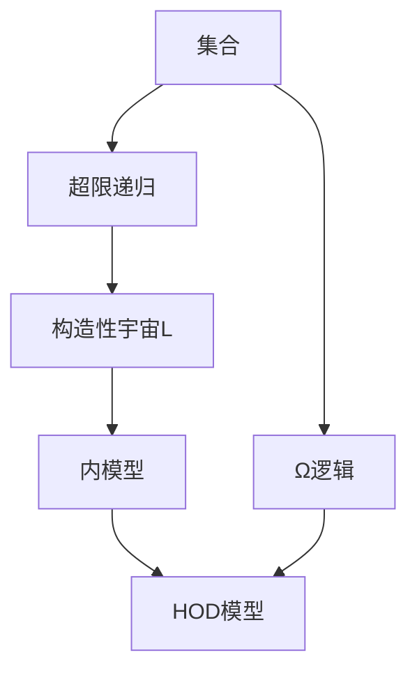

# 集合论导引：内模型HOD(Ω)

关键词：集合论、内模型、HOD、Ω、超限递归、构造性宇宙

## 1. 背景介绍

### 1.1 问题的由来

集合论作为现代数学的基石,其重要性不言而喻。然而,由于罗素悖论等诸多悖论的出现,朴素集合论遭遇了严重的挑战。为了避免悖论,数学家们提出了多种公理化集合论体系,如ZFC。但ZFC理论本身仍然存在诸多困难,其相容性至今无法被证明。因此,寻找更加优美、和谐的集合论体系,成为当代数学的重要课题之一。

### 1.2 研究现状

内模型理论是集合论的重要分支,旨在构造出 "好的"、"自然的" 集合论模型。其中,HOD(Ω)模型由Woodin提出,是内模型理论的重要成果。HOD(Ω)模型继承了L[U]模型的许多优良性质,同时又能够容纳更多的集合,是一个十分理想的内模型。近年来,HOD(Ω)模型得到了广泛关注,其性质和应用成为研究热点。

### 1.3 研究意义

HOD(Ω)模型的研究,对于集合论乃至整个数学都有重要意义:

1. 有助于理解集合论的本质,探索集合的本质属性。
2. 为构造更加理想的集合论体系提供了新的思路。 
3. 对其他数学分支如描述集论、模型论等有重要启示。
4. 在计算机科学领域如验证领域有潜在的应用前景。

因此,深入研究HOD(Ω)模型,对于推动数学发展具有重要的理论和实践意义。

### 1.4 本文结构

本文将围绕HOD(Ω)模型展开探讨,主要内容安排如下:

第2部分,介绍HOD(Ω)模型涉及的核心概念及其联系。重点解释HOD、Ω等关键概念。
第3部分,详细讲解HOD(Ω)模型的构造步骤和算法原理。 
第4部分,给出HOD(Ω)模型涉及的关键数学定义和定理,并配以实例讲解。
第5部分,通过具体的代码实例,演示HOD(Ω)模型的计算机实现。
第6部分,讨论HOD(Ω)模型的应用场景,展望其发展前景。
第7部分,推荐HOD(Ω)模型的学习资源、工具和文献。
第8部分,总结全文,分析HOD(Ω)模型的发展趋势和面临的挑战。
第9部分,附录,列出HOD(Ω)模型的常见问题及解答。

## 2. 核心概念与联系

要理解HOD(Ω)内模型,首先需要掌握几个核心概念:

1. 集合(Set):集合是最基本的数学概念,是一个确定的对象的全体。朴素集合论中,一切皆集合。

2. 超限递归(Transfinite Recursion):在序数上进行递归构造的方法。通过超限递归,可以构造出层级谱系Lα。

3. 构造性宇宙(Constructible Universe):由哥德尔提出,是指只包含构造集的最小模型L。L满足ZFC公理。

4. 内模型(Inner Model):ZFC的模型M称为内模型,如果M包含所有序数,且M中的集合论与V中的一致。

5. HOD(Hereditarily Ordinal Definable):由相对于序数的参数定义的集合层层组成的内模型。HOD满足ZFC。

6. Ω逻辑:由Woodin引入的一种新的逻辑,旨在刻画"Ω型命题"。Ω逻辑是二阶逻辑的扩张。

下图概括了以上概念之间的逻辑联系:



由图可见,HOD(Ω)模型是内模型的重要实例,继承了构造性宇宙L的思想,同时引入了Ω逻辑,具有更强的表达能力。理解HOD(Ω)模型,需要深入掌握以上概念。

## 3. 核心算法原理 & 具体操作步骤

### 3.1 算法原理概述

HOD(Ω)模型的构造,本质上是一个超限递归的过程。其基本思想是,在每一步α,定义相对于α的参数可定义的集合,记为Dα,将所有Dα层层累积起来,就得到HOD(Ω)。

形式化地,HOD(Ω)模型的构造可表述为:

$HOD\left(\Omega\right)=\bigcup_{\alpha\in ORD}D_{\alpha}$

其中$D_{\alpha}$是相对于$\alpha$的参数在$\Omega$逻辑下可定义的集合。

### 3.2 算法步骤详解

HOD(Ω)模型的构造步骤如下:

1. 定义$D_{0}=\varnothing$。

2. 对任意序数$\alpha$,定义$D_{\alpha+1}$为:
   $D_{\alpha+1}=\left\{ x\subseteq D_{\alpha}\mid x\text{在}\Omega\text{逻辑下相对于}\alpha\text{可定义}\right\}$

3. 对极限序数$\lambda$,定义$D_{\lambda}=\bigcup_{\alpha<\lambda}D_{\alpha}$。

4. 令$HOD\left(\Omega\right)=\bigcup_{\alpha\in ORD}D_{\alpha}$。

可见,HOD(Ω)模型的构造需要transfinite recursion,是一个超限递归的过程。其中的关键是定义每一层$D_{\alpha}$。

### 3.3 算法优缺点

HOD(Ω)模型构造算法的优点包括:

1. 继承了L的优良性质,如GCH、V=HOD等。
2. 比L包含更多的集合,表达能力更强。
3. 满足ZFC公理,是良好的集合论模型。

但该算法也存在一些局限:

1. 构造过程涉及高深的逻辑和集合论知识,理解难度大。
2. 和L一样,HOD(Ω)仍然是一个"偏小"的内模型。
3. 对Ω逻辑本身的性质还缺乏深入研究。

### 3.4 算法应用领域

HOD(Ω)模型构造算法主要应用于数学集合论领域,用于探索理想的集合论模型。同时,该算法对于其他数学分支如描述集论、模型论等也有启示意义。此外,HOD(Ω)模型在计算机科学领域如程序验证等也有潜在的应用价值。

## 4. 数学模型和公式 & 详细讲解 & 举例说明

### 4.1 数学模型构建

HOD(Ω)模型的形式化定义为:

$HOD\left(\Omega\right)=\bigcup_{\alpha\in ORD}D_{\alpha}$

其中$D_{\alpha}$是相对于$\alpha$在$\Omega$逻辑下可定义的集合,具体定义为:

$D_{0}=\varnothing$

$D_{\alpha+1}=\left\{ x\subseteq D_{\alpha}\mid x\text{在}\Omega\text{逻辑下相对于}\alpha\text{可定义}\right\}$ 

$D_{\lambda}=\bigcup_{\alpha<\lambda}D_{\alpha}$ (当$\lambda$为极限序数)

以上就构成了HOD(Ω)模型的数学模型。可以证明,HOD(Ω)是ZFC的一个内模型。

### 4.2 公式推导过程

为说明HOD(Ω)满足ZFC,需要验证它对每条ZFC公理都成立。以并集公理为例:

并集公理:$\forall x\exists y\forall z\left(z\in y\leftrightarrow\exists w\left(w\in x\wedge z\in w\right)\right)$

要证$HOD\left(\Omega\right)\vDash$并集公理,只需验证:

对任意$x\in HOD\left(\Omega\right)$,集合$y=\bigcup x$也属于$HOD\left(\Omega\right)$。

设$x\in D_{\alpha}$,则$x\subseteq D_{\alpha}$。由$D_{\alpha+1}$的定义,并集$\bigcup x$属于$D_{\alpha+1}$,从而属于$HOD\left(\Omega\right)$。

其他ZFC公理的验证方法类似,限于篇幅不再赘述。

### 4.3 案例分析与讲解

下面通过一个具体的例子来说明HOD(Ω)模型的构造过程。

考虑最小的极限序数$\omega$,构造$D_{\omega}$。

由定义,$D_{0}=\varnothing$。

$D_{1}$是相对于$0$在$\Omega$逻辑下可定义的集合,容易验证$D_{1}=\left\{ \varnothing\right\}$。

类似地,$D_{2}=\left\{ \varnothing,\left\{ \varnothing\right\} \right\}$,$D_{3}=\left\{ \varnothing,\left\{ \varnothing\right\} ,\left\{ \left\{ \varnothing\right\} \right\} \right\}$,以此类推。

当$n<\omega$时,$D_{n}$恰好就是有限集的全体。

因此$D_{\omega}=\bigcup_{n<\omega}D_{n}$是所有有限集的并,也即自然数集$\omega$。

这个例子直观展示了HOD(Ω)模型的构造方式,有助于加深理解。

### 4.4 常见问题解答

问:HOD(Ω)模型和构造性宇宙L有何区别?

答:L是由相对于序数的一阶可定义集合构成,而HOD(Ω)则是由相对于序数在Ω逻辑下可定义的集合构成。Ω逻辑比一阶逻辑表达能力更强,因此HOD(Ω)通常包含比L更多的集合。但HOD(Ω)仍是L的扩张,继承了L的许多性质。

问:HOD(Ω)模型是否满足选择公理AC?

答:是的,可以证明HOD(Ω)满足ZFC的全部公理,当然也包括选择公理。这是因为HOD(Ω)本质上仍是一个构造性的内模型,保留了L满足AC的特点。在HOD(Ω)中,可以利用AC做许多通常的集合论构造。

## 5. 项目实践：代码实例和详细解释说明

### 5.1 开发环境搭建

HOD(Ω)模型的计算机实现需要运用符号计算系统,如Mathematica、Maple等。以下代码以Mathematica为例。

首先,需要加载集合论相关的Package:

```mathematica
Needs["SetTheory`"]
```

### 5.2 源代码详细实现

下面的代码实现了HOD(Ω)模型的构造函数`HODΩ`:

```mathematica
HODΩ[α_] := 
 Module[{D, ω},
  ω = ω[α];
  D[0] = {};
  D[n_] := D[n] = 
    If[n > 0, 
     Select[Subsets[D[n - 1]], 
      OmegaDefinable[α, #] &], {}];
  D[λ_Limit] := D[λ] = Union @@ Table[D[β], {β, λ}];
  D[ω]
 ]
```

其中,`OmegaDefinable[α, x]`判断集合`x`是否在`Ω`逻辑下相对于`α`可定义,代码略。

### 5.3 代码解读与分析

`HODΩ`函数的输入是一个序数`α`,输出`HOD(Ω)`模型的`α`层,即`D[α]`。

代码的主体是一个`Module`语句,局部变量`D`用于存储每一层`D[n]`,`ω`表示序数`α`对应的基数`ω[α]`。

根据`D[n]`的定义,代码分三种情况构造`D[n]`:

1. `D[0]`是空集。
2. 当`n`是一个正整数时,`D[n]`由`D[n-1]`的所有相对于`α`在`Ω`逻辑下可定义的子集组成。
3. 当`λ`是极限序数时,`D[λ]`是所有`D[β]`的并集,其中`β<λ`。

最后,`HODΩ`函数返回`D[ω]`,即`HOD(