# 集合论导引：完备子集特性

## 1. 背景介绍

### 1.1 问题的由来

集合论是数学的一个基础分支,它研究集合及其相关概念和运算。在计算机科学和数学逻辑中,集合论扮演着至关重要的角色。其中,完备性是集合论中一个核心概念,它描述了集合的某些特性,对于建立数学基础和理解计算的本质具有重要意义。

完备性概念源于逻辑学中的完备性定理,它阐明了形式系统与语义模型之间的关系。在集合论中,完备性的概念被推广到集合的子集上,形成了完备子集的理论。完备子集特性描述了集合中某些子集的特殊性质,这些性质对于集合的表示、操作和推理过程都有着重要的应用。

### 1.2 研究现状

完备子集特性是集合论中一个重要而深奥的概念,它在数学基础、计算理论和逻辑推理等领域都有着广泛的应用。许多著名数学家和逻辑学家,如Georg Cantor、Kurt Gödel和Paul Cohen等,都对完备子集特性做出了重要贡献。

目前,完备子集特性的研究主要集中在以下几个方面:

1. 完备子集的构造和表示方法
2. 完备子集的性质和特征
3. 完备子集在数学基础和逻辑推理中的应用
4. 完备子集在计算复杂性理论中的作用

尽管已经取得了一些重要进展,但完备子集特性仍然存在许多未解决的问题和挑战,需要进一步深入探索。

### 1.3 研究意义

深入研究完备子集特性,对于数学基础、计算理论和逻辑推理等领域都具有重要意义:

1. 为建立数学基础提供了坚实的理论支撑
2. 有助于理解计算的本质和复杂性
3. 为逻辑推理和自动定理证明提供了强有力的工具
4. 在人工智能、密码学和其他领域也有潜在的应用前景

因此,探索完备子集特性不仅是一个重要的理论课题,也是推动科学技术发展的关键。

### 1.4 本文结构

本文将全面介绍完备子集特性的相关理论和应用。首先阐述完备子集的核心概念及其与其他集合概念的联系;然后详细解释完备子集的构造算法和数学模型;接着通过代码实例展示完备子集在实际项目中的应用;最后总结完备子集特性的发展趋势和面临的挑战。全文共分为以下几个部分:

```mermaid
graph TD
    A[集合论导引：完备子集特性] --> B[背景介绍]
    B --> C1[问题的由来]
    B --> C2[研究现状]
    B --> C3[研究意义]
    B --> C4[本文结构]
    A --> D[核心概念与联系]
    A --> E[核心算法原理&具体操作步骤]
    E --> E1[算法原理概述]
    E --> E2[算法步骤详解]
    E --> E3[算法优缺点]
    E --> E4[算法应用领域]
    A --> F[数学模型和公式&详细讲解&举例说明]
    F --> F1[数学模型构建]
    F --> F2[公式推导过程]
    F --> F3[案例分析与讲解]
    F --> F4[常见问题解答]
    A --> G[项目实践：代码实例和详细解释说明]
    G --> G1[开发环境搭建]
    G --> G2[源代码详细实现]
    G --> G3[代码解读与分析]
    G --> G4[运行结果展示]
    A --> H[实际应用场景]
    H --> H1[未来应用展望]
    A --> I[工具和资源推荐]
    I --> I1[学习资源推荐]
    I --> I2[开发工具推荐]
    I --> I3[相关论文推荐]
    I --> I4[其他资源推荐]
    A --> J[总结：未来发展趋势与挑战]
    J --> J1[研究成果总结]
    J --> J2[未来发展趋势]
    J --> J3[面临的挑战]
    J --> J4[研究展望]
    A --> K[附录：常见问题与解答]
```

## 2. 核心概念与联系

完备子集特性是集合论中一个核心概念,它与其他集合概念密切相关。为了深入理解完备子集,我们需要先了解以下基本概念:

1. **集合(Set)**: 集合是具有相同性质的元素的集合体。集合是现代数学的基础,也是计算机科学中不可或缺的概念。

2. **子集(Subset)**: 如果一个集合A中的所有元素也都属于另一个集合B,那么A就是B的子集,记作A⊆B。

3. **幂集(Power Set)**: 给定一个集合A,它的幂集P(A)是由A的所有子集组成的集合。

4. **完备性(Completeness)**: 在逻辑学和集合论中,完备性描述了形式系统与语义模型之间的关系。一个形式系统被称为完备的,当且仅当它能够证明所有在相应语义模型中为真的句子。

5. **完备集(Complete Set)**: 在集合论中,一个集合A被称为完备的,如果它满足某些特定的性质,例如能够表示所有可构造的集合。

完备子集特性建立在上述概念之上,它描述了集合中某些特殊的子集具有完备性质。具体来说,一个集合A的子集B被称为完备子集,如果它能够表示A中所有可构造的子集。

完备子集特性不仅在集合论本身具有重要意义,而且与其他数学分支和计算理论也有着密切联系:

- 在数学逻辑中,完备子集特性与形式系统的完备性密切相关,为建立数学基础提供了重要支撑。
- 在计算复杂性理论中,完备子集特性与不可判定性和无法计算性问题有关,有助于理解计算的本质和局限性。
- 在人工智能领域,完备子集特性可应用于知识表示和推理系统的构建。
- 在密码学中,完备子集特性可用于设计安全的加密算法。

总的来说,完备子集特性是一个贯穿数学、逻辑和计算机科学的核心概念,深入研究它对于建立坚实的理论基础和推动科技发展都具有重要意义。

## 3. 核心算法原理与具体操作步骤

### 3.1 算法原理概述

构造完备子集是集合论中一个重要的算法问题。给定一个集合A,我们需要找到A的一个子集B,使得B能够表示A中所有可构造的子集。这个子集B就被称为A的完备子集。

完备子集的构造算法基于一个重要的数学原理:对于任意集合A,都存在一个完备子集B,使得A的幂集P(A)等价于以B为基础构造的集合族。也就是说,通过对B进行有限次集合运算(并、交、补等),我们可以得到A中所有可能的子集。

这个原理为完备子集的构造算法提供了理论基础。算法的核心思想是:从集合A中选取一个特殊的子集B,使得B不仅能表示自身,而且还能表示A中所有其他可构造的子集。

具体来说,算法通过以下几个关键步骤来实现:

1. 选取初始子集B0
2. 递归构造子集序列B1, B2, ..., Bn
3. 证明Bn是A的完备子集

在这个过程中,算法需要满足一些特殊的条件和约束,以确保最终得到的子集Bn确实是完备的。算法的正确性和复杂度分析是完备子集理论的重要内容。

### 3.2 算法步骤详解

完备子集构造算法的具体步骤如下:

**输入**:一个集合A

**输出**:A的一个完备子集B

1. 初始化B0 = {∅, A}
2. 对于每个Bi(i≥0),构造Bi+1:
    a) Bi+1 = Bi
    b) 对于Bi中的每个集合X,如果A\X不属于Bi的幂集,则将A\X加入Bi+1
3. 重复步骤2,直到Bn = Bn+1为止
4. 返回Bn作为A的完备子集B

该算法的正确性由以下定理保证:

**定理**: 对于任意集合A,上述算法终止时得到的Bn都是A的完备子集。

**证明**:由数学归纳法可证。

**基础步骤**:当n=0时,B0包含了空集和A本身,显然B0是A的子集,并且能够表示A中的一些子集。

**归纳步骤**:假设对于n=k时,Bk是A的子集,并且能够表示A中的一些子集。我们需要证明,对于n=k+1时,Bk+1也是A的子集,并且能够表示的A的子集数量不少于Bk。

根据算法的构造过程,Bk+1是在Bk的基础上,加入了一些A中缺失的子集的补集。因此Bk+1显然也是A的子集。

另一方面,对于Bk中的任意子集X,由于Bk+1包含了Bk,所以X也属于Bk+1。而对于A中任意一个Bk所没有表示的子集Y,由于算法加入了Y的补集A\Y,因此Y可以由Bk+1中的A\Y和A通过补运算得到。

综上所述,Bk+1不仅是A的子集,而且能够表示的A的子集数量不少于Bk。

由归纳法的原理,当算法终止时得到的Bn,必然是A的完备子集。

### 3.3 算法优缺点

完备子集构造算法具有以下优点:

1. **正确性**:算法能够保证最终得到的子集确实是完备的,能够表示原集合中所有可构造的子集。
2. **通用性**:算法适用于任意集合,不受集合元素类型和大小的限制。
3. **有限性**:算法在有限步骤内就能终止,时间复杂度为O(n^2 * 2^n),其中n是原集合的基数。

但是,该算法也存在一些缺点和局限性:

1. **空间开销**:尽管时间复杂度可控,但算法需要存储所有中间子集,因此空间复杂度为O(2^n),对于大型集合来说可能会耗费大量内存。
2. **缺乏直观性**:算法的构造过程并不直观,需要一定的数学功底才能完全理解。
3. **不唯一性**:算法可能会得到不同的完备子集,缺乏唯一性保证。

因此,在实际应用中,我们需要权衡算法的优缺点,根据具体情况选择合适的实现方式。

### 3.4 算法应用领域

完备子集构造算法及其相关理论在多个领域都有重要应用,包括但不限于:

1. **数学基础**:完备子集理论为建立坚实的数学基础提供了重要支撑,是探索集合论深层次问题的基石。

2. **计算复杂性理论**:完备性概念与不可判定性和无法计算性问题密切相关,有助于理解计算的本质和局限性。

3. **自动定理证明**:通过构造合适的完备子集,可以简化逻辑推理和自动定理证明的过程。

4. **人工智能**:完备子集可用于知识表示和推理系统的构建,是发展智能系统的重要工具。

5. **密码学**:基于完备子集的原理,可以设计出安全性更高的加密算法。

6. **编码理论**:完备子集在纠错码和数据压缩编码的设计中也有一定应用。

7. **组合数学**:完备子集理论与组合数学中的一些重要问题密切相关,如Sperner定理等。

总的来说,完备子集构造算法不仅在集合论本身具有重要地位,而且对于数学基础、计算理论和智能系统的发展都有着深远影响。随着科技的不断进步,完备子集特性在更多领域中的应用潜力也将不断释放。

## 4. 数学模型和公式详细讲解与举例说明

### 4.1 数学模型构建

为了更好地理解和运用完备子集特性,我们需要建