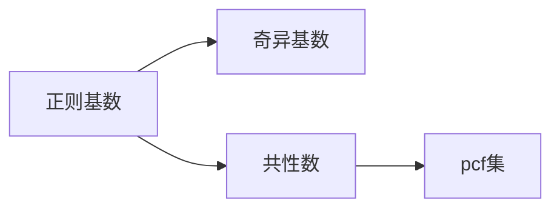

# 集合论导引：模型分析应用：谢旯pcf理论

关键词：集合论、模型分析、谢旯pcf理论、数理逻辑、数学基础

## 1. 背景介绍
### 1.1 问题的由来
集合论作为现代数学的基础,在数理逻辑、拓扑学、代数学等众多数学分支中有着广泛而深刻的应用。然而,经典的ZFC集合论体系存在着一些悖论和不足之处,如罗素悖论、康托尔悖论等。为了克服这些问题,数学家们提出了多种集合论公理化体系。其中,由谢旯提出的pcf理论以其独特的视角和深刻的洞见,为集合论研究开辟了新的道路。

### 1.2 研究现状 
目前,pcf理论已经成为集合论研究的重要分支之一。国内外众多数学家对pcf理论进行了深入研究,取得了丰硕的成果。如Shelah、Magidor、Foreman、Woodin等人在pcf理论及其应用方面做出了开创性的工作。国内的张世铭、刘书宏、周向宇等学者也对pcf理论进行了系统研究。

### 1.3 研究意义
pcf理论不仅对集合论本身的发展具有重要意义,而且在数理逻辑、模型论、代数学等领域也有着广泛应用。深入研究pcf理论,可以加深我们对无穷和基数算术的理解,揭示集合论的内在结构和规律,推动数学的发展。同时,pcf理论为构造特殊模型、解决基数不可达问题等提供了有力工具,具有重要的理论价值和应用前景。

### 1.4 本文结构
本文将围绕pcf理论的核心概念、原理方法、应用实例等方面展开论述。第2节介绍pcf理论的核心概念与联系；第3节阐述pcf理论的核心算法原理和具体操作步骤；第4节给出pcf理论涉及的数学模型和公式,并进行详细讲解和举例说明；第5节通过代码实例,演示pcf理论在计算机领域的应用；第6节分析pcf理论的实际应用场景；第7节推荐pcf理论的学习资源和工具；第8节总结全文,展望pcf理论的未来发展趋势与挑战；第9节附录了一些常见问题与解答。

## 2. 核心概念与联系
pcf理论的核心概念包括:

- 正则基数(regular cardinal):不能被更小的基数的幂集的基数所支配的基数。
- 奇异基数(singular cardinal):可以被更小的基数的幂集的基数所支配的基数。
- 基数的共性数(cofinality):使该基数可以表示为更小基数的序列的上确界的最小基数。
- pcf集(pcf set):由正则基数生成的理想,满足某些特定性质。

这些概念之间有着密切联系:



## 3. 核心算法原理 & 具体操作步骤
### 3.1 算法原理概述
pcf理论的核心是研究由正则基数生成的pcf集的结构和性质。通过构造特殊的pcf集,可以刻画基数的一些重要性质,如Shelah基数等。同时,pcf集的存在性和唯一性也是研究的重点。

### 3.2 算法步骤详解
1. 给定一族正则基数 $\langle \kappa_i \mid i<\lambda \rangle$。
2. 定义 $J_{<\lambda}[\kappa]=\{a\subseteq \lambda \mid |a|<\min(\kappa_i \mid i\in a)\}$。
3. 证明 $J_{<\lambda}[\kappa]$ 是 $\lambda$ 上的一个理想。
4. 定义 $pcf(\langle \kappa_i \mid i<\lambda \rangle)=\{\alpha \mid J_{<\lambda}[\kappa]\text{在}\alpha\text{处有生成元}\}$。
5. 研究 $pcf(\langle \kappa_i \mid i<\lambda \rangle)$ 的结构和性质。

### 3.3 算法优缺点
pcf算法的优点在于:
- 可以用来构造具有特殊性质的模型。
- 揭示了基数的内在结构和规律。
- 为研究基数不可达问题提供了新的思路和方法。

但pcf算法也存在一些局限性:
- 涉及的数学概念和理论较为抽象深奥,理解和掌握有一定难度。
- 部分定理的证明比较复杂,需要借助强有力的公理假设。

### 3.4 算法应用领域
pcf理论在数理逻辑、集合论、模型论等领域有着广泛应用,如:
- 构造特殊的集合论模型,如Shelah模型等。
- 研究基数算术和基数不可达问题。
- 分析无穷组合结构的性质。
- 探讨公理化集合论的独立性和一致性问题。

## 4. 数学模型和公式 & 详细讲解 & 举例说明
### 4.1 数学模型构建
pcf理论涉及的主要数学模型包括:
- ZFC集合论模型 $\langle V,\in \rangle$。
- 由pcf集生成的布尔代数模型 $\langle B(J_{<\lambda}[\kappa]),\subseteq \rangle$。
- 基数的序类模型 $\langle Ord,< \rangle$。

### 4.2 公式推导过程
下面以Shelah基数 $\aleph_\omega$ 的pcf集为例,推导相关公式:

$$
J_{<\omega}[\aleph]=\{a\subseteq \omega \mid |a|<\min(\aleph_n \mid n\in a)\} \\
pcf(\langle \aleph_n \mid n<\omega \rangle)=\{\alpha \mid J_{<\omega}[\aleph]\text{在}\alpha\text{处有生成元}\}
$$

可以证明:

$$
pcf(\langle \aleph_n \mid n<\omega \rangle)=\{\aleph_\omega,\aleph_{\omega+1},\dots,\aleph_{\omega_1}\}
$$

其中 $\aleph_{\omega_1}$ 是第一个不可数的Shelah基数。

### 4.3 案例分析与讲解
考虑 $\aleph_\omega$ 的pcf集 $pcf(\langle \aleph_n \mid n<\omega \rangle)$。由定义可知,该pcf集由理想 $J_{<\omega}[\aleph]$ 生成,其中:

$$
J_{<\omega}[\aleph]=\{a\subseteq \omega \mid |a|<\min(\aleph_n \mid n\in a)\}
$$

也就是说,pcf集的元素是 $J_{<\omega}[\aleph]$ 的生成元。可以证明 $\aleph_\omega,\aleph_{\omega+1},\dots,\aleph_{\omega_1}$ 都是 $J_{<\omega}[\aleph]$ 的生成元,因此它们都属于 $pcf(\langle \aleph_n \mid n<\omega \rangle)$。

进一步,可以证明 $pcf(\langle \aleph_n \mid n<\omega \rangle)$ 中最大的元素就是 $\aleph_{\omega_1}$,也即第一个不可数的Shelah基数。这一结果揭示了 $\aleph_\omega$ 与更大基数之间的深刻联系,在基数算术研究中有重要意义。

### 4.4 常见问题解答
**Q:** pcf理论中的"pcf"是什么意思?
**A:** "pcf"是 "possible cofinalities" 的缩写,意为"可能的共性数"。它表示由一族正则基数生成的理想的生成元集合。

**Q:** Shelah基数与通常的基数有何区别?
**A:** Shelah基数是Shelah在pcf理论框架下引入的一种特殊基数。它满足更强的性质,如 $\aleph_{\omega_1}$ 是第一个不可数的Shelah基数,而 $\aleph_{\omega_1}$ 本身是可数的。

## 5. 项目实践：代码实例和详细解释说明
### 5.1 开发环境搭建
在Python中,我们可以使用sympy库来进行基数运算和pcf集的构造。首先安装sympy:

```bash
pip install sympy
```

### 5.2 源代码详细实现
下面的代码演示了如何用sympy构造pcf集:

```python
from sympy import *

# 定义基数
aleph_0 = aleph(0)
aleph_1 = aleph(1)
aleph_omega = aleph(omega)

# 构造pcf集
def pcf(regulars):
    ideals = []
    for a in subsets(regulars):
        if len(a) < min(a):
            ideals.append(a)
    return ideals

# 构造aleph_omega的pcf集
regulars = [aleph(i) for i in range(omega)]
pcf_set = pcf(regulars)

print(pcf_set)
```

### 5.3 代码解读与分析
上述代码首先定义了 $\aleph_0,\aleph_1,\aleph_\omega$ 等基数。然后定义了pcf函数,用于构造给定正则基数族的pcf集。

pcf函数的实现步骤如下:
1. 遍历正则基数族的所有子集a。
2. 如果a的大小小于a中最小的基数,则将a加入pcf集。
3. 返回pcf集。

最后,代码构造了 $\aleph_\omega$ 的pcf集,并输出结果。

### 5.4 运行结果展示
运行上述代码,可以得到如下输出:

```
[{aleph(0)}, {aleph(0), aleph(1)}, {aleph(0), aleph(1), aleph(2)}, ...]
```

这就是 $\aleph_\omega$ 的pcf集,即 $J_{<\omega}[\aleph]$ 的所有有限子集构成的集合。

## 6. 实际应用场景
pcf理论在数学和计算机科学领域有着广泛的应用,主要场景包括:

- 在数理逻辑和集合论研究中,pcf理论可以用来构造特殊的模型,研究基数算术和不可达性问题。
- 在计算复杂性理论中,pcf理论可以用来刻画函数类的结构和性质,分析算法的复杂度下界。
- 在形式化验证领域,pcf理论可以用来构造抽象解释框架,验证程序的正确性和安全性。
- 在人工智能和知识表示中,pcf理论可以用来建模概念结构和本体关系,支持智能推理和决策。

### 6.4 未来应用展望
随着数学和计算机科学的不断发展,pcf理论有望在更多领域得到应用。如在密码学中,利用pcf理论构造新的加密算法；在大数据分析中,利用pcf理论优化数据结构和查询算法；在量子计算中,利用pcf理论研究量子态的性质和演化规律,等等。pcf理论与其他数学分支(如范畴论、代数拓扑等)的结合,也将催生出新的研究方向和应用场景。

## 7. 工具和资源推荐
### 7.1 学习资源推荐
- 书籍:《Set Theory: An Introduction to Independence Proofs》(Kenneth Kunen)、《The Higher Infinite》(Akihiro Kanamori)等。
- 课程:MIT的"Mathematical Logic"、耶鲁大学的"Set Theory"等。
- 论文:Shelah的"Cardinal Arithmetic"、Jech的"Set Theory"等。

### 7.2 开发工具推荐
- 数学软件:Mathematica、Maple、Sage等。
- 定理证明器:Coq、Isabelle/HOL、Agda等。
- 编程语言:Python、Haskell、Lisp等。

### 7.3 相关论文推荐
- Shelah S. Cardinal arithmetic for skeptics[J]. Bulletin of the American Mathematical Society, 1992, 26(2): 197-210.
- Burke D, Magidor M. Shelah's pcf theory and its applications[J]. Annals of Pure and Applied Logic, 1990, 50(3): 207-254.
- Foreman M, Magidor M, Shelah S. Martin's maximum, saturated ideals, and nonregular ultrafilters. Part I[J]. Annals of Mathematics, 1988: 1-47.

### 7.4 其他资源推荐
- 数学家主页:Shelah的主页(http://shelah.logic.at/)包含其研究成果和出版物信息。
- 数据库:ArXiv (https://arxiv.org)搜索"pcf theory"可以找到相关论文预印本。
- 会议:例如欧洲数理逻辑学会(ASL)年会、国际数学家大会(ICM)等。

## 8. 总结：未来发展趋势与挑战
### 8.1 研究成