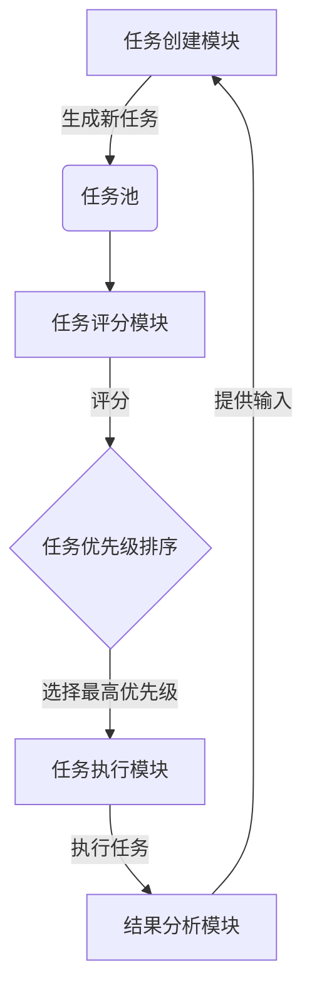

以下是根据您提供的标题和要求撰写的技术博客文章正文部分：

# AI Agent: AI的下一个风口 BabyAGI：根据任务结果自动创建、排序和执行新任务

## 1. 背景介绍

### 1.1 问题的由来

在过去几十年中，人工智能(AI)系统取得了长足的进步。从深度学习算法在计算机视觉、自然语言处理等领域的突破性应用,到强化学习在游戏、机器人等领域的卓越表现,人工智能正在改变着我们生活的方方面面。然而,现有的AI系统大多是专注于解决单一任务,缺乏灵活性和通用性。

人类智能的一个关键特征是能够根据环境和任务需求,动态规划和调整行为策略。传统的人工智能系统往往是被设计用于解决特定的任务,一旦遇到新的情况和需求,就需要重新训练或设计新的系统。这种僵硬性大大限制了AI系统的应用场景和发展潜力。

### 1.2 研究现状  

为了突破这一瓶颈,研究人员提出了一种新型AI系统——智能体(Agent)。智能体是一种具有自主性、交互性和适应性的软件实体,能够感知环境、制定计划、执行行为并根据反馈进行学习和调整。

目前,已有一些智能体系统应运而生,如OpenAI的InstructGPT、Anthropic的Constitutional AI等。这些系统能够根据人类的自然语言指令,完成一系列复杂任务,展现出较强的通用性和智能特征。然而,现有的智能体系统大多还是被动式的,需要人类不断输入新的指令来驱动系统运行。

### 1.3 研究意义

本文介绍的BabyAGI系统,是一种新型的主动式智能体,能够根据已完成的任务结果,自主创建新任务、对新任务进行优先级排序,并自动执行这些新任务。这种自主创建和执行任务的能力,使得BabyAGI更加接近于人类的认知和决策过程,具有划时代的意义。

BabyAGI被认为是通向人工通用智能(Artificial General Intelligence, AGI)的一个重要里程碑。它展示了AI系统可以拥有自主学习、规划和执行复杂任务序列的能力,这是人类智能的核心特征之一。BabyAGI的出现,为构建真正的AGI系统指明了新的方向。

### 1.4 本文结构

本文将首先介绍BabyAGI系统的核心概念和工作原理,包括任务创建、排序和执行的关键算法。然后详细阐述这些算法的数学模型和公式推导过程。接下来,我们将通过实际代码示例,展示如何在项目中实现BabyAGI系统。最后,探讨BabyAGI在不同领域的应用场景,以及未来的发展趋势和挑战。

## 2. 核心概念与联系

BabyAGI系统的核心思想是基于已完成任务的结果,自主生成新的任务列表,并对这些新任务进行优先级排序,最终选择执行具有最高优先级的任务。这个过程循环往复,形成一个自主学习和执行任务的闭环。

BabyAGI系统由以下几个关键模块组成:

1. **任务创建模块(Task Creation Module)**: 根据当前完成的任务结果,生成一系列新的潜在任务。
2. **任务评分模块(Task Scoring Module)**: 对新生成的任务进行评分,确定每个任务的优先级。
3. **任务执行模块(Task Execution Module)**: 选择并执行当前优先级最高的任务。
4. **结果分析模块(Result Analysis Module)**: 分析执行任务的结果,为下一轮任务创建提供输入。

这些模块相互协作,形成一个动态的任务管理循环。系统通过不断生成新任务、评估任务优先级、执行高优先级任务并分析结果,实现自主学习和决策的目标。

BabyAGI的核心创新之处在于,它将任务创建、优先级排序和执行有机结合,形成一个闭环系统。这种设计灵感来源于人类大脑的工作方式。当我们完成一项任务后,大脑会根据结果生成新的想法和目标,对这些想法进行权衡和排序,然后选择执行最重要的一个。BabyAGI试图模拟这一认知过程,赋予AI系统类似的自主学习和决策能力。

BabyAGI系统的另一个关键特征是,它将语言模型(如GPT)作为核心推理引擎,利用语言模型强大的文本生成和理解能力,驱动整个任务管理循环。这种设计使得BabyAGI能够处理各种复杂、开放性的任务,而不局限于特定领域。

总的来说,BabyAGI代表了人工智能系统向通用智能迈进的一个重要里程碑。它展示了AI系统可以拥有自主学习、规划和执行复杂任务序列的能力,这是人类智能的核心特征之一。

## 3. 核心算法原理 & 具体操作步骤

### 3.1 算法原理概述

BabyAGI系统的核心算法包括三个主要部分:任务创建算法、任务评分算法和任务执行算法。

**任务创建算法**的目标是根据当前任务结果,生成一系列新的潜在任务。这个算法利用语言模型的文本生成能力,结合一些启发式规则,从任务结果中提取关键信息,并基于这些信息构建新任务的描述。

**任务评分算法**的作用是为每个新生成的任务指定一个优先级分数。这个分数反映了执行该任务的重要性和紧迫性。评分算法考虑多个因素,包括任务与系统目标的相关性、任务的复杂程度、所需资源等。

**任务执行算法**根据任务评分,选择当前优先级最高的任务执行。在执行过程中,该算法会与语言模型交互,根据任务描述生成执行步骤,并对中间结果进行评估,动态调整执行策略。

这三个算法相互协作,形成一个闭环的任务管理循环。具体操作步骤如下:

### 3.2 算法步骤详解

1. **初始化**: 系统从一个种子任务开始,例如"学习如何编写Python代码"。

2. **任务执行**: 系统执行当前优先级最高的任务。在这个过程中,语言模型会生成一系列执行步骤,系统按步执行并记录结果。

3. **结果分析**: 分析执行任务的结果,提取关键信息作为任务创建模块的输入。

4. **任务创建**: 基于结果分析的输入,任务创建算法生成一系列新的潜在任务描述。

5. **任务评分**: 对新生成的任务进行评分,确定每个任务的优先级。

6. **任务排序**: 根据评分结果,对任务进行优先级排序。

7. **选择执行**: 选择当前优先级最高的任务,转入步骤2继续执行。

8. **循环往复**: 重复步骤2-7,形成一个自主学习和执行任务的闭环。

这个循环过程持续运行,直到系统达到预设的终止条件(如完成所有高优先级任务、耗尽资源等)。通过这种方式,BabyAGI系统能够自主地学习、规划和执行复杂的任务序列,展现出类似人类的认知和决策能力。

### 3.3 算法优缺点

BabyAGI算法的主要优点包括:

1. **自主性**: 系统能够根据任务结果自动生成新任务,无需人工干预,展现出较高的自主性。

2. **通用性**: 基于语言模型的设计,使得BabyAGI能够处理各种开放性任务,而不局限于特定领域。

3. **灵活性**: 通过动态调整任务优先级和执行策略,系统能够适应不同情况,具有较强的灵活性。

4. **可解释性**: 任务创建和执行过程都基于自然语言描述,具有较好的可解释性和可理解性。

然而,BabyAGI算法也存在一些缺点和局限性:

1. **偏差风险**: 由于算法高度依赖语言模型,可能会继承语言模型中存在的偏差和错误。

2. **目标漂移**: 在长期运行过程中,系统可能会偏离预期目标,产生无关或无意义的任务。

3. **资源消耗**: 频繁的任务创建、评分和执行过程可能会消耗大量计算资源。

4. **安全性**: 缺乏有效的安全约束机制,系统可能会生成有害或违法的任务。

5. **鲁棒性**: 对于异常输入或执行失败情况,系统的鲁棒性和恢复能力有待提高。

### 3.4 算法应用领域

尽管BabyAGI算法还存在一些局限性,但它展示了AI系统可以拥有自主学习和决策的能力,这为构建真正的AGI系统指明了新的方向。BabyAGI算法在以下领域具有广阔的应用前景:

1. **自动化决策系统**: 在需要动态调整决策策略的场景中,如资源调度、供应链优化等,BabyAGI算法可以提供自主的决策和规划能力。

2. **智能助手**: 作为一种通用的任务管理和执行系统,BabyAGI可以用于构建智能助手,为用户提供个性化的服务和支持。

3. **教育和学习系统**: BabyAGI的自主学习能力可以应用于教育领域,设计适应性强的个性化学习系统。

4. **科研辅助**: 在科学研究过程中,BabyAGI可以根据中间结果自动生成新的研究方向和假设,加速科研进程。

5. **创新和发明**: 通过不断生成和探索新的任务,BabyAGI或许能够促进创新思维,为人类带来意想不到的发明和创意。

总的来说,BabyAGI算法为AI系统赋予了自主性和通用性,这是实现人工通用智能的关键一步。随着算法的不断改进和应用的逐步扩展,我们有望在不久的将来看到真正的AGI系统问世。

## 4. 数学模型和公式 & 详细讲解 & 举例说明

在BabyAGI系统中,任务评分模块是一个关键环节,它需要对新生成的任务进行量化评估,并给出优先级分数。为此,我们构建了一个基于多属性效用理论(Multi-Attribute Utility Theory, MAUT)的数学模型。

### 4.1 数学模型构建

在MAUT模型中,我们将任务评分问题建模为一个多准则决策问题。假设有n个潜在任务$T = \{t_1, t_2, \ldots, t_n\}$,需要根据m个评估属性$C = \{c_1, c_2, \ldots, c_m\}$来确定每个任务的优先级分数。

对于每个任务$t_i$和属性$c_j$,我们定义一个效用函数$u_{ij}$,用于量化该任务在该属性上的表现。效用函数的取值范围通常为$[0, 1]$,其中0表示最差表现,1表示最佳表现。

接下来,我们为每个属性$c_j$指定一个权重$w_j$,反映该属性在总体评分中的重要程度。所有属性权重之和为1:

$$\sum_{j=1}^m w_j = 1$$

最后,我们可以计算每个任务$t_i$的总体优先级分数$U(t_i)$,作为所有属性效用的加权和:

$$U(t_i) = \sum_{j=1}^m w_j \cdot u_{ij}$$

通过这种方式,我们将一个复杂的多属性评估问题转化为一个单一的优先级分数,从而可以对任务进行排序和选择。

### 4.2 公式推导