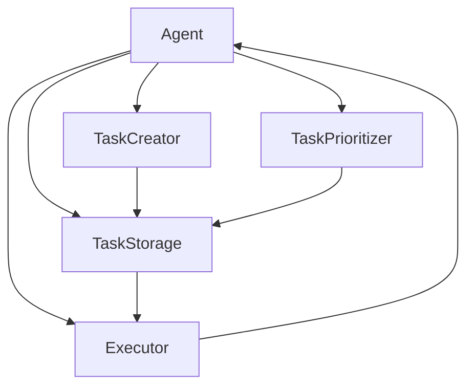

# AI Agent: AI的下一个风口 BabyAGI：根据任务结果自动创建、排序和执行新任务

## 1. 背景介绍
### 1.1 问题的由来
在人工智能的发展历程中,我们一直在追求创造出能够像人一样思考、学习和解决问题的智能体。传统的AI系统大多是针对特定任务设计的,缺乏通用性和自主学习能力。而要实现类似人类的通用人工智能,我们需要赋予AI系统自主学习、规划和执行任务的能力。

近年来,AI领域涌现出一种新的研究方向——AI Agent,旨在创造出能够自主学习、规划和执行任务的智能体。其中,BabyAGI作为一个有代表性的AI Agent框架,为这一领域的发展提供了新的思路。

### 1.2 研究现状
目前,AI Agent领域的研究主要集中在以下几个方面:

1. 强化学习:通过环境交互学习最优策略,代表算法有DQN、PPO等。
2. 元学习:学习如何学习,快速适应新任务,代表算法有MAML、Reptile等。  
3. 多任务学习:同时学习多个相关任务,提升泛化能力,代表算法有MMoE、PLE等。
4. 层次化强化学习:将复杂任务分解为多个子任务,代表算法有Options、MaxQ等。
5. 神经符号推理:结合神经网络和符号推理,赋予AI因果推理和逻辑思维能力。

BabyAGI是在这些研究基础上,提出的一个全新的AI Agent框架。它的核心思想是:根据当前任务的执行结果,自动创建、排序和执行新的子任务,通过这种持续的任务分解和规划,逐步完成复杂的目标。

### 1.3 研究意义
BabyAGI的研究意义主要体现在以下几个方面:

1. 探索通用人工智能的实现路径,为AGI的发展提供新的思路。
2. 提升AI系统的自主学习和问题解决能力,使其能够适应更加复杂多变的现实环境。
3. 促进多个AI领域的交叉融合,如强化学习、因果推理、任务规划等,推动AI技术的整体发展。
4. 在智能助理、自动化控制、机器人等领域具有广阔的应用前景。

### 1.4 本文结构
本文将围绕BabyAGI框架展开深入探讨,内容安排如下:

- 第2部分介绍BabyAGI的核心概念与内在联系  
- 第3部分重点阐述BabyAGI的核心算法原理和具体操作步骤
- 第4部分从数学角度对BabyAGI的模型和公式进行详细推导和举例说明
- 第5部分通过具体的代码实例,演示BabyAGI的实现过程
- 第6部分分析BabyAGI的实际应用场景及未来发展潜力
- 第7部分推荐BabyAGI相关的学习资源、开发工具等
- 第8部分总结全文,展望BabyAGI的未来发展趋势和面临的挑战
- 第9部分附录,解答一些常见问题

## 2. 核心概念与联系

BabyAGI框架的核心概念包括:

1. 任务(Task):表示智能体要完成的目标,可以是原子任务或由多个子任务组成的复合任务。
2. 执行器(Executor):负责执行任务并返回执行结果,可以是语言模型、API调用或实际的机器人执行。 
3. 任务创建器(TaskCreator):根据当前任务的执行结果,创建新的子任务。
4. 任务排序器(TaskPrioritizer):对新创建的子任务进行排序,确定任务执行的优先级。
5. 任务存储(TaskStorage):存储待执行的任务队列。
6. 代理(Agent):协调任务创建、排序、执行的整个过程,是BabyAGI的核心组件。

这些概念之间的关系如下图所示:

BabyAGI的工作流程为:Agent从TaskStorage中取出最高优先级的任务,交由Executor执行。Executor返回任务的执行结果,Agent将结果传递给TaskCreator,创建新的子任务。TaskPrioritizer对新任务进行排序,将其加入TaskStorage。Agent不断重复这一过程,直到完成最终目标。

通过这种创建-排序-执行的闭环,BabyAGI能够自主地将复杂任务分解为多个可执行的子任务,并动态调整任务优先级,展现出初步的自主规划和持续学习能力。这为探索通用人工智能提供了一种可行的思路。

## 3. 核心算法原理 & 具体操作步骤
### 3.1 算法原理概述
BabyAGI的核心算法可以概括为以下几个步骤:

1. 任务分解:将复杂任务递归地分解为多个可执行的子任务。
2. 任务排序:根据子任务的重要性、紧急程度等因素,对任务进行优先级排序。
3. 任务执行:按照优先级依次执行子任务,并记录任务执行结果。
4. 任务迭代:根据已执行任务的结果,创建新的子任务,并重复上述过程,直到完成最终目标。

其中,任务分解和任务迭代是BabyAGI的关键,它们体现了BabyAGI自主学习和规划的能力。通过持续地创建和执行子任务,BabyAGI能够在执行过程中不断积累知识,调整策略,逐步逼近最终目标。

### 3.2 算法步骤详解
下面我们对BabyAGI的算法步骤进行详细说明:

1. 初始化:创建一个初始任务,表示要完成的最终目标,将其加入任务存储。

2. 任务选择:从任务存储中取出优先级最高的任务,作为当前要执行的任务。

3. 任务执行:将当前任务交由执行器处理,执行器可以是语言模型、API调用或实际机器人,执行结果包括观察到的信息和完成度评估。

4. 任务分解:根据执行结果,判断当前任务是否完成。
   - 若未完成,则将当前任务分解为多个子任务,子任务的创建遵循以下原则:
     - 子任务应该是当前任务的一个步骤或组成部分
     - 子任务应该比当前任务更加具体、可执行
     - 子任务的粒度要适中,不能太大或太小
   - 若已完成,则不再分解。

5. 任务排序:对新创建的子任务进行优先级评估和排序,评估的维度包括:
   - 子任务对完成当前任务的重要性
   - 子任务的紧急程度
   - 子任务的预估难度
   - 子任务与已执行任务的相关性

6. 任务存储:将新创建的子任务加入任务存储,等待后续执行。

7. 迭代优化:重复步骤2-6,不断执行任务、创建子任务、更新优先级,直到完成最终目标。

8. 总结反馈:任务完成后,对整个执行过程进行总结,记录关键步骤、有效策略和改进点,用于优化后续任务的执行。

通过上述步骤,BabyAGI能够自主地将复杂任务分解为可执行的子任务,并根据执行结果动态调整任务优先级和执行策略,逐步完成最终目标。这种自我驱动的任务分解和规划机制,使BabyAGI具备了初步的自主学习和问题解决能力。

### 3.3 算法优缺点
BabyAGI算法的优点包括:

1. 自主性:能够自主地创建、排序和执行任务,减少了人工干预。
2. 适应性:可以根据任务执行结果动态调整策略,适应环境变化。
3. 可解释性:任务分解和执行过程清晰透明,便于分析和优化。
4. 通用性:可以应用于各种类型的任务,具有广泛的适用性。

但BabyAGI算法也存在一些局限性:

1. 依赖外部执行器:BabyAGI本身只负责任务的分解和规划,实际执行还需要依赖外部执行器,执行器的性能直接影响任务完成的质量。
2. 任务分解的有效性:任务分解的质量很大程度上取决于知识库的完备性和任务创建策略的合理性,需要大量的领域知识和经验作为支撑。
3. 优先级评估的准确性:任务优先级的评估涉及多个维度,需要权衡多种因素,评估结果的准确性和合理性有待进一步提高。
4. 长期规划能力有限:BabyAGI更擅长解决短期目标,对于需要长期规划和多轮迭代的复杂任务,其性能还有待提升。

### 3.4 算法应用领域
BabyAGI算法具有广泛的应用前景,主要体现在以下领域:

1. 智能助理:可用于开发更加智能、主动的对话助理和任务规划助手。
2. 自动化办公:用于自动化处理文书、报表等办公任务,提高工作效率。 
3. 智能客服:7×24小时提供客户服务,自动解答问题、处理投诉等。
4. 智能家居:用于家居设备的自动化控制和联动,提供更加智能、便捷的家居体验。
5. 工业自动化:应用于工业生产流程的自动化控制和优化,提高生产效率和产品质量。
6. 自动驾驶:用于自动驾驶汽车的决策规划和路径规划,提高行车安全性和舒适性。

未来,随着BabyAGI算法的不断发展和完善,它有望在更多领域得到应用,为人类生活和工作带来更多便利。

## 4. 数学模型和公式 & 详细讲解 & 举例说明
### 4.1 数学模型构建
BabyAGI的数学模型主要包括以下几个部分:

1. 任务表示:将任务抽象为一个元组$<S,A,R,P>$,其中:
   - $S$表示任务的状态空间,即任务执行过程中可能出现的所有状态。
   - $A$表示任务的动作空间,即执行任务时可以采取的所有动作。
   - $R:S×A→ℝ$是奖励函数,表示在状态$s$下采取动作$a$后获得的即时奖励。
   - $P:S×A→S$是状态转移函数,表示在状态$s$下采取动作$a$后转移到的下一个状态。

2. 任务分解:假设复合任务$T$可以分解为$n$个子任务$\{t_1,t_2,...,t_n\}$,每个子任务$t_i$也可以表示为一个元组$<S_i,A_i,R_i,P_i>$,则复合任务$T$可以表示为:

$$
T=\{<S_i,A_i,R_i,P_i>\}_{i=1}^n
$$

3. 任务优先级:假设任务$t_i$的优先级由$m$个特征$\{f_1,f_2,...,f_m\}$决定,每个特征$f_j$的重要性系数为$w_j$,则任务$t_i$的优先级$p_i$可以表示为:

$$
p_i=\sum_{j=1}^m w_j·f_j(t_i)
$$

其中,$f_j(t_i)$表示任务$t_i$在特征$f_j$上的取值。

4. 策略评估:假设策略$π$将状态映射为动作的概率分布,即$π:S→P(A)$,则策略$π$的期望累积奖励可以表示为:

$$
V^π(s)=𝔼[∑_{t=0}^∞ γ^t R(s_t,π(s_t))|s_0=s]
$$

其中,$γ∈[0,1]$是折扣因子,$𝔼$表示期望值。

### 4.2 公式推导过程
下面我们对上述数学模型中的一些关键公式进行推导。

1. 状态转移函数$P$的计算:
   
假设在状态