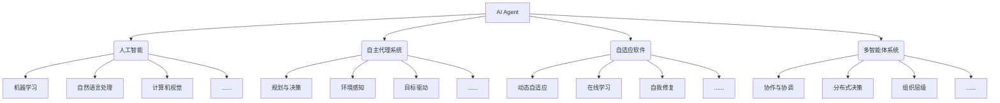
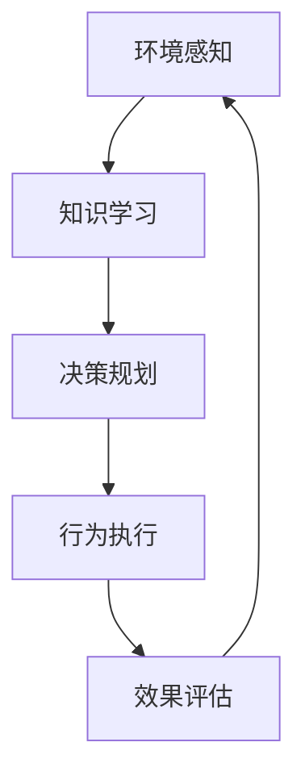

好的,我明白了您的要求。以下是按照您的要求撰写的技术博客文章正文部分:

# AI Agent: AI的下一个风口 下一代软件可以不必是软件

## 1. 背景介绍

### 1.1 问题的由来

在当今这个飞速发展的数字时代,软件无疑已成为推动科技进步和商业创新的核心驱动力。然而,传统的软件开发模式面临着诸多挑战:开发周期漫长、成本高昂、维护复杂、扩展性差等。与此同时,人工智能(AI)技术的迅猛发展为软件开发带来了新的契机和可能性。

AI Agent作为一种新型软件范式,正在引领软件开发进入一个全新的时代。它融合了人工智能、自主代理、自适应系统等前沿技术,打破了传统软件开发的框架,为构建智能化、自主化、可扩展的下一代软件系统铺平了道路。

### 1.2 研究现状  

近年来,AI Agent技术受到了业界和学术界的广泛关注。众多科技巨头如谷歌、微软、亚马逊等都在积极布局这一领域,推出了一系列基于AI Agent的创新产品和服务。同时,AI Agent相关的研究工作也在学术界蓬勃开展,涌现出许多突破性的理论模型和算法。

然而,AI Agent仍处于初级阶段,在理论建模、系统架构、开发工具链、应用实践等方面都还存在诸多挑战和不足,亟待进一步的深入研究和创新突破。

### 1.3 研究意义

AI Agent技术的兴起标志着软件开发进入了一个新的阶段,这将为构建更加智能化、自主化、高效率的软件系统提供全新的解决方案。AI Agent有望彻底改变传统软件开发模式,提高软件系统的适应性、鲁棒性和可扩展性,从而更好地满足未来复杂环境下的应用需求。

因此,深入研究AI Agent的理论基础、技术路线、系统架构、开发实践等,对于推动软件科学的发展、提升软件工程的水平、促进人工智能与软件工程的融合都具有重要的理论意义和现实意义。

### 1.4 本文结构

本文将全面深入地探讨AI Agent这一新兴软件范式。首先介绍AI Agent的核心概念及其与其他技术领域的联系;然后详细阐述AI Agent的核心算法原理和数学模型;接着通过实际项目案例,解析AI Agent系统的开发实践;最后分析AI Agent在不同领域的应用场景,并对其未来发展趋势和面临的挑战进行展望。

## 2. 核心概念与联系

AI Agent作为一种新型软件范式,其核心思想是构建一种智能化、自主化、自适应的软件实体,能够感知环境、理解语境、主动学习、自我决策并执行相应的行为。AI Agent打破了传统软件的被动执行模式,赋予软件以更高层次的"智能"和"自主性"。

AI Agent概念的提出,源于多个前沿技术领域的交叉融合,包括人工智能、自主代理系统、自适应软件、多智能体系统等。下面我们逐一探讨AI Agent与这些领域的联系:

### 2.1 人工智能

人工智能为AI Agent赋予了"智能"的核心能力,包括机器学习、自然语言处理、计算机视觉等。AI Agent可以利用这些技术来感知环境、理解语境、学习新知识,并作出智能化的决策和行为。

### 2.2 自主代理系统

自主代理是AI Agent的理论基础。一个自主代理系统由感知器、决策核心和执行器组成,能够感知环境、制定计划并执行相应的行为,从而实现特定目标。AI Agent实际上是一种高级自主代理,具备更强大的智能能力。

### 2.3 自适应软件  

自适应软件技术赋予了AI Agent以动态调整和自我修复的能力,使其能够根据环境变化和运行状态,自主地调整内部结构、行为策略和资源分配,提高了系统的鲁棒性和适应性。

### 2.4 多智能体系统

多智能体系统研究多个智能个体之间的协作、协调、组织等问题。AI Agent系统通常由多个智能代理组成,需要基于多智能体理论来设计代理间的交互模式、决策机制和组织结构。

可见,AI Agent是多个前沿技术领域的融合和创新,它继承了这些领域的理论基础和技术方法,但又超越了它们,开辟了一个全新的软件范式。

## 3. 核心算法原理与具体操作步骤

### 3.1 算法原理概述

AI Agent系统的核心是一个智能决策循环,使代理能够持续感知环境、学习新知识、制定行为计划并执行相应的动作,如下图所示:

1. **环境感知**:代理通过各种感知器获取环境数据,如视觉、语音、文本等信息。
2. **知识学习**:代理基于感知数据,通过机器学习等技术不断积累新知识,更新内部模型。 
3. **决策规划**:代理综合已有知识和当前状态,运用规划算法制定行为计划。
4. **行为执行**:代理通过执行器执行规划的行为,并影响外部环境。
5. **效果评估**:代理评估行为的效果,并将反馈输入下一个决策循环。

这一智能决策循环是AI Agent系统的核心驱动机制,使代理能够自主地感知、学习、规划和执行,不断提升自身能力。

### 3.2 算法步骤详解

AI Agent的智能决策循环可以通过多种具体算法来实现,下面我们详细介绍一种常用的基于强化学习的算法步骤:

1. **初始化**
    - 定义代理的状态空间$S$和行为空间$A$
    - 初始化策略$\pi(s,a)$和价值函数$V(s)$或$Q(s,a)$
    - 设置超参数:折扣因子$\gamma$,学习率$\alpha$等

2. **感知环境**
    - 获取当前环境状态$s_t$

3. **选择行为**
    - 根据策略$\pi(s_t,a)$选择行为$a_t$
    - 通常使用$\epsilon$-贪婪策略平衡探索和利用

4. **执行行为**
    - 在环境中执行行为$a_t$,获得奖励$r_{t+1}$和新状态$s_{t+1}$

5. **更新价值函数**
    - 计算TD目标: $r_{t+1} + \gamma V(s_{t+1})$或$r_{t+1} + \gamma \max_a Q(s_{t+1},a)$
    - 更新价值函数: $V(s_t) \leftarrow V(s_t) + \alpha[r_{t+1} + \gamma V(s_{t+1}) - V(s_t)]$

6. **更新策略**
    - 策略评估: 基于新的价值函数更新$\pi(s,a)$
    - 策略改进: 使用$\pi^* = \arg\max_\pi \sum_s \mu(s) \sum_a \pi(s,a)Q(s,a)$

7. **回到步骤2**,重复上述过程,直到收敛或达到停止条件

上述算法通过不断的试错与学习,使代理能够逐步优化其策略和价值函数,从而获得最优的行为决策能力。当然,这只是强化学习在AI Agent中的一种应用,还有诸多其他算法可供选择,如深度学习、规划算法、多智能体协作等。

### 3.3 算法优缺点

上述基于强化学习的AI Agent算法具有以下优缺点:

**优点**:

- 无需事先的环境模型,代理可以通过试错逐步学习最优策略
- 算法通用性强,可应用于各种决策场景 
- 理论基础扎实,建立在马尔可夫决策过程的数学框架之上
- 可以处理序列决策问题,寻求长期的累积奖励最大化

**缺点**:

- 收敛速度较慢,需要大量的试错数据来逐步学习
- 存在样本效率低下的问题,难以高效利用有限的数据
- 连续状态/行为空间下,函数逼近会带来不确定性和不稳定性
- 需要精心设计奖励函数,否则可能产生次优策略

总的来说,强化学习为AI Agent提供了一种通用而有效的算法框架,但在实际应用中还需要结合具体场景对算法进行优化和改进。

### 3.4 算法应用领域

基于强化学习的AI Agent算法可以应用于诸多领域,包括但不限于:

- 机器人控制:使机器人能够自主学习运动技能
- 游戏AI:训练AI代理学习游戏策略,提高AI在游戏中的表现
- 自动驾驶:开发自动驾驶系统,使车辆能够安全自主驾驶
- 资源管理:优化数据中心、电网等资源的动态调度
- 智能金融:开发智能投资策略,实现自动化交易决策
- 智能制造:优化工厂生产计划和物流路径
- ...

可见,AI Agent算法有着广阔的应用前景,有望在多个领域发挥重要作用。

## 4. 数学模型和公式详细讲解举例说明

AI Agent系统的设计和分析需要建立在坚实的数学基础之上。在这一章节中,我们将介绍AI Agent中几种核心的数学模型,并详细推导和解释相关的公式。

### 4.1 数学模型构建

#### 马尔可夫决策过程(MDP)

马尔可夫决策过程是AI Agent算法的基本数学模型,用于描述代理与环境的交互过程。一个MDP可以用一个五元组来表示:

$$MDP = \langle S, A, P, R, \gamma \rangle$$

其中:
- $S$是环境的状态空间
- $A$是代理的行为空间  
- $P(s'|s,a)$是状态转移概率,表示在状态$s$执行行为$a$后,转移到状态$s'$的概率
- $R(s,a)$是奖励函数,表示在状态$s$执行行为$a$后获得的即时奖励
- $\gamma \in [0,1)$是折扣因子,用于平衡即时奖励和长期奖励

代理的目标是找到一个策略$\pi: S \rightarrow A$,使其在MDP中获得的长期累积奖励最大:

$$\max_\pi \mathbb{E}\left[ \sum_{t=0}^\infty \gamma^t R(s_t, a_t) \right]$$

其中$s_t$和$a_t$分别表示时刻$t$的状态和行为,都由策略$\pi$和MDP的转移概率$P$共同决定。

#### 贝尔曼方程

贝尔曼方程是MDP理论的核心,它将代理的长期累积奖励与当前状态的价值函数联系起来:

$$V^*(s) = \max_a \mathbb{E}[R(s,a) + \gamma V^*(s')]$$

其中$V^*(s)$是最优价值函数,表示在状态$s$下遵循最优策略$\pi^*$可获得的期望累积奖励。$s'$是执行行为$a$后转移到的新状态。

我们还可以定义状态-行为价值函数$Q^*(s,a)$:

$$Q^*(s,a) = \math