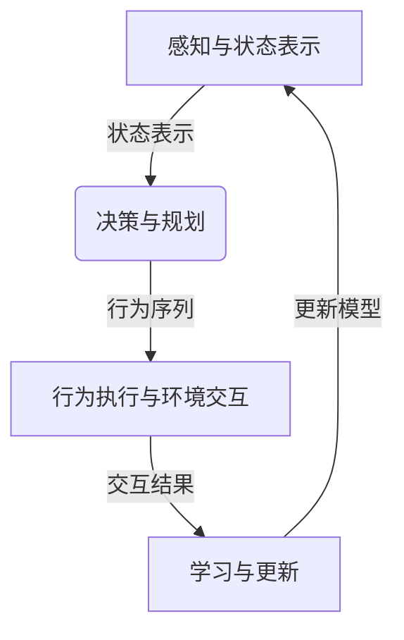

以下是针对《AI Agent: AI的下一个风口 具身智能的定义与特点》这个主题的技术博客文章正文内容：

# AI Agent: AI的下一个风口 具身智能的定义与特点

## 1. 背景介绍

### 1.1 问题的由来

人工智能的发展一直是科技领域的热门话题。从深度学习算法的突破,到大规模并行计算能力的提升,再到海量数据的积累,人工智能技术在过去十年里取得了长足的进步。但是,传统的人工智能系统仍然存在着一些局限性,主要体现在以下几个方面:

1. **缺乏身体和环境交互**:大多数人工智能系统都是基于软件模拟和虚拟环境进行训练和决策,缺乏真实世界的物理约束和交互反馈。

2. **缺乏情境理解能力**:人工智能系统难以像人类那样理解复杂的情境,并根据情境做出合理的决策和行为调整。

3. **缺乏持续学习能力**:大多数人工智能系统都是在固定的数据集上进行训练,一旦部署就无法持续学习和适应新的环境变化。

4. **缺乏自主性和主动性**:传统人工智能系统更多是被动地响应输入,缺乏自主探索和主动学习的能力。

为了解决这些问题,具身智能(Embodied AI)的概念应运而生。

### 1.2 研究现状

具身智能是近年来人工智能领域的一个新兴研究方向,旨在赋予人工智能系统一个虚拟或物理的身体,使其能够与真实世界环境进行交互和互动。具身智能代理(Embodied AI Agent)是具身智能的核心,它是一种拥有感知、决策和行为能力的智能体,可以在真实或模拟的环境中自主地感知、学习和行动。

目前,具身智能的研究主要集中在以下几个方面:

1. **感知与环境交互**:开发能够感知真实环境并与之交互的传感器和执行器。

2. **多模态学习**:整合视觉、语音、触觉等多种模态的信息,实现更加全面的环境理解和决策。

3. **自主探索与持续学习**:赋予智能体自主探索环境、主动获取经验和持续学习的能力。

4. **情境理解与决策**:提高智能体对复杂情境的理解能力,并做出合理的决策和行为调整。

5. **虚拟环境与模拟**:构建高度真实的虚拟环境,用于训练和测试具身智能系统。

6. **机器人与物理系统**:将具身智能系统部署到真实的机器人和物理系统中,实现与真实世界的无缝交互。

尽管具身智能领域取得了一些进展,但是仍然面临着诸多挑战,如感知能力的局限性、决策和行为的不确定性、安全性和可解释性等问题,需要持续的研究和探索。

### 1.3 研究意义

具身智能有望成为人工智能发展的一个新风口,对于推动人工智能技术的发展和应用具有重要意义:

1. **提高人工智能系统的智能水平**:通过与真实环境的交互,具身智能系统能够获取更加丰富和真实的信息,提高情境理解和决策能力,从而达到更高的智能水平。

2. **拓展人工智能的应用领域**:具身智能技术可以应用于机器人、虚拟现实、智能家居等领域,为人工智能开辟新的应用场景。

3. **促进人工智能与其他学科的融合**:具身智能需要借鉴心理学、认知科学、控制理论等多个学科的理论和方法,有助于推动人工智能与其他学科的交叉融合。

4. **解决人工智能的局限性问题**:具身智能有望解决传统人工智能系统存在的缺乏身体交互、情境理解能力不足、缺乏持续学习能力等问题。

5. **模拟和理解人类智能**:具身智能系统在某种程度上模拟了人类与环境交互的过程,有助于我们更好地理解人类智能的本质。

综上所述,具身智能代表了人工智能发展的一个新方向,对于提高人工智能系统的智能水平、拓展应用领域、推动学科融合等方面具有重要意义。

### 1.4 本文结构

本文将全面介绍具身智能的定义、特点、核心技术,以及在各个领域的应用前景。文章的主要结构如下:

1. 背景介绍
2. 核心概念与联系
3. 核心算法原理与具体操作步骤
4. 数学模型和公式详细讲解与举例说明
5. 项目实践:代码实例和详细解释说明
6. 实际应用场景
7. 工具和资源推荐
8. 总结:未来发展趋势与挑战
9. 附录:常见问题与解答

接下来,我们将逐一深入探讨具身智能的各个方面。

## 2. 核心概念与联系

具身智能(Embodied AI)是一种新兴的人工智能范式,其核心思想是赋予人工智能系统一个虚拟或物理的身体,使其能够与真实世界环境进行交互和互动。具身智能代理(Embodied AI Agent)是具身智能的核心概念,它是一种拥有感知、决策和行为能力的智能体,可以在真实或模拟的环境中自主地感知、学习和行动。

具身智能与传统的人工智能系统有着明显的区别,它强调以下几个核心概念:

1. **身体性(Embodiment)**:具身智能系统拥有一个虚拟或物理的身体,通过这个身体与环境进行交互。身体性使得智能系统受到真实世界的物理约束和反馈,从而更加贴近真实情况。

2. **情境性(Situatedness)**:具身智能系统需要理解和适应复杂的情境,根据情境做出合理的决策和行为调整。情境性强调智能系统与环境之间的相互作用和依赖关系。

3. **主动性(Pro-activeness)**:具身智能系统不仅被动响应输入,还能够主动探索环境、获取经验和持续学习。主动性使得智能系统具有更强的自主性和适应性。

4. **多模态交互(Multimodal Interaction)**:具身智能系统需要整合视觉、语音、触觉等多种模态的信息,实现更加全面的环境理解和决策。

5. **持续学习(Continual Learning)**:具身智能系统能够在与环境的交互过程中不断学习和适应,持续提高自身的能力。

这些核心概念与传统的人工智能范式形成鲜明对比,体现了具身智能的独特性和创新性。具身智能代理作为核心概念,将这些理念统一起来,旨在构建一种更加智能、更加人性化的人工智能系统。

具身智能与其他一些相关概念也有着密切联系,例如:

- **机器人技术**:具身智能系统可以部署在机器人平台上,实现与真实物理世界的无缝交互。
- **虚拟现实与增强现实**:虚拟环境和增强现实技术为具身智能系统提供了模拟训练和测试的平台。
- **多智能体系统**:多个具身智能代理可以组成多智能体系统,模拟复杂的社会环境和群体行为。
- **认知科学与心理学**:具身智能借鉴了认知科学和心理学中关于embodied cognition的理论和观点。

总的来说,具身智能是一个跨学科的综合性概念,它融合了人工智能、机器人、虚拟现实、认知科学等多个领域的理论和技术,旨在构建一种新型的人工智能范式。

## 3. 核心算法原理与具体操作步骤

### 3.1 算法原理概述

具身智能代理的核心算法原理主要包括以下几个方面:

1. **感知与状态表示**:通过各种传感器获取环境信息,并将其转换为内部状态表示,作为决策和行为的基础。

2. **决策与规划**:根据当前状态和目标,利用决策算法和规划技术选择合适的行为序列。

3. **行为执行与环境交互**:通过执行器将选择的行为序列转换为具体的动作,并与环境进行交互。

4. **学习与更新**:根据交互的结果和反馈,更新内部状态、知识库和决策模型,实现持续学习和自我完善。

这个过程循环往复,形成了具身智能代理的感知-决策-行为-学习的闭环系统。

上图展示了具身智能代理的核心算法原理流程。接下来,我们将详细介绍每个环节的具体算法和操作步骤。

### 3.2 算法步骤详解

#### 3.2.1 感知与状态表示

感知与状态表示是具身智能代理与环境交互的基础。主要包括以下步骤:

1. **数据采集**:通过各种传感器(如相机、麦克风、触觉传感器等)采集环境数据,包括视觉、语音、深度等多模态信息。

2. **数据预处理**:对采集的原始数据进行预处理,如去噪、校正、特征提取等,以提高数据质量和可用性。

3. **状态编码**:将预处理后的数据转换为内部状态表示,通常采用深度学习模型(如卷积神经网络、transformer等)进行端到端的状态编码。

4. **状态融合**:将来自不同模态的状态表示进行融合,形成综合的状态描述,作为决策和规划的输入。

常用的状态表示方法包括:

- 低维连续状态向量:将环境状态编码为固定长度的连续向量。
- 高维离散状态:将环境状态离散化为高维的一热编码向量。
- 层次状态表示:将状态分解为不同层次的表示,捕捉不同粒度的信息。

#### 3.2.2 决策与规划

决策与规划模块根据当前状态和目标,选择合适的行为序列。主要包括以下步骤:

1. **目标设定**:明确具身智能代理的目标,可以是单一目标或多重目标。

2. **策略学习**:基于强化学习、规划等技术,学习一个策略模型,将状态映射到行为序列。常用的策略学习算法包括:
   - 深度Q学习(Deep Q-Learning)
   - 策略梯度(Policy Gradient)
   - 行为克隆(Behavior Cloning)
   - 模型预测控制(Model Predictive Control)

3. **决策与规划**:利用学习到的策略模型,根据当前状态和目标,生成合适的行为序列。可以采用贪婪搜索、采样等方法进行决策。

4. **约束处理**:考虑环境约束、安全性等因素,对生成的行为序列进行修正和优化。

#### 3.2.3 行为执行与环境交互

行为执行与环境交互模块将决策出的行为序列转换为具体的动作,并与环境进行交互。主要包括以下步骤:

1. **运动规划**:将高级行为序列转换为可执行的低级动作序列,满足机器人或虚拟化身的运动约束。

2. **动作执行**:通过执行器(如机器人关节执行器、虚拟化身控制器等)执行低级动作序列,产生实际的运动和交互。

3. **状态转移**:执行动作会导致环境状态发生变化,需要更新内部状态表示。

4. **奖赏计算**:根据行为的结果和目标,计算获得的奖赏信号,作为强化学习的反馈。

#### 3.2.4 学习与更新

学习与更新模块根据交互的结果和反馈,更新内部状态、知识库和决策模型,实现持续学习和自我完善。主要包括以下步骤:

1. **经验存储**:将交互过程中的状态、行为、奖赏等信息存储为经验样本。

2. **模型更新**:利用