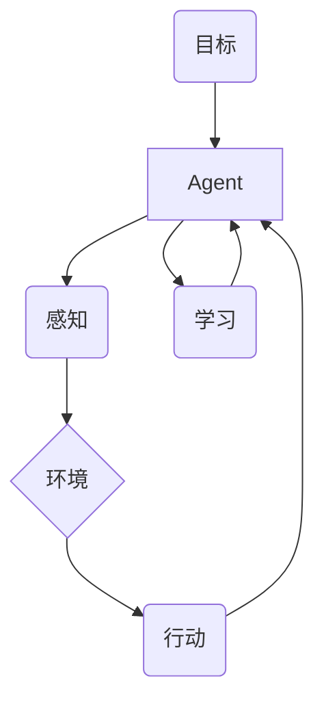

# AI Agent: AI的下一个风口 具身智能研究的挑战与机遇

关键词：AI Agent, 具身智能, 人工智能, 强化学习, 知识表示, 自然语言处理, 计算机视觉, 机器人

## 1. 背景介绍
### 1.1  问题的由来
人工智能(Artificial Intelligence, AI)经过几十年的发展,已经取得了令人瞩目的成就。从早期的符号主义和专家系统,到近年来大放异彩的深度学习,AI正在不断突破人类智能的边界。然而,当前的AI系统大多还是基于"非具身"(disembodied)范式,即通过分析大规模数据来训练得到抽象的数学模型,而很少考虑AI系统如何与现实世界进行交互。这导致了当前AI系统在感知、推理、决策等方面存在诸多局限性。因此,学术界和工业界开始将目光投向了一个新兴的研究方向——具身智能(Embodied Intelligence)。

具身智能的核心思想是,智能应该建立在主体与环境的交互基础之上。具身智能强调感知、运动和认知的统一,主张AI系统应该像人类一样拥有躯体,通过自主地探索和操控环境来学习和进化。这一范式的转变预示着AI将从单纯的"算法"走向真正意义上的"智能主体",并最终成长为能够在开放环境中自主行动的AI Agent。

### 1.2  研究现状 
具身智能作为一个交叉学科,涉及人工智能、机器人、认知科学等多个领域。目前,学术界对具身智能的研究还处于起步阶段,但已经涌现出一批有代表性的工作:

- 强化学习(Reinforcement Learning)被广泛应用于训练具身Agent。研究者利用RL算法让Agent在虚拟或真实环境中自主探索,通过试错来学习最优策略。DeepMind的一系列工作[1-3]展示了RL在具身智能领域的巨大潜力。

- 知识表示(Knowledge Representation)是赋予Agent认知和推理能力的关键。传统的逻辑表示法在应对复杂环境时捉襟见肘。研究者提出了基于表示学习(Representation Learning)[4]、概念空间(Conceptual Space)[5]等新方法,让Agent能够习得更加灵活和鲁棒的知识表示。  

- 自然语言处理(Natural Language Processing)使得Agent能够理解和执行人类语言指令。将语言指令Grounding到实际行动中是一个巨大挑战。近年来,研究者提出了一系列指令遵循(Instruction Following)的数据集和模型[6-7],让Agent学会根据语言指令完成复杂任务。

- 计算机视觉(Computer Vision)是Agent感知世界的重要途径。基于深度学习的视觉理解模型在图像分类、目标检测等任务上取得了巨大进步,但在具身环境下仍然面临挑战。场景理解(Scene Understanding)[8]、视觉问答(Visual Question Answering)[9]等任务的提出,促进了面向具身Agent的视觉理解技术的发展。

- 机器人技术的进步为具身智能研究提供了重要支撑。轻量化、模块化的机器人平台[10]降低了研究门槛,使得更多研究者能够开展具身智能实验。一些研究也探索了如何将具身智能用于改进机器人系统,如通过模仿学习(Imitation Learning)让机器人习得复杂操作技能[11]。

### 1.3  研究意义
具身智能研究对于推动AI的进一步发展具有重要意义:

首先,具身智能有望突破当前AI系统"狭义智能"的局限,实现"通用智能"的飞跃。通过与环境的实时交互,Agent能够学习到更加通用和鲁棒的技能,应对更加复杂多变的现实世界。

其次,具身智能为机器人等实体化AI系统的研发提供了新的思路。目前大多数机器人还是按照预先设计好的模式工作,缺乏灵活性和适应性。而具备感知、推理、决策能力的智能Agent,将极大拓展机器人的应用场景和功能边界。

此外,具身智能也为认知科学和神经科学研究提供了新的视角。通过构建具身Agent,我们可以更好地理解人脑是如何实现感知、运动和认知的高度统一的。这也有助于揭示人工智能和生物智能的异同,促进两个领域的互鉴融合。

### 1.4  本文结构
本文将重点探讨具身智能这一AI的新兴研究方向。第2节介绍具身智能的核心概念和内在联系;第3节重点阐述具身智能采用的核心算法原理;第4节从数学建模的角度对相关理论进行公式化描述;第5节给出具身智能的代码实例;第6节分析具身智能的实际应用场景;第7节总结推荐相关工具和学习资源;第8节展望具身智能的未来发展趋势和面临的挑战;第9节列举一些常见问题解答。

## 2. 核心概念与联系
具身智能的提出标志着AI研究的一个重要转向。传统AI更多关注"智能"本身,即如何通过算法实现感知、学习、推理等功能。而具身智能强调"具身"的重要性,即智能应该建立在主体与环境的交互基础上。

具身智能的核心概念包括:

- 主体(Agent):具有感知、决策和行动能力的实体,通常由软件和硬件组成。 
- 环境(Environment):Agent所处的外部世界,提供了感知信息和行动反馈。
- 感知(Perception):Agent通过传感器获取环境信息的过程。
- 行动(Action):Agent通过执行器对环境施加影响的过程。
- 交互(Interaction):Agent与环境之间通过感知-行动循环形成的双向信息流。
- 学习(Learning):Agent通过交互不断积累和优化知识、策略的过程。
- 目标(Goal):驱动Agent不断探索和优化行为的内在动因。

这些概念之间环环相扣,构成了具身智能的内在逻辑:

如图所示,Agent通过感知获取环境信息,并基于当前知识和目标做出行动决策,行动结果又反馈给环境。Agent通过不断的感知-行动交互来学习和进化,以更好地适应环境和达成目标。

因此,具身智能本质上是一个"闭环"系统,其智能来自于Agent、环境和交互的"三位一体"。这一范式突破了传统AI"离线学习"的桎梏,为打造真正"有灵魂"的AI系统指明了方向。

## 3. 核心算法原理 & 具体操作步骤
### 3.1  算法原理概述
具身智能需要建立在多种AI算法的基础之上。这里重点介绍强化学习(Reinforcement Learning, RL),它被认为是实现具身智能的核心算法范式。

RL的基本思想是,Agent通过与环境的交互来学习最优行为策略。形式化地,RL可以用一个五元组<S, A, P, R, γ>来描述:

- 状态空间S:表示Agent所处的环境状态集合。
- 行动空间A:表示Agent可以采取的行动集合。
- 状态转移概率P:表示在状态s下采取行动a后,环境转移到状态s'的概率。
- 奖励函数R:表示在状态s下采取行动a后,环境返回的即时奖励。
- 折扣因子γ:表示未来奖励相对当前奖励的衰减程度,取值在[0,1]之间。

RL的目标是学习一个最优策略π:S→A,使得Agent能够获得最大的累积奖励。形式化地,最优策略π*满足:

$$
\pi^* = \arg\max_{\pi} \mathbb{E} \left[ \sum_{t=0}^{\infty} \gamma^t R(s_t, a_t) | \pi \right]
$$

其中,st和at分别表示t时刻的状态和行动,求和项表示从t时刻开始的累积折扣奖励。

为了求解最优策略,RL引入了价值函数(Value Function)的概念。价值函数分为状态价值函数V(s)和动作价值函数Q(s,a),分别表示状态s和状态-行动对(s,a)的长期价值。

状态价值函数V(s)表示从状态s开始,遵循策略π能够获得的期望累积奖励:

$$
V^{\pi}(s) = \mathbb{E} \left[ \sum_{k=0}^{\infty} \gamma^k R(s_{t+k}, a_{t+k}) | s_t=s, \pi \right]
$$

动作价值函数Q(s,a)表示在状态s下采取行动a,然后遵循策略π能够获得的期望累积奖励:

$$
Q^{\pi}(s,a) = \mathbb{E} \left[ \sum_{k=0}^{\infty} \gamma^k R(s_{t+k}, a_{t+k}) | s_t=s, a_t=a, \pi \right]
$$

RL的核心就是学习价值函数,并基于价值函数来改进策略。一般有两大类方法:

- 基于值(Value-based)的方法:通过学习价值函数,然后贪婪地选择价值最高的行动。代表算法有Q-learning、Sarsa等。

- 基于策略(Policy-based)的方法:直接学习最优策略函数,通过梯度上升等方法来更新策略参数。代表算法有REINFORCE、Actor-Critic等。

近年来,深度强化学习(Deep RL)成为了研究热点。它将深度神经网络引入RL框架,用于拟合价值函数或策略函数。这使得RL能够处理更高维、连续的状态和行动空间,极大拓展了RL的应用范围。代表算法有DQN、DDPG、PPO等。

### 3.2  算法步骤详解
以经典的Q-learning算法为例,其具体步骤如下:

1. 初始化Q(s,a),对于所有s∈S,a∈A,任意初始化Q(s,a)的值。

2. 重复以下步骤,直到收敛:
   
   1) 根据某种策略(如ε-greedy)选择在状态st下的行动at;
   
   2) 执行行动at,观察奖励rt+1和新状态st+1;
   
   3) 更新Q值:
      
      $$
      Q(s_t,a_t) \leftarrow Q(s_t,a_t) + \alpha \left[ r_{t+1} + \gamma \max_{a} Q(s_{t+1},a) - Q(s_t,a_t) \right]
      $$
      
      其中α是学习率。
   
   4) 更新状态:st←st+1。

3. 输出最优策略π*:对于每个状态s,π*(s)=argmaxa Q(s,a)。

可以证明,当采用适当的探索策略(如ε-greedy)并且学习率满足一定条件时,Q-learning算法能够收敛到最优动作价值函数Q*。此时,贪婪策略就是最优策略。

深度Q网络(DQN)在Q-learning的基础上引入了两个改进:

1. 用深度神经网络Q(s,a;θ)来拟合动作价值函数,其中θ为网络参数。

2. 引入经验回放(Experience Replay)机制,将<s,a,r,s'>的转移样本存入回放缓冲区,并从中随机抽取小批量样本来更新网络参数。

DQN的更新公式为:

$$
\theta_{t+1} = \theta_t + \alpha \left[ r + \gamma \max_{a'} Q(s',a';\theta_t) - Q(s,a;\theta_t) \right] \nabla_{\theta_t} Q(s,a;\theta_t)
$$

其中θt为时刻t的网络参数,∇θtQ(s,a;θt)为Q值关于参数的梯度。

DQN及其变体(如Double DQN、Dueling DQN等)在Atari游戏、机器人控制等领域取得了显著成果,被视为具身智能的重要基石。

### 3.3  算法优缺点
RL算法的优点在于:

- 能够通过试错来自主学习,不需要人工标注的训练数据。这在很多具身智能场景下是必要的,因为事先准备大量标注数据往往是不现实的。

- 学习得到的策略具有普适